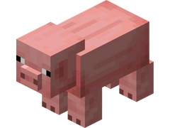
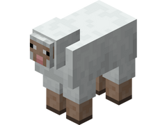
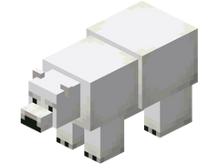
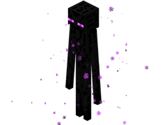
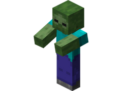
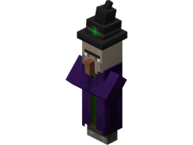
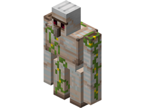

# 🐾 Les spawners

## 💠 Quelques informations... ? 📃
Les <mark style="color:green;">**spawners**</mark> sont des blocs spéciaux permettant de faire apparaître régulièrement un <mark style="color:green;">**mob défini**</mark> par le spawner.  
Ils sont particulièrement utiles pour la création de <mark style="color:green;">**farm automatiques**</mark>, afin de récolter des ressources, <mark style="color:green;">**gagner de l'XP**</mark> ou encore <mark style="color:green;">**monter votre métier de Chasseur**</mark>.  

Ces blocs peuvent être placés <mark style="color:green;">**n’importe où**</mark> (dans les zones où vous en avez l’autorisation).  
Cependant, ils ne sont <mark style="color:green;">**récupérables**</mark> qu’à l’intérieur de votre <mark style="color:green;">**propre ville**</mark>, ou d’une ville où vous disposez des droits nécessaires, et uniquement à l’aide d’une <mark style="color:green;">**pioche enchantée Toucher de Soie**</mark>.  
Également, vous ne pouvez placer que <mark style="color:green;">**16 spawners par chunk**</mark>.  

Il existe <mark style="color:green;">**deux types de spawners**</mark> sur le serveur :  
* <mark style="color:green;">**Spawner PASSIF**</mark> 🐔 : Nécessite des <mark style="color:green;">**blocs d’herbe**</mark> et de la <mark style="color:green;">**lumière**</mark> pour que les mobs puissent apparaître.  
* <mark style="color:green;">**Spawner AGRESSIF**</mark> 🐍 : Nécessite l’absence <mark style="color:green;">**totale de lumière**</mark> pour que les mobs puissent apparaître.  

## 💠 Liste des spawners existant ? 🔍

<table border="1" cellspacing="0" cellpadding="6">
  <tr>
    <td><mark style="color:red;"><strong>Nom 🏷️</strong></mark></td>
    <td><mark style="color:red;"><strong>Catégorie 📂</strong></mark></td>
    <td><mark style="color:red;"><strong>Obtentions 🔍</strong></mark></td>
  </tr>
  <tr>
    <td align="center">
      
<mark style="color:red;"><strong>Vache</strong></mark>

      

<figure></figure>

    </td>
    <td>
      
<mark style="color:green;"><strong>Passif ğŸ”</strong></mark>

    <td>
      
 * Caisse de Vote 📨

      
 * `/Boutique` (300 Gemmes💎)

      
 * Parchemin Avancé 🟡

      
 * Parchemin Abyssal 🌊

      
 * Parchemin Terrier du Lapin / Fabrique du Chcolat 🍫

    </td>
  </tr>
  <tr>
    <td align="center">
      
<mark style="color:red;"><strong>Cochon</strong></mark>

      

<figure></figure>

    </td>
    <td>
      
<mark style="color:green;"><strong>Passif ğŸ”</strong></mark>

    <td>
      
 * Caisse de Vote 📨

      
 * `/Boutique` (250 Gemmes💎)

      
 * Parchemin Facile 🟢

    </td>
  </tr>
  <tr>
    <td align="center">
      
<mark style="color:red;"><strong>Mouton</strong></mark>

      

<figure></figure>

    </td>
    <td>
      
<mark style="color:green;"><strong>Passif ğŸ”</strong></mark>

    <td>
      
 * Caisse de Vote 📨

      
 * `/Boutique` (200 Gemmes💎)

      
 * Parchemin Facile 🟢

    </td>
  </tr>
  <tr>
    <td align="center">
      
<mark style="color:red;"><strong>Poule</strong></mark>

      

<figure></figure>

    </td>
    <td>
      
<mark style="color:green;"><strong>Passif ğŸ”</strong></mark>

    <td>
      
 * Caisse de Vote 📨

      
 * `/Boutique` (150 Gemmes💎)

      
 * Parchemin Facile 🟢

      
 * Parchemin Abyssal 🌊

      
 * Parchemin Terrier du Lapin / Fabrique du Chcolat 🍫

    </td>
  </tr>
  <tr>
    <td align="center">
      
<mark style="color:red;"><strong>Lapin</strong></mark>

      

<figure></figure>

    </td>
    <td>
      
<mark style="color:green;"><strong>Passif ğŸ”</strong></mark>

    <td>
      
 * Caisse Pâques 🥚

      
 * `/Boutique` (250 Gemmes💎)

      
 * Parchemin Facile 🟢

    </td>
  </tr>
  <tr>
    <td align="center">
      
<mark style="color:red;"><strong>Tortue</strong></mark>

      

<figure></figure>

    </td>
    <td>
      
<mark style="color:green;"><strong>Passif ğŸ”</strong></mark>

    <td>
      
 * Caisse Abyssal 🌊

    </td>
  </tr>
  <tr>
    <td align="center">
      
<mark style="color:red;"><strong>Grenouille</strong></mark>

      

<figure></figure>

    </td>
    <td>
      
<mark style="color:green;"><strong>Passif ğŸ”</strong></mark>

    <td>
      
 * Caisse Trésors 🏴‍☠️

    </td>
  </tr>
  <tr>
    <td align="center">
      
<mark style="color:red;"><strong>Ours Polaire</strong></mark>

      

<figure></figure>

    </td>
    <td>
      
<mark style="color:green;"><strong>Passif ğŸ”</strong></mark>

    <td>
      
 * Caisse Givrée ❄️

      
 * `/Boutique` (400 Gemmes💎)

      
 * Parchemin de l'Amour ❤️

    </td>
  </tr>
  <tr>
    <td align="center">
      
<mark style="color:red;"><strong>Champimeuh</strong></mark>

      

<figure></figure>

    </td>
    <td>
      
<mark style="color:green;"><strong>Passif ğŸ”</strong></mark>

    <td>
      
 * `/Boutique` (350 Gemmes💎)

    </td>
  </tr>
  <tr>
    <td align="center">
      
<mark style="color:red;"><strong>Enderman</strong></mark>

      

<figure></figure>

    </td>
    <td>
      
<mark style="color:red;"><strong>Agressif 🐍</strong></mark>

    <td>
      
 * Caisse Rubis 🔻

      
 * `/Boutique` (500 Gemmes💎)

      
 * Parchemin Expert 🟣

      
 * Parchemin Abyssal 🌊

      
 * Parchemin Terrier du Lapin / Fabrique du Chcolat 🍫

    </td>
  </tr>
  <tr>
    <td align="center">
      
<mark style="color:red;"><strong>Blaze</strong></mark>

      

<figure></figure>

    </td>
    <td>
      
<mark style="color:red;"><strong>Agressif 🐍</strong></mark>

    <td>
      
 * Caisse Rubis 🔻

      
 * Caisse Draconique 🐉

      
 * `/Boutique` (500 Gemmes💎)

      
 * Parchemin Expert 🟣

      
 * Parchemin Abyssal 🌊

      
 * Parchemin Halloween 🎃

      
 * Parchemin Givré ❄️

      
 * Parchemin de l'Amour ❤️

      
 * Parchemin Terrier du Lapin / Fabrique du Chcolat 🍫

    </td>
  </tr>
  <tr>
    <td align="center">
      
<mark style="color:red;"><strong>Zombie</strong></mark>

      

<figure></figure>

    </td>
    <td>
      
<mark style="color:red;"><strong>Agressif 🐍</strong></mark>

    <td>
      
 * Caisse Émeraude ✳️

      
 * Caisse St-Valentin 💕

      
 * `/Boutique` (300 Gemmes💎)

      
 * Parchemin Avancé 🟡

      
 * Parchemin Difficile 🔵

      
 * Parchemin Abyssal 🌊

      
 * Parchemin Halloween 🎃

      
 * Parchemin Givré ❄️

      
 * Parchemin de l'Amour ❤️

      
 * Parchemin Terrier du Lapin / Fabrique du Chcolat 🍫

    </td>
  </tr>
  <tr>
    <td align="center">
      
<mark style="color:red;"><strong>Squellette</strong></mark>

      

<figure></figure>

    </td>
    <td>
      
<mark style="color:red;"><strong>Agressif 🐍</strong></mark>

    <td>
      
 * Caisse Émeraude ✳️

      
 * `/Boutique` (400 Gemmes💎)

      
 * Parchemin Avancé 🟡

      
 * Parchemin Difficile 🔵

      
 * Parchemin Abyssal 🌊

      
 * Parchemin Halloween 🎃

      
 * Parchemin Givré ❄️

      
 * Parchemin de l'Amour ❤️

      
 * Parchemin Terrier du Lapin / Fabrique du Chcolat 🍫

    </td>
  </tr>
  <tr>
    <td align="center">
      
<mark style="color:red;"><strong>Creeper</strong></mark>

      

<figure></figure>

    </td>
    <td>
      
<mark style="color:red;"><strong>Agressif 🐍</strong></mark>

    <td>
      
 * Caisse Émeraude ✳️

      
 * Parchemin Difficile 🔵

      
 * Parchemin Abyssal 🌊

      
 * Parchemin Halloween 🎃

      
 * Parchemin Givré ❄️

      
 * Parchemin de l'Amour ❤️

      
 * Parchemin Terrier du Lapin / Fabrique du Chcolat 🍫

    </td>
  </tr>
  <tr>
    <td align="center">
      
<mark style="color:red;"><strong>Piglin Zombifié</strong></mark>

      

<figure></figure>

    </td>
    <td>
      
<mark style="color:red;"><strong>Agressif 🐍</strong></mark>

    <td>
      
 * Caisse Draconique 🐉

      
 * Caisse Trésors 🏴‍☠️

      
 * Caisse Pâques 🥚

      
 * `/Boutique` (850 Gemmes💎)

      
 * Parchemin Expert 🟣

      
 * Parchemin Impossible 🔴

    </td>
  </tr>
  <tr>
    <td align="center">
      
<mark style="color:red;"><strong>Magma Cube</strong></mark>

      

<figure></figure>

    </td>
    <td>
      
<mark style="color:red;"><strong>Agressif 🐍</strong></mark>

    <td>
      
 * Caisse Draconique 🐉

      
 * `/Boutique` (650 Gemmes💎)

    </td>
  </tr>
  <tr>
    <td align="center">
      
<mark style="color:red;"><strong>Gardien</strong></mark>

      

<figure></figure>

    </td>
    <td>
      
<mark style="color:red;"><strong>Agressif 🐍</strong></mark>

    <td>
      
 * Caisse Jackpot 🎰

      
 * Caisse Abyssal 🌊

      
 * Caisse St-Valentin 💕

      
 * Caisse Summer 🏖️

      
 * `/Boutique` (850 Gemmes💎)

    </td>
  </tr>
  <tr>
    <td align="center">
      
<mark style="color:red;"><strong>Dauphin</strong></mark>

      

<figure></figure>

    </td>
    <td>
      
<mark style="color:red;"><strong>Agressif 🐍</strong></mark>

    <td>
      
 * Caisse Abyssal 🌊

    </td>
  </tr>
  <tr>
    <td align="center">
      
<mark style="color:red;"><strong>Sorcière</strong></mark>

      

<figure></figure>

    </td>
    <td>
      
<mark style="color:red;"><strong>Agressif 🐍</strong></mark>

    <td>
      
 * Caisse Halloween 🎃

      
 * Parchemin Impossible 🔴

      
 * Parchemin Halloween 🎃

      
 * Parchemin Givré ❄️

    </td>
  </tr>
  <tr>
    <td align="center">
      
<mark style="color:red;"><strong>Hoglin</strong></mark>

      

<figure></figure>

    </td>
    <td>
      
<mark style="color:red;"><strong>Agressif 🐍</strong></mark>

    <td>
      
 * Caisse Halloween 🎃

      
 * Caisse Pâques 🥚

      
 * Parchemin Halloween 🎃

      
 * Parchemin Givré ❄️

    </td>
  </tr>
  <tr>
    <td align="center">
      
<mark style="color:red;"><strong>Bonhomme de Neige</strong></mark>

      

<figure></figure>

    </td>
    <td>
      
<mark style="color:red;"><strong>Agressif 🐍</strong></mark>

    <td>
      
 * Caisse Givrée ❄️

      
 * Parchemin de l'Amour ❤️

    </td>
  </tr>
  <tr>
    <td align="center">
      
<mark style="color:red;"><strong>Zombie Momifié</strong></mark>

      

<figure></figure>

    </td>
    <td>
      
<mark style="color:red;"><strong>Agressif 🐍</strong></mark>

    <td>
      
 * Caisse St-Valentin 💕

      
 * Parchemin Abyssal 🌊

      
 * Parchemin Terrier du Lapin / Fabrique du Chcolat 🍫

    </td>
  </tr>
  <tr>
    <td align="center">
      
<mark style="color:red;"><strong>Vindicateur</strong></mark>

      

<figure></figure>

    </td>
    <td>
      
<mark style="color:red;"><strong>Agressif 🐍</strong></mark>

    <td>
      
 * Caisse St-Patrick 🍀

    </td>
  </tr>
  <tr>
    <td align="center">
      
<mark style="color:red;"><strong>Slime</strong></mark>

      

<figure></figure>

    </td>
    <td>
      
<mark style="color:red;"><strong>Agressif 🐍</strong></mark>

    <td>
      
 * Caisse St-Patrick 🍀

    </td>
  </tr>
  <tr>
    <td align="center">
      
<mark style="color:red;"><strong>Poulpe</strong></mark>

      

<figure></figure>

    </td>
    <td>
      
<mark style="color:red;"><strong>Agressif 🐍</strong></mark>

    <td>
      
 * Caisse Summer 🏖️

    </td>
  </tr>
  <tr>
    <td align="center">
      
<mark style="color:red;"><strong>Poulpe Scintillant</strong></mark>

      

<figure></figure>

    </td>
    <td>
      
<mark style="color:red;"><strong>Agressif 🐍</strong></mark>

    <td>
      
 * `/Boutique` (500 Gemmes💎)

    </td>
  </tr>
  <tr>
    <td align="center">
      
<mark style="color:red;"><strong>Arraignée</strong></mark>

      

<figure></figure>

    </td>
    <td>
      
<mark style="color:red;"><strong>Agressif 🐍</strong></mark>

    <td>
      
 * `/Boutique` (300 Gemmes💎)

      
 * Parchemin Avancé 🟡

      
 * Parchemin Difficile 🔵

    </td>
  </tr>
  <tr>
    <td align="center">
      
<mark style="color:red;"><strong>Golem de Fer</strong></mark>

      

<figure></figure>

    </td>
    <td>
      
<mark style="color:red;"><strong>Agressif 🐍</strong></mark>

    <td>
      
 * Caisse Jackpot 🎰

      
 * `/Boutique` (1 000 Gemmes💎)

      
 * Parchemin Impossible 🔴

      
 * Parchemin Halloween 🎃

      
 * Parchemin Givré ❄️

      
 * Parchemin de l'Amour ❤️

    </td>
  </tr>
  <tr>
    <td align="center">
      
<mark style="color:red;"><strong>Arraignée Venimeuse</strong></mark>

      

<figure></figure>

    </td>
    <td>
      
<mark style="color:red;"><strong>Agressif 🐍</strong></mark>

    <td>
      
 * Parchemin Expert 🟣

    </td>
  </tr>
</table>

