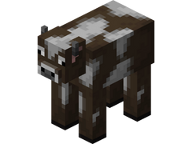

# 🐾 Les spawners

## 💠 Quelques informations... ? 📃
Les **spawners** sont des blocs spéciaux permettant de faire apparaître régulièrement un **mob défini** par le spawner. Ils sont particulièrement utiles pour la création de **farm automatiques**, afin de récolter des ressources, **gagner de l'XP** ou encore **monter votre métier de Chasseur**.

Ces blocs peuvent être placés **n’importe où** (dans les zones où vous en avez l’autorisation). Cependant, ils ne sont **récupérables** qu’à l’intérieur de votre propre ville, ou d’une ville où vous disposez des droits nécessaires, et uniquement à l’aide d’une **pioche enchantée Toucher de Soie**. Également, vous ne pouvez placer que 16 spawners par chunk.

Il existe **deux types de spawners** sur le serveur :  
* **Spawner PASSIF** 🐔 : Nécessite des **blocs d’herbe** et de la **lumière** pour que les mobs puissent apparaître.  
* **Spawner AGRESSIF** 🐍 : Nécessite l’absence **totale de lumière** pour que les mobs puissent apparaître.

## 💠 Liste des spawners existant ? 🔍

<table border="1" cellspacing="0" cellpadding="6">
  <tr>
    <td><mark style="color:red;"><strong>Nom 🏷️</strong></mark></td>
    <td><mark style="color:red;"><strong>Catégorie 📂</strong></mark></td>
    <td><mark style="color:red;"><strong>Obtentions 🔍</strong></mark></td>
  </tr>
  <tr>
    <td align="center">
      
<mark style="color:red;"><strong>Cochon</strong></mark>

      

<figure></figure>

    </td>
    <td>
      
<mark style="color:green;"><strong>Passif</strong></mark>

    <td>
      
 * Caisse de Vote 📨

      
 * `/Boutique` (300 Gemmes💎)

    </td>
  </tr>
  <tr>
    <td align="center">
      
<mark style="color:red;"><strong>Cochon</strong></mark>

      

<figure></figure>

    </td>
    <td>
      
<mark style="color:green;"><strong>Passif</strong></mark>

    <td>
      
 * Caisse de Vote 📨

      
 * Caisse Émeraude ✳️

      
 * Caisse Rubis 🔻

      
 * Caisse Jackpot 🎰

      
 * Caisse Draconique 🐉

      
 * Caisse Abyssal 🌊

      
 * Caisse Trésors 🏴‍☠️

      
 * Caisse Halloween 🎃

      
 * Caisse Givrée ❄️

      
 * Caisse St-Valentin 💕

      
 * Caisse St-Patrick 🍀

      
 * Caisse Pâques 🥚

      
 * Caisse Summer 🏖️

      
 * Caisse Antique 🦴

      
 * `/Boutique` (300 Gemmes💎)

    </td>
  </tr>

