h1{
color: green;
}

# 🥼 Les Armure

## 💠 <mark style="color:green;">Quelques informations... ?</mark> 📃

Les <mark style="color:green;">**Armure customs**</mark>, offrent bien plus qu’une simple protection. En plus de réduire les <mark style="color:green;">**dégâts des mobs**</mark> grâce à leurs <mark style="color:green;">**enchantements vanilla**</mark>, elles procurent des <mark style="color:green;">**statistiques de classe supplémentaires**</mark>, vous rendant plus résistant face aux ennemis.

Également, les différentes <h1>**pièces d’armure**</h1> vous permettent de compléter votre <h1>**/collection**</h1> afin d’obtenir un <h1>**tag exclusif**</h1> lorsque la <h1>**collection complète**</h1> a été réunie. Cela ajoute un objectif supplémentaire pour les joueurs souhaitant <h1>**collectionner et se démarquer**</h1> sur le serveur.

Ces Armure sont trouvables dans différentes [<mark style="color:green;">**caisses du serveur**</mark>](https://wiki.evolucraft.fr/le-gameplay/les-caisses), lors des <mark style="color:green;">**événements temporaires**</mark>, Le [<mark style="color:green;">**Marché Noir**</mark>](https://wiki.evolucraft.fr/le-gameplay/marche-noir) ou encore [<mark style="color:green;">**l'hôtel de vente**</mark>](https://wiki.evolucraft.fr/le-gameplay/le-commerce#hotel-des-ventes).

## 💠 <mark style="color:green;">Liste des Armure existantes ?</mark> 📑

### 🎲◦ <mark style="color:yellow;">Armure Jackpot</mark>

#### 🔹 <ins>Son obtention</ins>🤔

Les <mark style="color:green;">pièces d'Armure Jackpot</mark> ne sont <mark style="color:green;">plus obtenable actuellement</mark>, sauf à <mark style="color:green;">l'achat</mark> dans [<mark style="color:green;">l'hôtel de vente</mark>](https://wiki.evolucraft.fr/le-gameplay/le-commerce#hotel-des-ventes).

#### 🔹 <ins>Son aperçue</ins>🔍

<table border="1" cellspacing="0" cellpadding="6">
  <tr>
    <td align="center"><ins><strong>Casque</strong></ins></td>
    <td align="center"><ins><strong>Plastron</strong></ins></td>
    <td align="center"><ins><strong>Pantalon</strong></ins></td>
    <td align="center"><ins><strong>Bottes</strong></ins></td>    
  </tr>
  <tr>
   <td align="center"><figure>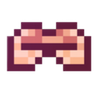</figure></td>
   <td align="center"><figure>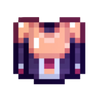</figure></td>
   <td align="center"><figure>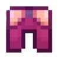</figure></td>
   <td align="center"><figure>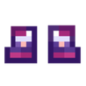</figure></td>
  </tr>
  <tr>
    <td>
      
🞄 <mark style="color:red;"><strong>❤️ Vie</strong></mark> <strong>+15</strong>

      
🞄 <mark style="color:blue;"><strong>🛡️ Défense</strong></mark> <strong>+5</strong>

      
🞄 <mark style="color:red;"><strong>💕 Régénération</strong></mark> <strong>+2</strong>

    </td>
    <td>
      
🞄 <mark style="color:red;"><strong>❤️ Vie</strong></mark> <strong>+15</strong>

      
🞄 <mark style="color:blue;"><strong>🛡️ Défense</strong></mark> <strong>+5</strong>

      
🞄 <mark style="color:red;"><strong>💕 Régénération</strong></mark> <strong>+2</strong>

    </td>
    <td>
      
🞄 <mark style="color:red;"><strong>❤️ Vie</strong></mark> <strong>+15</strong>

      
🞄 <mark style="color:blue;"><strong>🛡️ Défense</strong></mark> <strong>+5</strong>

      
🞄 <mark style="color:red;"><strong>💕 Régénération</strong></mark> <strong>+2</strong>

    </td>
    <td>
      
🞄 <mark style="color:red;"><strong>❤️ Vie</strong></mark> <strong>+15</strong>

      
🞄 <mark style="color:blue;"><strong>🛡️ Défense</strong></mark> <strong>+5</strong>

      
🞄 <mark style="color:red;"><strong>💕 Régénération</strong></mark> <strong>+2</strong>

    </td>
  </tr>
  <tr>
    <td>
      
🞄 <mark style="color:yellow;"><strong>Protection IV</strong></mark>

      
🞄 <mark style="color:yellow;"><strong>Solidité III</strong></mark>

      
🞄 <mark style="color:yellow;"><strong>Raccomodage</strong></mark>

      
🞄 <mark style="color:yellow;"><strong>Respiration III</strong></mark>

      
🞄 <mark style="color:yellow;"><strong>Affinité Aquatique</strong></mark>

    </td>
    <td>
      
🞄 <mark style="color:yellow;"><strong>Protection IV</strong></mark>

      
🞄 <mark style="color:yellow;"><strong>Solidité III</strong></mark>

      
🞄 <mark style="color:yellow;"><strong>Raccomodage</strong></mark>

    </td>
    <td>
      
🞄 <mark style="color:yellow;"><strong>Protection IV</strong></mark>

      
🞄 <mark style="color:yellow;"><strong>Solidité III</strong></mark>

      
🞄 <mark style="color:yellow;"><strong>Raccomodage</strong></mark>

      
🞄 <mark style="color:yellow;"><strong>Furtivité Rapide III</strong></mark>

    </td>
    <td>
      
🞄 <mark style="color:yellow;"><strong>Protection IV</strong></mark>

      
🞄 <mark style="color:yellow;"><strong>Solidité III</strong></mark>

      
🞄 <mark style="color:yellow;"><strong>Raccomodage</strong></mark>

      
🞄 <mark style="color:yellow;"><strong>Agilité des Âmes III</strong></mark>

      
🞄 <mark style="color:yellow;"><strong>Agilité Aquatique III</strong></mark>

      
🞄 <mark style="color:yellow;"><strong>Chute Amortie IV</strong></mark>

    </td>
  </tr>
</table>

</table>
<table border="1" cellspacing="0" cellpadding="6">
  <tr>
    <td><strong><ins>Aperçue de l'armure</ins> 🖼️</strong></td>
    <td><strong><ins>Statistiques globales</ins> 📊</strong></td>
    <td><strong><ins>Effets</ins>✨</strong></td>
  </tr>
  <tr>
    <td align="center"><figure></figure></td>
    <td>
      
🞄 <mark style="color:red;"><strong>❤️ Vie</strong></mark> <strong>+60</strong>

      
🞄 <mark style="color:blue;"><strong>🛡️ Défense</strong></mark> <strong>+20</strong>

      
🞄 <mark style="color:red;"><strong>💕 Régénération</strong></mark> <strong>+8</strong>

    </td>
    <td><strong><em><mark style="color:green;">Aucun Effet</mark> Supplémentaire ❌</em></strong></td>
  </tr>
</table>

### 🎰✨◦ <mark style="color:green;">Armure Jackpot Shiny</mark>

#### 🔹 <ins>Son obtention</ins>🤔

Les <mark style="color:green;">pièces d'Armure Jackpot Shiny</mark> ne sont <mark style="color:green;">plus obtenable actuellement</mark>, sauf à <mark style="color:green;">l'achat</mark> dans [<mark style="color:green;">l'hôtel de vente</mark>](https://wiki.evolucraft.fr/le-gameplay/le-commerce#hotel-des-ventes).

#### 🔹 <ins>Son aperçue</ins>🔍

<table border="1" cellspacing="0" cellpadding="6">
  <tr>
    <td align="center"><ins><strong>Casque</strong></ins></td>
    <td align="center"><ins><strong>Plastron</strong></ins></td>
    <td align="center"><ins><strong>Pantalon</strong></ins></td>
    <td align="center"><ins><strong>Bottes</strong></ins></td>    
  </tr>
  <tr>
   <td align="center"><figure></figure></td>
   <td align="center"><figure>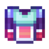</figure></td>
   <td align="center"><figure>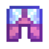</figure></td>
   <td align="center"><figure>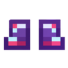</figure></td>
  </tr>
  <tr>
    <td>
      
🞄 <mark style="color:red;"><strong>❤️ Vie</strong></mark> <strong>+15</strong>

      
🞄 <mark style="color:blue;"><strong>🛡️ Défense</strong></mark> <strong>+5</strong>

      
🞄 <mark style="color:red;"><strong>💕 Régénération</strong></mark> <strong>+2</strong>

    </td>
    <td>
      
🞄 <mark style="color:red;"><strong>❤️ Vie</strong></mark> <strong>+15</strong>

      
🞄 <mark style="color:blue;"><strong>🛡️ Défense</strong></mark> <strong>+5</strong>

      
🞄 <mark style="color:red;"><strong>💕 Régénération</strong></mark> <strong>+2</strong>

    </td>
    <td>
      
🞄 <mark style="color:red;"><strong>❤️ Vie</strong></mark> <strong>+15</strong>

      
🞄 <mark style="color:blue;"><strong>🛡️ Défense</strong></mark> <strong>+5</strong>

      
🞄 <mark style="color:red;"><strong>💕 Régénération</strong></mark> <strong>+2</strong>

    </td>
    <td>
      
🞄 <mark style="color:red;"><strong>❤️ Vie</strong></mark> <strong>+15</strong>

      
🞄 <mark style="color:blue;"><strong>🛡️ Défense</strong></mark> <strong>+5</strong>

      
🞄 <mark style="color:red;"><strong>💕 Régénération</strong></mark> <strong>+2</strong>

    </td>
  </tr>
  <tr>
    <td>
      
🞄 <mark style="color:green;"><strong>Protection IV</strong></mark>

      
🞄 <mark style="color:green;"><strong>Solidité III</strong></mark>

      
🞄 <mark style="color:green;"><strong>Raccomodage</strong></mark>

      
🞄 <mark style="color:green;"><strong>Respiration III</strong></mark>

      
🞄 <mark style="color:green;"><strong>Affinité Aquatique</strong></mark>

    </td>
    <td>
      
🞄 <mark style="color:green;"><strong>Protection IV</strong></mark>

      
🞄 <mark style="color:green;"><strong>Solidité III</strong></mark>

      
🞄 <mark style="color:green;"><strong>Raccomodage</strong></mark>

    </td>
    <td>
      
🞄 <mark style="color:green;"><strong>Protection IV</strong></mark>

      
🞄 <mark style="color:green;"><strong>Solidité III</strong></mark>

      
🞄 <mark style="color:green;"><strong>Raccomodage</strong></mark>

      
🞄 <mark style="color:green;"><strong>Furtivité Rapide III</strong></mark>

    </td>
    <td>
      
🞄 <mark style="color:green;"><strong>Protection IV</strong></mark>

      
🞄 <mark style="color:green;"><strong>Solidité III</strong></mark>

      
🞄 <mark style="color:green;"><strong>Raccomodage</strong></mark>

      
🞄 <mark style="color:green;"><strong>Agilité des Âmes III</strong></mark>

      
🞄 <mark style="color:green;"><strong>Agilité Aquatique III</strong></mark>

      
🞄 <mark style="color:green;"><strong>Chute Amortie IV</strong></mark>

    </td>
  </tr>
</table>

</table>
<table border="1" cellspacing="0" cellpadding="6">
  <tr>
    <td><strong><ins>Aperçue de l'armure</ins> 🖼️</strong></td>
    <td><strong><ins>Statistiques globales</ins> 📊</strong></td>
    <td><strong><ins>Effets</ins>✨</strong></td>
  </tr>
  <tr>
    <td align="center"><figure>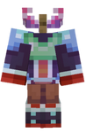</figure></td>
    <td>
      
🞄 <mark style="color:red;"><strong>❤️ Vie</strong></mark> <strong>+60</strong>

      
🞄 <mark style="color:blue;"><strong>🛡️ Défense</strong></mark> <strong>+20</strong>

      
🞄 <mark style="color:red;"><strong>💕 Régénération</strong></mark> <strong>+8</strong>

    </td>
    <td><strong><em><mark style="color:green;">Aucun Effet</mark> Supplémentaire ❌</em></strong></td>
  </tr>
</table>
      
### 🐉◦ <mark style="color:orange;"> Armure Draconique</mark>

#### 🔹 <ins>Son obtention</ins>🤔

Les <mark style="color:green;">pièces d'armures Draconique</mark> s'obtiennent dans la [<mark style="color:orange;">caisse Draconique</mark>](https://wiki.evolucraft.fr/le-gameplay/les-caisses#caisse-draconique).

#### 🔹 <ins>Son aperçue</ins>🔍

<table border="1" cellspacing="0" cellpadding="6">
  <tr>
    <td align="center"><ins><strong>Casque</strong></ins></td>
    <td align="center"><ins><strong>Plastron</strong></ins></td>
    <td align="center"><ins><strong>Pantalon</strong></ins></td>
    <td align="center"><ins><strong>Bottes</strong></ins></td>    
  </tr>
  <tr>
   <td align="center"><figure></figure></td>
   <td align="center"><figure>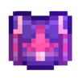</figure></td>
   <td align="center"><figure></figure></td>
   <td align="center"><figure>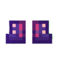</figure></td>
  </tr>
  <tr>
    <td>
      
🞄 <mark style="color:red;"><strong>❤️ Vie</strong></mark> <strong>+10</strong>

      
🞄 <mark style="color:blue;"><strong>🛡️ Défense</strong></mark> <strong>+2</strong>

    </td>
    <td>
      
🞄 <mark style="color:red;"><strong>❤️ Vie</strong></mark> <strong>+10</strong>

      
🞄 <mark style="color:blue;"><strong>🛡️ Défense</strong></mark> <strong>+2</strong>

    </td>
    <td>
      
🞄 <mark style="color:red;"><strong>❤️ Vie</strong></mark> <strong>+10</strong>

      
🞄 <mark style="color:blue;"><strong>🛡️ Défense</strong></mark> <strong>+2</strong>

    </td>
    <td>
      
🞄 <mark style="color:red;"><strong>❤️ Vie</strong></mark> <strong>+10</strong>

      
🞄 <mark style="color:blue;"><strong>🛡️ Défense</strong></mark> <strong>+2</strong>

    </td>
  <tr>
    <td>
      
🞄 <mark style="color:orange;"><strong>Protection IV</strong></mark>

      
🞄 <mark style="color:orange;"><strong>Solidité III</strong></mark>

      
🞄 <mark style="color:orange;"><strong>Raccomodage</strong></mark>

      
🞄 <mark style="color:orange;"><strong>Respiration III</strong></mark>

      
🞄 <mark style="color:orange;"><strong>Affinité Aquatique</strong></mark>

    </td>
    <td>
      
🞄 <mark style="color:orange;"><strong>Protection IV</strong></mark>

      
🞄 <mark style="color:orange;"><strong>Solidité III</strong></mark>

      
🞄 <mark style="color:orange;"><strong>Raccomodage</strong></mark>

    </td>
    <td>
      
🞄 <mark style="color:orange;"><strong>Protection IV</strong></mark>

      
🞄 <mark style="color:orange;"><strong>Solidité III</strong></mark>

      
🞄 <mark style="color:orange;"><strong>Raccomodage</strong></mark>

      
🞄 <mark style="color:orange;"><strong>Furtivité Rapide III</strong></mark>

    </td>
    <td>
      
🞄 <mark style="color:orange;"><strong>Protection IV</strong></mark>

      
🞄 <mark style="color:orange;"><strong>Solidité III</strong></mark>

      
🞄 <mark style="color:orange;"><strong>Raccomodage</strong></mark>

      
🞄 <mark style="color:orange;"><strong>Agilité des Âmes III</strong></mark>

      
🞄 <mark style="color:orange;"><strong>Agilité Aquatique III</strong></mark>

      
🞄 <mark style="color:orange;"><strong>Chute Amortie IV</strong></mark>

    </td>
  </tr>
</table>
<table border="1" cellspacing="0" cellpadding="6">
  <tr>
    <td><strong><ins>Aperçue de l'armure</ins> 🖼️</strong></td>
    <td><strong><ins>Statistiques globales</ins> 📊</strong></td>
    <td><strong><ins>Effets</ins>✨</strong></td>
  </tr>
  <tr>
    <td align="center"><figure>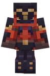</figure></td>
    <td>
      
🞄 <mark style="color:red;"><strong>❤️ Vie</strong></mark> <strong>+40</strong>

      
🞄 <mark style="color:blue;"><strong>🛡️ Défense</strong></mark> <strong>+8</strong>

    </td>
    <td>
      <mark style="color:orange;"><strong>Effet par pièce d'armure équiper</strong></mark> : <mark style="color:orange;"><strong>+ 2.5%</strong></mark> de <mark style="color:orange;"><strong>Dégats supplémentaire</strong></mark> dans les <a href="https://wiki.evolucraft.fr/le-gameplay/les-donjons/draconique"><mark style="color:orange;"><strong>Donjons Draconiques</strong></mark></a>
    </td>
  </tr>
</table>

### 🐲◦ <mark style="color:red;">Armure Draconnier</mark>

#### 🔹 <ins>Son obtention</ins>🤔

Les <mark style="color:green;">pièces d'armures Draconnier</mark> s'obtiennent dans le [<mark style="color:green;"><strong>Marché Noir 🧥</strong></mark>](https://wiki.evolucraft.fr/le-gameplay/marche-noir#draconique) avec les <mark style="color:green;">Coeurs de Dragons</mark>.

#### 🔹 <ins>Son aperçue</ins>🔍

<table border="1" cellspacing="0" cellpadding="6">
  <tr>
    <td align="center"><ins><strong>Casque</strong></ins></td>
    <td align="center"><ins><strong>Plastron</strong></ins></td>
    <td align="center"><ins><strong>Pantalon</strong></ins></td>
    <td align="center"><ins><strong>Bottes</strong></ins></td>    
  </tr>
  <tr>
   <td align="center"><figure>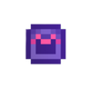</figure></td>
   <td align="center"><figure>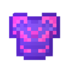</figure></td>
   <td align="center"><figure>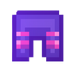</figure></td>
   <td align="center"><figure>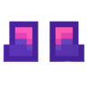</figure></td>
  </tr>
  <tr>
    <td>
      
🞄 <mark style="color:red;"><strong>❤️ Vie</strong></mark> <strong>+5</strong>

      
🞄 <mark style="color:blue;"><strong>🛡️ Défense</strong></mark> <strong>+1</strong>

    </td>
    <td>
      
🞄 <mark style="color:red;"><strong>❤️ Vie</strong></mark> <strong>+5</strong>

      
🞄 <mark style="color:blue;"><strong>🛡️ Défense</strong></mark> <strong>+1</strong>

    </td>
    <td>
      
🞄 <mark style="color:red;"><strong>❤️ Vie</strong></mark> <strong>+5</strong>

      
🞄 <mark style="color:blue;"><strong>🛡️ Défense</strong></mark> <strong>+1</strong>

    </td>
    <td>
      
🞄 <mark style="color:red;"><strong>❤️ Vie</strong></mark> <strong>+5</strong>

      
🞄 <mark style="color:blue;"><strong>🛡️ Défense</strong></mark> <strong>+1</strong>

    </td>
  <tr>
    <td>
      
🞄 <mark style="color:red;"><strong>Protection IV</strong></mark>

      
🞄 <mark style="color:red;"><strong>Solidité III</strong></mark>

      
🞄 <mark style="color:red;"><strong>Raccomodage</strong></mark>

      
🞄 <mark style="color:red;"><strong>Respiration III</strong></mark>

      
🞄 <mark style="color:red;"><strong>Affinité Aquatique</strong></mark>

    </td>
    <td>
      
🞄 <mark style="color:red;"><strong>Protection IV</strong></mark>

      
🞄 <mark style="color:red;"><strong>Solidité III</strong></mark>

      
🞄 <mark style="color:red;"><strong>Raccomodage</strong></mark>

    </td>
    <td>
      
🞄 <mark style="color:red;"><strong>Protection IV</strong></mark>

      
🞄 <mark style="color:red;"><strong>Solidité III</strong></mark>

      
🞄 <mark style="color:red;"><strong>Raccomodage</strong></mark>

      
🞄 <mark style="color:red;"><strong>Furtivité Rapide III</strong></mark>

    </td>
    <td>
      
🞄 <mark style="color:red;"><strong>Protection IV</strong></mark>

      
🞄 <mark style="color:red;"><strong>Solidité III</strong></mark>

      
🞄 <mark style="color:red;"><strong>Raccomodage</strong></mark>

      
🞄 <mark style="color:red;"><strong>Agilité des Âmes III</strong></mark>

      
🞄 <mark style="color:red;"><strong>Agilité Aquatique III</strong></mark>

      
🞄 <mark style="color:red;"><strong>Chute Amortie IV</strong></mark>

    </td>
  </tr>
</table>
<table border="1" cellspacing="0" cellpadding="6">
  <tr>
    <td><strong><ins>Aperçue de l'armure</ins> 🖼️</strong></td>
    <td><strong><ins>Statistiques globales</ins> 📊</strong></td>
    <td><strong><ins>Effets</ins>✨</strong></td>
  </tr>
  <tr>
    <td align="center"><figure>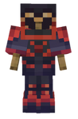</figure></td>
    <td>
      
🞄 <mark style="color:red;"><strong>❤️ Vie</strong></mark> <strong>+20</strong>

      
🞄 <mark style="color:blue;"><strong>🛡️ Défense</strong></mark> <strong>+4</strong>

    </td>
    <td>
      <mark style="color:red;"><strong>Effet par pièce d'armure équiper</strong></mark> : <mark style="color:red;"><strong>+ 1%</strong></mark> de <mark style="color:red;"><strong>Dégats supplémentaire</strong></mark> dans les <a href="https://wiki.evolucraft.fr/le-gameplay/les-donjons/draconique"><mark style="color:red;"><strong>Donjons Draconiques</strong></mark></a>
    </td>
  </tr>
</table>

### 🌊◦ <mark style="color:blue;">Armure Abyssal</mark>

#### 🔹 <ins>Son obtention</ins>🤔

Les <mark style="color:green;">pièces d'armures Abyssal</mark> s'obtiennent dans la [<mark style="color:blue;">caisse Abyssal</mark>](https://wiki.evolucraft.fr/le-gameplay/les-caisses#caisse-abyssal).

#### 🔹 <ins>Son aperçue</ins>🔍

<table border="1" cellspacing="0" cellpadding="6">
  <tr>
    <td align="center"><ins><strong>Casque</strong></ins></td>
    <td align="center"><ins><strong>Plastron</strong></ins></td>
    <td align="center"><ins><strong>Pantalon</strong></ins></td>
    <td align="center"><ins><strong>Bottes</strong></ins></td>    
  </tr>
  <tr>
   <td align="center"><figure></figure></td>
   <td align="center"><figure></figure></td>
   <td align="center"><figure>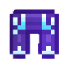</figure></td>
   <td align="center"><figure>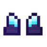</figure></td>
  </tr>
  <tr>
    <td>
      
🞄 <mark style="color:red;"><strong>❤️ Vie</strong></mark> <strong>+10</strong>

      
🞄 <mark style="color:red;"><strong>💕 Régénération</strong></mark> <strong>+2</strong>

    </td>
    <td>
      
🞄 <mark style="color:red;"><strong>❤️ Vie</strong></mark> <strong>+10</strong>

      
🞄 <mark style="color:red;"><strong>💕 Régénération</strong></mark> <strong>+2</strong>

    </td>
    <td>
      
🞄 <mark style="color:red;"><strong>❤️ Vie</strong></mark> <strong>+10</strong>

      
🞄 <mark style="color:red;"><strong>💕 Régénération</strong></mark> <strong>+2</strong>

    </td>
    <td>
      
🞄 <mark style="color:red;"><strong>❤️ Vie</strong></mark> <strong>+10</strong>

      
🞄 <mark style="color:red;"><strong>💕 Régénération</strong></mark> <strong>+2</strong>

    </td>
  <tr>
    <td>
      
🞄 <mark style="color:blue;"><strong>Protection IV</strong></mark>

      
🞄 <mark style="color:blue;"><strong>Solidité III</strong></mark>

      
🞄 <mark style="color:blue;"><strong>Raccomodage</strong></mark>

      
🞄 <mark style="color:blue;"><strong>Respiration III</strong></mark>

      
🞄 <mark style="color:blue;"><strong>Affinité Aquatique</strong></mark>

    </td>
    <td>
      
🞄 <mark style="color:blue;"><strong>Protection IV</strong></mark>

      
🞄 <mark style="color:blue;"><strong>Solidité III</strong></mark>

      
🞄 <mark style="color:blue;"><strong>Raccomodage</strong></mark>

    </td>
    <td>
      
🞄 <mark style="color:blue;"><strong>Protection IV</strong></mark>

      
🞄 <mark style="color:blue;"><strong>Solidité III</strong></mark>

      
🞄 <mark style="color:blue;"><strong>Raccomodage</strong></mark>

      
🞄 <mark style="color:blue;"><strong>Furtivité Rapide III</strong></mark>

    </td>
    <td>
      
🞄 <mark style="color:blue;"><strong>Protection IV</strong></mark>

      
🞄 <mark style="color:blue;"><strong>Solidité III</strong></mark>

      
🞄 <mark style="color:blue;"><strong>Raccomodage</strong></mark>

      
🞄 <mark style="color:blue;"><strong>Agilité des Âmes III</strong></mark>

      
🞄 <mark style="color:blue;"><strong>Agilité Aquatique III</strong></mark>

      
🞄 <mark style="color:blue;"><strong>Chute Amortie IV</strong></mark>

    </td>
  </tr>
</table>
<table border="1" cellspacing="0" cellpadding="6">
  <tr>
    <td><strong><ins>Aperçue de l'armure</ins> 🖼️</strong></td>
    <td><strong><ins>Statistiques globales</ins> 📊</strong></td>
    <td><strong><ins>Effets</ins>✨</strong></td>
  </tr>
  <tr>
    <td align="center"><figure>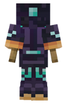</figure></td>
    <td>
      
🞄 <mark style="color:red;"><strong>❤️ Vie</strong></mark> <strong>+40</strong>

      
🞄 <mark style="color:red;"><strong>💕 Régénération</strong></mark> <strong>+8</strong>

    </td>
    <td>
      <mark style="color:blue;"><strong>Effet par pièce d'armure équiper</strong></mark> : <mark style="color:blue;"><strong>+ 2.5%</strong></mark> de <mark style="color:blue;"><strong>Dégats supplémentaire</strong></mark> dans les <a href="https://wiki.evolucraft.fr/le-gameplay/les-donjons/abyssal"><mark style="color:blue;"><strong>Donjons Abysseaux</strong></mark></a>
    </td>
  </tr>
</table>

### 🏴‍☠️◦ <mark style="color:yellow;">Armure Conquistador</mark>

#### 🔹 <ins>Son obtention</ins>🤔

Les <mark style="color:green;">pièces d'armures Conquistador</mark> s'obtiennent dans la [<mark style="color:green;">caisse aux Trésors</mark>](https://wiki.evolucraft.fr/le-gameplay/les-caisses#caisse-aux-tresors).

#### 🔹 <ins>Son aperçue</ins>🔍

<table border="1" cellspacing="0" cellpadding="6">
  <tr>
    <td align="center"><ins><strong>Casque</strong></ins></td>
    <td align="center"><ins><strong>Plastron</strong></ins></td>
    <td align="center"><ins><strong>Pantalon</strong></ins></td>
    <td align="center"><ins><strong>Bottes</strong></ins></td>    
  </tr>
  <tr>
   <td align="center"><figure>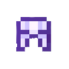</figure></td>
   <td align="center"><figure>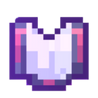</figure></td>
   <td align="center"><figure>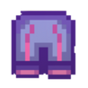</figure></td>
   <td align="center"><figure>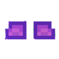</figure></td>
  </tr>
  <tr>
    <td>
      
🞄 <mark style="color:red;"><strong>❤️ Vie</strong></mark> <strong>+5</strong>

      
🞄 <mark style="color:blue;"><strong>🏃‍♂️ Vitesse</strong></mark> <strong>+2</strong>

    </td>
    <td>
      
🞄 <mark style="color:red;"><strong>❤️ Vie</strong></mark> <strong>+5</strong>

      
🞄 <mark style="color:blue;"><strong>🏃‍♂️ Vitesse</strong></mark> <strong>+2</strong>

    </td>
    <td>
      
🞄 <mark style="color:red;"><strong>❤️ Vie</strong></mark> <strong>+5</strong>

      
🞄 <mark style="color:blue;"><strong>🏃‍♂️ Vitesse</strong></mark> <strong>+2</strong>

    </td>
    <td>
      
🞄 <mark style="color:red;"><strong>❤️ Vie</strong></mark> <strong>+5</strong>

      
🞄 <mark style="color:blue;"><strong>🏃‍♂️ Vitesse</strong></mark> <strong>+2</strong>

    </td>
  <tr>
    <td>
      
🞄 <mark style="color:green;"><strong>Protection IV</strong></mark>

      
🞄 <mark style="color:green;"><strong>Solidité III</strong></mark>

      
🞄 <mark style="color:green;"><strong>Raccomodage</strong></mark>

      
🞄 <mark style="color:green;"><strong>Respiration III</strong></mark>

      
🞄 <mark style="color:green;"><strong>Affinité Aquatique</strong></mark>

    </td>
    <td>
      
🞄 <mark style="color:green;"><strong>Protection IV</strong></mark>

      
🞄 <mark style="color:green;"><strong>Solidité III</strong></mark>

      
🞄 <mark style="color:green;"><strong>Raccomodage</strong></mark>

    </td>
    <td>
      
🞄 <mark style="color:green;"><strong>Protection IV</strong></mark>

      
🞄 <mark style="color:green;"><strong>Solidité III</strong></mark>

      
🞄 <mark style="color:green;"><strong>Raccomodage</strong></mark>

      
🞄 <mark style="color:green;"><strong>Furtivité Rapide III</strong></mark>

    </td>
    <td>
      
🞄 <mark style="color:green;"><strong>Protection IV</strong></mark>

      
🞄 <mark style="color:green;"><strong>Solidité III</strong></mark>

      
🞄 <mark style="color:green;"><strong>Raccomodage</strong></mark>

      
🞄 <mark style="color:green;"><strong>Agilité des Âmes III</strong></mark>

      
🞄 <mark style="color:green;"><strong>Agilité Aquatique III</strong></mark>

      
🞄 <mark style="color:green;"><strong>Chute Amortie IV</strong></mark>

    </td>
  </tr>
</table>
<table border="1" cellspacing="0" cellpadding="6">
  <tr>
    <td><strong><ins>Aperçue de l'armure</ins> 🖼️</strong></td>
    <td><strong><ins>Statistiques globales</ins> 📊</strong></td>
    <td><strong><ins>Effets</ins>✨</strong></td>
  </tr>
  <tr>
    <td align="center"><figure>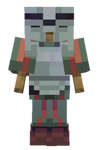</figure></td>
    <td>
      
🞄 <mark style="color:red;"><strong>❤️ Vie</strong></mark> <strong>+20</strong>

      
🞄 <mark style="color:blue;"><strong>🏃‍♂️ Vitesse</strong></mark> <strong>+8</strong>

    </td>
    <td><strong><em><mark style="color:green;">Aucun Effet</mark> Supplémentaire ❌</em></strong></td>
  </tr>
</table>

### 🌛◦ <mark style="color:blue;">Armure de Minuit 

#### 🔹 <ins>Son obtention</ins>🤔

Les <mark style="color:green;">pièces d'armures de Minuit</mark> s'obtiennent dans la [<mark style="color:orange;">caisse Halloween</mark>](https://wiki.evolucraft.fr/le-gameplay/les-caisses#caisse-halloween).

#### 🔹 <ins>Son aperçue</ins>🔍

<table border="1" cellspacing="0" cellpadding="6">
  <tr>
    <td align="center"><ins><strong>Casque</strong></ins></td>
    <td align="center"><ins><strong>Plastron</strong></ins></td>
    <td align="center"><ins><strong>Pantalon</strong></ins></td>
    <td align="center"><ins><strong>Bottes</strong></ins></td>    
  </tr>
  <tr>
   <td align="center"><figure></figure></td>
   <td align="center"><figure>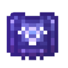</figure></td>
   <td align="center"><figure></figure></td>
   <td align="center"><figure>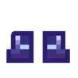</figure></td>
  </tr>
  <tr>
    <td>
      
🞄 <mark style="color:red;"><strong>❤️ Vie</strong></mark> <strong>+10</strong>

      
🞄 <mark style="color:yellow;"><strong>🧪 Mana</strong></mark> <strong>+10</strong>

    </td>
    <td>
      
🞄 <mark style="color:red;"><strong>❤️ Vie</strong></mark> <strong>+10</strong>

      
🞄 <mark style="color:yellow;"><strong>🧪 Mana</strong></mark> <strong>+10</strong>

    </td>
    <td>
      
🞄 <mark style="color:red;"><strong>❤️ Vie</strong></mark> <strong>+10</strong>

      
🞄 <mark style="color:yellow;"><strong>🧪 Mana</strong></mark> <strong>+10</strong>

    </td>
    <td>
      
🞄 <mark style="color:red;"><strong>❤️ Vie</strong></mark> <strong>+10</strong>

      
🞄 <mark style="color:yellow;"><strong>🧪 Mana</strong></mark> <strong>+10</strong>

    </td>
  <tr>
    <td>
      
🞄 <mark style="color:blue;"><strong>Protection IV</strong></mark>

      
🞄 <mark style="color:blue;"><strong>Solidité III</strong></mark>

      
🞄 <mark style="color:blue;"><strong>Raccomodage</strong></mark>

      
🞄 <mark style="color:blue;"><strong>Respiration III</strong></mark>

      
🞄 <mark style="color:blue;"><strong>Affinité Aquatique</strong></mark>

    </td>
    <td>
      
🞄 <mark style="color:blue;"><strong>Protection IV</strong></mark>

      
🞄 <mark style="color:blue;"><strong>Solidité III</strong></mark>

      
🞄 <mark style="color:blue;"><strong>Raccomodage</strong></mark>

    </td>
    <td>
      
🞄 <mark style="color:blue;"><strong>Protection IV</strong></mark>

      
🞄 <mark style="color:blue;"><strong>Solidité III</strong></mark>

      
🞄 <mark style="color:blue;"><strong>Raccomodage</strong></mark>

      
🞄 <mark style="color:blue;"><strong>Furtivité Rapide III</strong></mark>

    </td>
    <td>
      
🞄 <mark style="color:blue;"><strong>Protection IV</strong></mark>

      
🞄 <mark style="color:blue;"><strong>Solidité III</strong></mark>

      
🞄 <mark style="color:blue;"><strong>Raccomodage</strong></mark>

      
🞄 <mark style="color:blue;"><strong>Agilité des Âmes III</strong></mark>

      
🞄 <mark style="color:blue;"><strong>Agilité Aquatique III</strong></mark>

      
🞄 <mark style="color:blue;"><strong>Chute Amortie IV</strong></mark>

    </td>
  </tr>
</table>
<table border="1" cellspacing="0" cellpadding="6">
  <tr>
    <td><strong><ins>Aperçue de l'armure</ins> 🖼️</strong></td>
    <td><strong><ins>Statistiques globales</ins> 📊</strong></td>
    <td><strong><ins>Effets</ins>✨</strong></td>
  </tr>
  <tr>
    <td align="center"><figure>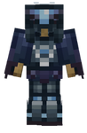</figure></td>
    <td>
      
🞄 <mark style="color:red;"><strong>❤️ Vie</strong></mark> <strong>+40</strong>

      
🞄 <mark style="color:yellow;"><strong>🧪 Mana</strong></mark> <strong>+40</strong>

    </td>
    <td>
      <mark style="color:blue;"><strong>Effet par pièce d'armure équiper</strong></mark> : <mark style="color:blue;"><strong>+ 0.5%</strong></mark> de <mark style="color:blue;"><strong>Vol de vie</strong></mark> dans <mark style="color:blue;"><strong>Tout types de Donjons</strong></mark>
    </td>
  </tr>
</table>

### 🎅◦ <mark style="color:red;">Armure Père Noël</mark>

#### 🔹 <ins>Son obtention</ins>🤔

Les <mark style="color:green;">pièces d'armures Père Noël</mark> s'obtiennent dans la [<mark style="color:green;">caisse Givrée</mark>](https://wiki.evolucraft.fr/le-gameplay/les-caisses#caisse-givree).

#### 🔹 <ins>Son aperçue</ins>🔍

<table border="1" cellspacing="0" cellpadding="6">
  <tr>
    <td align="center"><ins><strong>Casque</strong></ins></td>
    <td align="center"><ins><strong>Plastron</strong></ins></td>
    <td align="center"><ins><strong>Pantalon</strong></ins></td>
    <td align="center"><ins><strong>Bottes</strong></ins></td>    
  </tr>
  <tr>
   <td align="center"><figure>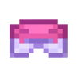</figure></td>
   <td align="center"><figure>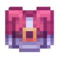</figure></td>
   <td align="center"><figure>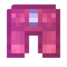</figure></td>
   <td align="center"><figure>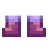</figure></td>
  </tr>
  <tr>
    <td>
      
🞄 <mark style="color:red;"><strong>❤️ Vie</strong></mark> <strong>+10</strong>

      
🞄 <mark style="color:red;"><strong>🥊 Chance de Critique</strong></mark> <strong>+4</strong>

    </td>
    <td>
      
🞄 <mark style="color:red;"><strong>❤️ Vie</strong></mark> <strong>+10</strong>

      
🞄 <mark style="color:red;"><strong>🥊 Chance de Critique</strong></mark> <strong>+4</strong>

    </td>
    <td>
      
🞄 <mark style="color:red;"><strong>❤️ Vie</strong></mark> <strong>+10</strong>

      
🞄 <mark style="color:red;"><strong>🥊 Chance de Critique</strong></mark> <strong>+4</strong>

    </td>
    <td>
      
🞄 <mark style="color:red;"><strong>❤️ Vie</strong></mark> <strong>+10</strong>

      
🞄 <mark style="color:red;"><strong>🥊 Chance de Critique</strong></mark> <strong>+4</strong>

    </td>
  <tr>
    <td>
      
🞄 <mark style="color:red;"><strong>Protection IV</strong></mark>

      
🞄 <mark style="color:red;"><strong>Solidité III</strong></mark>

      
🞄 <mark style="color:red;"><strong>Raccomodage</strong></mark>

      
🞄 <mark style="color:red;"><strong>Respiration III</strong></mark>

      
🞄 <mark style="color:red;"><strong>Affinité Aquatique</strong></mark>

    </td>
    <td>
      
🞄 <mark style="color:red;"><strong>Protection IV</strong></mark>

      
🞄 <mark style="color:red;"><strong>Solidité III</strong></mark>

      
🞄 <mark style="color:red;"><strong>Raccomodage</strong></mark>

    </td>
    <td>
      
🞄 <mark style="color:red;"><strong>Protection IV</strong></mark>

      
🞄 <mark style="color:red;"><strong>Solidité III</strong></mark>

      
🞄 <mark style="color:red;"><strong>Raccomodage</strong></mark>

      
🞄 <mark style="color:red;"><strong>Furtivité Rapide III</strong></mark>

    </td>
    <td>
      
🞄 <mark style="color:red;"><strong>Protection IV</strong></mark>

      
🞄 <mark style="color:red;"><strong>Solidité III</strong></mark>

      
🞄 <mark style="color:red;"><strong>Raccomodage</strong></mark>

      
🞄 <mark style="color:red;"><strong>Agilité des Âmes III</strong></mark>

      
🞄 <mark style="color:red;"><strong>Agilité Aquatique III</strong></mark>

      
🞄 <mark style="color:red;"><strong>Chute Amortie IV</strong></mark>

    </td>
  </tr>
</table>
<table border="1" cellspacing="0" cellpadding="6">
  <tr>
    <td><strong><ins>Aperçue de l'armure</ins> 🖼️</strong></td>
    <td><strong><ins>Statistiques globales</ins> 📊</strong></td>
    <td><strong><ins>Effets</ins>✨</strong></td>
  </tr>
  <tr>
    <td align="center"><figure>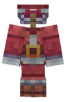</figure></td>
    <td>
      
🞄 <mark style="color:red;"><strong>❤️ Vie</strong></mark> <strong>+40</strong>

      
🞄 <mark style="color:red;"><strong>🥊 Chance de Critique</strong></mark> <strong>+16</strong>

    </td>
    <td><strong><em><mark style="color:green;">Aucun Effet</mark> Supplémentaire ❌</em></strong></td>
  </tr>
</table>

### 🧚‍♂️◦ <mark style="color:green;">Armure Elfes</mark>

#### 🔹 <ins>Son obtention</ins>🤔

Les <mark style="color:green;">pièces d'armures Elfes</mark> ne sont <mark style="color:green;">plus obtenables actuellement</mark>, sauf à <mark style="color:green;">l'achat</mark> dans [<mark style="color:green;">l'hôtel de vente</mark>](https://wiki.evolucraft.fr/le-gameplay/le-commerce#hotel-des-ventes).

#### 🔹 <ins>Son aperçue</ins>🔍

<table border="1" cellspacing="0" cellpadding="6">
  <tr>
    <td align="center"><ins><strong>Casque</strong></ins></td>
    <td align="center"><ins><strong>Plastron</strong></ins></td>
    <td align="center"><ins><strong>Pantalon</strong></ins></td>
    <td align="center"><ins><strong>Bottes</strong></ins></td>    
  </tr>
  <tr>
   <td align="center"><figure></figure></td>
   <td align="center"><figure>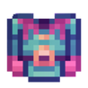</figure></td>
   <td align="center"><figure>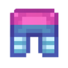</figure></td>
   <td align="center"><figure>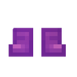</figure></td>
  </tr>
  <tr>
    <td>
      
🞄 <mark style="color:red;"><strong>❤️ Vie</strong></mark> <strong>+5</strong>

      
🞄 <mark style="color:red;"><strong>🥊 Chance de Critique</strong></mark> <strong>+0.25</strong>

    </td>
    <td>
      
🞄 <mark style="color:red;"><strong>❤️ Vie</strong></mark> <strong>+5</strong>

      
🞄 <mark style="color:red;"><strong>🥊 Chance de Critique</strong></mark> <strong>+0.25</strong>

    </td>
    <td>
      
🞄 <mark style="color:red;"><strong>❤️ Vie</strong></mark> <strong>+5</strong>

      
🞄 <mark style="color:red;"><strong>🥊 Chance de Critique</strong></mark> <strong>+0.25</strong>

    </td>
    <td>
      
🞄 <mark style="color:red;"><strong>❤️ Vie</strong></mark> <strong>+5</strong>

      
🞄 <mark style="color:red;"><strong>🥊 Chance de Critique</strong></mark> <strong>+0.25</strong>

    </td>
  <tr>
    <td>
      
🞄 <mark style="color:green;"><strong>Protection IV</strong></mark>

      
🞄 <mark style="color:green;"><strong>Solidité III</strong></mark>

      
🞄 <mark style="color:green;"><strong>Raccomodage</strong></mark>

      
🞄 <mark style="color:green;"><strong>Respiration III</strong></mark>

      
🞄 <mark style="color:green;"><strong>Affinité Aquatique</strong></mark>

    </td>
    <td>
      
🞄 <mark style="color:green;"><strong>Protection IV</strong></mark>

      
🞄 <mark style="color:green;"><strong>Solidité III</strong></mark>

      
🞄 <mark style="color:green;"><strong>Raccomodage</strong></mark>

    </td>
    <td>
      
🞄 <mark style="color:green;"><strong>Protection IV</strong></mark>

      
🞄 <mark style="color:green;"><strong>Solidité III</strong></mark>

      
🞄 <mark style="color:green;"><strong>Raccomodage</strong></mark>

      
🞄 <mark style="color:green;"><strong>Furtivité Rapide III</strong></mark>

    </td>
    <td>
      
🞄 <mark style="color:green;"><strong>Protection IV</strong></mark>

      
🞄 <mark style="color:green;"><strong>Solidité III</strong></mark>

      
🞄 <mark style="color:green;"><strong>Raccomodage</strong></mark>

      
🞄 <mark style="color:green;"><strong>Agilité des Âmes III</strong></mark>

      
🞄 <mark style="color:green;"><strong>Agilité Aquatique III</strong></mark>

      
🞄 <mark style="color:green;"><strong>Chute Amortie IV</strong></mark>

    </td>
  </tr>
</table>
<table border="1" cellspacing="0" cellpadding="6">
  <tr>
    <td><strong><ins>Aperçue de l'armure</ins> 🖼️</strong></td>
    <td><strong><ins>Statistiques globales</ins> 📊</strong></td>
    <td><strong><ins>Effets</ins>✨</strong></td>
  </tr>
  <tr>
    <td align="center"><figure>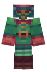</figure></td>
    <td>
      
🞄 <mark style="color:red;"><strong>❤️ Vie</strong></mark> <strong>+20</strong>

      
🞄 <mark style="color:red;"><strong>🥊 Chance de Critique</strong></mark> <strong>+1</strong>

    </td>
    <td><mark style="color:green;"><strong>Effet avec l'armure complète équiper</strong></mark> : Vous permet <mark style="color:green;"><strong>d'effectuer un Double Saut</strong></mark> <em>(Touche de Saut + Touche de Sneak)</em></td>
  </tr>
</table>

### 💘◦ <mark style="color:orange;">Armure Cupidon</mark>

#### 🔹 <ins>Son obtention</ins>🤔

Les <mark style="color:green;">pièces d'armures Cupidon</mark> s'obtiennent dans la [<mark style="color:red;">caisse Cupidon</mark>](https://wiki.evolucraft.fr/le-gameplay/les-caisses#caisse-cupidon).

#### 🔹 <ins>Son aperçue</ins>🔍

<table border="1" cellspacing="0" cellpadding="6">
  <tr>
    <td align="center"><ins><strong>Casque</strong></ins></td>
    <td align="center"><ins><strong>Plastron</strong></ins></td>
    <td align="center"><ins><strong>Pantalon</strong></ins></td>
    <td align="center"><ins><strong>Bottes</strong></ins></td>    
  </tr>
  <tr>
   <td align="center"><figure>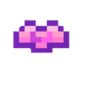</figure></td>
   <td align="center"><figure></figure></td>
   <td align="center"><figure></figure></td>
   <td align="center"><figure>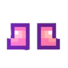</figure></td>
  </tr>
  <tr>
    <td>
      
🞄 <mark style="color:red;"><strong>❤️ Vie</strong></mark> <strong>+10</strong>

      
🞄 <mark style="color:blue;"><strong>✨ Régénération de Mana</strong></mark> <strong>+0.25</strong>

    </td>
    <td>
      
🞄 <mark style="color:red;"><strong>❤️ Vie</strong></mark> <strong>+10</strong>

      
🞄 <mark style="color:blue;"><strong>✨ Régénération de Mana</strong></mark> <strong>+0.25</strong>

    </td>
    <td>
      
🞄 <mark style="color:red;"><strong>❤️ Vie</strong></mark> <strong>+10</strong>

      
🞄 <mark style="color:blue;"><strong>✨ Régénération de Mana</strong></mark> <strong>+0.25</strong>

    </td>
    <td>
      
🞄 <mark style="color:red;"><strong>❤️ Vie</strong></mark> <strong>+10</strong>

      
🞄 <mark style="color:blue;"><strong>✨ Régénération de Mana</strong></mark> <strong>+0.25</strong>

    </td>
  <tr>
    <td>
      
🞄 <mark style="color:orange;"><strong>Protection IV</strong></mark>

      
🞄 <mark style="color:orange;"><strong>Solidité III</strong></mark>

      
🞄 <mark style="color:orange;"><strong>Raccomodage</strong></mark>

      
🞄 <mark style="color:orange;"><strong>Respiration III</strong></mark>

      
🞄 <mark style="color:orange;"><strong>Affinité Aquatique</strong></mark>

    </td>
    <td>
      
🞄 <mark style="color:orange;"><strong>Protection IV</strong></mark>

      
🞄 <mark style="color:orange;"><strong>Solidité III</strong></mark>

      
🞄 <mark style="color:orange;"><strong>Raccomodage</strong></mark>

    </td>
    <td>
      
🞄 <mark style="color:orange;"><strong>Protection IV</strong></mark>

      
🞄 <mark style="color:orange;"><strong>Solidité III</strong></mark>

      
🞄 <mark style="color:orange;"><strong>Raccomodage</strong></mark>

      
🞄 <mark style="color:orange;"><strong>Furtivité Rapide III</strong></mark>

    </td>
    <td>
      
🞄 <mark style="color:orange;"><strong>Protection IV</strong></mark>

      
🞄 <mark style="color:orange;"><strong>Solidité III</strong></mark>

      
🞄 <mark style="color:orange;"><strong>Raccomodage</strong></mark>

      
🞄 <mark style="color:orange;"><strong>Agilité des Âmes III</strong></mark>

      
🞄 <mark style="color:orange;"><strong>Agilité Aquatique III</strong></mark>

      
🞄 <mark style="color:orange;"><strong>Chute Amortie IV</strong></mark>

    </td>
  </tr>
</table>
<table border="1" cellspacing="0" cellpadding="6">
  <tr>
    <td><strong><ins>Aperçue de l'armure</ins> 🖼️</strong></td>
    <td><strong><ins>Statistiques globales</ins> 📊</strong></td>
    <td><strong><ins>Effets</ins>✨</strong></td>
  </tr>
  <tr>
    <td align="center"><figure>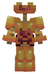</figure></td>
    <td>
      
🞄 <mark style="color:red;"><strong>❤️ Vie</strong></mark> <strong>+40</strong>

      
🞄 <mark style="color:blue;"><strong>✨ Régénération de Mana</strong></mark> <strong>+1</strong>

    </td>
    <td><strong><em><mark style="color:green;">Aucun Effet</mark> Supplémentaire ❌</em></strong></td>
  </tr>
</table>

### 🩷 ◦ <mark style="color:white;">Armure Amour</mark>

#### 🔹 <ins>Son obtention</ins>🤔

Les <mark style="color:green;">pièces d'armures Amour</mark> ne sont <mark style="color:green;">plus obtenables actuellement</mark>, sauf à <mark style="color:green;">l'achat</mark> dans [<mark style="color:green;">l'hôtel de vente</mark>](https://wiki.evolucraft.fr/le-gameplay/le-commerce#hotel-des-ventes).

#### 🔹 <ins>Son aperçue</ins>🔍

<table border="1" cellspacing="0" cellpadding="6">
  <tr>
    <td align="center"><ins><strong>Casque</strong></ins></td>
    <td align="center"><ins><strong>Plastron</strong></ins></td>
    <td align="center"><ins><strong>Pantalon</strong></ins></td>
    <td align="center"><ins><strong>Bottes</strong></ins></td>    
  </tr>
  <tr>
   <td align="center"><figure></figure></td>
   <td align="center"><figure></figure></td>
   <td align="center"><figure></figure></td>
   <td align="center"><figure>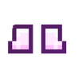</figure></td>
  </tr>
  <tr>
    <td>
      
🞄 <mark style="color:red;"><strong>❤️ Vie</strong></mark> <strong>+5</strong>

    </td>
    <td>
      
🞄 <mark style="color:red;"><strong>❤️ Vie</strong></mark> <strong>+5</strong>

    </td>
    <td>
      
🞄 <mark style="color:red;"><strong>❤️ Vie</strong></mark> <strong>+5</strong>

    </td>
    <td>
      
🞄 <mark style="color:red;"><strong>❤️ Vie</strong></mark> <strong>+5</strong>

    </td>
  <tr>
    <td>
      
🞄 <mark style="color:white;"><strong>Protection IV</strong></mark>

      
🞄 <mark style="color:white;"><strong>Solidité III</strong></mark>

      
🞄 <mark style="color:white;"><strong>Raccomodage</strong></mark>

      
🞄 <mark style="color:white;"><strong>Respiration III</strong></mark>

      
🞄 <mark style="color:white;"><strong>Affinité Aquatique</strong></mark>

    </td>
    <td>
      
🞄 <mark style="color:white;"><strong>Protection IV</strong></mark>

      
🞄 <mark style="color:white;"><strong>Solidité III</strong></mark>

      
🞄 <mark style="color:white;"><strong>Raccomodage</strong></mark>

    </td>
    <td>
      
🞄 <mark style="color:white;"><strong>Protection IV</strong></mark>

      
🞄 <mark style="color:white;"><strong>Solidité III</strong></mark>

      
🞄 <mark style="color:white;"><strong>Raccomodage</strong></mark>

      
🞄 <mark style="color:white;"><strong>Furtivité Rapide III</strong></mark>

    </td>
    <td>
      
🞄 <mark style="color:white;"><strong>Protection IV</strong></mark>

      
🞄 <mark style="color:white;"><strong>Solidité III</strong></mark>

      
🞄 <mark style="color:white;"><strong>Raccomodage</strong></mark>

      
🞄 <mark style="color:white;"><strong>Agilité des Âmes III</strong></mark>

      
🞄 <mark style="color:white;"><strong>Agilité Aquatique III</strong></mark>

      
🞄 <mark style="color:white;"><strong>Chute Amortie IV</strong></mark>

    </td>
  </tr>
</table>
<table border="1" cellspacing="0" cellpadding="6">
  <tr>
    <td><strong><ins>Aperçue de l'armure</ins> 🖼️</strong></td>
    <td><strong><ins>Statistiques globales</ins> 📊</strong></td>
    <td><strong><ins>Effets</ins>✨</strong></td>
  </tr>
  <tr>
    <td align="center"><figure></figure></td>
    <td>
      
🞄 <mark style="color:red;"><strong>❤️ Vie</strong></mark> <strong>+20</strong>

    </td>
    <td><strong><em><mark style="color:green;">Aucun Effet</mark> Supplémentaire ❌</em></strong></td>
  </tr>
</table>

### 🍀◦ <mark style="color:green;">Armure Leprechaun</mark>

#### 🔹 <ins>Son obtention</ins>🤔

Les <mark style="color:green;">pièces d'armures Leprechaun</mark> s'obtiennent dans la [<mark style="color:green;">caisse St-Patrick</mark>](https://wiki.evolucraft.fr/le-gameplay/les-caisses#caisse-saint-patrick).

#### 🔹 <ins>Son aperçue</ins>🔍

<table border="1" cellspacing="0" cellpadding="6">
  <tr>
    <td align="center"><ins><strong>Casque</strong></ins></td>
    <td align="center"><ins><strong>Plastron</strong></ins></td>
    <td align="center"><ins><strong>Pantalon</strong></ins></td>
    <td align="center"><ins><strong>Bottes</strong></ins></td>    
  </tr>
  <tr>
   <td align="center"><figure></figure></td>
   <td align="center"><figure>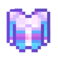</figure></td>
   <td align="center"><figure>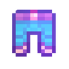</figure></td>
   <td align="center"><figure>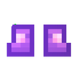</figure></td>
  </tr>
  <tr>
    <td>
      
🞄 <mark style="color:red;"><strong>❤️ Vie</strong></mark> <strong>+10</strong>

    </td>
    <td>
      
🞄 <mark style="color:red;"><strong>❤️ Vie</strong></mark> <strong>+10</strong>

    </td>
    <td>
      
🞄 <mark style="color:red;"><strong>❤️ Vie</strong></mark> <strong>+10</strong>

    </td>
    <td>
      
🞄 <mark style="color:red;"><strong>❤️ Vie</strong></mark> <strong>+10</strong>

    </td>
  <tr>
    <td>
      
🞄 <mark style="color:green;"><strong>Protection IV</strong></mark>

      
🞄 <mark style="color:green;"><strong>Solidité III</strong></mark>

      
🞄 <mark style="color:green;"><strong>Raccomodage</strong></mark>

      
🞄 <mark style="color:green;"><strong>Respiration III</strong></mark>

      
🞄 <mark style="color:green;"><strong>Affinité Aquatique</strong></mark>

    </td>
    <td>
      
🞄 <mark style="color:green;"><strong>Protection IV</strong></mark>

      
🞄 <mark style="color:green;"><strong>Solidité III</strong></mark>

      
🞄 <mark style="color:green;"><strong>Raccomodage</strong></mark>

    </td>
    <td>
      
🞄 <mark style="color:green;"><strong>Protection IV</strong></mark>

      
🞄 <mark style="color:green;"><strong>Solidité III</strong></mark>

      
🞄 <mark style="color:green;"><strong>Raccomodage</strong></mark>

      
🞄 <mark style="color:green;"><strong>Furtivité Rapide III</strong></mark>

    </td>
    <td>
      
🞄 <mark style="color:green;"><strong>Protection IV</strong></mark>

      
🞄 <mark style="color:green;"><strong>Solidité III</strong></mark>

      
🞄 <mark style="color:green;"><strong>Raccomodage</strong></mark>

      
🞄 <mark style="color:green;"><strong>Agilité des Âmes III</strong></mark>

      
🞄 <mark style="color:green;"><strong>Agilité Aquatique III</strong></mark>

      
🞄 <mark style="color:green;"><strong>Chute Amortie IV</strong></mark>

    </td>
  </tr>
</table>
<table border="1" cellspacing="0" cellpadding="6">
  <tr>
    <td><strong><ins>Aperçue de l'armure</ins> 🖼️</strong></td>
    <td><strong><ins>Statistiques globales</ins> 📊</strong></td>
    <td><strong><ins>Effets</ins>✨</strong></td>
  </tr>
  <tr>
    <td align="center"><figure>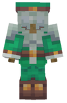</figure></td>
    <td>
      
🞄 <mark style="color:red;"><strong>❤️ Vie</strong></mark> <strong>+40</strong>

    </td>
    <td><mark style="color:green;"><strong>Effet par pièce d'armure équiper/avec l'armure complète équiper</strong></mark> : <mark style="color:green;"><strong>+ 50$</strong></mark> pour <mark style="color:green;"><strong>Chaque ennemie tuée</strong></mark> dans les <mark style="color:green;"><strong>Tout types de Donjons</strong></mark></td>
  </tr>
</table>

### 🌠◦ <mark style="color:white;">Armure Légendaire</mark>

#### 🔹 <ins>Son obtention</ins>🤔

Les <mark style="color:green;">pièces d'armures Légendaire</mark> s'obtiennent dans la [<mark style="color:yellow;">caisse Jackpot</mark>](https://wiki.evolucraft.fr/le-gameplay/les-caisses#caisse-jackpot).

#### 🔹 <ins>Son aperçue</ins>🔍

<table border="1" cellspacing="0" cellpadding="6">
  <tr>
    <td align="center"><ins><strong>Casque</strong></ins></td>
    <td align="center"><ins><strong>Plastron</strong></ins></td>
    <td align="center"><ins><strong>Pantalon</strong></ins></td>
    <td align="center"><ins><strong>Bottes</strong></ins></td>    
  </tr>
  <tr>
   <td align="center"><figure></figure></td>
   <td align="center"><figure>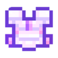</figure></td>
   <td align="center"><figure></figure></td>
   <td align="center"><figure>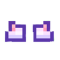</figure></td>
  </tr>
  <tr>
    <td>
      
🞄 <mark style="color:red;"><strong>❤️ Vie</strong></mark> <strong>+45</strong>

      
🞄 <mark style="color:blue;"><strong>🛡️ Défense</strong></mark> <strong>+16</strong>

      
🞄 <mark style="color:red;"><strong>💕 Régénération</strong></mark> <strong>+6</strong>

      
🞄 <mark style="color:blue;"><strong>🏃‍♂️ Vitesse</strong></mark> <strong>+6</strong>

    </td>
    <td>
      
🞄 <mark style="color:red;"><strong>❤️ Vie</strong></mark> <strong>+45</strong>

      
🞄 <mark style="color:blue;"><strong>🛡️ Défense</strong></mark> <strong>+16</strong>

      
🞄 <mark style="color:red;"><strong>💕 Régénération</strong></mark> <strong>+6</strong>

      
🞄 <mark style="color:blue;"><strong>🏃‍♂️ Vitesse</strong></mark> <strong>+6</strong>

    </td>
    <td>
      
🞄 <mark style="color:red;"><strong>❤️ Vie</strong></mark> <strong>+45</strong>

      
🞄 <mark style="color:blue;"><strong>🛡️ Défense</strong></mark> <strong>+16</strong>

      
🞄 <mark style="color:red;"><strong>💕 Régénération</strong></mark> <strong>+6</strong>

      
🞄 <mark style="color:blue;"><strong>🏃‍♂️ Vitesse</strong></mark> <strong>+6</strong>

    </td>
    <td>
      
🞄 <mark style="color:red;"><strong>❤️ Vie</strong></mark> <strong>+45</strong>

      
🞄 <mark style="color:blue;"><strong>🛡️ Défense</strong></mark> <strong>+16</strong>

      
🞄 <mark style="color:red;"><strong>💕 Régénération</strong></mark> <strong>+6</strong>

      
🞄 <mark style="color:blue;"><strong>🏃‍♂️ Vitesse</strong></mark> <strong>+6</strong>

    </td>
  <tr>
    <td>
      
🞄 <mark style="color:white;"><strong>Protection IV</strong></mark>

      
🞄 <mark style="color:white;"><strong>Solidité III</strong></mark>

      
🞄 <mark style="color:white;"><strong>Raccomodage</strong></mark>

      
🞄 <mark style="color:white;"><strong>Respiration III</strong></mark>

      
🞄 <mark style="color:white;"><strong>Affinité Aquatique</strong></mark>

    </td>
    <td>
      
🞄 <mark style="color:white;"><strong>Protection IV</strong></mark>

      
🞄 <mark style="color:white;"><strong>Solidité III</strong></mark>

      
🞄 <mark style="color:white;"><strong>Raccomodage</strong></mark>

    </td>
    <td>
      
🞄 <mark style="color:white;"><strong>Protection IV</strong></mark>

      
🞄 <mark style="color:white;"><strong>Solidité III</strong></mark>

      
🞄 <mark style="color:white;"><strong>Raccomodage</strong></mark>

      
🞄 <mark style="color:white;"><strong>Furtivité Rapide III</strong></mark>

    </td>
    <td>
      
🞄 <mark style="color:white;"><strong>Protection IV</strong></mark>

      
🞄 <mark style="color:white;"><strong>Solidité III</strong></mark>

      
🞄 <mark style="color:white;"><strong>Raccomodage</strong></mark>

      
🞄 <mark style="color:white;"><strong>Agilité des Âmes III</strong></mark>

      
🞄 <mark style="color:white;"><strong>Agilité Aquatique III</strong></mark>

      
🞄 <mark style="color:white;"><strong>Chute Amortie IV</strong></mark>

    </td>
  </tr>
</table>
<table border="1" cellspacing="0" cellpadding="6">
  <tr>
    <td><strong><ins>Aperçue de l'armure</ins> 🖼️</strong></td>
    <td><strong><ins>Statistiques globales</ins> 📊</strong></td>
    <td><strong><ins>Effets</ins>✨</strong></td>
  </tr>
  <tr>
    <td align="center"><figure>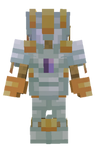</figure></td>
    <td>
      
🞄 <mark style="color:red;"><strong>❤️ Vie</strong></mark> <strong>+180</strong>

      
🞄 <mark style="color:blue;"><strong>🛡️ Défense</strong></mark> <strong>+64</strong>

      
🞄 <mark style="color:red;"><strong>💕 Régénération</strong></mark> <strong>+24</strong>

      
🞄 <mark style="color:blue;"><strong>🏃‍♂️ Vitesse</strong></mark> <strong>+24</strong>

    </td>
    <td><strong><em><mark style="color:green;">Aucun Effet</mark> Supplémentaire ❌</em></strong></td>
  </tr>
</table>

### 🐇◦ <mark style="color:blue;">Armure Lapin</mark>

#### 🔹 <ins>Son obtention</ins>🤔

Les <mark style="color:green;">pièces d'armures Draconique</mark> s'obtiennent dans la [<mark style="color:yellow;">caisse Pâques</mark>](https://wiki.evolucraft.fr/le-gameplay/les-caisses#caisse-paques).

#### 🔹 <ins>Son aperçue</ins>🔍

<table border="1" cellspacing="0" cellpadding="6">
  <tr>
    <td align="center"><ins><strong>Casque</strong></ins></td>
    <td align="center"><ins><strong>Plastron</strong></ins></td>
    <td align="center"><ins><strong>Pantalon</strong></ins></td>
    <td align="center"><ins><strong>Bottes</strong></ins></td>    
  </tr>
  <tr>
   <td align="center"><figure></figure></td>
   <td align="center"><figure>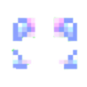</figure></td>
   <td align="center"><figure>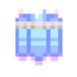</figure></td>
   <td align="center"><figure></figure></td>
  </tr>
  <tr>
    <td>
      
🞄 <mark style="color:red;"><strong>❤️ Vie</strong></mark> <strong>+10</strong>

      
🞄 <mark style="color:orange;"><strong>💀 Dégâts Critiques</strong></mark> <strong>+5</strong>

    </td>
    <td>
      
🞄 <mark style="color:red;"><strong>❤️ Vie</strong></mark> <strong>+10</strong>

      
🞄 <mark style="color:orange;"><strong>💀 Dégâts Critiques</strong></mark> <strong>+5</strong>

    </td>
    <td>
      
🞄 <mark style="color:red;"><strong>❤️ Vie</strong></mark> <strong>+10</strong>

      
🞄 <mark style="color:orange;"><strong>💀 Dégâts Critiques</strong></mark> <strong>+5</strong>

    </td>
    <td>
      
🞄 <mark style="color:red;"><strong>❤️ Vie</strong></mark> <strong>+10</strong>

      
🞄 <mark style="color:orange;"><strong>💀 Dégâts Critiques</strong></mark> <strong>+5</strong>

    </td>
  <tr>
    <td>
      
🞄 <mark style="color:blue;"><strong>Protection IV</strong></mark>

      
🞄 <mark style="color:blue;"><strong>Solidité III</strong></mark>

      
🞄 <mark style="color:blue;"><strong>Raccomodage</strong></mark>

      
🞄 <mark style="color:blue;"><strong>Respiration III</strong></mark>

      
🞄 <mark style="color:blue;"><strong>Affinité Aquatique</strong></mark>

    </td>
    <td>
      
🞄 <mark style="color:blue;"><strong>Protection IV</strong></mark>

      
🞄 <mark style="color:blue;"><strong>Solidité III</strong></mark>

      
🞄 <mark style="color:blue;"><strong>Raccomodage</strong></mark>

    </td>
    <td>
      
🞄 <mark style="color:blue;"><strong>Protection IV</strong></mark>

      
🞄 <mark style="color:blue;"><strong>Solidité III</strong></mark>

      
🞄 <mark style="color:blue;"><strong>Raccomodage</strong></mark>

      
🞄 <mark style="color:blue;"><strong>Furtivité Rapide III</strong></mark>

    </td>
    <td>
      
🞄 <mark style="color:blue;"><strong>Protection IV</strong></mark>

      
🞄 <mark style="color:blue;"><strong>Solidité III</strong></mark>

      
🞄 <mark style="color:blue;"><strong>Raccomodage</strong></mark>

      
🞄 <mark style="color:blue;"><strong>Agilité des Âmes III</strong></mark>

      
🞄 <mark style="color:blue;"><strong>Agilité Aquatique III</strong></mark>

      
🞄 <mark style="color:blue;"><strong>Chute Amortie IV</strong></mark>

    </td>
  </tr>
</table>
<table border="1" cellspacing="0" cellpadding="6">
  <tr>
    <td><strong><ins>Aperçue de l'armure</ins> 🖼️</strong></td>
    <td><strong><ins>Statistiques globales</ins> 📊</strong></td>
    <td><strong><ins>Effets</ins>✨</strong></td>
  </tr>
  <tr>
    <td align="center"><figure>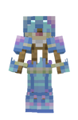</figure></td>
    <td>
      
🞄 <mark style="color:red;"><strong>❤️ Vie</strong></mark> <strong>+40</strong>

      
🞄 <mark style="color:orange;"><strong>💀 Dégâts Critiques</strong></mark> <strong>+20</strong>

    </td>
    <td>
      <mark style="color:blue;"><strong>Effet par pièce d'armure équiper</strong></mark> : <mark style="color:blue;"><strong>+ 2.5%</strong></mark> de <mark style="color:blue;"><strong>Dégats supplémentaire</strong></mark> dans les <a href="https://wiki.evolucraft.fr/le-gameplay/les-donjons/fabrique-chocolat"><mark style="color:blue;"><strong>Donjons Fabriques Du Chocolat</strong></mark></a>
    </td>
  </tr>
</table>

### 🥚 ◦ <mark style="color:yellow;">Armure Pâques</mark>

#### 🔹 <ins>Son obtention</ins>🤔

Les <mark style="color:green;">pièces d'armures Pâques</mark> ne sont <mark style="color:green;">plus obtenables actuellement</mark>, sauf à <mark style="color:green;">l'achat</mark> dans [<mark style="color:green;">l'hôtel de vente</mark>](https://wiki.evolucraft.fr/le-gameplay/le-commerce#hotel-des-ventes).

#### 🔹 <ins>Son aperçue</ins>🔍

<table border="1" cellspacing="0" cellpadding="6">
  <tr>
    <td align="center"><ins><strong>Casque</strong></ins></td>
    <td align="center"><ins><strong>Plastron</strong></ins></td>
    <td align="center"><ins><strong>Pantalon</strong></ins></td>
    <td align="center"><ins><strong>Bottes</strong></ins></td>    
  </tr>
  <tr>
   <td align="center"><figure></figure></td>
   <td align="center"><figure></figure></td>
   <td align="center"><figure></figure></td>
   <td align="center"><figure></figure></td>
  </tr>
  <tr>
    <td>
      
🞄 <mark style="color:red;"><strong>❤️ Vie</strong></mark> <strong>+5</strong>

      
🞄 <mark style="color:orange;"><strong>💀 Dégâts Critiques</strong></mark> <strong>+2</strong>

    </td>
    <td>
      
🞄 <mark style="color:red;"><strong>❤️ Vie</strong></mark> <strong>+5</strong>

      
🞄 <mark style="color:orange;"><strong>💀 Dégâts Critiques</strong></mark> <strong>+2</strong>

    </td>
    <td>
      
🞄 <mark style="color:red;"><strong>❤️ Vie</strong></mark> <strong>+5</strong>

      
🞄 <mark style="color:orange;"><strong>💀 Dégâts Critiques</strong></mark> <strong>+2</strong>

    </td>
    <td>
      
🞄 <mark style="color:red;"><strong>❤️ Vie</strong></mark> <strong>+5</strong>

      
🞄 <mark style="color:orange;"><strong>💀 Dégâts Critiques</strong></mark> <strong>+2</strong>

    </td>
  <tr>
    <td>
      
🞄 <mark style="color:yellow;"><strong>Protection IV</strong></mark>

      
🞄 <mark style="color:yellow;"><strong>Solidité III</strong></mark>

      
🞄 <mark style="color:yellow;"><strong>Raccomodage</strong></mark>

      
🞄 <mark style="color:yellow;"><strong>Respiration III</strong></mark>

      
🞄 <mark style="color:yellow;"><strong>Affinité Aquatique</strong></mark>

    </td>
    <td>
      
🞄 <mark style="color:yellow;"><strong>Protection IV</strong></mark>

      
🞄 <mark style="color:yellow;"><strong>Solidité III</strong></mark>

      
🞄 <mark style="color:yellow;"><strong>Raccomodage</strong></mark>

    </td>
    <td>
      
🞄 <mark style="color:yellow;"><strong>Protection IV</strong></mark>

      
🞄 <mark style="color:yellow;"><strong>Solidité III</strong></mark>

      
🞄 <mark style="color:yellow;"><strong>Raccomodage</strong></mark>

      
🞄 <mark style="color:yellow;"><strong>Furtivité Rapide III</strong></mark>

    </td>
    <td>
      
🞄 <mark style="color:yellow;"><strong>Protection IV</strong></mark>

      
🞄 <mark style="color:yellow;"><strong>Solidité III</strong></mark>

      
🞄 <mark style="color:yellow;"><strong>Raccomodage</strong></mark>

      
🞄 <mark style="color:yellow;"><strong>Agilité des Âmes III</strong></mark>

      
🞄 <mark style="color:yellow;"><strong>Agilité Aquatique III</strong></mark>

      
🞄 <mark style="color:yellow;"><strong>Chute Amortie IV</strong></mark>

    </td>
  </tr>
</table>
<table border="1" cellspacing="0" cellpadding="6">
  <tr>
    <td><strong><ins>Aperçue de l'armure</ins> 🖼️</strong></td>
    <td><strong><ins>Statistiques globales</ins> 📊</strong></td>
    <td><strong><ins>Effets</ins>✨</strong></td>
  </tr>
  <tr>
    <td align="center"><figure></figure></td>
    <td>
      
🞄 <mark style="color:red;"><strong>❤️ Vie</strong></mark> <strong>+20</strong>

      
🞄 <mark style="color:orange;"><strong>💀 Dégâts Critiques</strong></mark> <strong>+8</strong>

    </td>
    <td>
      <mark style="color:yellow;"><strong>Effet par pièce d'armure équiper</strong></mark> : <mark style="color:yellow;"><strong>+ 2.5%</strong></mark> de <mark style="color:yellow;"><strong>Dégats supplémentaire</strong></mark> dans les <a href="https://wiki.evolucraft.fr/le-gameplay/les-donjons/roi-lapin"><mark style="color:yellow;"><strong>Donjons Terriers du Roi Lapin</strong></mark></a>
    </td>
  </tr>
</table>

### 🏖️◦ <mark style="color:yellow;">Armure Summer</mark>

#### 🔹 <ins>Son obtention</ins>🤔

Les <mark style="color:green;">pièces d'armures Summer</mark> s'obtiennent dans la [<mark style="color:blue;">caisse Summer</mark>](https://wiki.evolucraft.fr/le-gameplay/les-caisses#caisse-summer).

#### 🔹 <ins>Son aperçue</ins>🔍

<table border="1" cellspacing="0" cellpadding="6">
  <tr>
    <td align="center"><ins><strong>Casque</strong></ins></td>
    <td align="center"><ins><strong>Plastron</strong></ins></td>
    <td align="center"><ins><strong>Pantalon</strong></ins></td>
    <td align="center"><ins><strong>Bottes</strong></ins></td>    
  </tr>
  <tr>
   <td align="center"><figure></figure></td>
   <td align="center"><figure></figure></td>
   <td align="center"><figure></figure></td>
   <td align="center"><figure></figure></td>
  </tr>
  <tr>
    <td>
      
🞄 <mark style="color:red;"><strong>❤️ Vie</strong></mark> <strong>+15</strong>

      
🞄 <mark style="color:red"><strong>🗡️ Force</strong></mark> <strong>+4</strong>

    </td>
    <td>
      
🞄 <mark style="color:red;"><strong>❤️ Vie</strong></mark> <strong>+15</strong>

      
🞄 <mark style="color:red"><strong>🗡️ Force</strong></mark> <strong>+4</strong>

    </td>
    <td>
      
🞄 <mark style="color:red;"><strong>❤️ Vie</strong></mark> <strong>+15</strong>

      
🞄 <mark style="color:red"><strong>🗡️ Force</strong></mark> <strong>+4</strong>

    </td>
    <td>
      
🞄 <mark style="color:red;"><strong>❤️ Vie</strong></mark> <strong>+15</strong>

      
🞄 <mark style="color:red"><strong>🗡️ Force</strong></mark> <strong>+4</strong>

    </td>
  <tr>
    <td>
      
🞄 <mark style="color:yellow;"><strong>Protection IV</strong></mark>

      
🞄 <mark style="color:yellow;"><strong>Solidité III</strong></mark>

      
🞄 <mark style="color:yellow;"><strong>Raccomodage</strong></mark>

      
🞄 <mark style="color:yellow;"><strong>Respiration III</strong></mark>

      
🞄 <mark style="color:yellow;"><strong>Affinité Aquatique</strong></mark>

    </td>
    <td>
      
🞄 <mark style="color:yellow;"><strong>Protection IV</strong></mark>

      
🞄 <mark style="color:yellow;"><strong>Solidité III</strong></mark>

      
🞄 <mark style="color:yellow;"><strong>Raccomodage</strong></mark>

    </td>
    <td>
      
🞄 <mark style="color:yellow;"><strong>Protection IV</strong></mark>

      
🞄 <mark style="color:yellow;"><strong>Solidité III</strong></mark>

      
🞄 <mark style="color:yellow;"><strong>Raccomodage</strong></mark>

      
🞄 <mark style="color:yellow;"><strong>Furtivité Rapide III</strong></mark>

    </td>
    <td>
      
🞄 <mark style="color:yellow;"><strong>Protection IV</strong></mark>

      
🞄 <mark style="color:yellow;"><strong>Solidité III</strong></mark>

      
🞄 <mark style="color:yellow;"><strong>Raccomodage</strong></mark>

      
🞄 <mark style="color:yellow;"><strong>Agilité des Âmes III</strong></mark>

      
🞄 <mark style="color:yellow;"><strong>Agilité Aquatique III</strong></mark>

      
🞄 <mark style="color:yellow;"><strong>Chute Amortie IV</strong></mark>

    </td>
  </tr>
</table>
<table border="1" cellspacing="0" cellpadding="6">
  <tr>
    <td><strong><ins>Aperçue de l'armure</ins> 🖼️</strong></td>
    <td><strong><ins>Statistiques globales</ins> 📊</strong></td>
    <td><strong><ins>Effets</ins>✨</strong></td>
  </tr>
  <tr>
    <td align="center"><figure></figure></td>
    <td>
      
🞄 <mark style="color:red;"><strong>❤️ Vie</strong></mark> <strong>+60</strong>

      
🞄 <mark style="color:red"><strong>🗡️ Force</strong></mark> <strong>+16</strong>

    </td>
    <td><strong><em><mark style="color:green;">Aucun Effet</mark> Supplémentaire ❌</em></strong></td>
  </tr>
</table>

### 🦴◦ <mark style="color:yellow;">Armure Archéologue</mark>

#### 🔹 <ins>Son obtention</ins>🤔

Les <mark style="color:green;">pièces d'armures Archéologue</mark> s'obtiennent dans la [<mark style="color:yellow;">caisse Antique</mark>](https://wiki.evolucraft.fr/le-gameplay/les-caisses#caisse-antique).

#### 🔹 <ins>Son aperçue</ins>🔍

<table border="1" cellspacing="0" cellpadding="6">
  <tr>
    <td align="center"><ins><strong>Casque</strong></ins></td>
    <td align="center"><ins><strong>Plastron</strong></ins></td>
    <td align="center"><ins><strong>Pantalon</strong></ins></td>
    <td align="center"><ins><strong>Bottes</strong></ins></td>    
  </tr>
  <tr>
   <td align="center"><figure></figure></td>
   <td align="center"><figure></figure></td>
   <td align="center"><figure></figure></td>
   <td align="center"><figure></figure></td>
  </tr>
  <tr>
    <td>
      
🞄 <mark style="color:red;"><strong>❤️ Vie</strong></mark> <strong>+15</strong>

      
🞄 <mark style="color:blue;"><strong>🛡️ Défense</strong></mark> <strong>+4</strong>

    </td>
    <td>
      
🞄 <mark style="color:red;"><strong>❤️ Vie</strong></mark> <strong>+15</strong>

      
🞄 <mark style="color:blue;"><strong>🛡️ Défense</strong></mark> <strong>+4</strong>

    </td>
    <td>
      
🞄 <mark style="color:red;"><strong>❤️ Vie</strong></mark> <strong>+15</strong>

      
🞄 <mark style="color:blue;"><strong>🛡️ Défense</strong></mark> <strong>+4</strong>

    </td>
    <td>
      
🞄 <mark style="color:red;"><strong>❤️ Vie</strong></mark> <strong>+15</strong>

      
🞄 <mark style="color:blue;"><strong>🛡️ Défense</strong></mark> <strong>+4</strong>

    </td>
  <tr>
    <td>
      
🞄 <mark style="color:yellow;"><strong>Protection IV</strong></mark>

      
🞄 <mark style="color:yellow;"><strong>Solidité III</strong></mark>

      
🞄 <mark style="color:yellow;"><strong>Raccomodage</strong></mark>

      
🞄 <mark style="color:yellow;"><strong>Respiration III</strong></mark>

      
🞄 <mark style="color:yellow;"><strong>Affinité Aquatique</strong></mark>

    </td>
    <td>
      
🞄 <mark style="color:yellow;"><strong>Protection IV</strong></mark>

      
🞄 <mark style="color:yellow;"><strong>Solidité III</strong></mark>

      
🞄 <mark style="color:yellow;"><strong>Raccomodage</strong></mark>

    </td>
    <td>
      
🞄 <mark style="color:yellow;"><strong>Protection IV</strong></mark>

      
🞄 <mark style="color:yellow;"><strong>Solidité III</strong></mark>

      
🞄 <mark style="color:yellow;"><strong>Raccomodage</strong></mark>

      
🞄 <mark style="color:yellow;"><strong>Furtivité Rapide III</strong></mark>

    </td>
    <td>
      
🞄 <mark style="color:yellow;"><strong>Protection IV</strong></mark>

      
🞄 <mark style="color:yellow;"><strong>Solidité III</strong></mark>

      
🞄 <mark style="color:yellow;"><strong>Raccomodage</strong></mark>

      
🞄 <mark style="color:yellow;"><strong>Agilité des Âmes III</strong></mark>

      
🞄 <mark style="color:yellow;"><strong>Agilité Aquatique III</strong></mark>

      
🞄 <mark style="color:yellow;"><strong>Chute Amortie IV</strong></mark>

    </td>
  </tr>
</table>
<table border="1" cellspacing="0" cellpadding="6">
  <tr>
    <td><strong><ins>Aperçue de l'armure</ins> 🖼️</strong></td>
    <td><strong><ins>Statistiques globales</ins> 📊</strong></td>
    <td><strong><ins>Effets</ins>✨</strong></td>
  </tr>
  <tr>
    <td align="center"><figure></figure></td>
    <td>
      
🞄 <mark style="color:red;"><strong>❤️ Vie</strong></mark> <strong>+60</strong>

      
🞄 <mark style="color:blue;"><strong>🛡️ Défense</strong></mark> <strong>+16</strong>

    </td>
    <td><strong><em><mark style="color:green;">Aucun Effet</mark> Supplémentaire ❌</em></strong></td>
  </tr>
</table>

