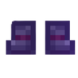
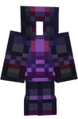
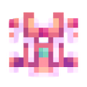
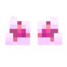

# 🥼 Les Armures

## 💠 <mark style="color:green;">Quelques informations... ?</mark> 📃

Les <mark style="color:green;">**Armure customs**</mark>, offrent bien plus qu’une simple protection. En plus de réduire les <mark style="color:green;">**dégâts des mobs**</mark> grâce à leurs <mark style="color:green;">**enchantements vanilla**</mark>, elles procurent des <mark style="color:green;">**statistiques de classe supplémentaires**</mark>, vous rendant plus résistant face aux ennemis.

Également, les différentes <mark style="color:green;">**pièces d’armure**</mark> vous permettent de compléter votre <mark style="color:green;">**/collection**</mark> afin d’obtenir un <mark style="color:green;">**tag exclusif**</mark> lorsque la <mark style="color:green;">**collection complète**</mark> a été réunie. Cela ajoute un objectif supplémentaire pour les joueurs souhaitant <mark style="color:green;">**collectionner et se démarquer**</mark> sur le serveur.

Ces Armure sont trouvables dans différentes [<mark style="color:green;">**caisses du serveur**</mark>](https://wiki.evolucraft.fr/le-gameplay/les-caisses), lors des <mark style="color:green;">**événements temporaires**</mark>, Le [<mark style="color:green;">**Marché Noir**</mark>](https://wiki.evolucraft.fr/le-gameplay/marche-noir) ou encore [<mark style="color:green;">**l'hôtel de vente**</mark>](https://wiki.evolucraft.fr/le-gameplay/le-commerce#hotel-des-ventes).

## 💠 <mark style="color:green;">Liste des Armure existantes ?</mark> 📑

### 🎲◦ <mark style="color:yellow;">Armure Jackpot</mark>

#### 🔹 Son obtention🤔

Les <mark style="color:green;">pièces d'Armure Jackpot</mark> ne sont <mark style="color:green;">plus obtenable actuellement</mark>, sauf à <mark style="color:green;">l'achat</mark> dans [<mark style="color:green;">l'hôtel de vente</mark>](https://wiki.evolucraft.fr/le-gameplay/le-commerce#hotel-des-ventes).

#### 🔹 Son aperçue🔍

|                                                                                                                                                                                       **Casque**                                                                                                                                                                                       |                                                                                                                                 **Plastron**                                                                                                                                 |                                                                                                                                                 **Pantalon**                                                                                                                                                 |                                                                                                                                                                                                                                  **Bottes**                                                                                                                                                                                                                                 |
| :------------------------------------------------------------------------------------------------------------------------------------------------------------------------------------------------------------------------------------------------------------------------------------------------------------------------------------------------------------------------------------: | :--------------------------------------------------------------------------------------------------------------------------------------------------------------------------------------------------------------------------------------------------------------------------: | :----------------------------------------------------------------------------------------------------------------------------------------------------------------------------------------------------------------------------------------------------------------------------------------------------------: | :-------------------------------------------------------------------------------------------------------------------------------------------------------------------------------------------------------------------------------------------------------------------------------------------------------------------------------------------------------------------------------------------------------------------------------------------------------------------------: |
|                                                                                                                               
<figure><figcaption></figcaption></figure>
                                                                                                                               |                                                                         
<figure><figcaption></figcaption></figure>
                                                                         |                                                                                         
<figure><figcaption></figcaption></figure>
                                                                                         |                                                                                                                                                                          
<figure><figcaption></figcaption></figure>
                                                                                                                                                                         |
|                                                      
▸ <mark style="color:red;"><strong>❤️ Vie</strong></mark> <strong>+15</strong>

▸ <mark style="color:blue;"><strong>🛡️ Défense</strong></mark> <strong>+5</strong>

▸ <mark style="color:red;"><strong>💕 Régénération</strong></mark> <strong>+2</strong>
                                                      | 
▸ <mark style="color:red;"><strong>❤️ Vie</strong></mark> <strong>+15</strong>

▸ <mark style="color:blue;"><strong>🛡️ Défense</strong></mark> <strong>+5</strong>

▸ <mark style="color:red;"><strong>💕 Régénération</strong></mark> <strong>+2</strong>
 |                 
▸ <mark style="color:red;"><strong>❤️ Vie</strong></mark> <strong>+15</strong>

▸ <mark style="color:blue;"><strong>🛡️ Défense</strong></mark> <strong>+5</strong>

▸ <mark style="color:red;"><strong>💕 Régénération</strong></mark> <strong>+2</strong>
                 |                                                                                                 
▸ <mark style="color:red;"><strong>❤️ Vie</strong></mark> <strong>+15</strong>

▸ <mark style="color:blue;"><strong>🛡️ Défense</strong></mark> <strong>+5</strong>

▸ <mark style="color:red;"><strong>💕 Régénération</strong></mark> <strong>+2</strong>
                                                                                                |
| 
▸ <mark style="color:yellow;"><strong>Protection IV</strong></mark>

▸ <mark style="color:yellow;"><strong>Solidité III</strong></mark>

▸ <mark style="color:yellow;"><strong>Raccomodage</strong></mark>

▸ <mark style="color:yellow;"><strong>Respiration III</strong></mark>

▸ <mark style="color:yellow;"><strong>Affinité Aquatique</strong></mark>
 |                          
▸ <mark style="color:yellow;"><strong>Protection IV</strong></mark>

▸ <mark style="color:yellow;"><strong>Solidité III</strong></mark>

▸ <mark style="color:yellow;"><strong>Raccomodage</strong></mark>
                         | 
▸ <mark style="color:yellow;"><strong>Protection IV</strong></mark>

▸ <mark style="color:yellow;"><strong>Solidité III</strong></mark>

▸ <mark style="color:yellow;"><strong>Raccomodage</strong></mark>

▸ <mark style="color:yellow;"><strong>Furtivité Rapide III</strong></mark>
 | 
▸ <mark style="color:yellow;"><strong>Protection IV</strong></mark>

▸ <mark style="color:yellow;"><strong>Solidité III</strong></mark>

▸ <mark style="color:yellow;"><strong>Raccomodage</strong></mark>

▸ <mark style="color:yellow;"><strong>Agilité des Âmes III</strong></mark>

▸ <mark style="color:yellow;"><strong>Agilité Aquatique III</strong></mark>

▸ <mark style="color:yellow;"><strong>Chute Amortie IV</strong></mark>
 |

| **Aperçue de l'armure 🖼️**                                                                                                 | **Statistiques globales 📊**                                                                                                                                                                                                                                                  | **Effets✨**                                                                       |
| --------------------------------------------------------------------------------------------------------------------------- | ----------------------------------------------------------------------------------------------------------------------------------------------------------------------------------------------------------------------------------------------------------------------------- | --------------------------------------------------------------------------------- |
| 
<figure><figcaption></figcaption></figure>
 | 
▸ <mark style="color:red;"><strong>❤️ Vie</strong></mark> <strong>+60</strong>

▸ <mark style="color:blue;"><strong>🛡️ Défense</strong></mark> <strong>+20</strong>

▸ <mark style="color:red;"><strong>💕 Régénération</strong></mark> <strong>+8</strong>
 | _<strong><mark style="color:green;">Aucun Effet</mark> Supplémentaire ❌</strong>_ |

### 🎰✨◦ <mark style="color:green;">Armure Jackpot Shiny</mark>

#### 🔹 Son obtention🤔

Les <mark style="color:green;">pièces d'Armure Jackpot Shiny</mark> ne sont <mark style="color:green;">plus obtenable actuellement</mark>, sauf à <mark style="color:green;">l'achat</mark> dans [<mark style="color:green;">l'hôtel de vente</mark>](https://wiki.evolucraft.fr/le-gameplay/le-commerce#hotel-des-ventes).

#### 🔹 Son aperçue🔍

|                                                                                                                                                                                     **Casque**                                                                                                                                                                                    |                                                                                                                                 **Plastron**                                                                                                                                 |                                                                                                                                               **Pantalon**                                                                                                                                               |                                                                                                                                                                                                                               **Bottes**                                                                                                                                                                                                                              |
| :-------------------------------------------------------------------------------------------------------------------------------------------------------------------------------------------------------------------------------------------------------------------------------------------------------------------------------------------------------------------------------: | :--------------------------------------------------------------------------------------------------------------------------------------------------------------------------------------------------------------------------------------------------------------------------: | :------------------------------------------------------------------------------------------------------------------------------------------------------------------------------------------------------------------------------------------------------------------------------------------------------: | :-------------------------------------------------------------------------------------------------------------------------------------------------------------------------------------------------------------------------------------------------------------------------------------------------------------------------------------------------------------------------------------------------------------------------------------------------------------------: |
|                                                                                                                          
<figure><figcaption></figcaption></figure>
                                                                                                                         |                                                                      
<figure><figcaption></figcaption></figure>
                                                                      |                                                                                    
<figure><figcaption></figcaption></figure>
                                                                                    |                                                                                                                                                                    
<figure><figcaption></figcaption></figure>
                                                                                                                                                                   |
|                                                    
▸ <mark style="color:red;"><strong>❤️ Vie</strong></mark> <strong>+15</strong>

▸ <mark style="color:blue;"><strong>🛡️ Défense</strong></mark> <strong>+5</strong>

▸ <mark style="color:red;"><strong>💕 Régénération</strong></mark> <strong>+2</strong>
                                                   | 
▸ <mark style="color:red;"><strong>❤️ Vie</strong></mark> <strong>+15</strong>

▸ <mark style="color:blue;"><strong>🛡️ Défense</strong></mark> <strong>+5</strong>

▸ <mark style="color:red;"><strong>💕 Régénération</strong></mark> <strong>+2</strong>
 |               
▸ <mark style="color:red;"><strong>❤️ Vie</strong></mark> <strong>+15</strong>

▸ <mark style="color:blue;"><strong>🛡️ Défense</strong></mark> <strong>+5</strong>

▸ <mark style="color:red;"><strong>💕 Régénération</strong></mark> <strong>+2</strong>
               |                                                                                              
▸ <mark style="color:red;"><strong>❤️ Vie</strong></mark> <strong>+15</strong>

▸ <mark style="color:blue;"><strong>🛡️ Défense</strong></mark> <strong>+5</strong>

▸ <mark style="color:red;"><strong>💕 Régénération</strong></mark> <strong>+2</strong>
                                                                                             |
| 
▸ <mark style="color:green;"><strong>Protection IV</strong></mark>

▸ <mark style="color:green;"><strong>Solidité III</strong></mark>

▸ <mark style="color:green;"><strong>Raccomodage</strong></mark>

▸ <mark style="color:green;"><strong>Respiration III</strong></mark>

▸ <mark style="color:green;"><strong>Affinité Aquatique</strong></mark>
 |                           
▸ <mark style="color:green;"><strong>Protection IV</strong></mark>

▸ <mark style="color:green;"><strong>Solidité III</strong></mark>

▸ <mark style="color:green;"><strong>Raccomodage</strong></mark>
                           | 
▸ <mark style="color:green;"><strong>Protection IV</strong></mark>

▸ <mark style="color:green;"><strong>Solidité III</strong></mark>

▸ <mark style="color:green;"><strong>Raccomodage</strong></mark>

▸ <mark style="color:green;"><strong>Furtivité Rapide III</strong></mark>
 | 
▸ <mark style="color:green;"><strong>Protection IV</strong></mark>

▸ <mark style="color:green;"><strong>Solidité III</strong></mark>

▸ <mark style="color:green;"><strong>Raccomodage</strong></mark>

▸ <mark style="color:green;"><strong>Agilité des Âmes III</strong></mark>

▸ <mark style="color:green;"><strong>Agilité Aquatique III</strong></mark>

▸ <mark style="color:green;"><strong>Chute Amortie IV</strong></mark>
 |

| **Aperçue de l'armure 🖼️**                                                                                                       | **Statistiques globales 📊**                                                                                                                                                                                                                                                  | **Effets✨**                                                                       |
| --------------------------------------------------------------------------------------------------------------------------------- | ----------------------------------------------------------------------------------------------------------------------------------------------------------------------------------------------------------------------------------------------------------------------------- | --------------------------------------------------------------------------------- |
| 
<figure><figcaption></figcaption></figure>
 | 
▸ <mark style="color:red;"><strong>❤️ Vie</strong></mark> <strong>+60</strong>

▸ <mark style="color:blue;"><strong>🛡️ Défense</strong></mark> <strong>+20</strong>

▸ <mark style="color:red;"><strong>💕 Régénération</strong></mark> <strong>+8</strong>
 | _<strong><mark style="color:green;">Aucun Effet</mark> Supplémentaire ❌</strong>_ |

### 🐉◦ <mark style="color:orange;">Armure Draconique</mark>

#### 🔹 Son obtention🤔

Les <mark style="color:green;">pièces d'armures Draconique</mark> s'obtiennent dans la [<mark style="color:orange;">caisse Draconique</mark>](https://wiki.evolucraft.fr/le-gameplay/les-caisses#caisse-draconique).

#### 🔹 Son aperçue🔍

|                                                                                                                                                                                       **Casque**                                                                                                                                                                                       |                                                                                                         **Plastron**                                                                                                        |                                                                                                                                                 **Pantalon**                                                                                                                                                 |                                                                                                                                                                                                                                  **Bottes**                                                                                                                                                                                                                                 |
| :------------------------------------------------------------------------------------------------------------------------------------------------------------------------------------------------------------------------------------------------------------------------------------------------------------------------------------------------------------------------------------: | :-------------------------------------------------------------------------------------------------------------------------------------------------------------------------------------------------------------------------: | :----------------------------------------------------------------------------------------------------------------------------------------------------------------------------------------------------------------------------------------------------------------------------------------------------------: | :-------------------------------------------------------------------------------------------------------------------------------------------------------------------------------------------------------------------------------------------------------------------------------------------------------------------------------------------------------------------------------------------------------------------------------------------------------------------------: |
|                                                                                                                              
<figure><figcaption></figcaption></figure>
                                                                                                                             |                                               
<figure><figcaption></figcaption></figure>
                                               |                                                                                        
<figure><figcaption></figcaption></figure>
                                                                                       |                                                                                                                                                                        
<figure><figcaption></figcaption></figure>
                                                                                                                                                                        |
|                                                                                                     
▸ <mark style="color:red;"><strong>❤️ Vie</strong></mark> <strong>+10</strong>

▸ <mark style="color:blue;"><strong>🛡️ Défense</strong></mark> <strong>+2</strong>
                                                                                                    |                       
▸ <mark style="color:red;"><strong>❤️ Vie</strong></mark> <strong>+10</strong>

▸ <mark style="color:blue;"><strong>🛡️ Défense</strong></mark> <strong>+2</strong>
                       |                                                                
▸ <mark style="color:red;"><strong>❤️ Vie</strong></mark> <strong>+10</strong>

▸ <mark style="color:blue;"><strong>🛡️ Défense</strong></mark> <strong>+2</strong>
                                                               |                                                                                                                                               
▸ <mark style="color:red;"><strong>❤️ Vie</strong></mark> <strong>+10</strong>

▸ <mark style="color:blue;"><strong>🛡️ Défense</strong></mark> <strong>+2</strong>
                                                                                                                                               |
| 
▸ <mark style="color:orange;"><strong>Protection IV</strong></mark>

▸ <mark style="color:orange;"><strong>Solidité III</strong></mark>

▸ <mark style="color:orange;"><strong>Raccomodage</strong></mark>

▸ <mark style="color:orange;"><strong>Respiration III</strong></mark>

▸ <mark style="color:orange;"><strong>Affinité Aquatique</strong></mark>
 | 
▸ <mark style="color:orange;"><strong>Protection IV</strong></mark>

▸ <mark style="color:orange;"><strong>Solidité III</strong></mark>

▸ <mark style="color:orange;"><strong>Raccomodage</strong></mark>
 | 
▸ <mark style="color:orange;"><strong>Protection IV</strong></mark>

▸ <mark style="color:orange;"><strong>Solidité III</strong></mark>

▸ <mark style="color:orange;"><strong>Raccomodage</strong></mark>

▸ <mark style="color:orange;"><strong>Furtivité Rapide III</strong></mark>
 | 
▸ <mark style="color:orange;"><strong>Protection IV</strong></mark>

▸ <mark style="color:orange;"><strong>Solidité III</strong></mark>

▸ <mark style="color:orange;"><strong>Raccomodage</strong></mark>

▸ <mark style="color:orange;"><strong>Agilité des Âmes III</strong></mark>

▸ <mark style="color:orange;"><strong>Agilité Aquatique III</strong></mark>

▸ <mark style="color:orange;"><strong>Chute Amortie IV</strong></mark>
 |

| **Aperçue de l'armure 🖼️**                                                                                                    | **Statistiques globales 📊**                                                                                                                                                    | **Effets✨**                                                                                                                                                                                                                                                                                                                  |
| ------------------------------------------------------------------------------------------------------------------------------ | ------------------------------------------------------------------------------------------------------------------------------------------------------------------------------- | ---------------------------------------------------------------------------------------------------------------------------------------------------------------------------------------------------------------------------------------------------------------------------------------------------------------------------- |
| 
<figure><figcaption></figcaption></figure>
 | 
▸ <mark style="color:red;"><strong>❤️ Vie</strong></mark> <strong>+40</strong>

▸ <mark style="color:blue;"><strong>🛡️ Défense</strong></mark> <strong>+8</strong>
 | <mark style="color:orange;">**Effet par pièce d'armure équiper**</mark> : <mark style="color:orange;">**+ 2.5%**</mark> de <mark style="color:orange;">**Dégats supplémentaire**</mark> dans les [<mark style="color:orange;">**Donjons Draconiques**</mark>](https://wiki.evolucraft.fr/le-gameplay/les-donjons/draconique) |

### 🐲◦ <mark style="color:red;">Armure Draconnier</mark>

#### 🔹 Son obtention🤔

Les <mark style="color:green;">pièces d'armures Draconnier</mark> s'obtiennent dans le [<mark style="color:green;">**Marché Noir 🧥**</mark>](https://wiki.evolucraft.fr/le-gameplay/marche-noir#draconique) avec les <mark style="color:green;">Coeurs de Dragons</mark> ou à <mark style="color:green;">l'achat</mark> dans [<mark style="color:green;">l'hôtel de vente</mark>](https://wiki.evolucraft.fr/le-gameplay/le-commerce#hotel-des-ventes).

#### 🔹 Son aperçue🔍

|                                                                                                                                                                                **Casque**                                                                                                                                                                               |                                                                                                    **Plastron**                                                                                                    |                                                                                                                                           **Pantalon**                                                                                                                                           |                                                                                                                                                                                                                         **Bottes**                                                                                                                                                                                                                        |
| :---------------------------------------------------------------------------------------------------------------------------------------------------------------------------------------------------------------------------------------------------------------------------------------------------------------------------------------------------------------------: | :----------------------------------------------------------------------------------------------------------------------------------------------------------------------------------------------------------------: | :----------------------------------------------------------------------------------------------------------------------------------------------------------------------------------------------------------------------------------------------------------------------------------------------: | :-------------------------------------------------------------------------------------------------------------------------------------------------------------------------------------------------------------------------------------------------------------------------------------------------------------------------------------------------------------------------------------------------------------------------------------------------------: |
|                                                                                                                      
<figure><figcaption></figcaption></figure>
                                                                                                                      |                                           
<figure><figcaption></figcaption></figure>
                                          |                                                                                  
<figure><figcaption></figcaption></figure>
                                                                                 |                                                                                                                                                               
<figure><figcaption></figcaption></figure>
                                                                                                                                                               |
|                                                                                              
▸ <mark style="color:red;"><strong>❤️ Vie</strong></mark> <strong>+5</strong>

▸ <mark style="color:blue;"><strong>🛡️ Défense</strong></mark> <strong>+1</strong>
                                                                                             |                   
▸ <mark style="color:red;"><strong>❤️ Vie</strong></mark> <strong>+5</strong>

▸ <mark style="color:blue;"><strong>🛡️ Défense</strong></mark> <strong>+1</strong>
                   |                                                          
▸ <mark style="color:red;"><strong>❤️ Vie</strong></mark> <strong>+5</strong>

▸ <mark style="color:blue;"><strong>🛡️ Défense</strong></mark> <strong>+1</strong>
                                                          |                                                                                                                                       
▸ <mark style="color:red;"><strong>❤️ Vie</strong></mark> <strong>+5</strong>

▸ <mark style="color:blue;"><strong>🛡️ Défense</strong></mark> <strong>+1</strong>
                                                                                                                                      |
| 
▸ <mark style="color:red;"><strong>Protection IV</strong></mark>

▸ <mark style="color:red;"><strong>Solidité III</strong></mark>

▸ <mark style="color:red;"><strong>Raccomodage</strong></mark>

▸ <mark style="color:red;"><strong>Respiration III</strong></mark>

▸ <mark style="color:red;"><strong>Affinité Aquatique</strong></mark>
 | 
▸ <mark style="color:red;"><strong>Protection IV</strong></mark>

▸ <mark style="color:red;"><strong>Solidité III</strong></mark>

▸ <mark style="color:red;"><strong>Raccomodage</strong></mark>
 | 
▸ <mark style="color:red;"><strong>Protection IV</strong></mark>

▸ <mark style="color:red;"><strong>Solidité III</strong></mark>

▸ <mark style="color:red;"><strong>Raccomodage</strong></mark>

▸ <mark style="color:red;"><strong>Furtivité Rapide III</strong></mark>
 | 
▸ <mark style="color:red;"><strong>Protection IV</strong></mark>

▸ <mark style="color:red;"><strong>Solidité III</strong></mark>

▸ <mark style="color:red;"><strong>Raccomodage</strong></mark>

▸ <mark style="color:red;"><strong>Agilité des Âmes III</strong></mark>

▸ <mark style="color:red;"><strong>Agilité Aquatique III</strong></mark>

▸ <mark style="color:red;"><strong>Chute Amortie IV</strong></mark>
 |

| **Aperçue de l'armure 🖼️**                                                                                                    | **Statistiques globales 📊**                                                                                                                                                    | **Effets✨**                                                                                                                                                                                                                                                                                                    |
| ------------------------------------------------------------------------------------------------------------------------------ | ------------------------------------------------------------------------------------------------------------------------------------------------------------------------------- | -------------------------------------------------------------------------------------------------------------------------------------------------------------------------------------------------------------------------------------------------------------------------------------------------------------- |
| 
<figure><figcaption></figcaption></figure>
 | 
▸ <mark style="color:red;"><strong>❤️ Vie</strong></mark> <strong>+20</strong>

▸ <mark style="color:blue;"><strong>🛡️ Défense</strong></mark> <strong>+4</strong>
 | <mark style="color:red;">**Effet par pièce d'armure équiper**</mark> : <mark style="color:red;">**+ 1%**</mark> de <mark style="color:red;">**Dégats supplémentaire**</mark> dans les [<mark style="color:red;">**Donjons Draconiques**</mark>](https://wiki.evolucraft.fr/le-gameplay/les-donjons/draconique) |

### 🌊◦ <mark style="color:blue;">Armure Abyssal</mark>

#### 🔹 Son obtention🤔

Les <mark style="color:green;">pièces d'armures Abyssal</mark> s'obtiennent dans la [<mark style="color:blue;">caisse Abyssal</mark>](https://wiki.evolucraft.fr/le-gameplay/les-caisses#caisse-abyssal) ou à <mark style="color:green;">l'achat</mark> dans [<mark style="color:green;">l'hôtel de vente</mark>](https://wiki.evolucraft.fr/le-gameplay/le-commerce#hotel-des-ventes).

#### 🔹 Son aperçue🔍

|                                                                                                                                                                                  **Casque**                                                                                                                                                                                  |                                                                                                      **Plastron**                                                                                                     |                                                                                                                                             **Pantalon**                                                                                                                                             |                                                                                                                                                                                                                            **Bottes**                                                                                                                                                                                                                           |
| :--------------------------------------------------------------------------------------------------------------------------------------------------------------------------------------------------------------------------------------------------------------------------------------------------------------------------------------------------------------------------: | :-------------------------------------------------------------------------------------------------------------------------------------------------------------------------------------------------------------------: | :--------------------------------------------------------------------------------------------------------------------------------------------------------------------------------------------------------------------------------------------------------------------------------------------------: | :-------------------------------------------------------------------------------------------------------------------------------------------------------------------------------------------------------------------------------------------------------------------------------------------------------------------------------------------------------------------------------------------------------------------------------------------------------------: |
|                                                                                                                          
<figure><figcaption></figcaption></figure>
                                                                                                                          |                                              
<figure><figcaption></figcaption></figure>
                                             |                                                                                     
<figure><figcaption></figcaption></figure>
                                                                                     |                                                                                                                                                                    
<figure><figcaption></figcaption></figure>
                                                                                                                                                                   |
|                                                                                              
▸ <mark style="color:red;"><strong>❤️ Vie</strong></mark> <strong>+10</strong>

▸ <mark style="color:red;"><strong>💕 Régénération</strong></mark> <strong>+2</strong>
                                                                                              |                   
▸ <mark style="color:red;"><strong>❤️ Vie</strong></mark> <strong>+10</strong>

▸ <mark style="color:red;"><strong>💕 Régénération</strong></mark> <strong>+2</strong>
                  |                                                          
▸ <mark style="color:red;"><strong>❤️ Vie</strong></mark> <strong>+10</strong>

▸ <mark style="color:red;"><strong>💕 Régénération</strong></mark> <strong>+2</strong>
                                                          |                                                                                                                                        
▸ <mark style="color:red;"><strong>❤️ Vie</strong></mark> <strong>+10</strong>

▸ <mark style="color:red;"><strong>💕 Régénération</strong></mark> <strong>+2</strong>
                                                                                                                                       |
| 
▸ <mark style="color:blue;"><strong>Protection IV</strong></mark>

▸ <mark style="color:blue;"><strong>Solidité III</strong></mark>

▸ <mark style="color:blue;"><strong>Raccomodage</strong></mark>

▸ <mark style="color:blue;"><strong>Respiration III</strong></mark>

▸ <mark style="color:blue;"><strong>Affinité Aquatique</strong></mark>
 | 
▸ <mark style="color:blue;"><strong>Protection IV</strong></mark>

▸ <mark style="color:blue;"><strong>Solidité III</strong></mark>

▸ <mark style="color:blue;"><strong>Raccomodage</strong></mark>
 | 
▸ <mark style="color:blue;"><strong>Protection IV</strong></mark>

▸ <mark style="color:blue;"><strong>Solidité III</strong></mark>

▸ <mark style="color:blue;"><strong>Raccomodage</strong></mark>

▸ <mark style="color:blue;"><strong>Furtivité Rapide III</strong></mark>
 | 
▸ <mark style="color:blue;"><strong>Protection IV</strong></mark>

▸ <mark style="color:blue;"><strong>Solidité III</strong></mark>

▸ <mark style="color:blue;"><strong>Raccomodage</strong></mark>

▸ <mark style="color:blue;"><strong>Agilité des Âmes III</strong></mark>

▸ <mark style="color:blue;"><strong>Agilité Aquatique III</strong></mark>

▸ <mark style="color:blue;"><strong>Chute Amortie IV</strong></mark>
 |

| **Aperçue de l'armure 🖼️**                                                                                                 | **Statistiques globales 📊**                                                                                                                                                       | **Effets✨**                                                                                                                                                                                                                                                                                                     |
| --------------------------------------------------------------------------------------------------------------------------- | ---------------------------------------------------------------------------------------------------------------------------------------------------------------------------------- | --------------------------------------------------------------------------------------------------------------------------------------------------------------------------------------------------------------------------------------------------------------------------------------------------------------- |
| 
<figure><figcaption></figcaption></figure>
 | 
▸ <mark style="color:red;"><strong>❤️ Vie</strong></mark> <strong>+40</strong>

▸ <mark style="color:red;"><strong>💕 Régénération</strong></mark> <strong>+8</strong>
 | <mark style="color:blue;">**Effet par pièce d'armure équiper**</mark> : <mark style="color:blue;">**+ 2.5%**</mark> de <mark style="color:blue;">**Dégats supplémentaire**</mark> dans les [<mark style="color:blue;">**Donjons Abysseaux**</mark>](https://wiki.evolucraft.fr/le-gameplay/les-donjons/abyssal) |

### 🏴‍☠️◦ <mark style="color:yellow;">Armure Conquistador</mark>

#### 🔹 Son obtention🤔

Les <mark style="color:green;">pièces d'armures Conquistador</mark> s'obtiennent dans la [<mark style="color:green;">caisse aux Trésors</mark>](https://wiki.evolucraft.fr/le-gameplay/les-caisses#caisse-aux-tresors) ou à <mark style="color:green;">l'achat</mark> dans [<mark style="color:green;">l'hôtel de vente</mark>](https://wiki.evolucraft.fr/le-gameplay/le-commerce#hotel-des-ventes).

#### 🔹 Son aperçue🔍

|                                                                                                                                                                                     **Casque**                                                                                                                                                                                    |                                                                                                       **Plastron**                                                                                                       |                                                                                                                                               **Pantalon**                                                                                                                                               |                                                                                                                                                                                                                               **Bottes**                                                                                                                                                                                                                              |
| :-------------------------------------------------------------------------------------------------------------------------------------------------------------------------------------------------------------------------------------------------------------------------------------------------------------------------------------------------------------------------------: | :----------------------------------------------------------------------------------------------------------------------------------------------------------------------------------------------------------------------: | :------------------------------------------------------------------------------------------------------------------------------------------------------------------------------------------------------------------------------------------------------------------------------------------------------: | :-------------------------------------------------------------------------------------------------------------------------------------------------------------------------------------------------------------------------------------------------------------------------------------------------------------------------------------------------------------------------------------------------------------------------------------------------------------------: |
|                                                                                                                          
<figure><figcaption></figcaption></figure>
                                                                                                                          |                                             
<figure><figcaption></figcaption></figure>
                                            |                                                                                     
<figure><figcaption></figcaption></figure>
                                                                                    |                                                                                                                                                                    
<figure><figcaption></figcaption></figure>
                                                                                                                                                                    |
|                                                                                                  
▸ <mark style="color:red;"><strong>❤️ Vie</strong></mark> <strong>+5</strong>

▸ <mark style="color:blue;"><strong>🏃‍♂️ Vitesse</strong></mark> <strong>+2</strong>
                                                                                                 |                     
▸ <mark style="color:red;"><strong>❤️ Vie</strong></mark> <strong>+5</strong>

▸ <mark style="color:blue;"><strong>🏃‍♂️ Vitesse</strong></mark> <strong>+2</strong>
                     |                                                             
▸ <mark style="color:red;"><strong>❤️ Vie</strong></mark> <strong>+5</strong>

▸ <mark style="color:blue;"><strong>🏃‍♂️ Vitesse</strong></mark> <strong>+2</strong>
                                                             |                                                                                                                                            
▸ <mark style="color:red;"><strong>❤️ Vie</strong></mark> <strong>+5</strong>

▸ <mark style="color:blue;"><strong>🏃‍♂️ Vitesse</strong></mark> <strong>+2</strong>
                                                                                                                                           |
| 
▸ <mark style="color:green;"><strong>Protection IV</strong></mark>

▸ <mark style="color:green;"><strong>Solidité III</strong></mark>

▸ <mark style="color:green;"><strong>Raccomodage</strong></mark>

▸ <mark style="color:green;"><strong>Respiration III</strong></mark>

▸ <mark style="color:green;"><strong>Affinité Aquatique</strong></mark>
 | 
▸ <mark style="color:green;"><strong>Protection IV</strong></mark>

▸ <mark style="color:green;"><strong>Solidité III</strong></mark>

▸ <mark style="color:green;"><strong>Raccomodage</strong></mark>
 | 
▸ <mark style="color:green;"><strong>Protection IV</strong></mark>

▸ <mark style="color:green;"><strong>Solidité III</strong></mark>

▸ <mark style="color:green;"><strong>Raccomodage</strong></mark>

▸ <mark style="color:green;"><strong>Furtivité Rapide III</strong></mark>
 | 
▸ <mark style="color:green;"><strong>Protection IV</strong></mark>

▸ <mark style="color:green;"><strong>Solidité III</strong></mark>

▸ <mark style="color:green;"><strong>Raccomodage</strong></mark>

▸ <mark style="color:green;"><strong>Agilité des Âmes III</strong></mark>

▸ <mark style="color:green;"><strong>Agilité Aquatique III</strong></mark>

▸ <mark style="color:green;"><strong>Chute Amortie IV</strong></mark>
 |

| **Aperçue de l'armure 🖼️**                                                                                                      | **Statistiques globales 📊**                                                                                                                                                      | **Effets✨**                                                                       |
| -------------------------------------------------------------------------------------------------------------------------------- | --------------------------------------------------------------------------------------------------------------------------------------------------------------------------------- | --------------------------------------------------------------------------------- |
| 
<figure><figcaption></figcaption></figure>
 | 
▸ <mark style="color:red;"><strong>❤️ Vie</strong></mark> <strong>+20</strong>

▸ <mark style="color:blue;"><strong>🏃‍♂️ Vitesse</strong></mark> <strong>+8</strong>
 | _<strong><mark style="color:green;">Aucun Effet</mark> Supplémentaire ❌</strong>_ |

### 🌛◦ <mark style="color:blue;">Armure de Minuit</mark>

#### 🔹 Son obtention🤔

Les <mark style="color:green;">pièces d'armures de Minuit</mark> s'obtiennent dans la [<mark style="color:orange;">caisse Halloween</mark>](https://wiki.evolucraft.fr/le-gameplay/les-caisses#caisse-halloween) ou à <mark style="color:green;">l'achat</mark> dans [<mark style="color:green;">l'hôtel de vente</mark>](https://wiki.evolucraft.fr/le-gameplay/le-commerce#hotel-des-ventes).

#### 🔹 Son aperçue🔍

|                                                                                                                                                                                  **Casque**                                                                                                                                                                                  |                                                                                                      **Plastron**                                                                                                     |                                                                                                                                             **Pantalon**                                                                                                                                             |                                                                                                                                                                                                                            **Bottes**                                                                                                                                                                                                                           |
| :--------------------------------------------------------------------------------------------------------------------------------------------------------------------------------------------------------------------------------------------------------------------------------------------------------------------------------------------------------------------------: | :-------------------------------------------------------------------------------------------------------------------------------------------------------------------------------------------------------------------: | :--------------------------------------------------------------------------------------------------------------------------------------------------------------------------------------------------------------------------------------------------------------------------------------------------: | :-------------------------------------------------------------------------------------------------------------------------------------------------------------------------------------------------------------------------------------------------------------------------------------------------------------------------------------------------------------------------------------------------------------------------------------------------------------: |
|                                                                                                                           
<figure><figcaption></figcaption></figure>
                                                                                                                          |                                              
<figure><figcaption></figcaption></figure>
                                              |                                                                                      
<figure><figcaption></figcaption></figure>
                                                                                     |                                                                                                                                                                    
<figure><figcaption></figcaption></figure>
                                                                                                                                                                    |
|                                                                                                
▸ <mark style="color:red;"><strong>❤️ Vie</strong></mark> <strong>+10</strong>

▸ <mark style="color:yellow;"><strong>🧪 Mana</strong></mark> <strong>+10</strong>
                                                                                                |                     
▸ <mark style="color:red;"><strong>❤️ Vie</strong></mark> <strong>+10</strong>

▸ <mark style="color:yellow;"><strong>🧪 Mana</strong></mark> <strong>+10</strong>
                    |                                                            
▸ <mark style="color:red;"><strong>❤️ Vie</strong></mark> <strong>+10</strong>

▸ <mark style="color:yellow;"><strong>🧪 Mana</strong></mark> <strong>+10</strong>
                                                            |                                                                                                                                          
▸ <mark style="color:red;"><strong>❤️ Vie</strong></mark> <strong>+10</strong>

▸ <mark style="color:yellow;"><strong>🧪 Mana</strong></mark> <strong>+10</strong>
                                                                                                                                         |
| 
▸ <mark style="color:blue;"><strong>Protection IV</strong></mark>

▸ <mark style="color:blue;"><strong>Solidité III</strong></mark>

▸ <mark style="color:blue;"><strong>Raccomodage</strong></mark>

▸ <mark style="color:blue;"><strong>Respiration III</strong></mark>

▸ <mark style="color:blue;"><strong>Affinité Aquatique</strong></mark>
 | 
▸ <mark style="color:blue;"><strong>Protection IV</strong></mark>

▸ <mark style="color:blue;"><strong>Solidité III</strong></mark>

▸ <mark style="color:blue;"><strong>Raccomodage</strong></mark>
 | 
▸ <mark style="color:blue;"><strong>Protection IV</strong></mark>

▸ <mark style="color:blue;"><strong>Solidité III</strong></mark>

▸ <mark style="color:blue;"><strong>Raccomodage</strong></mark>

▸ <mark style="color:blue;"><strong>Furtivité Rapide III</strong></mark>
 | 
▸ <mark style="color:blue;"><strong>Protection IV</strong></mark>

▸ <mark style="color:blue;"><strong>Solidité III</strong></mark>

▸ <mark style="color:blue;"><strong>Raccomodage</strong></mark>

▸ <mark style="color:blue;"><strong>Agilité des Âmes III</strong></mark>

▸ <mark style="color:blue;"><strong>Agilité Aquatique III</strong></mark>

▸ <mark style="color:blue;"><strong>Chute Amortie IV</strong></mark>
 |

| **Aperçue de l'armure 🖼️**                                                                                                | **Statistiques globales 📊**                                                                                                                                                   | **Effets✨**                                                                                                                                                                                                                            |
| -------------------------------------------------------------------------------------------------------------------------- | ------------------------------------------------------------------------------------------------------------------------------------------------------------------------------ | -------------------------------------------------------------------------------------------------------------------------------------------------------------------------------------------------------------------------------------- |
| 
<figure><figcaption></figcaption></figure>
 | 
▸ <mark style="color:red;"><strong>❤️ Vie</strong></mark> <strong>+40</strong>

▸ <mark style="color:yellow;"><strong>🧪 Mana</strong></mark> <strong>+40</strong>
 | <mark style="color:blue;">**Effet par pièce d'armure équiper**</mark> : <mark style="color:blue;">**+ 0.5%**</mark> de <mark style="color:blue;">**Vol de vie**</mark> dans <mark style="color:blue;">**Tout types de Donjons**</mark> |

### 🎅◦ <mark style="color:red;">Armure Père Noël</mark>

#### 🔹 Son obtention🤔

Les <mark style="color:green;">pièces d'armures Père Noël</mark> s'obtiennent dans la [<mark style="color:green;">caisse Givrée</mark>](https://wiki.evolucraft.fr/le-gameplay/les-caisses#caisse-givree) ou à <mark style="color:green;">l'achat</mark> dans [<mark style="color:green;">l'hôtel de vente</mark>](https://wiki.evolucraft.fr/le-gameplay/le-commerce#hotel-des-ventes).

#### 🔹 Son aperçue🔍

|                                                                                                                                                                                **Casque**                                                                                                                                                                               |                                                                                                    **Plastron**                                                                                                    |                                                                                                                                           **Pantalon**                                                                                                                                           |                                                                                                                                                                                                                         **Bottes**                                                                                                                                                                                                                        |
| :---------------------------------------------------------------------------------------------------------------------------------------------------------------------------------------------------------------------------------------------------------------------------------------------------------------------------------------------------------------------: | :----------------------------------------------------------------------------------------------------------------------------------------------------------------------------------------------------------------: | :----------------------------------------------------------------------------------------------------------------------------------------------------------------------------------------------------------------------------------------------------------------------------------------------: | :-------------------------------------------------------------------------------------------------------------------------------------------------------------------------------------------------------------------------------------------------------------------------------------------------------------------------------------------------------------------------------------------------------------------------------------------------------: |
|                                                                                                                       
<figure><figcaption></figcaption></figure>
                                                                                                                       |                                            
<figure><figcaption></figcaption></figure>
                                           |                                                                                   
<figure><figcaption></figcaption></figure>
                                                                                  |                                                                                                                                                                
<figure><figcaption></figcaption></figure>
                                                                                                                                                                |
|                                                                                         
▸ <mark style="color:red;"><strong>❤️ Vie</strong></mark> <strong>+10</strong>

▸ <mark style="color:red;"><strong>🥊 Chance de Critique</strong></mark> <strong>+4</strong>
                                                                                        |              
▸ <mark style="color:red;"><strong>❤️ Vie</strong></mark> <strong>+10</strong>

▸ <mark style="color:red;"><strong>🥊 Chance de Critique</strong></mark> <strong>+4</strong>
              |                                                     
▸ <mark style="color:red;"><strong>❤️ Vie</strong></mark> <strong>+10</strong>

▸ <mark style="color:red;"><strong>🥊 Chance de Critique</strong></mark> <strong>+4</strong>
                                                     |                                                                                                                                  
▸ <mark style="color:red;"><strong>❤️ Vie</strong></mark> <strong>+10</strong>

▸ <mark style="color:red;"><strong>🥊 Chance de Critique</strong></mark> <strong>+4</strong>
                                                                                                                                 |
| 
▸ <mark style="color:red;"><strong>Protection IV</strong></mark>

▸ <mark style="color:red;"><strong>Solidité III</strong></mark>

▸ <mark style="color:red;"><strong>Raccomodage</strong></mark>

▸ <mark style="color:red;"><strong>Respiration III</strong></mark>

▸ <mark style="color:red;"><strong>Affinité Aquatique</strong></mark>
 | 
▸ <mark style="color:red;"><strong>Protection IV</strong></mark>

▸ <mark style="color:red;"><strong>Solidité III</strong></mark>

▸ <mark style="color:red;"><strong>Raccomodage</strong></mark>
 | 
▸ <mark style="color:red;"><strong>Protection IV</strong></mark>

▸ <mark style="color:red;"><strong>Solidité III</strong></mark>

▸ <mark style="color:red;"><strong>Raccomodage</strong></mark>

▸ <mark style="color:red;"><strong>Furtivité Rapide III</strong></mark>
 | 
▸ <mark style="color:red;"><strong>Protection IV</strong></mark>

▸ <mark style="color:red;"><strong>Solidité III</strong></mark>

▸ <mark style="color:red;"><strong>Raccomodage</strong></mark>

▸ <mark style="color:red;"><strong>Agilité des Âmes III</strong></mark>

▸ <mark style="color:red;"><strong>Agilité Aquatique III</strong></mark>

▸ <mark style="color:red;"><strong>Chute Amortie IV</strong></mark>
 |

| **Aperçue de l'armure 🖼️**                                                                                                  | **Statistiques globales 📊**                                                                                                                                                              | **Effets✨**                                                                       |
| ---------------------------------------------------------------------------------------------------------------------------- | ----------------------------------------------------------------------------------------------------------------------------------------------------------------------------------------- | --------------------------------------------------------------------------------- |
| 
<figure><figcaption></figcaption></figure>
 | 
▸ <mark style="color:red;"><strong>❤️ Vie</strong></mark> <strong>+40</strong>

▸ <mark style="color:red;"><strong>🥊 Chance de Critique</strong></mark> <strong>+16</strong>
 | _<strong><mark style="color:green;">Aucun Effet</mark> Supplémentaire ❌</strong>_ |

### 🧚‍♂️◦ <mark style="color:green;">Armure Elfes</mark>

#### 🔹 Son obtention🤔

Les <mark style="color:green;">pièces d'armures Elfes</mark> ne sont <mark style="color:green;">plus obtenables actuellement</mark>, sauf à <mark style="color:green;">l'achat</mark> dans [<mark style="color:green;">l'hôtel de vente</mark>](https://wiki.evolucraft.fr/le-gameplay/le-commerce#hotel-des-ventes).

#### 🔹 Son aperçue🔍

|                                                                                                                                                                                     **Casque**                                                                                                                                                                                    |                                                                                                       **Plastron**                                                                                                       |                                                                                                                                               **Pantalon**                                                                                                                                               |                                                                                                                                                                                                                               **Bottes**                                                                                                                                                                                                                              |
| :-------------------------------------------------------------------------------------------------------------------------------------------------------------------------------------------------------------------------------------------------------------------------------------------------------------------------------------------------------------------------------: | :----------------------------------------------------------------------------------------------------------------------------------------------------------------------------------------------------------------------: | :------------------------------------------------------------------------------------------------------------------------------------------------------------------------------------------------------------------------------------------------------------------------------------------------------: | :-------------------------------------------------------------------------------------------------------------------------------------------------------------------------------------------------------------------------------------------------------------------------------------------------------------------------------------------------------------------------------------------------------------------------------------------------------------------: |
|                                                                                                                              
<figure><figcaption></figcaption></figure>
                                                                                                                             |                                                
<figure><figcaption></figcaption></figure>
                                                |                                                                                        
<figure><figcaption></figcaption></figure>
                                                                                        |                                                                                                                                                                        
<figure><figcaption></figcaption></figure>
                                                                                                                                                                       |
|                                                                                             
▸ <mark style="color:red;"><strong>❤️ Vie</strong></mark> <strong>+5</strong>

▸ <mark style="color:red;"><strong>🥊 Chance de Critique</strong></mark> <strong>+0.25</strong>
                                                                                            |                
▸ <mark style="color:red;"><strong>❤️ Vie</strong></mark> <strong>+5</strong>

▸ <mark style="color:red;"><strong>🥊 Chance de Critique</strong></mark> <strong>+0.25</strong>
                |                                                        
▸ <mark style="color:red;"><strong>❤️ Vie</strong></mark> <strong>+5</strong>

▸ <mark style="color:red;"><strong>🥊 Chance de Critique</strong></mark> <strong>+0.25</strong>
                                                        |                                                                                                                                       
▸ <mark style="color:red;"><strong>❤️ Vie</strong></mark> <strong>+5</strong>

▸ <mark style="color:red;"><strong>🥊 Chance de Critique</strong></mark> <strong>+0.25</strong>
                                                                                                                                      |
| 
▸ <mark style="color:green;"><strong>Protection IV</strong></mark>

▸ <mark style="color:green;"><strong>Solidité III</strong></mark>

▸ <mark style="color:green;"><strong>Raccomodage</strong></mark>

▸ <mark style="color:green;"><strong>Respiration III</strong></mark>

▸ <mark style="color:green;"><strong>Affinité Aquatique</strong></mark>
 | 
▸ <mark style="color:green;"><strong>Protection IV</strong></mark>

▸ <mark style="color:green;"><strong>Solidité III</strong></mark>

▸ <mark style="color:green;"><strong>Raccomodage</strong></mark>
 | 
▸ <mark style="color:green;"><strong>Protection IV</strong></mark>

▸ <mark style="color:green;"><strong>Solidité III</strong></mark>

▸ <mark style="color:green;"><strong>Raccomodage</strong></mark>

▸ <mark style="color:green;"><strong>Furtivité Rapide III</strong></mark>
 | 
▸ <mark style="color:green;"><strong>Protection IV</strong></mark>

▸ <mark style="color:green;"><strong>Solidité III</strong></mark>

▸ <mark style="color:green;"><strong>Raccomodage</strong></mark>

▸ <mark style="color:green;"><strong>Agilité des Âmes III</strong></mark>

▸ <mark style="color:green;"><strong>Agilité Aquatique III</strong></mark>

▸ <mark style="color:green;"><strong>Chute Amortie IV</strong></mark>
 |

| **Aperçue de l'armure 🖼️**                                                                                               | **Statistiques globales 📊**                                                                                                                                                             | **Effets✨**                                                                                                                                                                                    |
| ------------------------------------------------------------------------------------------------------------------------- | ---------------------------------------------------------------------------------------------------------------------------------------------------------------------------------------- | ---------------------------------------------------------------------------------------------------------------------------------------------------------------------------------------------- |
| 
<figure><figcaption></figcaption></figure>
 | 
▸ <mark style="color:red;"><strong>❤️ Vie</strong></mark> <strong>+20</strong>

▸ <mark style="color:red;"><strong>🥊 Chance de Critique</strong></mark> <strong>+1</strong>
 | <mark style="color:green;">**Effet avec l'armure complète équiper**</mark> : Vous permet <mark style="color:green;">**d'effectuer un Double Saut**</mark> _(Touche de Saut + Touche de Sneak)_ |

### 💘◦ <mark style="color:orange;">Armure Cupidon</mark>

#### 🔹 Son obtention🤔

Les <mark style="color:green;">pièces d'armures Cupidon</mark> s'obtiennent dans la [<mark style="color:red;">caisse Cupidon</mark>](https://wiki.evolucraft.fr/le-gameplay/les-caisses#caisse-cupidon) ou à <mark style="color:green;">l'achat</mark> dans [<mark style="color:green;">l'hôtel de vente</mark>](https://wiki.evolucraft.fr/le-gameplay/le-commerce#hotel-des-ventes).

#### 🔹 Son aperçue🔍

|                                                                                                                                                                                       **Casque**                                                                                                                                                                                       |                                                                                                         **Plastron**                                                                                                        |                                                                                                                                                 **Pantalon**                                                                                                                                                 |                                                                                                                                                                                                                                  **Bottes**                                                                                                                                                                                                                                 |
| :------------------------------------------------------------------------------------------------------------------------------------------------------------------------------------------------------------------------------------------------------------------------------------------------------------------------------------------------------------------------------------: | :-------------------------------------------------------------------------------------------------------------------------------------------------------------------------------------------------------------------------: | :----------------------------------------------------------------------------------------------------------------------------------------------------------------------------------------------------------------------------------------------------------------------------------------------------------: | :-------------------------------------------------------------------------------------------------------------------------------------------------------------------------------------------------------------------------------------------------------------------------------------------------------------------------------------------------------------------------------------------------------------------------------------------------------------------------: |
|                                                                                                                               
<figure><figcaption></figcaption></figure>
                                                                                                                               |                                                 
<figure><figcaption></figcaption></figure>
                                                |                                                                                         
<figure><figcaption></figcaption></figure>
                                                                                         |                                                                                                                                                                          
<figure><figcaption></figcaption></figure>
                                                                                                                                                                         |
|                                                                                              
▸ <mark style="color:red;"><strong>❤️ Vie</strong></mark> <strong>+10</strong>

▸ <mark style="color:blue;"><strong>✨ Régénération de Mana</strong></mark> <strong>+0.25</strong>
                                                                                             |                
▸ <mark style="color:red;"><strong>❤️ Vie</strong></mark> <strong>+10</strong>

▸ <mark style="color:blue;"><strong>✨ Régénération de Mana</strong></mark> <strong>+0.25</strong>
                |                                                         
▸ <mark style="color:red;"><strong>❤️ Vie</strong></mark> <strong>+10</strong>

▸ <mark style="color:blue;"><strong>✨ Régénération de Mana</strong></mark> <strong>+0.25</strong>
                                                        |                                                                                                                                        
▸ <mark style="color:red;"><strong>❤️ Vie</strong></mark> <strong>+10</strong>

▸ <mark style="color:blue;"><strong>✨ Régénération de Mana</strong></mark> <strong>+0.25</strong>
                                                                                                                                        |
| 
▸ <mark style="color:orange;"><strong>Protection IV</strong></mark>

▸ <mark style="color:orange;"><strong>Solidité III</strong></mark>

▸ <mark style="color:orange;"><strong>Raccomodage</strong></mark>

▸ <mark style="color:orange;"><strong>Respiration III</strong></mark>

▸ <mark style="color:orange;"><strong>Affinité Aquatique</strong></mark>
 | 
▸ <mark style="color:orange;"><strong>Protection IV</strong></mark>

▸ <mark style="color:orange;"><strong>Solidité III</strong></mark>

▸ <mark style="color:orange;"><strong>Raccomodage</strong></mark>
 | 
▸ <mark style="color:orange;"><strong>Protection IV</strong></mark>

▸ <mark style="color:orange;"><strong>Solidité III</strong></mark>

▸ <mark style="color:orange;"><strong>Raccomodage</strong></mark>

▸ <mark style="color:orange;"><strong>Furtivité Rapide III</strong></mark>
 | 
▸ <mark style="color:orange;"><strong>Protection IV</strong></mark>

▸ <mark style="color:orange;"><strong>Solidité III</strong></mark>

▸ <mark style="color:orange;"><strong>Raccomodage</strong></mark>

▸ <mark style="color:orange;"><strong>Agilité des Âmes III</strong></mark>

▸ <mark style="color:orange;"><strong>Agilité Aquatique III</strong></mark>

▸ <mark style="color:orange;"><strong>Chute Amortie IV</strong></mark>
 |

| **Aperçue de l'armure 🖼️**                                                                                                 | **Statistiques globales 📊**                                                                                                                                                               | **Effets✨**                                                                       |
| --------------------------------------------------------------------------------------------------------------------------- | ------------------------------------------------------------------------------------------------------------------------------------------------------------------------------------------ | --------------------------------------------------------------------------------- |
| 
<figure><figcaption></figcaption></figure>
 | 
▸ <mark style="color:red;"><strong>❤️ Vie</strong></mark> <strong>+40</strong>

▸ <mark style="color:blue;"><strong>✨ Régénération de Mana</strong></mark> <strong>+1</strong>
 |_<strong><mark style="color:green;">Aucun Effet</mark> Supplémentaire ❌</strong>_ |

### 🩷 ◦ Armure Amour

#### 🔹 Son obtention🤔

Les <mark style="color:green;">pièces d'armures Amour</mark> ne sont <mark style="color:green;">plus obtenables actuellement</mark>, sauf à <mark style="color:green;">l'achat</mark> dans [<mark style="color:green;">l'hôtel de vente</mark>](https://wiki.evolucraft.fr/le-gameplay/le-commerce#hotel-des-ventes).

#### 🔹 Son aperçue🔍

|                                                                                                **Casque**                                                                                               |                                                        **Plastron**                                                        |                                                                           **Pantalon**                                                                           |                                                                                                                         **Bottes**                                                                                                                        |
| :-----------------------------------------------------------------------------------------------------------------------------------------------------------------------------------------------------: | :------------------------------------------------------------------------------------------------------------------------: | :--------------------------------------------------------------------------------------------------------------------------------------------------------------: | :-------------------------------------------------------------------------------------------------------------------------------------------------------------------------------------------------------------------------------------------------------: |
|                                         
<figure><figcaption></figcaption></figure>
                                        | 
<figure><figcaption></figcaption></figure>
 |                    
<figure><figcaption></figcaption></figure>
                    |                                                                  
<figure><figcaption></figcaption></figure>
                                                                 |
|                                                                           ▸ <mark style="color:red;">**❤️ Vie**</mark> **+5**                                                                           |                                     ▸ <mark style="color:red;">**❤️ Vie**</mark> **+5**                                    |                                                        ▸ <mark style="color:red;">**❤️ Vie**</mark> **+5**                                                       |                                                                                                    ▸ <mark style="color:red;">**❤️ Vie**</mark> **+5**                                                                                                    |
| 
▸ <strong>Protection IV</strong>

▸ <strong>Solidité III</strong>

▸ <strong>Raccomodage</strong>

▸ <strong>Respiration III</strong>

▸ <strong>Affinité Aquatique</strong>
 |     
▸ <strong>Protection IV</strong>

▸ <strong>Solidité III</strong>

▸ <strong>Raccomodage</strong>
     | 
▸ <strong>Protection IV</strong>

▸ <strong>Solidité III</strong>

▸ <strong>Raccomodage</strong>

▸ <strong>Furtivité Rapide III</strong>
 | 
▸ <strong>Protection IV</strong>

▸ <strong>Solidité III</strong>

▸ <strong>Raccomodage</strong>

▸ <strong>Agilité des Âmes III</strong>

▸ <strong>Agilité Aquatique III</strong>

▸ <strong>Chute Amortie IV</strong>
 |

| **Aperçue de l'armure 🖼️**                                                                                               | **Statistiques globales 📊**                         | **Effets✨**                                                                       |
| ------------------------------------------------------------------------------------------------------------------------- | ---------------------------------------------------- | --------------------------------------------------------------------------------- |
| 
<figure><figcaption></figcaption></figure>
 | ▸ <mark style="color:red;">**❤️ Vie**</mark> **+20** | _<mark style="color:green;">**Aucun Effet**</mark>**&#x20;****Supplémentaire ❌**_ |

### 🍀◦ <mark style="color:green;">Armure Leprechaun</mark>

#### 🔹 Son obtention🤔

Les <mark style="color:green;">pièces d'armures Leprechaun</mark> s'obtiennent dans la [<mark style="color:green;">caisse St-Patrick</mark>](https://wiki.evolucraft.fr/le-gameplay/les-caisses#caisse-saint-patrick) ou à <mark style="color:green;">l'achat</mark> dans [<mark style="color:green;">l'hôtel de vente</mark>](https://wiki.evolucraft.fr/le-gameplay/le-commerce#hotel-des-ventes).

#### 🔹 Son aperçue🔍

|                                                                                                                                                                                     **Casque**                                                                                                                                                                                    |                                                                                                       **Plastron**                                                                                                       |                                                                                                                                               **Pantalon**                                                                                                                                               |                                                                                                                                                                                                                               **Bottes**                                                                                                                                                                                                                              |
| :-------------------------------------------------------------------------------------------------------------------------------------------------------------------------------------------------------------------------------------------------------------------------------------------------------------------------------------------------------------------------------: | :----------------------------------------------------------------------------------------------------------------------------------------------------------------------------------------------------------------------: | :------------------------------------------------------------------------------------------------------------------------------------------------------------------------------------------------------------------------------------------------------------------------------------------------------: | :-------------------------------------------------------------------------------------------------------------------------------------------------------------------------------------------------------------------------------------------------------------------------------------------------------------------------------------------------------------------------------------------------------------------------------------------------------------------: |
|                                                                                                                           
<figure><figcaption></figcaption></figure>
                                                                                                                           |                                              
<figure><figcaption></figcaption></figure>
                                             |                                                                                      
<figure><figcaption></figcaption></figure>
                                                                                     |                                                                                                                                                                     
<figure><figcaption></figcaption></figure>
                                                                                                                                                                     |
|                                                                                                                                                                ▸ <mark style="color:red;">**❤️ Vie**</mark> **+10**                                                                                                                                                               |                                                                                   ▸ <mark style="color:red;">**❤️ Vie**</mark> **+10**                                                                                   |                                                                                                                           ▸ <mark style="color:red;">**❤️ Vie**</mark> **+10**                                                                                                                           |                                                                                                                                                                                                          ▸ <mark style="color:red;">**❤️ Vie**</mark> **+10**                                                                                                                                                                                                         |
| 
▸ <mark style="color:green;"><strong>Protection IV</strong></mark>

▸ <mark style="color:green;"><strong>Solidité III</strong></mark>

▸ <mark style="color:green;"><strong>Raccomodage</strong></mark>

▸ <mark style="color:green;"><strong>Respiration III</strong></mark>

▸ <mark style="color:green;"><strong>Affinité Aquatique</strong></mark>
 | 
▸ <mark style="color:green;"><strong>Protection IV</strong></mark>

▸ <mark style="color:green;"><strong>Solidité III</strong></mark>

▸ <mark style="color:green;"><strong>Raccomodage</strong></mark>
 | 
▸ <mark style="color:green;"><strong>Protection IV</strong></mark>

▸ <mark style="color:green;"><strong>Solidité III</strong></mark>

▸ <mark style="color:green;"><strong>Raccomodage</strong></mark>

▸ <mark style="color:green;"><strong>Furtivité Rapide III</strong></mark>
 | 
▸ <mark style="color:green;"><strong>Protection IV</strong></mark>

▸ <mark style="color:green;"><strong>Solidité III</strong></mark>

▸ <mark style="color:green;"><strong>Raccomodage</strong></mark>

▸ <mark style="color:green;"><strong>Agilité des Âmes III</strong></mark>

▸ <mark style="color:green;"><strong>Agilité Aquatique III</strong></mark>

▸ <mark style="color:green;"><strong>Chute Amortie IV</strong></mark>
 |

| **Aperçue de l'armure 🖼️**                                                                                                    | **Statistiques globales 📊**                         | **Effets✨**                                                                                                                                                                                                                                                                             |
| ------------------------------------------------------------------------------------------------------------------------------ | ---------------------------------------------------- | --------------------------------------------------------------------------------------------------------------------------------------------------------------------------------------------------------------------------------------------------------------------------------------- |
| 
<figure><figcaption></figcaption></figure>
 | ▸ <mark style="color:red;">**❤️ Vie**</mark> **+40** | <mark style="color:green;">**Effet par pièce d'armure équiper/avec l'armure complète équiper**</mark> : <mark style="color:green;">**+ 50$**</mark> pour <mark style="color:green;">**Chaque ennemie tuée**</mark> dans les <mark style="color:green;">**Tout types de Donjons**</mark> |

### 🌠◦ Armure Légendaire

#### 🔹 Son obtention🤔

Les <mark style="color:green;">pièces d'armures Légendaire</mark> s'obtiennent dans la [<mark style="color:yellow;">caisse Jackpot</mark>](https://wiki.evolucraft.fr/le-gameplay/les-caisses#caisse-jackpot) ou à <mark style="color:green;">l'achat</mark> dans [<mark style="color:green;">l'hôtel de vente</mark>](https://wiki.evolucraft.fr/le-gameplay/le-commerce#hotel-des-ventes).

#### 🔹 Son aperçue🔍

|                                                                                                                                                                                 **Casque**                                                                                                                                                                                |                                                                                                                                                                                **Plastron**                                                                                                                                                                               |                                                                                                                                                                                **Pantalon**                                                                                                                                                                               |                                                                                                                                                                                 **Bottes**                                                                                                                                                                                |
| :-----------------------------------------------------------------------------------------------------------------------------------------------------------------------------------------------------------------------------------------------------------------------------------------------------------------------------------------------------------------------: | :-----------------------------------------------------------------------------------------------------------------------------------------------------------------------------------------------------------------------------------------------------------------------------------------------------------------------------------------------------------------------: | :-----------------------------------------------------------------------------------------------------------------------------------------------------------------------------------------------------------------------------------------------------------------------------------------------------------------------------------------------------------------------: | :-----------------------------------------------------------------------------------------------------------------------------------------------------------------------------------------------------------------------------------------------------------------------------------------------------------------------------------------------------------------------: |
|                                                                                                                       
<figure><figcaption></figcaption></figure>
                                                                                                                       |                                                                                                                      
<figure><figcaption></figcaption></figure>
                                                                                                                      |                                                                                                                      
<figure><figcaption></figcaption></figure>
                                                                                                                      |                                                                                                                       
<figure><figcaption></figcaption></figure>
                                                                                                                       |
| 
▸ <mark style="color:red;"><strong>❤️ Vie</strong></mark> <strong>+45</strong>

▸ <mark style="color:blue;"><strong>🛡️ Défense</strong></mark> <strong>+16</strong>

▸ <mark style="color:red;"><strong>💕 Régénération</strong></mark> <strong>+6</strong>

▸ <mark style="color:blue;"><strong>🏃‍♂️ Vitesse</strong></mark> <strong>+6</strong>
 | 
▸ <mark style="color:red;"><strong>❤️ Vie</strong></mark> <strong>+45</strong>

▸ <mark style="color:blue;"><strong>🛡️ Défense</strong></mark> <strong>+16</strong>

▸ <mark style="color:red;"><strong>💕 Régénération</strong></mark> <strong>+6</strong>

▸ <mark style="color:blue;"><strong>🏃‍♂️ Vitesse</strong></mark> <strong>+6</strong>
 | 
▸ <mark style="color:red;"><strong>❤️ Vie</strong></mark> <strong>+45</strong>

▸ <mark style="color:blue;"><strong>🛡️ Défense</strong></mark> <strong>+16</strong>

▸ <mark style="color:red;"><strong>💕 Régénération</strong></mark> <strong>+6</strong>

▸ <mark style="color:blue;"><strong>🏃‍♂️ Vitesse</strong></mark> <strong>+6</strong>
 | 
▸ <mark style="color:red;"><strong>❤️ Vie</strong></mark> <strong>+45</strong>

▸ <mark style="color:blue;"><strong>🛡️ Défense</strong></mark> <strong>+16</strong>

▸ <mark style="color:red;"><strong>💕 Régénération</strong></mark> <strong>+6</strong>

▸ <mark style="color:blue;"><strong>🏃‍♂️ Vitesse</strong></mark> <strong>+6</strong>
 |
|                                                                                  
▸ <strong>Protection IV</strong>

▸ <strong>Solidité III</strong>

▸ <strong>Raccomodage</strong>

▸ <strong>Respiration III</strong>

▸ <strong>Affinité Aquatique</strong>
                                                                                  |                                                                                                                             
▸ <strong>Protection IV</strong>

▸ <strong>Solidité III</strong>

▸ <strong>Raccomodage</strong>
                                                                                                                            |                                                                                                      
▸ <strong>Protection IV</strong>

▸ <strong>Solidité III</strong>

▸ <strong>Raccomodage</strong>

▸ <strong>Furtivité Rapide III</strong>
                                                                                                     |                                                         
▸ <strong>Protection IV</strong>

▸ <strong>Solidité III</strong>

▸ <strong>Raccomodage</strong>

▸ <strong>Agilité des Âmes III</strong>

▸ <strong>Agilité Aquatique III</strong>

▸ <strong>Chute Amortie IV</strong>
                                                         |

| **Aperçue de l'armure 🖼️**                                                                                                    | **Statistiques globales 📊**                                                                                                                                                                                                                                                                                                                                                 | **Effets✨**                                                                       |
| ------------------------------------------------------------------------------------------------------------------------------ | ---------------------------------------------------------------------------------------------------------------------------------------------------------------------------------------------------------------------------------------------------------------------------------------------------------------------------------------------------------------------------- | --------------------------------------------------------------------------------- |
| 
<figure><figcaption></figcaption></figure>
 | 
▸ <mark style="color:red;"><strong>❤️ Vie</strong></mark> <strong>+180</strong>

▸ <mark style="color:blue;"><strong>🛡️ Défense</strong></mark> <strong>+64</strong>

▸ <mark style="color:red;"><strong>💕 Régénération</strong></mark> <strong>+24</strong>

▸ <mark style="color:blue;"><strong>🏃‍♂️ Vitesse</strong></mark> <strong>+24</strong>
 | _<mark style="color:green;">**Aucun Effet**</mark>**&#x20;****Supplémentaire ❌**_ |

### 🐇◦ <mark style="color:blue;">Armure Lapin</mark>

#### 🔹 Son obtention🤔

Les <mark style="color:green;">pièces d'armures Draconique</mark> s'obtiennent dans la [<mark style="color:yellow;">caisse Pâques</mark>](https://wiki.evolucraft.fr/le-gameplay/les-caisses#caisse-paques) ou à <mark style="color:green;">l'achat</mark> dans [<mark style="color:green;">l'hôtel de vente</mark>](https://wiki.evolucraft.fr/le-gameplay/le-commerce#hotel-des-ventes).

#### 🔹 Son aperçue🔍

|                                                                                                                                                                                  **Casque**                                                                                                                                                                                  |                                                                                                      **Plastron**                                                                                                     |                                                                                                                                             **Pantalon**                                                                                                                                             |                                                                                                                                                                                                                            **Bottes**                                                                                                                                                                                                                           |
| :--------------------------------------------------------------------------------------------------------------------------------------------------------------------------------------------------------------------------------------------------------------------------------------------------------------------------------------------------------------------------: | :-------------------------------------------------------------------------------------------------------------------------------------------------------------------------------------------------------------------: | :--------------------------------------------------------------------------------------------------------------------------------------------------------------------------------------------------------------------------------------------------------------------------------------------------: | :-------------------------------------------------------------------------------------------------------------------------------------------------------------------------------------------------------------------------------------------------------------------------------------------------------------------------------------------------------------------------------------------------------------------------------------------------------------: |
|                                                                                                                           
<figure><figcaption></figcaption></figure>
                                                                                                                           |                                               
<figure><figcaption></figcaption></figure>
                                              |                                                                                      
<figure><figcaption></figcaption></figure>
                                                                                      |                                                                                                                                                                     
<figure><figcaption></figcaption></figure>
                                                                                                                                                                    |
|                                                                                           
▸ <mark style="color:red;"><strong>❤️ Vie</strong></mark> <strong>+10</strong>

▸ <mark style="color:orange;"><strong>💀 Dégâts Critiques</strong></mark> <strong>+5</strong>
                                                                                          |               
▸ <mark style="color:red;"><strong>❤️ Vie</strong></mark> <strong>+10</strong>

▸ <mark style="color:orange;"><strong>💀 Dégâts Critiques</strong></mark> <strong>+5</strong>
               |                                                       
▸ <mark style="color:red;"><strong>❤️ Vie</strong></mark> <strong>+10</strong>

▸ <mark style="color:orange;"><strong>💀 Dégâts Critiques</strong></mark> <strong>+5</strong>
                                                      |                                                                                                                                    
▸ <mark style="color:red;"><strong>❤️ Vie</strong></mark> <strong>+10</strong>

▸ <mark style="color:orange;"><strong>💀 Dégâts Critiques</strong></mark> <strong>+5</strong>
                                                                                                                                    |
| 
▸ <mark style="color:blue;"><strong>Protection IV</strong></mark>

▸ <mark style="color:blue;"><strong>Solidité III</strong></mark>

▸ <mark style="color:blue;"><strong>Raccomodage</strong></mark>

▸ <mark style="color:blue;"><strong>Respiration III</strong></mark>

▸ <mark style="color:blue;"><strong>Affinité Aquatique</strong></mark>
 | 
▸ <mark style="color:blue;"><strong>Protection IV</strong></mark>

▸ <mark style="color:blue;"><strong>Solidité III</strong></mark>

▸ <mark style="color:blue;"><strong>Raccomodage</strong></mark>
 | 
▸ <mark style="color:blue;"><strong>Protection IV</strong></mark>

▸ <mark style="color:blue;"><strong>Solidité III</strong></mark>

▸ <mark style="color:blue;"><strong>Raccomodage</strong></mark>

▸ <mark style="color:blue;"><strong>Furtivité Rapide III</strong></mark>
 | 
▸ <mark style="color:blue;"><strong>Protection IV</strong></mark>

▸ <mark style="color:blue;"><strong>Solidité III</strong></mark>

▸ <mark style="color:blue;"><strong>Raccomodage</strong></mark>

▸ <mark style="color:blue;"><strong>Agilité des Âmes III</strong></mark>

▸ <mark style="color:blue;"><strong>Agilité Aquatique III</strong></mark>

▸ <mark style="color:blue;"><strong>Chute Amortie IV</strong></mark>
 |

| **Aperçue de l'armure 🖼️**                                                                                               | **Statistiques globales 📊**                                                                                                                                                               | **Effets✨**                                                                                                                                                                                                                                                                                                                           |
| ------------------------------------------------------------------------------------------------------------------------- | ------------------------------------------------------------------------------------------------------------------------------------------------------------------------------------------ | ------------------------------------------------------------------------------------------------------------------------------------------------------------------------------------------------------------------------------------------------------------------------------------------------------------------------------------- |
| 
<figure><figcaption></figcaption></figure>
 | 
▸ <mark style="color:red;"><strong>❤️ Vie</strong></mark> <strong>+40</strong>

▸ <mark style="color:orange;"><strong>💀 Dégâts Critiques</strong></mark> <strong>+20</strong>
 | <mark style="color:blue;">**Effet par pièce d'armure équiper**</mark> : <mark style="color:blue;">**+ 2.5%**</mark> de <mark style="color:blue;">**Dégats supplémentaire**</mark> dans les [<mark style="color:blue;">**Donjons Fabriques Du Chocolat**</mark>](https://wiki.evolucraft.fr/le-gameplay/les-donjons/fabrique-chocolat) |

### 🥚 ◦ <mark style="color:yellow;">Armure Pâques</mark>

#### 🔹 Son obtention🤔

Les <mark style="color:green;">pièces d'armures Pâques</mark> ne sont <mark style="color:green;">plus obtenables actuellement</mark>, sauf à <mark style="color:green;">l'achat</mark> dans [<mark style="color:green;">l'hôtel de vente</mark>](https://wiki.evolucraft.fr/le-gameplay/le-commerce#hotel-des-ventes).

#### 🔹 Son aperçue🔍

|                                                                                                                                                                                       **Casque**                                                                                                                                                                                       |                                                                                                         **Plastron**                                                                                                        |                                                                                                                                                 **Pantalon**                                                                                                                                                 |                                                                                                                                                                                                                                  **Bottes**                                                                                                                                                                                                                                 |
| :------------------------------------------------------------------------------------------------------------------------------------------------------------------------------------------------------------------------------------------------------------------------------------------------------------------------------------------------------------------------------------: | :-------------------------------------------------------------------------------------------------------------------------------------------------------------------------------------------------------------------------: | :----------------------------------------------------------------------------------------------------------------------------------------------------------------------------------------------------------------------------------------------------------------------------------------------------------: | :-------------------------------------------------------------------------------------------------------------------------------------------------------------------------------------------------------------------------------------------------------------------------------------------------------------------------------------------------------------------------------------------------------------------------------------------------------------------------: |
|                                                                                                                                
<figure><figcaption></figcaption></figure>
                                                                                                                               |                                                 
<figure><figcaption></figcaption></figure>
                                                 |                                                                                          
<figure><figcaption></figcaption></figure>
                                                                                         |                                                                                                                                                                          
<figure><figcaption></figcaption></figure>
                                                                                                                                                                          |
|                                                                                                
▸ <mark style="color:red;"><strong>❤️ Vie</strong></mark> <strong>+5</strong>

▸ <mark style="color:orange;"><strong>💀 Dégâts Critiques</strong></mark> <strong>+2</strong>
                                                                                                |                   
▸ <mark style="color:red;"><strong>❤️ Vie</strong></mark> <strong>+5</strong>

▸ <mark style="color:orange;"><strong>💀 Dégâts Critiques</strong></mark> <strong>+2</strong>
                  |                                                           
▸ <mark style="color:red;"><strong>❤️ Vie</strong></mark> <strong>+5</strong>

▸ <mark style="color:orange;"><strong>💀 Dégâts Critiques</strong></mark> <strong>+2</strong>
                                                           |                                                                                                                                           
▸ <mark style="color:red;"><strong>❤️ Vie</strong></mark> <strong>+5</strong>

▸ <mark style="color:orange;"><strong>💀 Dégâts Critiques</strong></mark> <strong>+2</strong>
                                                                                                                                          |
| 
▸ <mark style="color:yellow;"><strong>Protection IV</strong></mark>

▸ <mark style="color:yellow;"><strong>Solidité III</strong></mark>

▸ <mark style="color:yellow;"><strong>Raccomodage</strong></mark>

▸ <mark style="color:yellow;"><strong>Respiration III</strong></mark>

▸ <mark style="color:yellow;"><strong>Affinité Aquatique</strong></mark>
 | 
▸ <mark style="color:yellow;"><strong>Protection IV</strong></mark>

▸ <mark style="color:yellow;"><strong>Solidité III</strong></mark>

▸ <mark style="color:yellow;"><strong>Raccomodage</strong></mark>
 | 
▸ <mark style="color:yellow;"><strong>Protection IV</strong></mark>

▸ <mark style="color:yellow;"><strong>Solidité III</strong></mark>

▸ <mark style="color:yellow;"><strong>Raccomodage</strong></mark>

▸ <mark style="color:yellow;"><strong>Furtivité Rapide III</strong></mark>
 | 
▸ <mark style="color:yellow;"><strong>Protection IV</strong></mark>

▸ <mark style="color:yellow;"><strong>Solidité III</strong></mark>

▸ <mark style="color:yellow;"><strong>Raccomodage</strong></mark>

▸ <mark style="color:yellow;"><strong>Agilité des Âmes III</strong></mark>

▸ <mark style="color:yellow;"><strong>Agilité Aquatique III</strong></mark>

▸ <mark style="color:yellow;"><strong>Chute Amortie IV</strong></mark>
 |

| **Aperçue de l'armure 🖼️**                                                                                                | **Statistiques globales 📊**                                                                                                                                                              | **Effets✨**                                                                                                                                                                                                                                                                                                                           |
| -------------------------------------------------------------------------------------------------------------------------- | ----------------------------------------------------------------------------------------------------------------------------------------------------------------------------------------- | ------------------------------------------------------------------------------------------------------------------------------------------------------------------------------------------------------------------------------------------------------------------------------------------------------------------------------------- |
| 
<figure><figcaption></figcaption></figure>
 | 
▸ <mark style="color:red;"><strong>❤️ Vie</strong></mark> <strong>+20</strong>

▸ <mark style="color:orange;"><strong>💀 Dégâts Critiques</strong></mark> <strong>+8</strong>
 | <mark style="color:yellow;">**Effet par pièce d'armure équiper**</mark> : <mark style="color:yellow;">**+ 2.5%**</mark> de <mark style="color:yellow;">**Dégats supplémentaire**</mark> dans les [<mark style="color:yellow;">**Donjons Terriers du Roi Lapin**</mark>](https://wiki.evolucraft.fr/le-gameplay/les-donjons/roi-lapin) |

### 🏖️◦ <mark style="color:yellow;">Armure Summer</mark>

#### 🔹 Son obtention🤔

Les <mark style="color:green;">pièces d'armures Summer</mark> s'obtiennent dans la [<mark style="color:blue;">caisse Summer</mark>](https://wiki.evolucraft.fr/le-gameplay/les-caisses#caisse-summer) ou à <mark style="color:green;">l'achat</mark> dans [<mark style="color:green;">l'hôtel de vente</mark>](https://wiki.evolucraft.fr/le-gameplay/le-commerce#hotel-des-ventes).

#### 🔹 Son aperçue🔍

|                                                                                                                                                                                       **Casque**                                                                                                                                                                                       |                                                                                                         **Plastron**                                                                                                        |                                                                                                                                                 **Pantalon**                                                                                                                                                 |                                                                                                                                                                                                                                  **Bottes**                                                                                                                                                                                                                                 |
| :------------------------------------------------------------------------------------------------------------------------------------------------------------------------------------------------------------------------------------------------------------------------------------------------------------------------------------------------------------------------------------: | :-------------------------------------------------------------------------------------------------------------------------------------------------------------------------------------------------------------------------: | :----------------------------------------------------------------------------------------------------------------------------------------------------------------------------------------------------------------------------------------------------------------------------------------------------------: | :-------------------------------------------------------------------------------------------------------------------------------------------------------------------------------------------------------------------------------------------------------------------------------------------------------------------------------------------------------------------------------------------------------------------------------------------------------------------------: |
|                                                                                                                                
<figure><figcaption></figcaption></figure>
                                                                                                                               |                                                 
<figure><figcaption></figcaption></figure>
                                                 |                                                                                          
<figure><figcaption></figcaption></figure>
                                                                                         |                                                                                                                                                                          
<figure><figcaption></figcaption></figure>
                                                                                                                                                                          |
|                                                                                                      
▸ <mark style="color:red;"><strong>❤️ Vie</strong></mark> <strong>+15</strong>

▸ <mark style="color:red;"><strong>🗡️ Force</strong></mark> <strong>+4</strong>
                                                                                                      |                         
▸ <mark style="color:red;"><strong>❤️ Vie</strong></mark> <strong>+15</strong>

▸ <mark style="color:red;"><strong>🗡️ Force</strong></mark> <strong>+4</strong>
                        |                                                                 
▸ <mark style="color:red;"><strong>❤️ Vie</strong></mark> <strong>+15</strong>

▸ <mark style="color:red;"><strong>🗡️ Force</strong></mark> <strong>+4</strong>
                                                                 |                                                                                                                                                 
▸ <mark style="color:red;"><strong>❤️ Vie</strong></mark> <strong>+15</strong>

▸ <mark style="color:red;"><strong>🗡️ Force</strong></mark> <strong>+4</strong>
                                                                                                                                                |
| 
▸ <mark style="color:yellow;"><strong>Protection IV</strong></mark>

▸ <mark style="color:yellow;"><strong>Solidité III</strong></mark>

▸ <mark style="color:yellow;"><strong>Raccomodage</strong></mark>

▸ <mark style="color:yellow;"><strong>Respiration III</strong></mark>

▸ <mark style="color:yellow;"><strong>Affinité Aquatique</strong></mark>
 | 
▸ <mark style="color:yellow;"><strong>Protection IV</strong></mark>

▸ <mark style="color:yellow;"><strong>Solidité III</strong></mark>

▸ <mark style="color:yellow;"><strong>Raccomodage</strong></mark>
 | 
▸ <mark style="color:yellow;"><strong>Protection IV</strong></mark>

▸ <mark style="color:yellow;"><strong>Solidité III</strong></mark>

▸ <mark style="color:yellow;"><strong>Raccomodage</strong></mark>

▸ <mark style="color:yellow;"><strong>Furtivité Rapide III</strong></mark>
 | 
▸ <mark style="color:yellow;"><strong>Protection IV</strong></mark>

▸ <mark style="color:yellow;"><strong>Solidité III</strong></mark>

▸ <mark style="color:yellow;"><strong>Raccomodage</strong></mark>

▸ <mark style="color:yellow;"><strong>Agilité des Âmes III</strong></mark>

▸ <mark style="color:yellow;"><strong>Agilité Aquatique III</strong></mark>

▸ <mark style="color:yellow;"><strong>Chute Amortie IV</strong></mark>
 |

| **Aperçue de l'armure 🖼️**                                                                                                | **Statistiques globales 📊**                                                                                                                                                  | **Effets✨**                                                                       |
| -------------------------------------------------------------------------------------------------------------------------- | ----------------------------------------------------------------------------------------------------------------------------------------------------------------------------- | --------------------------------------------------------------------------------- |
| 
<figure><figcaption></figcaption></figure>
 | 
▸ <mark style="color:red;"><strong>❤️ Vie</strong></mark> <strong>+60</strong>

▸ <mark style="color:red;"><strong>🗡️ Force</strong></mark> <strong>+16</strong>
 | _<strong><mark style="color:green;">Aucun Effet</mark> Supplémentaire ❌</strong>_ |

### 🦴◦ <mark style="color:yellow;">Armure Archéologue</mark>

#### 🔹 Son obtention🤔

Les <mark style="color:green;">pièces d'armures Archéologue</mark> s'obtiennent dans la [<mark style="color:yellow;">caisse Antique</mark>](https://wiki.evolucraft.fr/le-gameplay/les-caisses#caisse-antique) ou à <mark style="color:green;">l'achat</mark> dans [<mark style="color:green;">l'hôtel de vente</mark>](https://wiki.evolucraft.fr/le-gameplay/le-commerce#hotel-des-ventes).

#### 🔹 Son aperçue🔍

|                                                                                                                                                                                       **Casque**                                                                                                                                                                                       |                                                                                                         **Plastron**                                                                                                        |                                                                                                                                                 **Pantalon**                                                                                                                                                 |                                                                                                                                                                                                                                  **Bottes**                                                                                                                                                                                                                                 |
| :------------------------------------------------------------------------------------------------------------------------------------------------------------------------------------------------------------------------------------------------------------------------------------------------------------------------------------------------------------------------------------: | :-------------------------------------------------------------------------------------------------------------------------------------------------------------------------------------------------------------------------: | :----------------------------------------------------------------------------------------------------------------------------------------------------------------------------------------------------------------------------------------------------------------------------------------------------------: | :-------------------------------------------------------------------------------------------------------------------------------------------------------------------------------------------------------------------------------------------------------------------------------------------------------------------------------------------------------------------------------------------------------------------------------------------------------------------------: |
|                                                                                                                             
<figure><figcaption></figcaption></figure>
                                                                                                                             |                                               
<figure><figcaption></figcaption></figure>
                                              |                                                                                       
<figure><figcaption></figcaption></figure>
                                                                                       |                                                                                                                                                                        
<figure><figcaption></figcaption></figure>
                                                                                                                                                                       |
|                                                                                                     
▸ <mark style="color:red;"><strong>❤️ Vie</strong></mark> <strong>+15</strong>

▸ <mark style="color:blue;"><strong>🛡️ Défense</strong></mark> <strong>+4</strong>
                                                                                                    |                       
▸ <mark style="color:red;"><strong>❤️ Vie</strong></mark> <strong>+15</strong>

▸ <mark style="color:blue;"><strong>🛡️ Défense</strong></mark> <strong>+4</strong>
                       |                                                                
▸ <mark style="color:red;"><strong>❤️ Vie</strong></mark> <strong>+15</strong>

▸ <mark style="color:blue;"><strong>🛡️ Défense</strong></mark> <strong>+4</strong>
                                                               |                                                                                                                                               
▸ <mark style="color:red;"><strong>❤️ Vie</strong></mark> <strong>+15</strong>

▸ <mark style="color:blue;"><strong>🛡️ Défense</strong></mark> <strong>+4</strong>
                                                                                                                                               |
| 
▸ <mark style="color:yellow;"><strong>Protection IV</strong></mark>

▸ <mark style="color:yellow;"><strong>Solidité III</strong></mark>

▸ <mark style="color:yellow;"><strong>Raccomodage</strong></mark>

▸ <mark style="color:yellow;"><strong>Respiration III</strong></mark>

▸ <mark style="color:yellow;"><strong>Affinité Aquatique</strong></mark>
 | 
▸ <mark style="color:yellow;"><strong>Protection IV</strong></mark>

▸ <mark style="color:yellow;"><strong>Solidité III</strong></mark>

▸ <mark style="color:yellow;"><strong>Raccomodage</strong></mark>
 | 
▸ <mark style="color:yellow;"><strong>Protection IV</strong></mark>

▸ <mark style="color:yellow;"><strong>Solidité III</strong></mark>

▸ <mark style="color:yellow;"><strong>Raccomodage</strong></mark>

▸ <mark style="color:yellow;"><strong>Furtivité Rapide III</strong></mark>
 | 
▸ <mark style="color:yellow;"><strong>Protection IV</strong></mark>

▸ <mark style="color:yellow;"><strong>Solidité III</strong></mark>

▸ <mark style="color:yellow;"><strong>Raccomodage</strong></mark>

▸ <mark style="color:yellow;"><strong>Agilité des Âmes III</strong></mark>

▸ <mark style="color:yellow;"><strong>Agilité Aquatique III</strong></mark>

▸ <mark style="color:yellow;"><strong>Chute Amortie IV</strong></mark>
 |

| **Aperçue de l'armure 🖼️**                                                                                                     | **Statistiques globales 📊**                                                                                                                                                     | **Effets✨**                                                                       |
| ------------------------------------------------------------------------------------------------------------------------------- | -------------------------------------------------------------------------------------------------------------------------------------------------------------------------------- | --------------------------------------------------------------------------------- |
| 
<figure><figcaption></figcaption></figure>
 | 
▸ <mark style="color:red;"><strong>❤️ Vie</strong></mark> <strong>+60</strong>

▸ <mark style="color:blue;"><strong>🛡️ Défense</strong></mark> <strong>+16</strong>
 | _<strong><mark style="color:green;">Aucun Effet</mark> Supplémentaire ❌</strong>_ |

### 🩸 ◦ <mark style="color:red;">Armure Lune de Sang</mark>

#### 🔹 Son obtention🤔

Les <mark style="color:green;">pièces d'armures de la Lune de Sang</mark> ne sont <mark style="color:green;">plus obtenables actuellement</mark>, sauf à <mark style="color:green;">l'achat</mark> dans [<mark style="color:green;">l'hôtel de vente</mark>](https://wiki.evolucraft.fr/le-gameplay/le-commerce#hotel-des-ventes).

#### 🔹 Son aperçue🔍

|                                                                                                                                                                                       **Casque**                                                                                                                                                                                       |                                                                                                         **Plastron**                                                                                                        |                                                                                                                                                 **Pantalon**                                                                                                                                                 |                                                                                                                                                                                                                                  **Bottes**                                                                                                                                                                                                                                 |
| :------------------------------------------------------------------------------------------------------------------------------------------------------------------------------------------------------------------------------------------------------------------------------------------------------------------------------------------------------------------------------------: | :-------------------------------------------------------------------------------------------------------------------------------------------------------------------------------------------------------------------------: | :----------------------------------------------------------------------------------------------------------------------------------------------------------------------------------------------------------------------------------------------------------------------------------------------------------: | :-------------------------------------------------------------------------------------------------------------------------------------------------------------------------------------------------------------------------------------------------------------------------------------------------------------------------------------------------------------------------------------------------------------------------------------------------------------------------: |
|                                                                                                                                
<figure></figure>
                                                                                                                               |                                                  
<figure></figure>
                                                 |                                                                                           
<figure></figure>
                                                                                         |                                                                                                                                                                          
<figure></figure>
                                                                                                                                                                          |
|                                                                                                
▸ <mark style="color:red;"><strong>❤️ Vie</strong></mark> <strong>+15</strong>

▸ <mark style="color:orange;"><strong>💀 Dégâts Critiques</strong></mark> <strong>+8</strong>
                                                                                                |                   
▸ <mark style="color:red;"><strong>❤️ Vie</strong></mark> <strong>+15</strong>

▸ <mark style="color:orange;"><strong>💀 Dégâts Critiques</strong></mark> <strong>+8</strong>
                  |                                                           
▸ <mark style="color:red;"><strong>❤️ Vie</strong></mark> <strong>+15</strong>

▸ <mark style="color:orange;"><strong>💀 Dégâts Critiques</strong></mark> <strong>+8</strong>
                                                           |                                                                                                                                           
▸ <mark style="color:red;"><strong>❤️ Vie</strong></mark> <strong>+15</strong>

▸ <mark style="color:orange;"><strong>💀 Dégâts Critiques</strong></mark> <strong>+8</strong>
                                                                                                                                          |
| 
▸ <mark style="color:red;"><strong>Protection IV</strong></mark>

▸ <mark style="color:red;"><strong>Solidité III</strong></mark>

▸ <mark style="color:red;"><strong>Raccomodage</strong></mark>

▸ <mark style="color:red;"><strong>Respiration III</strong></mark>

▸ <mark style="color:red;"><strong>Affinité Aquatique</strong></mark>
 | 
▸ <mark style="color:red;"><strong>Protection IV</strong></mark>

▸ <mark style="color:red;"><strong>Solidité III</strong></mark>

▸ <mark style="color:red;"><strong>Raccomodage</strong></mark>
 | 
▸ <mark style="color:red;"><strong>Protection IV</strong></mark>

▸ <mark style="color:red;"><strong>Solidité III</strong></mark>

▸ <mark style="color:red;"><strong>Raccomodage</strong></mark>

▸ <mark style="color:red;"><strong>Furtivité Rapide III</strong></mark>
 | 
▸ <mark style="color:red;"><strong>Protection IV</strong></mark>

▸ <mark style="color:red;"><strong>Solidité III</strong></mark>

▸ <mark style="color:red;"><strong>Raccomodage</strong></mark>

▸ <mark style="color:red;"><strong>Agilité des Âmes III</strong></mark>

▸ <mark style="color:red;"><strong>Agilité Aquatique III</strong></mark>

▸ <mark style="color:red;"><strong>Chute Amortie IV</strong></mark>
 |

| **Aperçue de l'armure 🖼️**                                                                                                | **Statistiques globales 📊**                                                                                                                                                              | **Effets✨**                                                                                                                                                                                                                                                                                                                           |
| -------------------------------------------------------------------------------------------------------------------------- | ----------------------------------------------------------------------------------------------------------------------------------------------------------------------------------------- | ------------------------------------------------------------------------------------------------------------------------------------------------------------------------------------------------------------------------------------------------------------------------------------------------------------------------------------- |
| 
<figure><figcaption></figcaption></figure>
 | 
▸ <mark style="color:red;"><strong>❤️ Vie</strong></mark> <strong>+60</strong>

▸ <mark style="color:orange;"><strong>💀 Dégâts Critiques</strong></mark> <strong>+24</strong>
 | <mark style="color:red;">**Effet par pièce d'armure équiper**</mark> : <mark style="color:red;">**+ 2.5%**</mark> de <mark style="color:red;">**Dégats supplémentaire**</mark> dans les [<mark style="color:red;">**Donjons Lune de Sang**</mark>](https://wiki.evolucraft.fr/le-gameplay/les-donjons/lune-de-sang) |

### 🍪◦ <mark style="color:red;">Armure de Pain d'Épice</mark>

#### 🔹 Son obtention🤔

Les <mark style="color:green;">pièces d'armures de Pain d'épice</mark> s'obtiennent dans la [<mark style="color:red;">caisse Pain d'Épice</mark>](https://wiki.evolucraft.fr/le-gameplay/les-caisses#caisse-pain-dépice) ou à <mark style="color:green;">l'achat</mark> dans [<mark style="color:green;">l'hôtel de vente</mark>](https://wiki.evolucraft.fr/le-gameplay/le-commerce#hotel-des-ventes).

#### 🔹 Son aperçue🔍

|                                                                                                                                                                                  **Casque**                                                                                                                                                                                  |                                                                                                      **Plastron**                                                                                                     |                                                                                                                                             **Pantalon**                                                                                                                                             |                                                                                                                                                                                                                            **Bottes**                                                                                                                                                                                                                           |
| :--------------------------------------------------------------------------------------------------------------------------------------------------------------------------------------------------------------------------------------------------------------------------------------------------------------------------------------------------------------------------: | :-------------------------------------------------------------------------------------------------------------------------------------------------------------------------------------------------------------------: | :--------------------------------------------------------------------------------------------------------------------------------------------------------------------------------------------------------------------------------------------------------------------------------------------------: | :-------------------------------------------------------------------------------------------------------------------------------------------------------------------------------------------------------------------------------------------------------------------------------------------------------------------------------------------------------------------------------------------------------------------------------------------------------------: |
|                                                                                                                           
<figure></figure>
                                                                                                                          |                                              
<figure></figure>
                                                |                                                                                      
<figure></figure>
                                                                                       |                                                                                                                                                                    
<figure></figure>
                                                                                                                                                                     |
|                                                                                                
▸ <mark style="color:red;"><strong>❤️ Vie</strong></mark> <strong>+15</strong>

▸ <mark style="color:yellow;"><strong>🧪 Mana</strong></mark> <strong>+15</strong>
                                                                                                |                     
▸ <mark style="color:red;"><strong>❤️ Vie</strong></mark> <strong>+15</strong>

▸ <mark style="color:yellow;"><strong>🧪 Mana</strong></mark> <strong>+15</strong>
                    |                                                            
▸ <mark style="color:red;"><strong>❤️ Vie</strong></mark> <strong>+15</strong>

▸ <mark style="color:yellow;"><strong>🧪 Mana</strong></mark> <strong>+15</strong>
                                                            |                                                                                                                                          
▸ <mark style="color:red;"><strong>❤️ Vie</strong></mark> <strong>+15</strong>

▸ <mark style="color:yellow;"><strong>🧪 Mana</strong></mark> <strong>+15</strong>
                                                                                                                                         |
| 
▸ <mark style="color:red;"><strong>Protection IV</strong></mark>

▸ <mark style="color:red;"><strong>Solidité III</strong></mark>

▸ <mark style="color:red;"><strong>Raccomodage</strong></mark>

▸ <mark style="color:red;"><strong>Respiration III</strong></mark>

▸ <mark style="color:red;"><strong>Affinité Aquatique</strong></mark>
 | 
▸ <mark style="color:red;"><strong>Protection IV</strong></mark>

▸ <mark style="color:red;"><strong>Solidité III</strong></mark>

▸ <mark style="color:red;"><strong>Raccomodage</strong></mark>
 | 
▸ <mark style="color:red;"><strong>Protection IV</strong></mark>

▸ <mark style="color:red;"><strong>Solidité III</strong></mark>

▸ <mark style="color:red;"><strong>Raccomodage</strong></mark>

▸ <mark style="color:red;"><strong>Furtivité Rapide III</strong></mark>
 | 
▸ <mark style="color:red;"><strong>Protection IV</strong></mark>

▸ <mark style="color:red;"><strong>Solidité III</strong></mark>

▸ <mark style="color:red;"><strong>Raccomodage</strong></mark>

▸ <mark style="color:red;"><strong>Agilité des Âmes III</strong></mark>

▸ <mark style="color:red;"><strong>Agilité Aquatique III</strong></mark>

▸ <mark style="color:red;"><strong>Chute Amortie IV</strong></mark>
 |

| **Aperçue de l'armure 🖼️**                                                                                                | **Statistiques globales 📊**                                                                                                                                                   | **Effets✨**                                                                                                                                                                                                                            |
| -------------------------------------------------------------------------------------------------------------------------- | ------------------------------------------------------------------------------------------------------------------------------------------------------------------------------ | -------------------------------------------------------------------------------------------------------------------------------------------------------------------------------------------------------------------------------------- |
| 
<figure></figure>
 | 
▸ <mark style="color:red;"><strong>❤️ Vie</strong></mark> <strong>+60</strong>

▸ <mark style="color:yellow;"><strong>🧪 Mana</strong></mark> <strong>+60</strong>
 | _<strong><mark style="color:green;">Aucun Effet</mark> Supplémentaire ❌</strong>_ |
