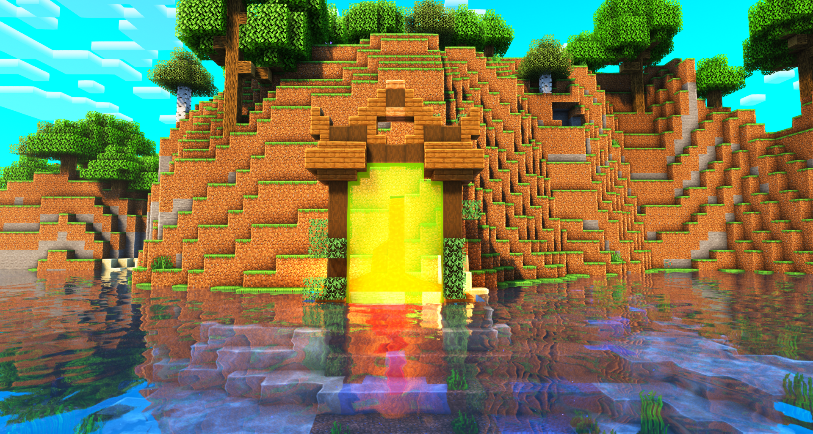

# 🏛️ Les Donjons


**Tuto : Les Nouveautés MMO/RPG d'Evolucraft**


Les donjons sont une nouvelle fonctionnalité sur Evolucraft, offrant des aventures passionnantes aux explorateurs en quête d'action pour monter en niveaux de classe, gagner de nouvelles armes de classe ou encore obtenir de nombreuses autres récompenses !

## <mark style="color:green;">💠 Comment différencier un donjon selon sa rareté ? 🔍</mark>

Pour reconnaître à quel type appartient le donjon, vous avez <mark style="color:green;">plusieurs indices</mark> visibles dessus. Il y a notamment <mark style="color:green;">la couleur des vitres du portail</mark> mais aussi la <mark style="color:green;">taille du portail</mark> : plus il est grand, plus il demandera un niveau de classe élevé pour le réaliser.

### 🔸 Les donjons basiques

* 🟩 [<mark style="color:green;">Commun</mark>](https://wiki.evolucraft.fr/le-gameplay/les-donjons/commun) : _(Niveau requis : <mark style="color:green;">niveau 1</mark>)_
* 🟨 [<mark style="color:yellow;">Rare</mark>](https://wiki.evolucraft.fr/le-gameplay/les-donjons/rare) : _(Niveau requis : <mark style="color:yellow;">niveau 10</mark>)_
* 🟦 [<mark style="color:blue;">Épique</mark>](https://wiki.evolucraft.fr/le-gameplay/les-donjons/epique) : _(Niveau requis : <mark style="color:blue;">niveau 25</mark>)_
* 🟪 [<mark style="color:purple;">Légendaire</mark>](https://wiki.evolucraft.fr/le-gameplay/les-donjons/legendaire) : _(Niveau requis : <mark style="color:purple;">niveau 40</mark>)_
* 🟥 [<mark style="color:red;">Mythique</mark>](https://wiki.evolucraft.fr/le-gameplay/les-donjons/mythique) : _(Niveau requis : <mark style="color:red;">niveau 50</mark>)_


REMARQUE 🤓☝ : Plus un donjon demande un niveau élevé, plus il est difficile, mais les récompenses sont également plus importantes !


Pour rendre votre expérience variée, plusieurs types de biomes de donjons sont présents, modifiant les salles, les monstres ainsi que l'apparence du portail. Vous pourrez y trouver des donjons dans les biomes suivants :

* **Forêt** 🌳
* **Jungle** 🦜
* **Marais** 🐸
* **Neige** ❄️
* **Désert** 🏜️
* **Messa** 🌵
* **Savane** 🦏
* **Nether** 🔥

<figure><figcaption>
<strong>Aperçu d'un donjon Forêt</strong>
</figcaption></figure>

### 🔸 Les donjons événements

De plus, des donjons spécifiques ajoutés lors de mises à jour sur le serveur vous permettent de diversifier l’expérience et d’adopter de nouvelles stratégies !

* 🐉 [<mark style="color:orange;">Donjon Draconique</mark>](https://wiki.evolucraft.fr/le-gameplay/les-donjons/draconique) _(Niveau requis : <mark style="color:orange;">niveau 10</mark>)_
* 🌊 [<mark style="color:blue;">Donjon Abyssal</mark>](https://wiki.evolucraft.fr/le-gameplay/les-donjons/abyssal) _(Niveau requis : <mark style="color:blue;">niveau 10</mark>)_
* 🧛‍♂️ [<mark style="color:orange;">Donjon Halloween</mark>](https://wiki.evolucraft.fr/le-gameplay/les-donjons/halloween) _(Niveau requis : <mark style="color:orange;">niveau 20</mark>)_
* ❄️ [<mark style="color:blue;">Donjon Givrée Commun</mark>](https://wiki.evolucraft.fr/le-gameplay/les-donjons/givre15) _(Niveau requis : <mark style="color:blue;">niveau 15</mark>)_
* 🌟 [<mark style="color:blue;">Donjon Givrée Épique</mark>](https://wiki.evolucraft.fr/le-gameplay/les-donjons/givre40) _(Niveau requis : <mark style="color:blue;">niveau 40</mark>)_
* ❤️ [<mark style="color:red;">Donjon Amour</mark>](https://wiki.evolucraft.fr/le-gameplay/les-donjons/amour) _(Niveau requis : <mark style="color:red;">niveau 10</mark>)_
* 🏹 [<mark style="color:red;">Donjon Cupidon</mark>](https://wiki.evolucraft.fr/le-gameplay/les-donjons/cupidon) _(Niveau requis : <mark style="color:red;">niveau 40</mark>)_
* 🐰 [<mark style="color:yellow;">Donjon Terrier du Roi Lapin</mark>](https://wiki.evolucraft.fr/le-gameplay/les-donjons/roi-lapin) _(Niveau requis : <mark style="color:yellow;">niveau 15</mark>)_
* 🍫 [<mark style="color:yellow;">Donjon Fabrique du Chocolat</mark>](https://wiki.evolucraft.fr/le-gameplay/les-donjons/fabrique-chocolat) _(Niveau requis : <mark style="color:yellow;">niveau 40</mark>)_
* 🎃 [<mark style="color:red;">Donjon Citrouille</mark>](https://wiki.evolucraft.fr/le-gameplay/les-donjons/citrouille) _(Niveau requis : <mark style="color:red;">niveau 15</mark>)_
* 🩸 [<mark style="color:red;">Donjon Lune de Sang</mark>](https://wiki.evolucraft.fr/le-gameplay/les-donjons/lune-de-sang) _(Niveau requis : <mark style="color:red;">niveau 45</mark>)_


REMARQUE 🔍 : Lorsqu’un <mark style="color:green;">donjon est ajouté ou mis en avant après une mise à jour</mark>, son <mark style="color:green;">taux d’apparition est boosté</mark>. 📈

