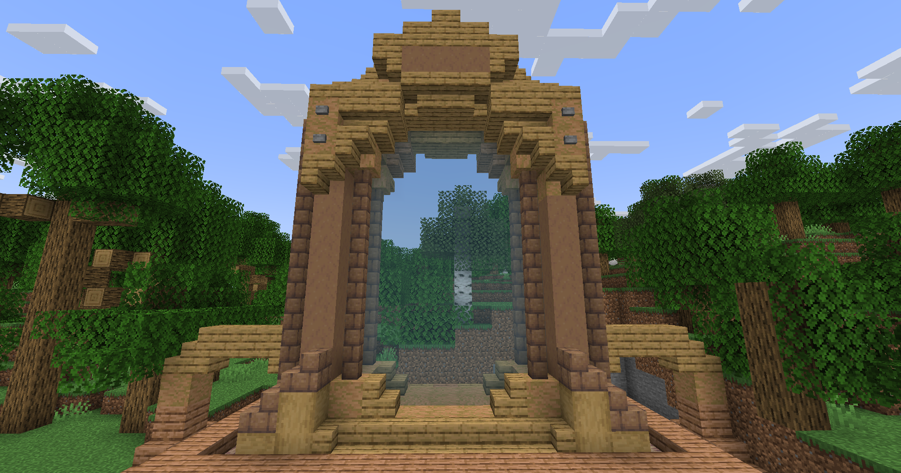

# 🌊 Donjon Abyssal

## 💠 <mark style="color:green;"> Caractéristiques 📋</mark>

👪 Nombre de joueurs accueillis : <mark style="color:green;">**1 à 4 joueurs**</mark>  
📈 Niveau de classe minimum : <mark style="color:green;">**Classe niveau 10**</mark>  
🕓 Durée du donjon : <mark style="color:green;">**20 minutes**</mark>  

## 💠 <mark style="color:green;"> Aperçu du portail 👁‍🗨</mark>

<table border="1" cellspacing="0" cellpadding="6">
  <tr>
    <td><mark style="color:green;"><strong>Aperçu du Donjon 📸</strong></mark></td>
  </tr>
  <tr>
    <td><figure></figure></td>
  </tr>
</table>

## 💠 <mark style="color:blue;"> Statistiques détaillées 📊</mark>

### 📊 Valeurs unitaires

<table border="1" cellspacing="0" cellpadding="8">
  <tr style="background-color: #e3f2fd;">
    <th><strong>Type d’ennemi</strong></th>
    <th><strong>XP par ennemi</strong></th>
  </tr>
  <tr>
    <td>🧟‍♂️ <strong>Mob Normal</strong></td>
    <td><mark style="color:green;"><strong>18 XP</strong></mark></td>
  </tr>
  <tr>
    <td>👽 <strong>Nautilux (Mini Boss)</strong></td>
    <td><mark style="color:yellow;"><strong>450 XP</strong></mark></td>
  </tr>
  <tr>
    <td>🐉 <strong>Merlock (Boss Final)</strong></td>
    <td><mark style="color:red;"><strong>900 XP</strong></mark></td>
  </tr>
</table>

### 📋 Structure du donjon

Le donjon est composé de **5 salles aléatoires** (normales ou mini boss) suivies de **1 salle boss finale**.
La répartition entre salles normales et mini boss est **totalement aléatoire**.

<table border="1" cellspacing="0" cellpadding="8">
  <tr style="background-color: #e3f2fd;">
    <th><strong>Type de salle</strong></th>
    <th><strong>Nombre</strong></th>
    <th><strong>Composition</strong></th>
    <th><strong>XP par salle</strong></th>
  </tr>
  <tr>
    <td>🟢 <strong>Salle Normale</strong></td>
    <td>Variable (aléatoire)</td>
    <td>24 mobs × 4 vagues</td>
    <td><mark style="color:green;"><strong>1 728 XP</strong></mark></td>
  </tr>
  <tr>
    <td>🟡 <strong>Salle Mini Boss</strong></td>
    <td>Variable (aléatoire)</td>
    <td>20 mobs + 3 Nautilux</td>
    <td><mark style="color:yellow;"><strong>1 710 XP</strong></mark></td>
  </tr>
  <tr>
    <td>🔴 <strong>Salle Boss Final</strong></td>
    <td>1 salle (toujours)</td>
    <td>1 Merlock</td>
    <td><mark style="color:red;"><strong>900 XP</strong></mark></td>
  </tr>
</table>

<table border="1" cellspacing="0" cellpadding="8">
  <tr style="background-color: #e8f5e9;">
    <th><strong>Configuration</strong></th>
    <th><strong>Mobs Normaux</strong></th>
    <th><strong>Mini Boss</strong></th>
    <th><strong>Boss Final</strong></th>
    <th><strong>XP Total</strong></th>
  </tr>
  <tr style="background-color: #fff3e0;">
    <td>⬇️ <strong>MINIMUM</strong> <small>(5 salles mini boss)</small></td>
    <td>100 mobs <mark style="color:green;"><strong>1 800 XP</strong></mark></td>
    <td>15 Nautilux <mark style="color:yellow;"><strong>6 750 XP</strong></mark></td>
    <td>1 Merlock <mark style="color:red;"><strong>900 XP</strong></mark></td>
    <td><mark style="color:orange;"><strong>9 450 XP</strong></mark></td>
  </tr>
  <tr style="background-color: #f3e5f5;">
    <td>📊 <strong>MOYENNE</strong> <small>(4 normales + 1 mini boss)</small></td>
    <td>404 mobs <mark style="color:green;"><strong>7 272 XP</strong></mark></td>
    <td>3 Nautilux <mark style="color:yellow;"><strong>1 350 XP</strong></mark></td>
    <td>1 Merlock <mark style="color:red;"><strong>900 XP</strong></mark></td>
    <td><mark style="color:purple;"><strong>~9 522 XP</strong></mark></td>
  </tr>
  <tr style="background-color: #e8f5e9;">
    <td>⬆️ <strong>MAXIMUM</strong> <small>(5 salles normales)</small></td>
    <td>480 mobs <mark style="color:green;"><strong>8 640 XP</strong></mark></td>
    <td>0 Nautilux <mark style="color:yellow;"><strong>0 XP</strong></mark></td>
    <td>1 Merlock <mark style="color:red;"><strong>900 XP</strong></mark></td>
    <td><mark style="color:green;"><strong>9 540 XP</strong></mark></td>
  </tr>
</table>

## 💠 <mark style="color:green;">Récompenses 🎁</mark>

|                                                                                        |
|:--------------------------------------------------------------------------------------:|
| <mark style="color:blue;"><strong>2 Cartes de Classe Aléatoire Commune</strong></mark> |
| <mark style="color:blue;"><strong>Cartes de Classe Aléatoire Rare</strong></mark>      |
| <mark style="color:blue;"><strong>Parchemin Abyssal</strong></mark>                    |
| <mark style="color:blue;"><strong>75.000 💲</strong></mark>                             |
| <mark style="color:blue;"><strong>125.000 💲</strong></mark>                            |
| <mark style="color:blue;"><strong>175.000 💲</strong></mark>                            |
| <mark style="color:blue;"><strong>2 Pinces de Crabe Abyssale</strong></mark>      |
| <mark style="color:blue;"><strong>2 Bonbons à l'Orange</strong></mark>                 |
| <mark style="color:blue;"><strong>Œuf de familier Abyssal</strong></mark>              |
| <mark style="color:blue;"><strong>5 000 XP Classe</strong></mark>                      |
| <mark style="color:blue;"><strong>Pet Merlock (Uniquement sur le boss)</strong></mark> |
