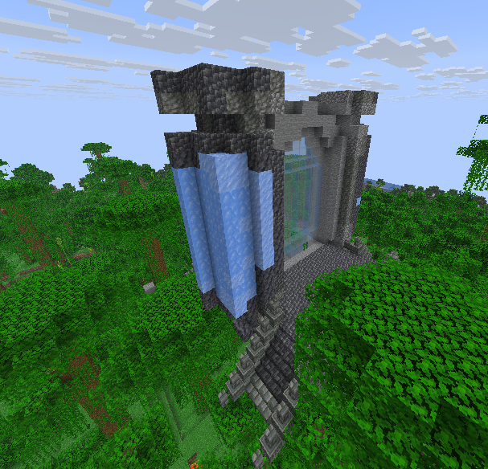

# ⛰️ Donjon Caverne

## 💠 <mark style="color:green;"> Caractéristiques 📋</mark>

👪 Nombre de joueurs accueillis : <mark style="color:green;">**? joueurs**</mark>
📈 Niveau de classe minimum : <mark style="color:green;">**Classe niveau 15**</mark>
🕓 Durée du donjon : <mark style="color:green;">**? minutes**</mark>

## 💠 <mark style="color:green;"> Aperçu du portail 👁‍🗨</mark>

<table border="1" cellspacing="0" cellpadding="6">
  <tr>
    <td><mark style="color:green;"><strong>Aperçu du Donjon 📸</strong></mark></td>
  </tr>
  <tr>
    <td><figure></figure></td>
  </tr>
</table>

## 💠 <mark style="color:green;"> XP de classe récoltée ⚔️</mark>

Lors de ce donjon, vous pouvez obtenir l'XP de classe comme suit :

* <mark style="color:green;"><strong>Mob normal 🧟‍♂️</strong></mark> : **?? XP**
* <mark style="color:yellow;"><strong>Mini boss 👽</strong></mark> : **?? XP**
* <mark style="color:red;"><strong>Boss 🐉</strong></mark> : **?? XP**

## 💠 <mark style="color:green;">Récompenses 🎁</mark>

|                                                                                     |
|:-----------------------------------------------------------------------------------:|
| <mark style="color:blue;"><strong>Cartes Aléatoire de Classe Commune (x2)</strong></mark> |
| <mark style="color:blue;"><strong>Cartes Aléatoire de Classe Rare</strong></mark> |
| <mark style="color:blue;"><strong>Parchemin Avancé</strong></mark>               |
| <mark style="color:blue;"><strong>Parchemin Difficile</strong></mark>            |
| <mark style="color:blue;"><strong>35 000 💲</strong></mark>                       |
| <mark style="color:blue;"><strong>75 000 💲</strong></mark>                       |
| <mark style="color:blue;"><strong>175 000 💲</strong></mark>                      |
| <mark style="color:blue;"><strong>Cristal de donjon rare (x2)</strong></mark>    |
| <mark style="color:blue;"><strong>Bonbons Rares (x3)</strong></mark>             |
| <mark style="color:blue;"><strong>Plume de Fly</strong></mark>                   |
| <mark style="color:blue;"><strong>Plume de Phoenix</strong></mark>               |
| <mark style="color:blue;"><strong>Œuf de Familier Gorille de la Caverne</strong></mark> |
| <mark style="color:blue;"><strong>Socle du Kabuto (Musée)</strong></mark>        |
| <mark style="color:blue;"><strong>Jambière Droite du Kabuto (Musée)</strong></mark> |
| <mark style="color:blue;"><strong>Épaulière Droite du Kabuto (Musée)</strong></mark> |
| <mark style="color:blue;"><strong>Bébé Droit de la Louve Capitoline (Musée)</strong></mark> |
| <mark style="color:blue;"><strong>Statue de la Louve Capitoline (Musée)</strong></mark> |
