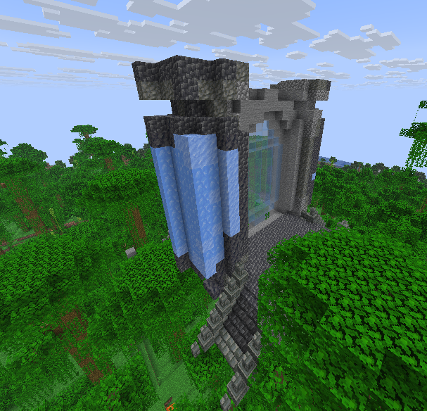

# ⛰️ Donjon Caverne

## 💠 <mark style="color:green;"> Caractéristiques 📋</mark>

👪 Nombre de joueurs accueillis : <mark style="color:green;">**1 à 4 joueurs**</mark>  
📈 Niveau de classe minimum : <mark style="color:green;">**Classe niveau 15**</mark>  
🕓 Durée du donjon : <mark style="color:green;">**10 minutes**</mark>  

## 💠 <mark style="color:green;"> Aperçu du portail 👁‍🗨</mark>

<table border="1" cellspacing="0" cellpadding="6">
  <tr>
    <td><mark style="color:green;"><strong>Aperçu du Donjon 📸</strong></mark></td>
  </tr>
  <tr>
    <td><figure></figure></td>
  </tr>
</table>

## 💠 <mark style="color:blue;"> Statistiques détaillées 📊</mark>

### 📊 Valeurs unitaires

<table border="1" cellspacing="0" cellpadding="8">
  <tr style="background-color: #e3f2fd;">
    <th><strong>Type d'ennemi</strong></th>
    <th><strong>XP par ennemi</strong></th>
  </tr>
  <tr>
    <td>🧟‍♂️ <strong>Mob Normal</strong></td>
    <td><mark style="color:green;"><strong>26 XP</strong></mark></td>
  </tr>
  <tr>
    <td>👽 <strong>Mini Boss</strong></td>
    <td><mark style="color:yellow;"><strong>975 XP</strong></mark></td>
  </tr>
  <tr>
    <td>🐉 <strong>Boss Final</strong></td>
    <td><mark style="color:red;"><strong>2 450 XP</strong></mark></td>
  </tr>
</table>

### 📋 Structure du donjon

Le donjon est composé de **6 salles aléatoires** (normales ou mini boss) suivies de **1 salle boss finale**.
La répartition entre salles normales et mini boss est **totalement aléatoire**.

<table border="1" cellspacing="0" cellpadding="8">
  <tr style="background-color: #e3f2fd;">
    <th><strong>Type de salle</strong></th>
    <th><strong>Nombre</strong></th>
    <th><strong>Composition</strong></th>
    <th><strong>XP par salle</strong></th>
  </tr>
  <tr>
    <td>🟢 <strong>Salle Normale</strong></td>
    <td>Variable (aléatoire)</td>
    <td>48 mobs normaux (1 vague)</td>
    <td>
      
<mark style="color:green;"><strong>1 248 XP</strong></mark>

      
<mark style="color:green;"><strong>720 Sucres d'orge</strong></mark>

    </td>
  </tr>
  <tr>
    <td>🟡 <strong>Salle Mini Boss</strong></td>
    <td>Variable (aléatoire)</td>
    <td>7 mobs normaux + 1 mini boss</td>
    <td>
      
<mark style="color:yellow;"><strong>1 157 XP</strong></mark>

      
<mark style="color:green;"><strong>155 Sucres d'orge</strong></mark>

    </td>
  </tr>
  <tr>
    <td>🔴 <strong>Salle Boss Final</strong></td>
    <td>1 salle (toujours)</td>
    <td>1 boss</td>
    <td>
      
<mark style="color:red;"><strong>2 450 XP</strong></mark>

      
<mark style="color:green;"><strong>150 Sucres d'orge</strong></mark>

    </td>
  </tr>
</table>

<table border="1" cellspacing="0" cellpadding="8">
  <tr style="background-color: #e8f5e9;">
    <th><strong>Configuration</strong></th>
    <th><strong>Mobs Normaux</strong></th>
    <th><strong>Mini Boss</strong></th>
    <th><strong>Boss Final</strong></th>
    <th><strong>XP Total</strong></th>
  </tr>
  <tr style="background-color: #fff3e0;">
    <td>⬇️ <strong>MINIMUM</strong> <small>(6 salles mini boss)</small></td>
    <td>42 mobs <mark style="color:green;"><strong>1 092 XP 630 Sucres d'orge</strong></mark></td>
    <td>6 mini boss <mark style="color:yellow;"><strong>5 850 XP 300 Sucres d'orge</strong></mark></td>
    <td>1 boss <mark style="color:red;"><strong>2 450 XP 150 Sucres d'orge</strong></mark></td>
    <td><mark style="color:orange;"><strong>9 392 XP 1 080 Sucres d'orge</strong></mark></td></strong></mark></td>
  </tr>
  <tr style="background-color: #f3e5f5;">
    <td>📊 <strong>MOYENNE</strong> <small>(4 normales + 2 mini boss)</small></td>
    <td>206 mobs <mark style="color:green;"><strong>5 356 XP 3 090 Sucres d'orge</strong></mark></td>
    <td>2 mini boss <mark style="color:yellow;"><strong>1 950 XP 100 Sucres d'orge</strong></mark></td>
    <td>1 boss <mark style="color:red;"><strong>2 450 XP 150 Sucres d'orge</strong></mark></td>
    <td><mark style="color:purple;"><strong>~9 750 XP ~3 340 Sucres d'orge</strong></mark></td></strong></mark></td>
  </tr>
  <tr style="background-color: #e8f5e9;">
    <td>⬆️ <strong>MAXIMUM</strong> <small>(6 salles normales)</small></td>
    <td>288 mobs <mark style="color:green;"><strong>7 488 XP 4 320 Sucres d'orge</strong></mark></td>
    <td>0 mini boss <mark style="color:yellow;"><strong>0 XP 0 Sucre d'orge</strong></mark></td>
    <td>1 boss <mark style="color:red;"><strong>2 450 XP 150 Sucres d'orge</strong></mark></td>
    <td><mark style="color:green;"><strong>9 938 XP 4 470 Sucres d'orge</strong></mark></td>
  </tr>
</table>

## 💠 <mark style="color:green;">Récompenses 🎁</mark>

|                                                                                     |
|:-----------------------------------------------------------------------------------:|
| <mark style="color:blue;"><strong>Cartes Aléatoires de Classe Commune (x2)</strong></mark> |
| <mark style="color:blue;"><strong>Cartes Aléatoires de Classe Rare</strong></mark> |
| <mark style="color:blue;"><strong>Parchemin Avancé</strong></mark>               |
| <mark style="color:blue;"><strong>Parchemin Difficile</strong></mark>            |
| <mark style="color:blue;"><strong>35 000 💲</strong></mark>                       |
| <mark style="color:blue;"><strong>75 000 💲</strong></mark>                       |
| <mark style="color:blue;"><strong>175 000 💲</strong></mark>                      |
| <mark style="color:blue;"><strong>Cristal de donjon rare (x2)</strong></mark>    |
| <mark style="color:blue;"><strong>Bonbons Rares (x3)</strong></mark>             |
| <mark style="color:blue;"><strong>Plume de Fly</strong></mark>                   |
| <mark style="color:blue;"><strong>Plume de Phoenix</strong></mark>               |
| <mark style="color:blue;"><strong>Pierres de téléportation de donjons hivernaux</strong></mark>               |
| <mark style="color:blue;"><strong>Pet Gorille de la Caverne</strong></mark> |
| <mark style="color:blue;"><strong>Armes Rare</strong></mark>                                    |
| <mark style="color:blue;"><strong>Armes Épique</strong></mark>                                  |
| <mark style="color:blue;"><strong>Socle du Kabuto (Musée)</strong></mark>        |
| <mark style="color:blue;"><strong>Jambière Droite du Kabuto (Musée)</strong></mark> |
| <mark style="color:blue;"><strong>Épaulière Droite du Kabuto (Musée)</strong></mark> |
| <mark style="color:blue;"><strong>Bébé Droit de la Louve Capitoline (Musée)</strong></mark> |
| <mark style="color:blue;"><strong>Statue de la Louve Capitoline (Musée)</strong></mark> |
