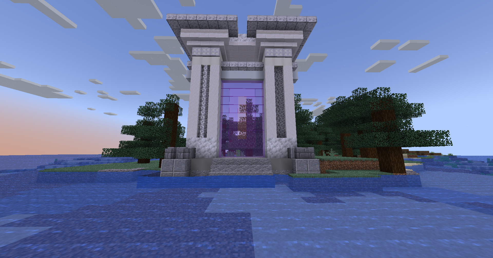

# 🏹 Cupidon

## 💠 <mark style="color:green;"> Caractéristiques 📋</mark>

👪 Nombre de joueurs accueillis : <mark style="color:green;">**1 à 8 joueurs**</mark>  
📈 Niveau de classe minimum : <mark style="color:green;">**Classe niveau 40**</mark>  
🕓 Durée du donjon : <mark style="color:green;">**15 minutes**</mark>  

## 💠 <mark style="color:green;"> Aperçu du portail 👁‍🗨</mark>

<table border="1" cellspacing="0" cellpadding="6">
  <tr>
    <td><mark style="color:green;"><strong>Aperçu du Donjon 📸</strong></mark></td>
  </tr>
  <tr>
    <td><figure></figure></td>
  </tr>
</table>

## 💠 <mark style="color:blue;"> Statistiques détaillées 📊</mark>

### 📊 Valeurs unitaires

<table border="1" cellspacing="0" cellpadding="8">
  <tr style="background-color: #e3f2fd;">
    <th><strong>Type d’ennemi</strong></th>
    <th><strong>XP par ennemi</strong></th>
  </tr>
  <tr>
    <td>🧟‍♂️ <strong>Apprenti, Archer & Chevalier</strong></td>
    <td><mark style="color:green;"><strong>50 XP</strong></mark></td>
  </tr>
  <tr>
    <td>👽 <strong>Seraphiel & Uriel (Mini Boss)</strong></td>
    <td><mark style="color:yellow;"><strong>5 000 XP</strong></mark></td>
  </tr>
  <tr>
    <td>🐉 <strong>Cupidon (Boss Final)</strong></td>
    <td><mark style="color:red;"><strong>10 000 XP</strong></mark></td>
  </tr>
</table>

### 📋 Structure du donjon

Le donjon est composé de **4 salles** (mobs + mini boss) suivies de **1 salle boss finale**. La structure est **fixe**.

<table border="1" cellspacing="0" cellpadding="8">
  <tr style="background-color: #e3f2fd;">
    <th><strong>Type de salle</strong></th>
    <th><strong>Nombre</strong></th>
    <th><strong>Composition</strong></th>
    <th><strong>XP par salle</strong></th>
  </tr>
  <tr>
    <td>🟡 <strong>Salle Mobs + Mini Boss</strong></td>
    <td>4 salles (fixe)</td>
    <td>37 mobs + 2 Seraphiel/Uriel</td>
    <td><mark style="color:yellow;"><strong>11 850 XP</strong></mark></td>
  </tr>
  <tr>
    <td>🔴 <strong>Salle Boss Final</strong></td>
    <td>1 salle (toujours)</td>
    <td>1 Cupidon</td>
    <td><mark style="color:red;"><strong>10 000 XP</strong></mark></td>
  </tr>
</table>

<table border="1" cellspacing="0" cellpadding="8">
  <tr style="background-color: #e8f5e9;">
    <th><strong>XP Total du donjon</strong></th>
  </tr>
  <tr>
    <td><mark style="color:green;"><strong>57 400 XP</strong></mark> <small>4 × 11 850 + 10 000</small></td>
  </tr>
</table>

## 💠 <mark style="color:green;">Récompenses 🎁</mark>

|                                                                              | 
|:----------------------------------------------------------------------------:|
| <mark style="color:red;"><strong>Parchemin de l'amour</strong></mark>        |
| <mark style="color:red;"><strong>40 000 💲</strong></mark>                   |
| <mark style="color:red;"><strong>60 000 💲</strong></mark>                   |
| <mark style="color:red;"><strong>100 000 💲</strong></mark>                  |
| <mark style="color:red;"><strong>2 Auréoles</strong></mark>                 |
| <mark style="color:red;"><strong>2 Bonbons à l'orange</strong></mark>       |
| <mark style="color:red;"><strong>Œuf de familier de l'amour</strong></mark> |
| <mark style="color:red;"><strong>5 000 XP classe</strong></mark>            |
| <mark style="color:red;"><strong>Clé Cupidon</strong></mark>                |
