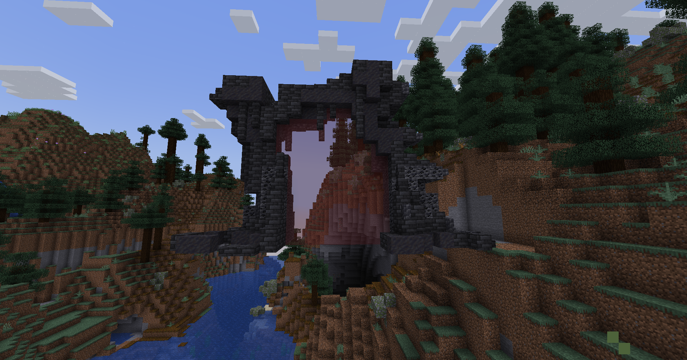

# 🐉 Donjon Draconique

## 💠 <mark style="color:green;"> Caractéristiques 📋</mark>

👪 Nombre de joueurs accueillis : <mark style="color:green;">**1 à 10 joueurs**</mark>  
📈 Niveau de classe minimum : <mark style="color:green;">**Classe niveau 10**</mark>  
🕓 Durée du donjon : <mark style="color:green;">**30 minutes**</mark>  

## 💠 <mark style="color:green;"> Aperçu du portail 👁‍🗨</mark>

<table border="1" cellspacing="0" cellpadding="6">
  <tr>
    <td><mark style="color:green;"><strong>Aperçu du Donjon 📸</strong></mark></td>
  </tr>
  <tr>
    <td><figure></figure></td>
  </tr>
</table>

## 💠 <mark style="color:blue;"> Statistiques détaillées 📊</mark>

### 📊 Valeurs unitaires

<table border="1" cellspacing="0" cellpadding="8">
  <tr style="background-color: #e3f2fd;">
    <th><strong>Type d’ennemi</strong></th>
    <th><strong>XP par ennemi</strong></th>
  </tr>
  <tr>
    <td>🧟‍♂️ <strong>Dragon vert & Dragon de feu</strong></td>
    <td><mark style="color:green;"><strong>17,5 XP</strong></mark></td>
  </tr>
  <tr>
    <td>🧟‍♂️ <strong>Patate (mini-boss tank)</strong></td>
    <td><mark style="color:green;"><strong>150 XP</strong></mark></td>
  </tr>
  <tr>
    <td>🧟‍♂️ <strong>Albi (mini-boss volant)</strong></td>
    <td><mark style="color:green;"><strong>250 XP</strong></mark></td>
  </tr>
  <tr>
    <td>👽 <strong>Drogon (Mini Boss)</strong></td>
    <td><mark style="color:yellow;"><strong>500 XP</strong></mark></td>
  </tr>
  <tr>
    <td>🐉 <strong>Saphira (Boss Final)</strong></td>
    <td><mark style="color:red;"><strong>900 XP</strong></mark></td>
  </tr>
</table>

### 📋 Structure du donjon

Le donjon est composé de **2 salles mini boss** suivies de **1 salle boss finale**. La structure est **fixe**.

<table border="1" cellspacing="0" cellpadding="8">
  <tr style="background-color: #e3f2fd;">
    <th><strong>Type de salle</strong></th>
    <th><strong>Nombre</strong></th>
    <th><strong>Composition</strong></th>
    <th><strong>XP par salle</strong></th>
  </tr>
  <tr>
    <td>🟡 <strong>Salle Mini Boss</strong></td>
    <td>2 salles (fixe)</td>
    <td>32 Dragons + 4 Patates + 2 Albis + 1 Drogon</td>
    <td><mark style="color:yellow;"><strong>2 160 XP</strong></mark></td>
  </tr>
  <tr>
    <td>🔴 <strong>Salle Boss Final</strong></td>
    <td>1 salle (toujours)</td>
    <td>1 Saphira</td>
    <td><mark style="color:red;"><strong>900 XP</strong></mark></td>
  </tr>
</table>

<table border="1" cellspacing="0" cellpadding="8">
  <tr style="background-color: #e8f5e9;">
    <th><strong>XP Total du donjon</strong></th>
  </tr>
  <tr>
    <td><mark style="color:green;"><strong>5 220 XP</strong></mark> <small>2 × 2 160 + 900</small></td>
  </tr>
</table>

## 💠 <mark style="color:green;">Récompenses 🎁</mark>

|                                                                                           |
|:-----------------------------------------------------------------------------------------:|
| <mark style="color:orange;"><strong>2 Cartes Aléatoires de Classe Commune</strong></mark> |
| <mark style="color:orange;"><strong>Carte Aléatoire de Classe Rare</strong></mark>        |
| <mark style="color:orange;"><strong>Parchemin Avancé</strong></mark>                        |
| <mark style="color:orange;"><strong>Parchemin Difficile</strong></mark>                      |
| <mark style="color:orange;"><strong>50 000 💲</strong></mark>                              |
| <mark style="color:orange;"><strong>100 000 💲</strong></mark>                             |
| <mark style="color:orange;"><strong>150 000 💲</strong></mark>                             |
| <mark style="color:orange;"><strong>4 Cœurs de Dragon </strong></mark>                    |
| <mark style="color:orange;"><strong>6 Cœurs de Dragon </strong></mark>                    |
| <mark style="color:orange;"><strong>Bonbon à l'Orange</strong></mark>                     |
| <mark style="color:orange;"><strong>Œuf de Familier Draconique</strong></mark>            |
| <mark style="color:orange;"><strong>5 000 XP Classe</strong></mark>                       |
