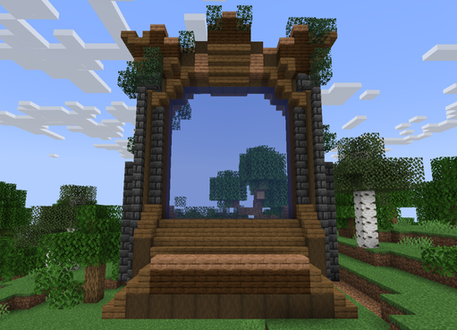
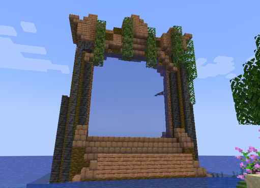
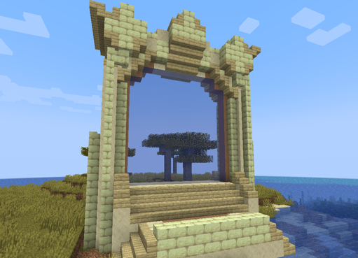
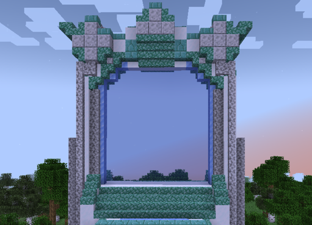
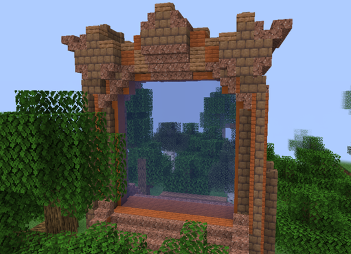
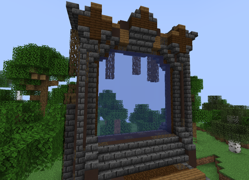
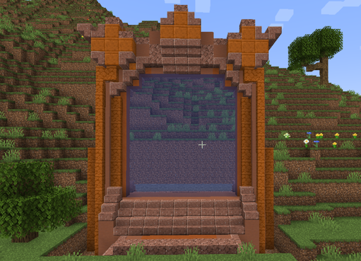
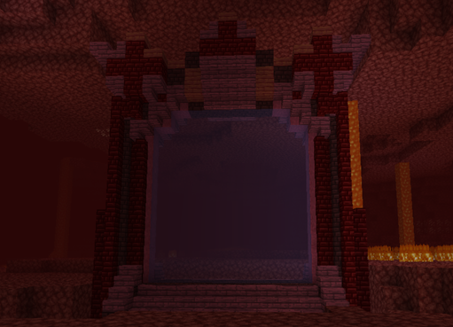

# 🟦 Donjon Épique

## 💠 <mark style="color:green;"> Caractéristiques 📋</mark>

👪 Nombre de joueurs accueillis : <mark style="color:green;">**1 à 4 joueurs**</mark>  
📈 Niveau de classe minimum : <mark style="color:green;">**Classe niveau 25**</mark>  
🕓 Durée du donjon : <mark style="color:green;">**25 minutes**</mark>  

## 💠 <mark style="color:green;"> Aperçu du portail 👁‍🗨</mark>

<table border="1" cellspacing="0" cellpadding="6">
  <tr>
    <td><mark style="color:green;"><strong>Biome du portail 🏛️</strong></mark></td>
    <td><mark style="color:white;"><strong>Forêt 🌳</strong></mark></td>
    <td><mark style="color:white;"><strong>Jungle 🦜</strong></mark></td>
    <td><mark style="color:white;"><strong>Désert 🏜️</strong></mark></td>
    <td><mark style="color:white;"><strong>Neige ❄️</strong></mark></td>
    <td><mark style="color:white;"><strong>Savane 🦏</strong></mark></td>
    <td><mark style="color:white;"><strong>Marais 🐸</strong></mark></td>
    <td><mark style="color:white;"><strong>Messa 🌵</strong></mark></td>
    <td><mark style="color:white;"><strong>Nether 🔥</strong></mark></td>
  </tr>
  <tr>
    <td><mark style="color:green;"><strong>Aperçu du Donjon 📸</strong></mark></td>
    <td><figure></figure></td>
    <td><figure></figure></td>
    <td><figure></figure></td>
    <td><figure></figure></td>
    <td><figure></figure></td>
    <td><figure></figure></td>
    <td><figure></figure></td>
    <td><figure></figure></td>
  </tr>
</table>

## 💠 <mark style="color:blue;"> Statistiques détaillées 📊</mark>

### 📊 Valeurs unitaires

<table border="1" cellspacing="0" cellpadding="8">
  <tr style="background-color: #e3f2fd;">
    <th><strong>Type d’ennemi</strong></th>
    <th><strong>XP par ennemi</strong></th>
  </tr>
  <tr>
    <td>🧟‍♂️ <strong>Mob Normal</strong></td>
    <td><mark style="color:green;"><strong>35 XP</strong></mark></td>
  </tr>
  <tr>
    <td>👽 <strong>Mini Boss</strong></td>
    <td><mark style="color:yellow;"><strong>1 500 XP</strong></mark></td>
  </tr>
  <tr>
    <td>🐉 <strong>Boss Final</strong></td>
    <td><mark style="color:red;"><strong>4 000 XP</strong></mark></td>
  </tr>
</table>

### 📋 Structure du donjon

Le donjon est composé de **6 salles aléatoires** (normales ou mini boss) suivies de **1 salle boss finale**.
La répartition entre salles normales et mini boss est **totalement aléatoire**.

<table border="1" cellspacing="0" cellpadding="8">
  <tr style="background-color: #e3f2fd;">
    <th><strong>Type de salle</strong></th>
    <th><strong>Nombre</strong></th>
    <th><strong>Composition</strong></th>
    <th><strong>XP par salle</strong></th>
  </tr>
  <tr>
    <td>🟢 <strong>Salle Normale</strong></td>
    <td>Variable (aléatoire)</td>
    <td>16 mobs × 3 vagues</td>
    <td><mark style="color:green;"><strong>1 680 XP</strong></mark></td>
  </tr>
  <tr>
    <td>🟡 <strong>Salle Mini Boss</strong></td>
    <td>Variable (aléatoire)</td>
    <td>9 mobs + 1 mini boss</td>
    <td><mark style="color:yellow;"><strong>1 815 XP</strong></mark></td>
  </tr>
  <tr>
    <td>🔴 <strong>Salle Boss Final</strong></td>
    <td>1 salle (toujours)</td>
    <td>1 boss</td>
    <td><mark style="color:red;"><strong>4 000 XP</strong></mark></td>
  </tr>
</table>

<table border="1" cellspacing="0" cellpadding="8">
  <tr style="background-color: #e8f5e9;">
    <th><strong>Configuration</strong></th>
    <th><strong>Mobs Normaux</strong></th>
    <th><strong>Mini Boss</strong></th>
    <th><strong>Boss Final</strong></th>
    <th><strong>XP Total</strong></th>
  </tr>
  <tr style="background-color: #fff3e0;">
    <td>⬇️ <strong>MINIMUM</strong> <small>(6 salles normales)</small></td>
    <td>288 mobs <mark style="color:green;"><strong>10 080 XP</strong></mark></td>
    <td>0 mini boss <mark style="color:yellow;"><strong>0 XP</strong></mark></td>
    <td>1 boss <mark style="color:red;"><strong>4 000 XP</strong></mark></td>
    <td><mark style="color:orange;"><strong>14 080 XP</strong></mark></td>
  </tr>
  <tr style="background-color: #f3e5f5;">
    <td>📊 <strong>MOYENNE</strong> <small>(4 normales + 2 mini boss)</small></td>
    <td>210 mobs <mark style="color:green;"><strong>7 350 XP</strong></mark></td>
    <td>2 mini boss <mark style="color:yellow;"><strong>3 000 XP</strong></mark></td>
    <td>1 boss <mark style="color:red;"><strong>4 000 XP</strong></mark></td>
    <td><mark style="color:purple;"><strong>~14 350 XP</strong></mark></td>
  </tr>
  <tr style="background-color: #e8f5e9;">
    <td>⬆️ <strong>MAXIMUM</strong> <small>(6 salles mini boss)</small></td>
    <td>54 mobs <mark style="color:green;"><strong>1 890 XP</strong></mark></td>
    <td>6 mini boss <mark style="color:yellow;"><strong>9 000 XP</strong></mark></td>
    <td>1 boss <mark style="color:red;"><strong>4 000 XP</strong></mark></td>
    <td><mark style="color:green;"><strong>14 890 XP</strong></mark></td>
  </tr>
</table>

## 💠 <mark style="color:green;">Récompenses 🎁</mark>

|                                                                                      |
|:------------------------------------------------------------------------------------:|
| <mark style="color:blue;"><strong>Cartes Aléatoires de Classe Rare</strong></mark>   |
| <mark style="color:blue;"><strong>Parchemin Difficile</strong></mark>                |
| <mark style="color:blue;"><strong>50 000 💲</strong></mark>                          |
| <mark style="color:blue;"><strong>100 000 💲</strong></mark>                         |
| <mark style="color:blue;"><strong>250 000 💲</strong></mark>                         |
| <mark style="color:blue;"><strong>Cristal de Donjon Épique</strong></mark>           |
| <mark style="color:blue;"><strong>2 Bonbons à la Myrtille</strong></mark>            |
| <mark style="color:blue;"><strong>Plume de Phoenix</strong></mark>                   |
| <mark style="color:blue;"><strong>Arme Rare</strong></mark>                          |
| <mark style="color:blue;"><strong>Arme Épique</strong></mark>                        |
| <mark style="color:blue;"><strong>Pet du Donjon (Boss Uniquement)</strong></mark>    |
| <mark style="color:blue;"><strong>Partie Gauche de la Pierre de Rosette (Musée)</strong></mark> |
| <mark style="color:blue;"><strong>Partie Haute de la Pierre de Rosette (Musée)</strong></mark>  |
| <mark style="color:blue;"><strong>Socle du Soldat d'Argile (Musée)</strong></mark>              |
| <mark style="color:blue;"><strong>Côté Droit du Soldat d'Argile (Musée)</strong></mark>         |
| <mark style="color:blue;"><strong>Côté Gauche du Soldat d'Argile (Musée)</strong></mark>        |
| <mark style="color:blue;"><strong>Pot du Vase de Soissons (Musée)</strong></mark>                |
| <mark style="color:blue;"><strong>Socle du Vase de Soissons (Musée)</strong></mark>              |
