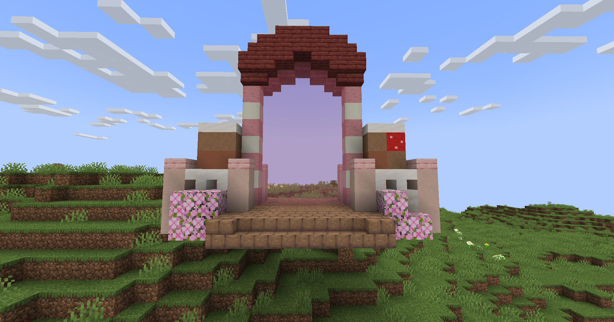

# 🍫 Fabrique de Chocolat

## 💠 <mark style="color:green;"> Caractéristiques 📋</mark>

👪 Nombre de joueurs accueillis : <mark style="color:green;">**1 à 4 joueurs**</mark>  
📈 Niveau de classe minimum : <mark style="color:green;">**Classe niveau 40**</mark>  
🕓 Durée du donjon : <mark style="color:green;">**20 minutes**</mark>  

## 💠 <mark style="color:green;"> Aperçu du portail 👁‍🗨</mark>

<table border="1" cellspacing="0" cellpadding="6">
  <tr>
    <td><mark style="color:green;"><strong>Aperçu du Donjon 📸</strong></mark></td>
  </tr>
  <tr>
    <td></figure></td>
  </tr>
</table>

## 💠 <mark style="color:blue;"> Statistiques détaillées 📊</mark>

### 📊 Valeurs unitaires

<table border="1" cellspacing="0" cellpadding="8">
  <tr style="background-color: #e3f2fd;">
    <th><strong>Type d’ennemi</strong></th>
    <th><strong>XP par ennemi</strong></th>
  </tr>
  <tr>
    <td>🧟‍♂️ <strong>Soldats & Tireurs</strong></td>
    <td><mark style="color:green;"><strong>50 XP</strong></mark></td>
  </tr>
  <tr>
    <td>👽 <strong>Dinosaures (Mini Boss)</strong></td>
    <td><mark style="color:yellow;"><strong>5 000 XP</strong></mark></td>
  </tr>
  <tr>
    <td>🐉 <strong>Abomination (Boss Final)</strong></td>
    <td><mark style="color:red;"><strong>10 000 XP</strong></mark></td>
  </tr>
</table>

### 📋 Structure du donjon

Le donjon est composé de **6 salles aléatoires** (normales ou mini boss) suivies de **1 salle boss finale**.
La répartition entre salles normales et mini boss est **totalement aléatoire**.

<table border="1" cellspacing="0" cellpadding="8">
  <tr style="background-color: #e3f2fd;">
    <th><strong>Type de salle</strong></th>
    <th><strong>Nombre</strong></th>
    <th><strong>Composition</strong></th>
    <th><strong>XP par salle</strong></th>
  </tr>
  <tr>
    <td>🟢 <strong>Salle Normale</strong></td>
    <td>Variable (aléatoire)</td>
    <td>16 mobs × 3 vagues</td>
    <td><mark style="color:green;"><strong>2 400 XP</strong></mark></td>
  </tr>
  <tr>
    <td>🟡 <strong>Salle Mini Boss</strong></td>
    <td>Variable (aléatoire)</td>
    <td>? mobs + 1 Dinosaure</td>
    <td><mark style="color:yellow;"><strong>? XP</strong></mark></td>
  </tr>
  <tr>
    <td>🔴 <strong>Salle Boss Final</strong></td>
    <td>1 salle (toujours)</td>
    <td>1 Abomination</td>
    <td><mark style="color:red;"><strong>10 000 XP</strong></mark></td>
  </tr>
</table>

<table border="1" cellspacing="0" cellpadding="8">
  <tr style="background-color: #e8f5e9;">
    <th><strong>XP Total estimé (6 salles normales + boss)</strong></th>
  </tr>
  <tr>
    <td><mark style="color:green;"><strong>~24 400 XP</strong></mark> <small>6 × 2 400 + 10 000</small></td>
  </tr>
</table>

## 💠 <mark style="color:green;">Récompenses 🎁</mark>

|                                                                                         |
|:---------------------------------------------------------------------------------------:|
| <mark style="color:yellow;"><strong>Parchemin de la Fabrique de Chocolat</strong></mark> |
| <mark style="color:yellow;"><strong>40 000 💲</strong></mark>                            |
| <mark style="color:yellow;"><strong>60 000 💲</strong></mark>                            |
| <mark style="color:yellow;"><strong>100 000 💲</strong></mark>                           |
| <mark style="color:yellow;"><strong>2 Tablettes de chocolat</strong></mark>         |
| <mark style="color:yellow;"><strong>2 Bonbons à l'orange</strong></mark>              |
| <mark style="color:yellow;"><strong>Œuf de familier de Pâques</strong></mark>            |
| <mark style="color:yellow;"><strong>5 000 XP classe</strong></mark>                  |
| <mark style="color:yellow;"><strong>Clé de Pâques</strong></mark>                   |
