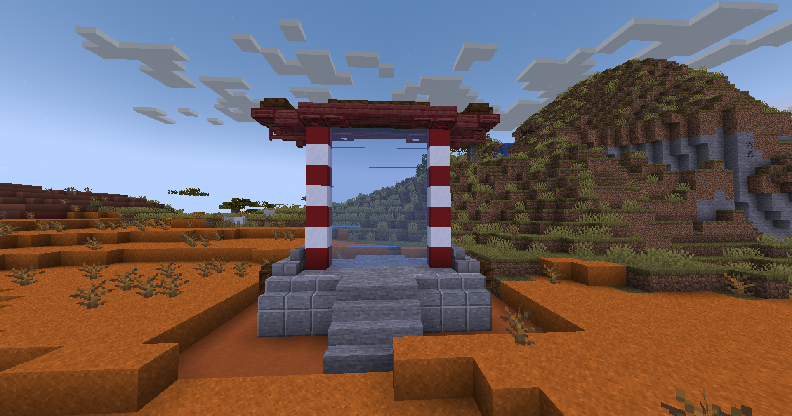

# ❄️ Donjon Givré Commun

## 💠 <mark style="color:green;"> Caractéristiques 📋</mark>

👪 Nombre de joueurs accueillis : <mark style="color:green;">**1 ou 2 joueurs**</mark>  
📈 Niveau de classe minimum : <mark style="color:green;">**Classe niveau 15**</mark>  
🕓 Durée du donjon : <mark style="color:green;">**5 minutes**</mark>  

## 💠 <mark style="color:green;"> Aperçu du portail 👁‍🗨</mark>

<table border="1" cellspacing="0" cellpadding="6">
  <tr>
    <td><mark style="color:green;"><strong>Aperçu du Donjon 📸</strong></mark></td>
  </tr>
  <tr>
    <td><figure></figure></td>
  </tr>
</table>

## 💠 <mark style="color:blue;"> Statistiques détaillées 📊</mark>

### 📊 Valeurs unitaires

<table border="1" cellspacing="0" cellpadding="8">
  <tr style="background-color: #e3f2fd;">
    <th><strong>Type d’ennemi</strong></th>
    <th><strong>XP par ennemi</strong></th>
  </tr>
  <tr>
    <td>🧟‍♂️ <strong>Combattant & Elf</strong></td>
    <td><mark style="color:green;"><strong>18 XP</strong></mark></td>
  </tr>
  <tr>
    <td>👽 <strong>Golem (Mini Boss)</strong></td>
    <td><mark style="color:yellow;"><strong>450 XP</strong></mark></td>
  </tr>
  <tr>
    <td>🐉 <strong>Reine des Glaces (Boss Final)</strong></td>
    <td><mark style="color:red;"><strong>900 XP</strong></mark></td>
  </tr>
</table>

### 📋 Structure du donjon

Le donjon est composé de **1 salle mini boss** suivie de **1 salle boss finale**. La structure est **fixe**.

<table border="1" cellspacing="0" cellpadding="8">
  <tr style="background-color: #e3f2fd;">
    <th><strong>Type de salle</strong></th>
    <th><strong>Nombre</strong></th>
    <th><strong>Composition</strong></th>
    <th><strong>XP par salle</strong></th>
  </tr>
  <tr>
    <td>🟡 <strong>Salle Mini Boss</strong></td>
    <td>1 salle (fixe)</td>
    <td>12 mobs + 1 Golem</td>
    <td><mark style="color:yellow;"><strong>666 XP</strong></mark></td>
  </tr>
  <tr>
    <td>🔴 <strong>Salle Boss Final</strong></td>
    <td>1 salle (toujours)</td>
    <td>1 Reine des Glaces</td>
    <td><mark style="color:red;"><strong>900 XP</strong></mark></td>
  </tr>
</table>

<table border="1" cellspacing="0" cellpadding="8">
  <tr style="background-color: #e8f5e9;">
    <th><strong>XP Total du donjon</strong></th>
  </tr>
  <tr>
    <td><mark style="color:green;"><strong>1 566 XP</strong></mark> <small>666 + 900</small></td>
  </tr>
</table>

## 💠 <mark style="color:green;">Récompenses 🎁</mark>

|                                                                           |
|:-------------------------------------------------------------------------:|
| <mark style="color:blue;"><strong>Parchemin Givré</strong></mark>           |
| <mark style="color:blue;"><strong>10 000 💲</strong></mark>                |
| <mark style="color:blue;"><strong>15 000 💲</strong></mark>                |
| <mark style="color:blue;"><strong>25 000 💲</strong></mark>                |
| <mark style="color:blue;"><strong>Sucre d'orge</strong></mark>        |
| <mark style="color:blue;"><strong>Bonbon à la pomme</strong></mark> |
| <mark style="color:blue;"><strong>Œuf de familier givré</strong></mark>    |
| <mark style="color:blue;"><strong>250 XP classe</strong></mark>        |
