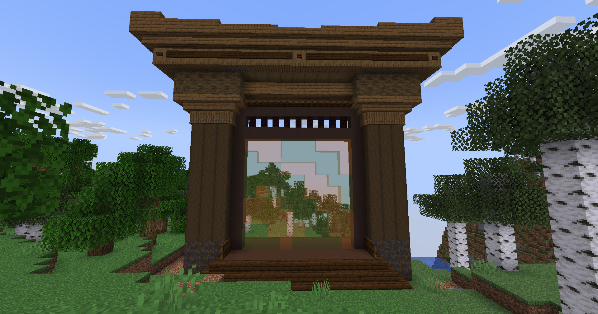

# 🧛‍♂️ Donjon Halloween

## 💠 <mark style="color:green;"> Caractéristiques 📋</mark>

👪 Nombre de joueurs accueillis : <mark style="color:green;">**1 à 4 joueurs**</mark>  
📈 Niveau de classe minimum : <mark style="color:green;">**Classe niveau 20**</mark>  
🕓 Durée du donjon : <mark style="color:green;">**20 minutes**</mark>  

## 💠 <mark style="color:green;"> Aperçu du portail 👁‍🗨</mark>

<table border="1" cellspacing="0" cellpadding="6">
  <tr>
    <td><mark style="color:green;"><strong>Aperçu du Donjon 📸</strong></mark></td>
  </tr>
  <tr>
    <td><figure></figure></td>
  </tr>
</table>

## 💠 <mark style="color:green;"> XP de classe récoltée ⚔️</mark>

Lors de ce donjon, vous pouvez obtenir l’XP de classe comme suit :  

* <mark style="color:green;"><strong>Mob normal 🧟‍♂️</strong></mark> : **35 XP**  
* <mark style="color:yellow;"><strong>Mini boss 👽</strong></mark> : **1 250 XP**  
* <mark style="color:red;"><strong>Boss 🐉</strong></mark> : **3 500 XP**

## 💠 <mark style="color:green;">Récompenses 🎁</mark>

|                                                                                     |
|:-----------------------------------------------------------------------------------:|
| <mark style="color:orange;"><strong>Cartes Aléatoires de Classe Rare</strong></mark> |
| <mark style="color:orange;"><strong>Parchemin Halloween</strong></mark>             |
| <mark style="color:orange;"><strong>50 000 💲</strong></mark>                       |
| <mark style="color:orange;"><strong>100 000 💲</strong></mark>                      |
| <mark style="color:orange;"><strong>250 000 💲</strong></mark>                      |
| <mark style="color:orange;"><strong>2 Citrouilles Scintillantes</strong></mark>     |
| <mark style="color:orange;"><strong>2 Bonbons à la Myrtille</strong></mark>         |
| <mark style="color:orange;"><strong>Œuf de Familier Halloween</strong></mark>       |
| <mark style="color:orange;"><strong>5 000 XP Classe</strong></mark>                 |
