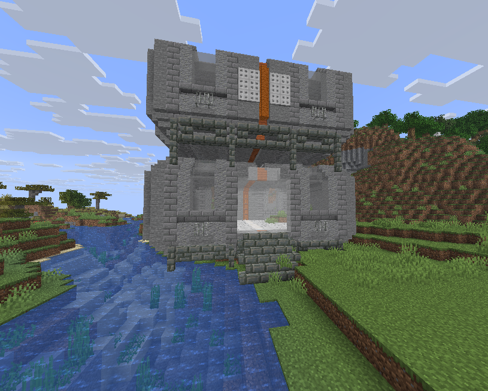

# ⚗️ Donjon Laboratoire Glaciale

## 💠 <mark style="color:green;"> Caractéristiques 📋</mark>

👪 Nombre de joueurs accueillis : <mark style="color:green;">**1 à 4 joueurs**</mark>  
📈 Niveau de classe minimum : <mark style="color:green;">**Classe niveau 30**</mark>  
🕓 Durée du donjon : <mark style="color:green;">**10 minutes**</mark>  

## 💠 <mark style="color:green;"> Aperçu du portail 👁‍🗨</mark>

<table border="1" cellspacing="0" cellpadding="6">
  <tr>
    <td><mark style="color:green;"><strong>Aperçu du Donjon 📸</strong></mark></td>
  </tr>
  <tr>
    <td><figure></figure></td>
  </tr>
</table>

## 💠 <mark style="color:green;"> XP de classe récoltée ⚔️</mark>

Lors de ce donjon, vous pouvez obtenir l’XP de classe comme suit :  

* <mark style="color:green;"><strong>Mob normal 🧟‍♂️</strong></mark> : **42 XP**  
* <mark style="color:yellow;"><strong>Mini boss 👽</strong></mark> : **2 800 XP**  
* <mark style="color:red;"><strong>Boss 🐉</strong></mark> : **6 500 XP**

## 💠 <mark style="color:green;">Récompenses 🎁</mark>

|                                                                                      |
|:------------------------------------------------------------------------------------:|
| <mark style="color:blue;"><strong>Cartes Aléatoire de Classe Rare</strong></mark>  |
| <mark style="color:blue;"><strong>Carte Aléatoire de Classe Épique</strong></mark> |
| <mark style="color:blue;"><strong>Parchemin Difficile</strong></mark>              |
| <mark style="color:blue;"><strong>Parchemin Expert</strong></mark>                 |
| <mark style="color:blue;"><strong>100 000 💲</strong></mark>                       |
| <mark style="color:blue;"><strong>150 000 💲</strong></mark>                       |
| <mark style="color:blue;"><strong>450 000 💲</strong></mark>                       |
| <mark style="color:blue;"><strong>Cristal de donjon Épique</strong></mark>         |
| <mark style="color:blue;"><strong>2 Cristaux de donjon Épique</strong></mark>      |
| <mark style="color:blue;"><strong>2 Citrouilles Scintillantes</strong></mark>      |
| <mark style="color:blue;"><strong>3 Bonbons à la Myrtille</strong></mark>          |
| <mark style="color:blue;"><strong>Plume de Phénix</strong></mark>                  |
| <mark style="color:blue;"><strong>Pierre de téléportation de donjon Hivernaux</strong></mark>   |
| <mark style="color:blue;"><strong>Pet Méca-Gorille du Labo</strong></mark>                      |
| <mark style="color:blue;"><strong>Armes Rare</strong></mark>                                    |
| <mark style="color:blue;"><strong>Armes Épique</strong></mark>                                  |
| <mark style="color:blue;"><strong>Partie Gauche de la Pierre de Rosette (Musée)</strong></mark> |
| <mark style="color:blue;"><strong>Partie Haute de la Pierre de Rosette (Musée)</strong></mark>  |
| <mark style="color:blue;"><strong>Socle du Soldat d'Argile (Musée)</strong></mark>              |
| <mark style="color:blue;"><strong>Coté Droit du Soldat d'Argile (Musée)</strong></mark>         |
| <mark style="color:blue;"><strong>Coté Gauche du Soldat d'Argile (Musée)</strong></mark>        |
| <mark style="color:blue;"><strong>Base du Vase de Soisons (Musée)</strong></mark>                |
| <mark style="color:blue;"><strong>Socle du Vase de Soisons (Musée)</strong></mark>               |

