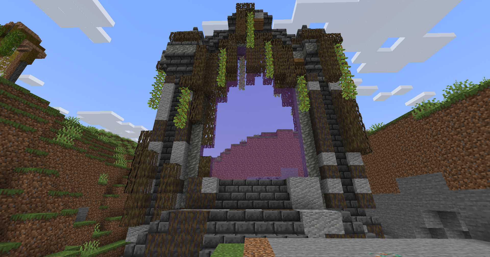

# 🟪 Donjon Légendaire

## 💠 <mark style="color:green;"> Caractéristiques 📋</mark>

👪 Nombre de joueurs accueillis : <mark style="color:green;">**1 à 4 joueurs**</mark>  
📈 Niveau de classe minimum : <mark style="color:green;">**Classe niveau 40**</mark>  
🕓 Durée du donjon : <mark style="color:green;">**30 minutes**</mark>  

## 💠 <mark style="color:green;"> Aperçu du portail 👁‍🗨</mark>

<table border="1" cellspacing="0" cellpadding="6">
  <tr>
    <td><mark style="color:green;"><strong>Aperçu du Donjon 📸</strong></mark></td>
  </tr>
  <tr>
    <td><figure></figure></td>
  </tr>
</table>

## 💠 <mark style="color:blue;"> Statistiques détaillées 📊</mark>

### 📊 Valeurs unitaires

<table border="1" cellspacing="0" cellpadding="8">
  <tr style="background-color: #e3f2fd;">
    <th><strong>Type d’ennemi</strong></th>
    <th><strong>XP par ennemi</strong></th>
  </tr>
  <tr>
    <td>🧟‍♂️ <strong>Mob Normal</strong></td>
    <td><mark style="color:green;"><strong>50 XP</strong></mark></td>
  </tr>
  <tr>
    <td>🧟‍♂️ <strong>Sl’Endermen</strong></td>
    <td><mark style="color:green;"><strong>500 XP</strong></mark></td>
  </tr>
  <tr>
    <td>👽 <strong>Mini Boss</strong></td>
    <td><mark style="color:yellow;"><strong>5 000 XP</strong></mark></td>
  </tr>
  <tr>
    <td>🐉 <strong>Boss Final</strong></td>
    <td><mark style="color:red;"><strong>10 000 XP</strong></mark></td>
  </tr>
</table>

### 📋 Structure du donjon

Le donjon est composé de **5 salles normales + 2 salles mini boss + 1 salle boss finale**. La structure est **fixe**.

<table border="1" cellspacing="0" cellpadding="8">
  <tr style="background-color: #e3f2fd;">
    <th><strong>Type de salle</strong></th>
    <th><strong>Nombre</strong></th>
    <th><strong>Composition</strong></th>
    <th><strong>XP par salle</strong></th>
  </tr>
  <tr>
    <td>🟢 <strong>Salle Normale</strong></td>
    <td>5 salles (fixe)</td>
    <td>~4 Sl’Endermen + 25 mobs (29 total, 1 vague)</td>
    <td><mark style="color:green;"><strong>~3 250 XP</strong></mark></td>
  </tr>
  <tr>
    <td>🟡 <strong>Salle Mini Boss</strong></td>
    <td>2 salles (fixe)</td>
    <td>5 mobs + 1 mini boss</td>
    <td><mark style="color:yellow;"><strong>5 250 XP</strong></mark></td>
  </tr>
  <tr>
    <td>🔴 <strong>Salle Boss Final</strong></td>
    <td>1 salle (toujours)</td>
    <td>1 boss + 2 mini boss</td>
    <td><mark style="color:red;"><strong>20 000 XP</strong></mark></td>
  </tr>
</table>

<table border="1" cellspacing="0" cellpadding="8">
  <tr style="background-color: #e8f5e9;">
    <th><strong>XP Total du donjon</strong></th>
  </tr>
  <tr>
    <td><mark style="color:green;"><strong>~46 750 XP</strong></mark> <small>5 × 3 250 + 2 × 5 250 + 20 000</small></td>
  </tr>
</table>

## 💠 <mark style="color:green;">Récompenses 🎁</mark>

|                                                                                       |
|:-------------------------------------------------------------------------------------:|
| <mark style="color:purple;"><strong>Cartes Aléatoire de Classe Rare</strong></mark>   |
| <mark style="color:purple;"><strong>Cartes Aléatoire de Classe Épique</strong></mark> |
| <mark style="color:purple;"><strong>Parchemin Difficile</strong></mark>               |
| <mark style="color:purple;"><strong>Parchemin Expert</strong></mark>                  |
| <mark style="color:purple;"><strong>150 000 💲</strong></mark>                         |
| <mark style="color:purple;"><strong>300 000 💲</strong></mark>                         |
| <mark style="color:purple;"><strong>750 000 💲</strong></mark>                         |
| <mark style="color:purple;"><strong>Cristal de donjon légendaire</strong></mark>      |
| <mark style="color:purple;"><strong>2 Bonbons à la Myrtille (x2)</strong></mark>      |
| <mark style="color:purple;"><strong>2 Bonbons au Raisin (x2)</strong></mark>          |
| <mark style="color:purple;"><strong>Plume de Phoenix</strong></mark>                  |
| <mark style="color:purple;"><strong>Item Évolutif Aléatoire</strong></mark>           |
| <mark style="color:purple;"><strong>Pet Donjon (Uniquement Boss)</strong></mark>      |
| <mark style="color:purple;"><strong>Clé Aléatoire</strong></mark>                     |
| <mark style="color:purple;"><strong>Jambe Gauche d'Atlas (Musée)</strong></mark>      |
| <mark style="color:purple;"><strong>Bras Gauche d'Atlas (Musée)</strong></mark>       |
| <mark style="color:purple;"><strong>Pierre du Bas d'Atlas (Musée)</strong></mark>     |
| <mark style="color:purple;"><strong>Pierre du Haut d'Atlas (Musée)</strong></mark>    |

