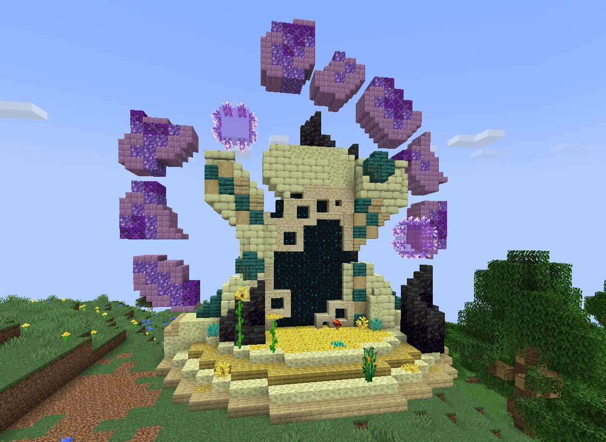

# 🟥 Donjon Mythique

## 💠 <mark style="color:green;"> Caractéristiques 📋</mark>

👪 Nombre de joueurs accueillis : <mark style="color:green;">**1 à 10 joueurs**</mark>  
📈 Niveau de classe minimum : <mark style="color:green;">**Classe niveau 50**</mark>  
🕓 Durée du donjon : <mark style="color:green;">**60 minutes**</mark>  

## 💠 <mark style="color:green;"> Aperçu du portail 👁‍🗨</mark>

<table border="1" cellspacing="0" cellpadding="6">
  <tr>
    <td><mark style="color:green;"><strong>Aperçu du Donjon 📸</strong></mark></td>
  </tr>
  <tr>
    <td><figure></figure></td>
  </tr>
</table>

## 💠 <mark style="color:blue;"> Statistiques détaillées 📊</mark>

### 📊 Valeurs unitaires

<table border="1" cellspacing="0" cellpadding="8">
  <tr style="background-color: #e3f2fd;">
    <th><strong>Type d’ennemi</strong></th>
    <th><strong>XP par ennemi</strong></th>
  </tr>
  <tr>
    <td>🧟‍♂️ <strong>Mob Normal</strong></td>
    <td><mark style="color:green;"><strong>100 XP</strong></mark></td>
  </tr>
  <tr>
    <td>👽 <strong>Mini Boss</strong></td>
    <td><mark style="color:yellow;"><strong>10 000 XP</strong></mark></td>
  </tr>
  <tr>
    <td>🐉 <strong>Boss Final</strong></td>
    <td><mark style="color:red;"><strong>20 000 XP</strong></mark></td>
  </tr>
</table>

### 📋 Structure du donjon

Le donjon est composé de **2 salles** (mobs + mini boss) suivies de **1 salle boss finale**. La structure est **fixe**.

<table border="1" cellspacing="0" cellpadding="8">
  <tr style="background-color: #e3f2fd;">
    <th><strong>Type de salle</strong></th>
    <th><strong>Nombre</strong></th>
    <th><strong>Composition</strong></th>
    <th><strong>XP par salle</strong></th>
  </tr>
  <tr>
    <td>🟡 <strong>Salle Mobs + Mini Boss</strong></td>
    <td>2 salles (fixe)</td>
    <td>120 mobs + 1 mini boss</td>
    <td><mark style="color:yellow;"><strong>22 000 XP</strong></mark></td>
  </tr>
  <tr>
    <td>🔴 <strong>Salle Boss Final</strong></td>
    <td>1 salle (toujours)</td>
    <td>1 boss</td>
    <td><mark style="color:red;"><strong>20 000 XP</strong></mark></td>
  </tr>
</table>

<table border="1" cellspacing="0" cellpadding="8">
  <tr style="background-color: #e8f5e9;">
    <th><strong>XP Total du donjon</strong></th>
  </tr>
  <tr>
    <td><mark style="color:green;"><strong>64 000 XP</strong></mark> <small>2 × 22 000 + 20 000</small></td>
  </tr>
</table>

## 💠 <mark style="color:green;">Récompenses 🎁</mark>

|                                                                                       |
|:-------------------------------------------------------------------------------------:|
| <mark style="color:red;"><strong>Carte Aléatoire de Classe Épique</strong></mark>     |
| <mark style="color:red;"><strong>Carte Aléatoire de Classe Légendaire</strong></mark> |
| <mark style="color:red;"><strong>Parchemin Expert</strong></mark>                     |
| <mark style="color:red;"><strong>Parchemin Impossible</strong></mark>                 |
| <mark style="color:red;"><strong>300 000 💲</strong></mark>                            |
| <mark style="color:red;"><strong>750 000 💲</strong></mark>                            |
| <mark style="color:red;"><strong>1 000 000 💲</strong></mark>                          |
| <mark style="color:red;"><strong>Cristaux de donjon Mythique</strong></mark>          |
| <mark style="color:red;"><strong>2 Bonbons au Raisin</strong></mark>                  |      
| <mark style="color:red;"><strong>Plume de Phoenix</strong></mark>                     |
| <mark style="color:red;"><strong>Item Évolutif Aléatoire</strong></mark>              |
| <mark style="color:red;"><strong>Pet Donjon (Boss Uniquement)</strong></mark>         |
| <mark style="color:red;"><strong>Clé Aléatoire</strong></mark>                        |
| <mark style="color:red;"><strong>Pied Droit du T-Rex (Musée)</strong></mark>          |
| <mark style="color:red;"><strong>Pied Gauche du T-Rex (Musée)</strong></mark>         |
| <mark style="color:red;"><strong>Colonne Vertébrale du T-Rex (Musée)</strong></mark>  |
| <mark style="color:red;"><strong>Bras Droit du T-Rex (Musée)</strong></mark>          |
| <mark style="color:red;"><strong>Bras Gauche du T-Rex (Musée)</strong></mark>         |
| <mark style="color:red;"><strong>Main Gauche du T-Rex (Musée)</strong></mark>         |

