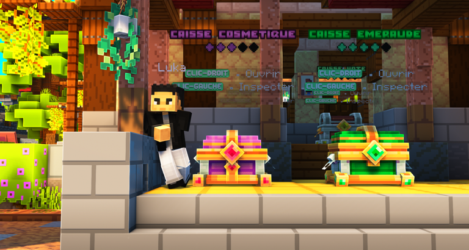

# 🍬 <mark style="color:green;">**Les bonbons**</mark>

Les <mark style="color:green;">**bonbons**</mark> servent à <mark style="color:green;">**faire progresser vos familiers (pets)**</mark>.  
En augmentant leur niveau, ils vous offrent des <mark style="color:green;">**avantages variés**</mark> comme plus d’<mark style="color:green;">**argent toutes les heures**</mark>, des <mark style="color:green;">**bonus de métiers**</mark>, des <mark style="color:green;">**réductions sur la vente d’items**</mark> ou encore des <mark style="color:green;">**effets spéciaux**</mark> pouvant vous aider tout au long de l’aventure.  

Ces <mark style="color:green;">**bonbons**</mark> existent en **5 raretés différentes**. Plus la rareté est élevée, plus ils donnent d’<mark style="color:green;">**XP**</mark> :  
* <mark style="color:green;">**Bonbon à la Pomme 🍏**</mark> _( +6 XP )_  
* <mark style="color:yellow;">**Bonbon à l’Orange 🍊**</mark> _( +12 XP )_  
* <mark style="color:blue;">**Bonbon à la Myrtille 🔵**</mark> _( +24 XP )_  
* <mark style="color:purple;">**Bonbon aux Raisins 🍇**</mark> _( +32 XP )_  
* <mark style="color:red;">**Bonbon à la Fraise 🍓**</mark> _( +50 XP )_  

## 💠 Où en obtenir ? 📌

### 🔸 Les <mark style="color:green;">**caisses**</mark>  
En ouvrant les <mark style="color:green;">**boxs Émeraude, Rubis, Évènements ou Jackpot**</mark>, vous avez une petite chance d’obtenir des <mark style="color:green;">**bonbons**</mark>.

<figure><figcaption>
<strong>Emplacement des <mark style="color:green;">caisses</mark></strong>
</figcaption></figure>

### 🔸 Les <mark style="color:green;">**parchemins**</mark>  
En complétant certains <mark style="color:green;">**parchemins**</mark>, vous pouvez recevoir des <mark style="color:green;">**bonbons**</mark> comme récompense.  


**🔍 REMARQUE :** Pour savoir quels <mark style="color:green;">**parchemins**</mark> peuvent offrir des <mark style="color:green;">**bonbons**</mark>, utilisez la commande <mark style="color:green;">**`/quest`**</mark> puis cliquez sur **"Parchemins"**.


<figure><figcaption>
<strong>Menu des <mark style="color:green;">quêtes</mark></strong>
</figcaption></figure>

### 🔸 Les <mark style="color:green;">**récompenses de donjons**</mark>  
En éliminant le <mark style="color:green;">**boss d’un donjon**</mark>, vous obtenez l’accès à des coffres remplis de <mark style="color:green;">**récompenses**</mark>.  
Parmi celles-ci, vous pouvez parfois trouver des <mark style="color:green;">**bonbons**</mark>.  


**🔍 REMARQUE :** Consultez la page des [<mark style="color:green;">**donjons 🏛️**</mark>](https://wiki.evolucraft.fr/le-gameplay/les-donjons) pour découvrir les différents <mark style="color:green;">**types de récompenses**</mark> et ainsi savoir quels <mark style="color:green;">**bonbons**</mark> vous pouvez obtenir.


<figure><figcaption>
<strong>Aperçu des coffres de <mark style="color:green;">récompenses de donjons</mark></strong>
</figcaption></figure>

### 🔸 Le <mark style="color:green;">**`/boutique`**</mark>  
Chaque jour, à <mark style="color:green;">**minuit**</mark>, la <mark style="color:green;">**boutique du jour**</mark> propose **5 articles**, dont **2 gratuits** (1 accessible uniquement avec le [<mark style="color:green;">**Premium 👑**</mark>](https://wiki.evolucraft.fr/le-gameplay/les-grades#abonnement-premium)).  
Parmi les **3 lots achetables** avec des <mark style="color:green;">**Gemmes**</mark>, il est possible d’y trouver des <mark style="color:green;">**bonbons**</mark>.  

Voici les prix :  
* Lot de <mark style="color:green;">**2 Bonbons à la Pomme 🍏**</mark> : **25 Gemmes 💎**  
* Lot de <mark style="color:yellow;">**2 Bonbons à l’Orange 🍊**</mark> : **50 Gemmes 💎**  
* Lot de <mark style="color:blue;">**2 Bonbons à la Myrtille 🔵**</mark> : **100 Gemmes 💎**  
* Lot de <mark style="color:purple;">**2 Bonbons aux Raisins 🍇**</mark> : **150 Gemmes 💎**  
* Lot de <mark style="color:red;">**2 Bonbons à la Fraise 🍓**</mark> : **200 Gemmes 💎**  

## 💠 Combien de <mark style="color:green;">**bonbons**</mark> faut-il ? 🤔  

Voici le tableau indiquant le <mark style="color:green;">**nombre d’XP requis par niveau**</mark> et le <mark style="color:green;">**nombre de bonbons nécessaires**</mark> en fonction de la <mark style="color:green;">**rareté de votre compagnon**</mark>.  

### 🔸 Tableau <mark style="color:green;">**XP demandée par compagnon**</mark> selon sa <mark style="color:green;">**rareté**</mark> 📈

<table border="1" cellspacing="0" cellpadding="6">
  <tr>
    <td><mark style="color:white;"><strong>Niveau actuel📊</strong></mark></td>
    <td><mark style="color:green;"><strong>Compagnon Commun 🐸</strong></mark></td>
    <td><mark style="color:yellow;"><strong>Compagnon Rare 🐤</strong></mark></td>
    <td><mark style="color:blue;"><strong>Compagnon Épique 🐟</strong></mark></td>
    <td><mark style="color:purple;"><strong>Compagnon Légendaire 👾</strong></mark></td>
    <td><mark style="color:red;"><strong>Compagnon Mythique 🦞</strong></mark></td>
  </tr>
  <tr>
    <td><mark style="color:white;"><strong>Niveau 1</strong></mark></td>
    <td><mark style="color:green;"><strong>32 xp</strong></mark></td>
    <td><mark style="color:yellow;"><strong>34 xp</strong></mark></td>
    <td><mark style="color:blue;"><strong>36 xp</strong></mark></td>
    <td><mark style="color:pruple;"><strong>38 xp</strong></mark></td>
    <td><mark style="color:red;"><strong>40 xp</strong></mark></td>
  </tr>
  <tr>
    <td><mark style="color:white;"><strong>Niveau 2</strong></mark></td>
    <td><mark style="color:green;"><strong>33 xp</strong></mark></td>
    <td><mark style="color:yellow;"><strong>35 xp</strong></mark></td>
    <td><mark style="color:blue;"><strong>37 xp</strong></mark></td>
    <td><mark style="color:purple;"><strong>39 xp</strong></mark></td>
    <td><mark style="color:red;"><strong>41 xp</strong></mark></td>
  </tr>
  <tr>
    <td><mark style="color:white;"><strong>Niveau 3</strong></mark></td>
    <td><mark style="color:green;"><strong>36 xp</strong></mark></td>
    <td><mark style="color:yellow;"><strong>38 xp</strong></mark></td>
    <td><mark style="color:blue;"><strong>40 xp</strong></mark></td>
    <td><mark style="color:purple;"><strong>42 xp</strong></mark></td>
    <td><mark style="color:red;"><strong>44 xp</strong></mark></td>
  </tr>
  <tr>
    <td><mark style="color:white;"><strong>Niveau 4</strong></mark></td>
    <td><mark style="color:green;"><strong>41 xp</strong></mark></td>
    <td><mark style="color:yellow;"><strong>43 xp</strong></mark></td>
    <td><mark style="color:blue;"><strong>45 xp</strong></mark></td>
    <td><mark style="color:purple;"><strong>47 xp</strong></mark></td>
    <td><mark style="color:red;"><strong>49 xp</strong></mark></td>
  </tr>
  <tr>
    <td><mark style="color:white;"><strong>Niveau 5</strong></mark></td>
    <td><mark style="color:green;"><strong>48 xp</strong></mark></td>
    <td><mark style="color:yellow;"><strong>50 xp</strong></mark></td>
    <td><mark style="color:blue;"><strong>52 xp</strong></mark></td>
    <td><mark style="color:purple;"><strong>54 xp</strong></mark></td>
    <td><mark style="color:red;"><strong>56 xp</strong></mark></td>
  </tr>
  <tr>
    <td><mark style="color:white;"><strong>Niveau 6</strong></mark></td>
    <td><mark style="color:green;"><strong>57 xp</strong></mark></td>
    <td><mark style="color:yellow;"><strong>59 xp</strong></mark></td>
    <td><mark style="color:blue;"><strong>61 xp</strong></mark></td>
    <td><mark style="color:purple;"><strong>63 xp</strong></mark></td>
    <td><mark style="color:red;"><strong>65 xp</strong></mark></td>
  </tr>
  <tr>
    <td><mark style="color:white;"><strong>Niveau 7</strong></mark></td>
    <td><mark style="color:green;"><strong>68 xp</strong></mark></td>
    <td><mark style="color:yellow;"><strong>70 xp</strong></mark></td>
    <td><mark style="color:blue;"><strong>72 xp</strong></mark></td>
    <td><mark style="color:purple;"><strong>74 xp</strong></mark></td>
    <td><mark style="color:red;"><strong>76 xp</strong></mark></td>
  </tr>
  <tr>
    <td><mark style="color:white;"><strong>Niveau 8</strong></mark></td>
    <td><mark style="color:green;"><strong>81 xp</strong></mark></td>
    <td><mark style="color:yellow;"><strong>83 xp</strong></mark></td>
    <td><mark style="color:blue;"><strong>85 xp</strong></mark></td>
    <td><mark style="color:purple;"><strong>87 xp</strong></mark></td>
    <td><mark style="color:red;"><strong>89 xp</strong></mark></td>
  </tr>
  <tr>
    <td><mark style="color:white;"><strong>Niveau 9</strong></mark></td>
    <td><mark style="color:green;"><strong>96 xp</strong></mark></td>
    <td><mark style="color:yellow;"><strong>98 xp</strong></mark></td>
    <td><mark style="color:blue;"><strong>100 xp</strong></mark></td>
    <td><mark style="color:purple;"><strong>102 xp</strong></mark></td>
    <td><mark style="color:red;"><strong>104 xp</strong></mark></td>
  </tr>
  <tr>
    <td><mark style="color:white;"><strong>Niveau 10</strong></mark></td>
    <td><mark style="color:green;"><strong>113 xp</strong></mark></td>
    <td><mark style="color:yellow;"><strong>115 xp</strong></mark></td>
    <td><mark style="color:blue;"><strong>117 xp</strong></mark></td>
    <td><mark style="color:purple;"><strong>119 xp</strong></mark></td>
    <td><mark style="color:red;"><strong>121 xp</strong></mark></td>
  </tr>
  <tr>
    <td><mark style="color:white;"><strong>Niveau 11</strong></mark></td>
    <td><mark style="color:green;"><strong>132 xp</strong></mark></td>
    <td><mark style="color:yellow;"><strong>134 xp</strong></mark></td>
    <td><mark style="color:blue;"><strong>136 xp</strong></mark></td>
    <td><mark style="color:purple;"><strong>138 xp</strong></mark></td>
    <td><mark style="color:red;"><strong>140 xp</strong></mark></td>
  </tr>
  <tr>
    <td><mark style="color:white;"><strong>Niveau 12</strong></mark></td>
    <td><mark style="color:green;"><strong>153 xp</strong></mark></td>
    <td><mark style="color:yellow;"><strong>155 xp</strong></mark></td>
    <td><mark style="color:blue;"><strong>157 xp</strong></mark></td>
    <td><mark style="color:purple;"><strong>159 xp</strong></mark></td>
    <td><mark style="color:red;"><strong>161 xp</strong></mark></td>
  </tr>
  <tr>
    <td><mark style="color:white;"><strong>Niveau 13</strong></mark></td>
    <td><mark style="color:green;"><strong>176 xp</strong></mark></td>
    <td><mark style="color:yellow;"><strong>178 xp</strong></mark></td>
    <td><mark style="color:blue;"><strong>180 xp</strong></mark></td>
    <td><mark style="color:purple;"><strong>182 xp</strong></mark></td>
    <td><mark style="color:red;"><strong>184 xp</strong></mark></td>
  </tr>
  <tr>
    <td><mark style="color:white;"><strong>Niveau 14</strong></mark></td>
    <td><mark style="color:green;"><strong>201 xp</strong></mark></td>
    <td><mark style="color:yellow;"><strong>203 xp</strong></mark></td>
    <td><mark style="color:blue;"><strong>205 xp</strong></mark></td>
    <td><mark style="color:purple;"><strong>207 xp</strong></mark></td>
    <td><mark style="color:red;"><strong>209 xp</strong></mark></td>
  </tr>
  <tr>
    <td><mark style="color:white;"><strong>Niveau 15</strong></mark></td>
    <td><mark style="color:green;"><strong>228 xp</strong></mark></td>
    <td><mark style="color:yellow;"><strong>230 xp</strong></mark></td>
    <td><mark style="color:blue;"><strong>232 xp</strong></mark></td>
    <td><mark style="color:purple;"><strong>234 xp</strong></mark></td>
    <td><mark style="color:red;"><strong>236 xp</strong></mark></td>
  </tr>
  <tr>
    <td><mark style="color:white;"><strong>Niveau 16</strong></mark></td>
    <td><mark style="color:green;"><strong>257 xp</strong></mark></td>
    <td><mark style="color:yellow;"><strong>259 xp</strong></mark></td>
    <td><mark style="color:blue;"><strong>261 xp</strong></mark></td>
    <td><mark style="color:purple;"><strong>263 xp</strong></mark></td>
    <td><mark style="color:red;"><strong>265 xp</strong></mark></td>
  </tr>
  <tr>
    <td><mark style="color:white;"><strong>Niveau 17</strong></mark></td>
    <td><mark style="color:green;"><strong>288 xp</strong></mark></td>
    <td><mark style="color:yellow;"><strong>290 xp</strong></mark></td>
    <td><mark style="color:blue;"><strong>292 xp</strong></mark></td>
    <td><mark style="color:purple;"><strong>294 xp</strong></mark></td>
    <td><mark style="color:red;"><strong>296 xp</strong></mark></td>
  </tr>
  <tr>
    <td><mark style="color:white;"><strong>Niveau 18</strong></mark></td>
    <td><mark style="color:green;"><strong>321 xp</strong></mark></td>
    <td><mark style="color:yellow;"><strong>323 xp</strong></mark></td>
    <td><mark style="color:blue;"><strong>325 xp</strong></mark></td>
    <td><mark style="color:purple;"><strong>327 xp</strong></mark></td>
    <td><mark style="color:red;"><strong>329 xp</strong></mark></td>
  </tr>
  <tr>
    <td><mark style="color:white;"><strong>Niveau 19</strong></mark></td>
    <td><mark style="color:green;"><strong>356 xp</strong></mark></td>
    <td><mark style="color:yellow;"><strong>358 xp</strong></mark></td>
    <td><mark style="color:blue;"><strong>360 xp</strong></mark></td>
    <td><mark style="color:purple;"><strong>362 xp</strong></mark></td>
    <td><mark style="color:red;"><strong>364 xp</strong></mark></td>
  </tr>
  <tr>
    <td><mark style="color:white;"><strong>Total</strong></mark></td>
    <td><mark style="color:green;"><strong>2 717 xp</strong></mark></td>
    <td><mark style="color:yellow;"><strong>2 755 xp</strong></mark></td>
    <td><mark style="color:blue;"><strong>2 793 xp</strong></mark></td>
    <td><mark style="color:purple;"><strong>2 831 xp</strong></mark></td>
    <td><mark style="color:red;"><strong>2 869 xp</strong></mark></td>
  </tr>
</table>

### 🔸 <mark style="color:green;">**Nombre total de bonbons**</mark> nécessaires pour <mark style="color:green;">**monter un compagnon au niveau maximum**</mark> selon sa <mark style="color:green;">**rareté**</mark> 📉
<table border="1" cellspacing="0" cellpadding="6">
  <tr>
    <td><mark style="color:white;"><strong>Type de bonbon 🍬 </strong></mark></td>
    <td><mark style="color:green;"><strong>Compagnon Commun 🐸</strong></mark></td>
    <td><mark style="color:yellow;"><strong>Compagnon Rare 🐤</strong></mark></td>
    <td><mark style="color:blue;"><strong>Compagnon Épique 🐟</strong></mark></td>
    <td><mark style="color:purple;"><strong>Compagnon Légendaire 👾</strong></mark></td>
    <td><mark style="color:red;"><strong>Compagnon Mythique 🦞</strong></mark></td>
  </tr>
  <tr>
    <td><mark style="color:green;"><strong>Bonbons à la Pomme 🍏</strong></mark></td>
    <td>
     
<mark style="color:green;"><strong>453 bonbons</strong></mark>

     
<mark style="color:white;"><strong>(7 stacks et 5 bonbons)</strong></mark>

    </td>
    <td>
     
<mark style="color:green;"><strong>460 bonbons</strong></mark>

     
<mark style="color:white;"><strong>(7 stacks et 12 bonbons)</strong></mark>

    </td>
    <td>
     
<mark style="color:green;"><strong>466 bonbons</strong></mark>

     
<mark style="color:white;"><strong>(7 stacks et 18 bonbons)</strong></mark>

    </td>
    <td>
     
<mark style="color:green;"><strong>472 bonbons</strong></mark>

     
<mark style="color:white;"><strong>(7 stacks et 24 bonbons)</strong></mark>

    </td>
    <td>
     
<mark style="color:green;"><strong>479 bonbons</strong></mark>

     
<mark style="color:white;"><strong>(7 stacks et 31 bonbons)</strong></mark>

    </td>
  </tr>
  <tr>
    <td><mark style="color:orange;"><strong>Bonbons à l’Orange 🍊</strong></mark></td>
    <td>
     
<mark style="color:orange;"><strong>227 bonbons</strong></mark>

     
<mark style="color:white;"><strong>(3 stacks et 35 bonbons)</strong></mark>

    </td>
    <td>
     
<mark style="color:orange;"><strong>230 bonbons</strong></mark>

     
<mark style="color:white;"><strong>(3 stacks et 38 bonbons)</strong></mark>

    </td>
    <td>
     
<mark style="color:orange;"><strong>233 bonbons</strong></mark>

     
<mark style="color:white;"><strong>(3 stacks et 41 bonbons)</strong></mark>

    </td>
    <td>
     
<mark style="color:orange;"><strong>236 bonbons</strong></mark>

     
<mark style="color:white;"><strong>(3 stacks et 44 bonbons)</strong></mark>

    </td>
    <td>
     
<mark style="color:orange;"><strong>240 bonbons</strong></mark>

     
<mark style="color:white;"><strong>(3 stacks et 48 bonbons)</strong></mark>

    </td>
  </tr>
  <tr>
    <td><mark style="color:blue;"><strong>Bonbons à la Myrtille 🔵</strong></mark></td>
    <td>
     
<mark style="color:blue;"><strong>114 bonbons</strong></mark>

     
<mark style="color:white;"><strong>(1 stack et 50 bonbons)</strong></mark>

    </td>
    <td>
     
<mark style="color:blue;"><strong>115 bonbons</strong></mark>

     
<mark style="color:white;"><strong>(1 stack et 51 bonbons)</strong></mark>

    </td>
    <td>
     
<mark style="color:blue;"><strong>117 bonbons</strong></mark>

     
<mark style="color:white;"><strong>(1 stack et 53 bonbons)</strong></mark>

    </td>
    <td>
     
<mark style="color:blue;"><strong>119 bonbons</strong></mark>

     
<mark style="color:white;"><strong>(1 stack et 55 bonbons)</strong></mark>

    </td>
    <td>
     
<mark style="color:blue;"><strong>120 bonbons</strong></mark>

     
<mark style="color:white;"><strong>(1 stack et 56 bonbons)</strong></mark>

    </td>
  </tr>
  <tr>
    <td><mark style="color:purple;"><strong>Bonbons aux Raisins 🍇</strong></mark></td>
    <td>
     
<mark style="color:purple;"><strong>85 bonbons</strong></mark>

     
<mark style="color:white;"><strong>(1 stack et 21 bonbons)</strong></mark>

    </td>
    <td>
     
<mark style="color:purple;"><strong>87 bonbons</strong></mark>

     
<mark style="color:white;"><strong>(1 stack et 23 bonbons)</strong></mark>

    </td>
    <td>
     
<mark style="color:purple;"><strong>88 bonbons</strong></mark>

     
<mark style="color:white;"><strong>(1 stack et 24 bonbons)</strong></mark>

    </td>
    <td>
     
<mark style="color:purple;"><strong>89 bonbons</strong></mark>

     
<mark style="color:white;"><strong>(1 stack et 25 bonbons)</strong></mark>

    </td>
    <td>
     
<mark style="color:purple;"><strong>90 bonbons</strong></mark>

     
<mark style="color:white;"><strong>(1 stack et 26 bonbons)</strong></mark>

    </td>
  </tr>
  <tr>
    <td><mark style="color:red;"><strong>Bonbons à la Fraise 🍓</strong></mark></td>
    <td><mark style="color:red;"><strong>55 bonbons</strong></mark></td>
    <td><mark style="color:red;"><strong>56 bonbons</strong></mark></td>
    <td><mark style="color:red;"><strong>56 bonbons</strong></mark></td>
    <td><mark style="color:red;"><strong>57 bonbons</strong></mark></td>
    <td><mark style="color:red;"><strong>58 bonbons</strong></mark></td>
  </tr>
</table>
