# 🐸 Compagnon Commun

## 💠 La liste des compagnons communs

<table border="1" cellspacing="0" cellpadding="6">
  <tr>
    <td><mark style="color:green;"><strong>Nom 🏷️</strong></mark></td>
    <td><mark style="color:green;"><strong>Image de l'item 🖼️</strong></mark></td>
    <td><mark style="color:green;"><strong>Avantages 💪</strong></mark></td>
    <td><mark style="color:green;"><strong>Obtentions 🔍</strong></mark></td>
  </tr>
  <tr>
    <td><mark style="color:green;"><strong>Meow</strong></mark></td>
    <td>
      
<figure>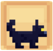</figure>

      
<figure>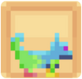</figure>

    </td>
    <td>
     
<mark style="color:green;"><strong>Niveau 1</strong></mark> → <mark style="color:green;"><strong>+ 1.000</strong></mark> 💲/h

     
<mark style="color:green;"><strong>Niveau 5</strong></mark> → <mark style="color:green;"><strong>🏃‍♂️ Vitesse</strong></mark> +2

     
<mark style="color:green;"><strong>Niveau 10</strong></mark> → <mark style="color:green;"><strong>Vision Nocturne</strong></mark>

     
<mark style="color:green;"><strong>Niveau 15</strong></mark> → <mark style="color:green;"><strong>+ 1.500</strong></mark> 💲/h

     
<mark style="color:green;"><strong>Niveau 20</strong></mark> → <mark style="color:green;"><strong>+2,5%</strong></mark> d'EXP <mark style="color:green;"><strong>Chasseur 🗡️</strong></mark>

    </td>
    <td>
     
* Œuf de familier (Caisse Émeraude ✳️)

     
* Œuf de familier Commun (Palier 7 de vote)

    </td>
  </tr>
  <tr>
    <td><mark style="color:green;"><strong>Duck</strong></mark></td>
    <td>
      
<figure>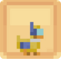</figure>

      
<figure>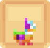</figure>

    </td>
    <td>
     
<mark style="color:green;"><strong>Niveau 1</strong></mark> → <mark style="color:green;"><strong>Respiration</strong></mark>

     
<mark style="color:green;"><strong>Niveau 5</strong></mark> → <mark style="color:green;"><strong>+ 1.250</strong></mark> 💲/h

     
<mark style="color:green;"><strong>Niveau 10</strong></mark> → <mark style="color:green;"><strong>Grâce du dauphin</strong></mark>

     
<mark style="color:green;"><strong>Niveau 15</strong></mark> → <mark style="color:green;"><strong>💀 Dégâts Critiques</strong></mark> +1

     
<mark style="color:green;"><strong>Niveau 20</strong></mark> → <mark style="color:green;"><strong>+2,5%</strong></mark> d'EXP <mark style="color:green;"><strong>Pêcheur 🎣</strong></mark>
 
    </td>
    <td>
     
* Œuf de familier (Caisse Émeraude ✳️)

     
* Œuf de familier Commun (Palier 7 de vote)

    </td>
  </tr>
  <tr>
    <td><mark style="color:green;"><strong>Lapinou</strong></mark></td>
    <td>
      
<figure>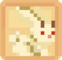</figure>

      
<figure>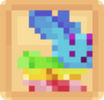</figure>

    </td>
    <td>
     
<mark style="color:green;"><strong>Niv. 1</strong></mark> → <mark style="color:green;"><strong>🧪 Mana</strong></mark> +10

     
<mark style="color:green;"><strong>Niv. 5</strong></mark> → <mark style="color:green;"><strong>+2,5%</strong></mark> d'EXP <mark style="color:green;"><strong>ForgeMage 📖</strong></mark>

     
<mark style="color:green;"><strong>Niv. 10</strong></mark> → <mark style="color:green;"><strong>+ 1.000</strong></mark> 💲/h

     
<mark style="color:green;"><strong>Niv. 15</strong></mark> → <mark style="color:green;"><strong>+50%</strong></mark> sur la vente de <mark style="color:green;"><strong>Pattes de lapin</strong></mark> au /shop

     
<mark style="color:green;"><strong>Niv. 20</strong></mark> → <mark style="color:green;"><strong>+ 1.000</strong></mark> 💲/h
  
    </td>
    <td>
     
* Œuf de familier (Caisse Émeraude ✳️)

     
* Œuf de familier Commun (Palier 7 de vote)

    </td>
  </tr>
  <tr>
    <td><mark style="color:green;"><strong>Nugget</strong></mark></td>
    <td>
      
<figure></figure>

      
<figure></figure>

    </td>
    <td>
     
<mark style="color:green;"><strong>Niv. 1</strong></mark> → <mark style="color:green;"><strong>❤️ Vie</strong></mark> +5

     
<mark style="color:green;"><strong>Niv. 5</strong></mark> → <mark style="color:green;"><strong>+ 1.000</strong></mark> 💲/h

     
<mark style="color:green;"><strong>Niv. 10</strong></mark> → <mark style="color:green;"><strong>+2,5%</strong></mark> d'EXP <mark style="color:green;"><strong>Bûcheron 🪚</strong></mark>

     
<mark style="color:green;"><strong>Niv. 15</strong></mark> → <mark style="color:green;"><strong>+ 2.000</strong></mark> 💲/h

     
<mark style="color:green;"><strong>Niv. 20</strong></mark> → <mark style="color:green;"><strong>🛡️ Défense</strong></mark> +2

    </td>
    <td>
     
* Œuf de familier (Caisse Émeraude ✳️)

     
* Œuf de familier Commun (Palier 7 de vote)

    </td>
  </tr>
  <tr>
    <td><mark style="color:green;"><strong>Pike</strong></mark></td>
    <td>
      
<figure></figure>

      
<figure></figure>

    </td>
    <td>
     
<mark style="color:green;"><strong>Niv. 1</strong></mark> → <mark style="color:green;"><strong>+50%</strong></mark> sur la vente de <mark style="color:green;"><strong>Cactus</strong></mark> au /shop

     
<mark style="color:green;"><strong>Niv. 5</strong></mark> → <mark style="color:green;"><strong>+ 2.500</strong></mark> 💲/h

     
<mark style="color:green;"><strong>Niv. 10</strong></mark> → <mark style="color:green;"><strong>Épines 1</strong></mark>

     
<mark style="color:green;"><strong>Niv. 15</strong></mark> → <mark style="color:green;"><strong>+2,5%</strong></mark> d'EXP <mark style="color:green;"><strong>Fermier 🌾</strong></mark>

     
<mark style="color:green;"><strong>Niv. 20</strong></mark> → <mark style="color:green;"><strong>🏃‍♂️ Vitesse</strong></mark> +1
  
    </td>
    <td>
     
* Œuf de familier (Caisse Émeraude ✳️)

     
* Œuf de familier Commun (Palier 7 de vote)

    </td>
  </tr>
  <tr>
    <td><mark style="color:green;"><strong>Surt</strong></mark></td>
    <td>
      
<figure>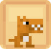</figure>

      
<figure>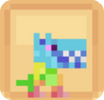</figure>

    </td>
    <td>
     
<mark style="color:green;"><strong>Niv. 1</strong></mark> → <mark style="color:green;"><strong>+ 2.000</strong></mark> 💲/h

     
<mark style="color:green;"><strong>Niv. 5</strong></mark> → <mark style="color:green;"><strong>+25%</strong></mark> sur la vente de <mark style="color:green;"><strong>Chair putréfiées</strong></mark> au /shop

     
<mark style="color:green;"><strong>Niv. 10</strong></mark> → <mark style="color:green;"><strong>+10%</strong></mark> de chance <mark style="color:green;"><strong>d'enflammer les ennemis</strong></mark>

     
<mark style="color:green;"><strong>Niv. 15</strong></mark> → <mark style="color:green;"><strong>+2,5%</strong></mark> d'EXP <mark style="color:green;"><strong>Mineur ⛏️</strong></mark>

     
<mark style="color:green;"><strong>Niv. 20</strong></mark> → <mark style="color:green;"><strong>Célérité 1</strong></mark>

    </td>
    <td>
     
* Œuf de familier (Caisse Émeraude ✳️)

     
* Œuf de familier Commun (Palier 7 de vote)

    </td>
  </tr>
  <tr>
    <td><mark style="color:green;"><strong>Potato</strong></mark></td>
    <td><figure>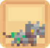</figure></td>
    <td>
     
<mark style="color:green;"><strong>Niv. 1</strong></mark> → <mark style="color:green;"><strong>+10%</strong></mark> sur la vente de <mark style="color:green;"><strong>Betterave</strong></mark> chez Jimmy

     
<mark style="color:green;"><strong>Niv. 5</strong></mark> → <mark style="color:green;"><strong>+ 1.000</strong></mark> 💲/h

     
<mark style="color:green;"><strong>Niv. 10</strong></mark> → <mark style="color:green;"><strong>Monture</strong></mark> (Terrestre)

     
<mark style="color:green;"><strong>Niv. 15</strong></mark> → <mark style="color:green;"><strong>🧪 Mana</strong></mark> +15

     
<mark style="color:green;"><strong>Niv. 20</strong></mark> → <mark style="color:green;"><strong>Célérité 1</strong></mark>
 
    </td>
    <td>* Œuf de famillier (Caisse Draconique 🐉)</td>
  </tr>
  <tr>
    <td><mark style="color:green;"><strong>Coka</strong></mark></td>
    <td><figure>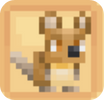</figure></td>
    <td>
     
<mark style="color:green;"><strong>Niv. 1</strong></mark> → <mark style="color:green;"><strong>+ 1.500</strong></mark> 💲/h

     
<mark style="color:green;"><strong>Niv. 5</strong></mark> → <mark style="color:green;"><strong>Vision Nocturne</strong></mark>

     
<mark style="color:green;"><strong>Niv. 10</strong></mark> → <mark style="color:green;"><strong>🧪 Mana</strong></mark> +20

     
<mark style="color:green;"><strong>Niv. 15</strong></mark> → <mark style="color:green;"><strong>+ 1.500</strong></mark> 💲/h

     
<mark style="color:green;"><strong>Niv. 20</strong></mark> → <mark style="color:green;"><strong>+2,5%</strong></mark> d'EXP <mark style="color:green;"><strong>ForgeMage 📖</strong></mark>
   
    </td>
    <td>* Œuf de famillier (Caisse aux Trésors 🏴‍☠️)</td>
  </tr>
  <tr>
    <td><mark style="color:green;"><strong>The Reaper</strong></mark></td>
    <td><figure></figure></td>
    <td>
     
<mark style="color:green;"><strong>Niv. 1</strong></mark> → <mark style="color:green;"><strong>+5%</strong></mark> sur la vente de <mark style="color:green;"><strong>Citrouille</strong></mark> au /shop

     
<mark style="color:green;"><strong>Niv. 5</strong></mark> → <mark style="color:green;"><strong>+ 1.000</strong></mark> 💲/h

     
<mark style="color:green;"><strong>Niv. 10</strong></mark> → <mark style="color:green;"><strong>🛡️ Défense</strong></mark> +2

     
<mark style="color:green;"><strong>Niv. 15</strong></mark> → <mark style="color:green;"><strong>+ 1.000</strong></mark> 💲/h

     
<mark style="color:green;"><strong>Niv. 20</strong></mark> → <mark style="color:green;"><strong>💕 Régénération</strong></mark> +1
  
    </td>
    <td>* Œuf de famillier (Caisse Halloween 🎃)</td>
  </tr>
  <tr>
    <td><mark style="color:green;"><strong>Olaf</strong></mark></td>
    <td><figure></figure></td>
    <td>
     
<mark style="color:green;"><strong>Niv. 1</strong></mark> → <mark style="color:green;"><strong>+5%</strong></mark> sur la vente de <mark style="color:green;"><strong>Diorite</strong></mark> au /shop

     
<mark style="color:green;"><strong>Niv. 5</strong></mark> → <mark style="color:green;"><strong>+ 1.000</strong></mark> 💲/h

     
<mark style="color:green;"><strong>Niv. 10</strong></mark> → <mark style="color:green;"><strong>+ 1.500</strong></mark> 💲/h

     
<mark style="color:green;"><strong>Niv. 15</strong></mark> → <mark style="color:green;"><strong>❤️ Vie</strong></mark> +7

     
<mark style="color:green;"><strong>Niv. 20</strong></mark> → <mark style="color:green;"><strong>+ 1.500</strong></mark> 💲/h

    </td>
    <td>* Œuf de famillier (Caisse Givrée ❄️)</td>
  </tr>
  <tr>
    <td><mark style="color:green;"><strong>Chimère</strong></mark></td>
    <td><figure>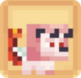</figure></td>
    <td>
     
<mark style="color:green;"><strong>Niv. 1</strong></mark> → <mark style="color:green;"><strong>+5%</strong></mark> sur la vente de <mark style="color:green;"><strong>Peau de Lapin</strong></mark> au /shop

     
<mark style="color:green;"><strong>Niv. 5</strong></mark> → <mark style="color:green;"><strong>+ 1.000</strong></mark> 💲/h

     
<mark style="color:green;"><strong>Niv. 10</strong></mark> → <mark style="color:green;"><strong>+ 1.500</strong></mark> 💲/h

     
<mark style="color:green;"><strong>Niv. 15</strong></mark> → <mark style="color:green;"><strong>🥊 Chance de Critique</strong></mark> +4

     
<mark style="color:green;"><strong>Niv. 20</strong></mark> → <mark style="color:green;"><strong>+2,5%</strong></mark> d'EXP <mark style="color:green;"><strong>Chasseur 🗡️</strong></mark>
  
    </td>
    <td>* Œuf de famillier (Caisse Saint Valentin 💕)</td>
  </tr>
  <tr>
    <td><mark style="color:green;"><strong>Cot-Cot</strong></mark></td>
    <td><figure></figure></td>
    <td>
     
<mark style="color:green;"><strong>Niv. 1</strong></mark> → <mark style="color:green;"><strong>+5%</strong></mark> sur la vente de <mark style="color:green;"><strong>Poulet Cru</strong></mark> au /shop

     
<mark style="color:green;"><strong>Niv. 5</strong></mark> → <mark style="color:green;"><strong>+ 1.500</strong></mark> 💲/h

     
<mark style="color:green;"><strong>Niv. 10</strong></mark> → <mark style="color:green;"><strong>🏃‍♂️ Vitesse</strong></mark> +3

     
<mark style="color:green;"><strong>Niv. 15</strong></mark> → <mark style="color:green;"><strong>+ 2.500</strong></mark> 💲/h

     
<mark style="color:green;"><strong>Niv. 20</strong></mark> → <mark style="color:green;"><strong>+2,5%</strong></mark> d'EXP <mark style="color:green;"><strong>Fermier 🌾</strong></mark>
  
    </td>
    <td>* Œuf de famillier (Caisse Pâques 2025 🥚)</td>
  </tr>
  <tr>
    <td><mark style="color:green;"><strong>Petite-Feuille</strong></mark></td>
    <td><figure></figure></td>
    <td>
     
<mark style="color:green;"><strong>Niv. 1</strong></mark> → <mark style="color:green;"><strong>+5%</strong></mark> sur la vente de <mark style="color:green;"><strong>Liane</strong></mark> au /shop

     
<mark style="color:green;"><strong>Niv. 5</strong></mark> → <mark style="color:green;"><strong>+ 1.250</strong></mark> 💲/h

     
<mark style="color:green;"><strong>Niv. 10</strong></mark> → <mark style="color:green;"><strong>🛡️ Défense</strong></mark> +3

     
<mark style="color:green;"><strong>Niv. 15</strong></mark> → <mark style="color:green;"><strong>+ 2.250</strong></mark> 💲/h

     
<mark style="color:green;"><strong>Niv. 20</strong></mark> → <mark style="color:green;"><strong>+2,5%</strong></mark> d'EXP <mark style="color:green;"><strong>Mineur ⛏️</strong></mark>
  
    </td>
    <td>* Œuf de famillier (Caisse Summer 🏖️)</td>
  </tr>
  <tr>
    <td><mark style="color:green;"><strong>Petit-Pied</strong></mark></td>
    <td><figure></figure></td>
    <td>
     
<mark style="color:green;"><strong>Niv. 1</strong></mark> → <mark style="color:green;"><strong>+5%</strong></mark> sur la vente de <mark style="color:green;"><strong>Pomme de Terre</strong></mark> au /shop

     
<mark style="color:green;"><strong>Niv. 5</strong></mark> → <mark style="color:green;"><strong>🛡️ Défense</strong></mark> +2

     
<mark style="color:green;"><strong>Niv. 10</strong></mark> → <mark style="color:green;"><strong>+ 1.250</strong></mark> 💲/h

     
<mark style="color:green;"><strong>Niv. 15</strong></mark> → <mark style="color:green;"><strong>+ 2.000</strong></mark> 💲/h

     
<mark style="color:green;"><strong>Niv. 20</strong></mark> → <mark style="color:green;"><strong>💕 Régénération</strong></mark> +1
  
    </td>
    <td>* Œuf de famillier (Caisse Antique 🗿)</td>
  </tr>
  <tr>
    <td><mark style="color:green;"><strong>Gardien</strong></mark></td>
    <td><figure></figure></td>
    <td>
     
<mark style="color:green;"><strong>Niv. 1</strong></mark> → <mark style="color:green;"><strong>+5%</strong></mark> sur la vente de <mark style="color:green;"><strong>Chêne pâle</strong></mark> au /shop

     
<mark style="color:green;"><strong>Niv. 5</strong></mark> → <mark style="color:green;"><strong>+ 1.000</strong></mark> 💲/h

     
<mark style="color:green;"><strong>Niv. 10</strong></mark> → <mark style="color:green;"><strong>🥊 Chance de Critique</strong></mark> +1

     
<mark style="color:green;"><strong>Niv. 15</strong></mark> → <mark style="color:green;"><strong>+ 1.750</strong></mark> 💲/h

     
<mark style="color:green;"><strong>Niv. 20</strong></mark> → <mark style="color:green;"><strong>+2,5%</strong></mark> d'EXP <mark style="color:green;"><strong>Bûcheron 🪚</strong></mark>
  
    </td>
    <td>* Œuf de famillier (Caisse Lune de Sang 🩸)</td>
  </tr>  
  <tr>
    <td><mark style="color:green;"><strong>Lutin</strong></mark></td>
    <td><figure></figure></td>
    <td>
     
<mark style="color:green;"><strong>Niv. 1</strong></mark> → <mark style="color:green;"><strong>+5%</strong></mark> sur la vente de <mark style="color:green;"><strong>Poisson globe</strong></mark> au /shop

     
<mark style="color:green;"><strong>Niv. 5</strong></mark> → <mark style="color:green;"><strong>+ 1.500</strong></mark> 💲/h

     
<mark style="color:green;"><strong>Niv. 10</strong></mark> → <mark style="color:green;"><strong>🛡️ Défense</strong></mark> +2

     
<mark style="color:green;"><strong>Niv. 15</strong></mark> → <mark style="color:green;"><strong>+ 2.000</strong></mark> 💲/h

     
<mark style="color:green;"><strong>Niv. 20</strong></mark> → <mark style="color:green;"><strong>+2,5%</strong></mark> d'EXP <mark style="color:green;"><strong>Pêcheur 🎣</strong></mark>
  
    </td>
    <td>* Œuf de famillier (Caisse Pain d'épice 🍪)</td>
  </tr>
</table>
