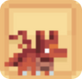
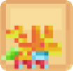
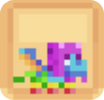
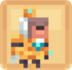
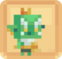
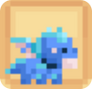
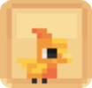
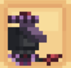

# 🐟 Compagnon Épique

## 💠 La liste des compagnons ÉPIQUES

<table border="1" cellspacing="0" cellpadding="6">
  <tr>
    <td><mark style="color:blue;"><strong>Nom 🏷️</strong></mark></td>
    <td><mark style="color:blue;"><strong>Image de l'item 🖼️</strong></mark></td>
    <td><mark style="color:blue;"><strong>Avantages 💪</strong></mark></td>
    <td><mark style="color:blue;"><strong>Obtentions 🔍</strong></mark></td>
  </tr>
  <tr>
   <td><mark style="color:blue;"><strong>Denvheur</strong></mark></td>
   <td>
     
<figure></figure>

     
<figure></figure>

   </td>
   <td>
    
<mark style="color:blue;"><strong>Niveau 1</strong></mark> → <mark style="color:blue;"><strong>+ 7.500</strong></mark> 💲/h

    
<mark style="color:blue;"><strong>Niveau 5</strong></mark> → <mark style="color:blue;"><strong>Célérité 2</strong></mark>

    
<mark style="color:blue;"><strong>Niveau 10</strong></mark> → <mark style="color:blue;"><strong>🛡️ Défense</strong></mark> +4

    
<mark style="color:blue;"><strong>Niveau 15</strong></mark> → <mark style="color:blue;"><strong>+15%</strong></mark> sur la vente de <mark style="color:blue;"><strong>Lingots de Fer</strong></mark> au /shop

    
<mark style="color:blue;"><strong>Niveau 20</strong></mark> → <mark style="color:blue;"><strong>+7.5%</strong></mark> d'EXP <mark style="color:blue;"><strong>Mineur ⛏️</strong></mark>

   </td>
   <td>
     
* Œuf de familier (Caisse Émeraude ✳️)

     
* Œuf de familier (Caisse Rubis 🔻)

   </td>
  </tr>
  <tr>
   <td><mark style="color:blue;"><strong>Dracon</strong></mark></td>
   <td>
     
<figure></figure>

     
<figure></figure>

   </td>
   <td>
    
<mark style="color:blue;"><strong>Niv. 1</strong></mark> → <mark style="color:blue;"><strong>Résistance au feu</strong></mark>

    
<mark style="color:blue;"><strong>Niv. 5</strong></mark> → <mark style="color:blue;"><strong>+7.5%</strong></mark> d'EXP <mark style="color:blue;"><strong>Chasseur 🗡️</strong></mark>

    
<mark style="color:blue;"><strong>Niv. 10</strong></mark> → <mark style="color:blue;"><strong>Monture</strong></mark> (Aérienne)

    
<mark style="color:blue;"><strong>Niv. 15</strong></mark> → <mark style="color:blue;"><strong>+10%</strong></mark> de chance <mark style="color:blue;"><strong>d'enflammer les ennemis</strong></mark>

    
<mark style="color:blue;"><strong>Niv. 20</strong></mark> → <mark style="color:blue;"><strong>+15%</strong></mark> sur la vente de <mark style="color:blue;"><strong>Loots de mobs</strong></mark> au /shop

   </td>
   <td>
     
* Œuf de familier (Caisse Émeraude ✳️)

     
* Œuf de familier (Caisse Rubis 🔻)

   </td>
  </tr>
  <tr>
   <td><mark style="color:blue;"><strong>Nayru</strong></mark></td>
   <td>
     
<figure></figure>

     
<figure></figure>

   </td>
   <td>
    
<mark style="color:blue;"><strong>Niv. 1</strong></mark> → <mark style="color:blue;"><strong>+ 6.500</strong></mark> 💲/h

    
<mark style="color:blue;"><strong>Niv. 5</strong></mark> → <mark style="color:blue;"><strong>+7.5%</strong></mark> d'EXP <mark style="color:blue;"><strong>Bûcheron 🪚</strong></mark>

    
<mark style="color:blue;"><strong>Niv. 10</strong></mark> → <mark style="color:blue;"><strong>Monture</strong></mark> (Aérienne)

    
<mark style="color:blue;"><strong>Niv. 15</strong></mark> → Réduction des <mark style="color:blue;"><strong>Dégats de Chute</strong></mark> de moitié

    
<mark style="color:blue;"><strong>Niv. 20</strong></mark> → <mark style="color:blue;"><strong>+5%</strong></mark> sur <mark style="color:blue;">vos ventes</mark> chez Jimmy

   </td>
   <td>
     
* Œuf de familier (Caisse Émeraude ✳️)

     
* Œuf de familier (Caisse Rubis 🔻)

   </td>
  </tr>
  <tr>
   <td><mark style="color:blue;"><strong>Pow</strong></mark></td>
   <td>
     
<figure></figure>

     
<figure></figure>

   </td>
   <td>
     
<mark style="color:blue;"><strong>Niv. 1</strong></mark> → <mark style="color:blue;"><strong>+ 7.000</strong></mark> 💲/h

     
<mark style="color:blue;"><strong>Niv. 5</strong></mark> → <mark style="color:blue;"><strong>Stockage</strong></mark> double coffre

     
<mark style="color:blue;"><strong>Niv. 10</strong></mark> → <mark style="color:blue;"><strong>Monture</strong></mark> (Terrestre)

     
<mark style="color:blue;"><strong>Niv. 15</strong></mark> → <mark style="color:blue;"><strong>🛡️ Défense</strong></mark> +5

     
<mark style="color:blue;"><strong>Niv. 20</strong></mark> → <mark style="color:blue;"><strong>+7.5%</strong></mark> d'EXP <mark style="color:blue;"><strong>Fermier 🌾</strong></mark>

   </td>
   <td>
     
* Œuf de familier (Caisse Émeraude ✳️)

     
* Œuf de familier (Caisse Rubis 🔻)

   </td>
  </tr>
  <tr>
   <td><mark style="color:blue;"><strong>Anubis</strong></mark></td>
   <td><figure></figure></td>
   <td>
     
<mark style="color:blue;"><strong>Niv. 1</strong></mark> → <mark style="color:blue;"><strong>+ 2.500</strong></mark> 💲/h

     
<mark style="color:blue;"><strong>Niv. 5</strong></mark> → <mark style="color:blue;"><strong>🥊 Chance de Critique</strong></mark> +3

     
<mark style="color:blue;"><strong>Niv. 10</strong></mark> → <mark style="color:blue;"><strong>+5%</strong></mark> sur la vente d'<mark style="color:blue;"><strong>Os</strong></mark> au /shop

     
<mark style="color:blue;"><strong>Niv. 15</strong></mark> → <mark style="color:blue;"><strong>💀 Dégâts Critiques</strong></mark> +3

     
<mark style="color:blue;"><strong>Niv. 20</strong></mark> → <mark style="color:blue;"><strong>+ 3.000</strong></mark> 💲/h
     
   </td>
   <td>* Loot de boss 🐉(Donjons Biome Désert)</td>
  </tr>
  <tr>
   <td><mark style="color:blue;"><strong>Biggoron</strong></mark></td>
   <td><figure></figure></td>
   <td>
     
<mark style="color:blue;"><strong>Niv. 1</strong></mark> → <mark style="color:blue;"><strong>+ 3.500</strong></mark> 💲/h

     
<mark style="color:blue;"><strong>Niv. 5</strong></mark> → <mark style="color:blue;"><strong>❤️ Vie</strong></mark> +25

     
<mark style="color:blue;"><strong>Niv. 10</strong></mark> → <mark style="color:blue;"><strong>Stockage</strong></mark> double coffre

     
<mark style="color:blue;"><strong>Niv. 15</strong></mark> → <mark style="color:blue;"><strong>🛡️ Défense</strong></mark> +8

     
<mark style="color:blue;"><strong>Niv. 20</strong></mark> → <mark style="color:blue;"><strong>+5%</strong></mark> sur la vente de <mark style="color:blue;"><strong>Diamants</strong></mark> au /shop
     
   </td>
   <td>* Loot de boss 🐉(Donjons Biome Messa)</td>
  </tr>
  <tr>
   <td><mark style="color:blue;"><strong>Bolg</strong></mark></td>
   <td><figure></figure></td>
   <td>
     
<mark style="color:blue;"><strong>Niv. 1</strong></mark> → <mark style="color:blue;"><strong>+ 1.500</strong></mark> 💲/h

     
<mark style="color:blue;"><strong>Niv. 5</strong></mark> → <mark style="color:blue;"><strong>🗡️ Force</strong></mark> +9

     
<mark style="color:blue;"><strong>Niv. 10</strong></mark> → <mark style="color:blue;"><strong>+5%</strong></mark> sur la vente de <mark style="color:blue;"><strong>Chairs putiéfiées</strong></mark> au /shop

     
<mark style="color:blue;"><strong>Niv. 15</strong></mark> → <mark style="color:blue;"><strong>🤺 Dextérité</strong></mark> +5

     
<mark style="color:blue;"><strong>Niv. 20</strong></mark> → <mark style="color:blue;"><strong>+ 5.500</strong></mark> 💲/h
  
   </td>
   <td>* Loot de boss 🐉(Donjons Biome Savane)</td>
  </tr>
  <tr>
   <td><mark style="color:blue;"><strong>Bufo Bufo</strong></mark></td>
   <td><figure></figure></td>
   <td>
     
<mark style="color:blue;"><strong>Niv. 1</strong></mark> → <mark style="color:blue;"><strong>+5%</strong></mark> sur la vente de <mark style="color:blue;"><strong>Boule de Slime</strong></mark> au /shop

     
<mark style="color:blue;"><strong>Niv. 5</strong></mark> → <mark style="color:blue;"><strong>🧪 Mana</strong></mark> +75

     
<mark style="color:blue;"><strong>Niv. 10</strong></mark> → <mark style="color:blue;"><strong>Monture</strong></mark> (Terrestre)

     
<mark style="color:blue;"><strong>Niv. 15</strong></mark> → <mark style="color:blue;"><strong>❤️ Vie</strong></mark> +27

     
<mark style="color:blue;"><strong>Niv. 20</strong></mark> → <mark style="color:blue;"><strong>+ 5.500</strong></mark> 💲/h
 
   </td>
   <td>* Loot de boss 🐉(Donjons Biome Marais)</td>
  </tr>
  <tr>
   <td><mark style="color:blue;"><strong>Lilith</strong></mark></td>
   <td><figure></figure></td>
   <td>
     
<mark style="color:blue;"><strong>Niv. 1</strong></mark> → <mark style="color:blue;"><strong>+5%</strong></mark> sur la vente de <mark style="color:blue;"><strong>Verrues du Nether</strong></mark> au /shop

     
<mark style="color:blue;"><strong>Niv. 5</strong></mark> → <mark style="color:blue;"><strong>🏃‍♂️ Vitesse</strong></mark> +6

     
<mark style="color:blue;"><strong>Niv. 10</strong></mark> → <mark style="color:blue;"><strong>Résistance au feu</strong></mark>

     
<mark style="color:blue;"><strong>Niv. 15</strong></mark> → <mark style="color:blue;"><strong>🗡️ Force</strong></mark> +8

     
<mark style="color:blue;"><strong>Niv. 20</strong></mark> → <mark style="color:blue;"><strong>+ 7.000</strong></mark> 💲/h
   
   </td>
   <td>* Loot de boss 🐉(Donjons Biome Nether)</td>
  </tr>
  <tr>
   <td><mark style="color:blue;"><strong>Pohaku</strong></mark></td>
   <td><figure></figure></td>
   <td>
     
<mark style="color:blue;"><strong>Niv. 1</strong></mark> → <mark style="color:blue;"><strong>+ 2.500</strong></mark> 💲/h

     
<mark style="color:blue;"><strong>Niv. 5</strong></mark> → <mark style="color:blue;"><strong>🛡️ Défense</strong></mark> +11

     
<mark style="color:blue;"><strong>Niv. 10</strong></mark> → <mark style="color:blue;"><strong>+7.5%</strong></mark> sur la vente de <mark style="color:blue;"><strong>Pierres</strong></mark> au /shop

     
<mark style="color:blue;"><strong>Niv. 15</strong></mark> → <mark style="color:blue;"><strong>🛡️ Défense</strong></mark> +9

     
<mark style="color:blue;"><strong>Niv. 20</strong></mark> → <mark style="color:blue;"><strong>+ 4.000</strong></mark> 💲/h
   
   </td>
   <td>* Loot de boss 🐉(Donjons Biome Jungle)</td>
  </tr>
  <tr>
   <td><mark style="color:blue;"><strong>Skog</strong></mark></td>
   <td><figure></figure></td>
   <td>
     
<mark style="color:blue;"><strong>Niv. 1</strong></mark> → <mark style="color:blue;"><strong>+20%</strong></mark> sur la vente de <mark style="color:blue;"><strong>Bûches de chêne</strong></mark> au /shop

     
<mark style="color:blue;"><strong>Niv. 5</strong></mark> → <mark style="color:blue;"><strong>🛡️ Défense</strong></mark> +11

     
<mark style="color:blue;"><strong>Niv. 10</strong></mark> → <mark style="color:blue;"><strong>+7,5% d'XP Vanilla 🟢</strong></mark>

     
<mark style="color:blue;"><strong>Niv. 15</strong></mark> → <mark style="color:blue;"><strong>💕 Régénération</strong></mark> +5

     
<mark style="color:blue;"><strong>Niv. 20</strong></mark> → <mark style="color:blue;"><strong>+ 3.500</strong></mark> 💲/h
   
   </td>
   <td>* Loot de boss 🐉(Donjons Biome Forêt)</td>
  </tr>
  <tr>
   <td><mark style="color:blue;"><strong>Yukio</strong></mark></td>
   <td><figure></figure></td>
   <td>
     
<mark style="color:blue;"><strong>Niv. 1</strong></mark> → <mark style="color:blue;"><strong>+ 5.000</strong></mark> 💲/h

     
<mark style="color:blue;"><strong>Niv. 5</strong></mark> → <mark style="color:blue;"><strong>🤺 Dextérité</strong></mark> +7

     
<mark style="color:blue;"><strong>Niv. 10</strong></mark> → <mark style="color:blue;"><strong>Monture</strong></mark> (Aérienne)

     
<mark style="color:blue;"><strong>Niv. 15</strong></mark> → <mark style="color:blue;"><strong>🧪 Mana</strong></mark> +70

     
<mark style="color:blue;"><strong>Niv. 20</strong></mark> → <mark style="color:blue;"><strong>+10%</strong></mark> sur la vente de <mark style="color:blue;"><strong>Glace</strong></mark> au /shop
   
   </td>
   <td>* Loot de boss 🐉(Donjons Biome Neige)</td>
  </tr>
  <tr>
   <td><mark style="color:blue;"><strong>Merlock</strong></mark></td>
   <td><figure></figure></td>
   <td>
     
<mark style="color:blue;"><strong>Niv. 1</strong></mark> → <mark style="color:blue;"><strong>+ 4.000</strong></mark> 💲/h

     
<mark style="color:blue;"><strong>Niv. 5</strong></mark> → <mark style="color:blue;"><strong>+5%</strong></mark> sur la vente d'<mark style="color:blue;"><strong>Éclats de prismarine</strong></mark> au /shop

     
<mark style="color:blue;"><strong>Niv. 10</strong></mark> → <mark style="color:blue;"><strong>Respiration Aquatique</strong></mark>

<mark style="color:blue;"><strong>Niv. 15</strong></mark> → <mark style="color:blue;"><strong>+ 4.000</strong></mark> 💲/h

     
<mark style="color:blue;"><strong>Niv. 20</strong></mark> → <mark style="color:blue;"><strong>💀 Dégâts Critiques</strong></mark> +11

   </td>
   <td>* Loot de boss 🐉(Donjons Abyssaux)</td>
  </tr>
  <tr>
   <td><mark style="color:blue;"><strong>Ice Queen</strong></mark></td>
   <td><figure></figure></td>
   <td>
     
<mark style="color:blue;"><strong>Niv. 1</strong></mark> → <mark style="color:blue;"><strong>+200%</strong></mark> sur la vente de <mark style="color:blue;"><strong>Bûches de sapin</strong></mark> au /shop

     
<mark style="color:blue;"><strong>Niv. 5</strong></mark> → <mark style="color:blue;"><strong>🗡️ Force</strong></mark> +7

     
<mark style="color:blue;"><strong>Niv. 10</strong></mark> → <mark style="color:blue;"><strong>+ 3.500</strong></mark> 💲/h

     
<mark style="color:blue;"><strong>Niv. 15</strong></mark> → <mark style="color:blue;"><strong>🛡️ Défense</strong></mark> +12

     
<mark style="color:blue;"><strong>Niv. 20</strong></mark> → <mark style="color:blue;"><strong>+ 5.000</strong></mark> 💲/h
  
   </td>
   <td>* Loot de boss 🐉(Donjons Givrés)</td>
  </tr>
   <tr>
   <td><mark style="color:blue;"><strong>Gorille des cavernes</strong></mark></td>
   <td><figure></figure></td>
   <td>
     
<mark style="color:blue;"><strong>Niv. 1</strong></mark> → <mark style="color:blue;"><strong>+2.500</strong></mark>💲/h

     
<mark style="color:blue;"><strong>Niv. 5</strong></mark> → <mark style="color:blue;"><strong>❤️ Vie </strong></mark>+10 /
     <mark style="color:blue;"><strong>🛡️ Défense </strong></mark>+5

     
<mark style="color:blue;"><strong>Niv. 10</strong></mark> → <strong><mark style="color:blue;">+7.5%</strong></mark> d'EXP <mark style="color:blue;"><strong>Mineur⛏️<strong></mark>
  
    
<mark style="color:blue;"><strong>Niv. 15</strong></mark> → <mark style="color:blue;"><strong>❤️ Vie </strong></mark>+15 /
     <mark style="color:blue;"><strong>🛡️ Défense </strong></mark>+10

     
<mark style="color:blue;"><strong>Niv. 20</strong></mark> → <mark style="color:blue;"><strong>+7.500</strong></mark>💲/h

   </td>
   <td>* Loot de boss + coffre de récompense🐉(donjons cavernes)</td>
  </tr>
  <tr>
   <td><mark style="color:blue;"><strong>Drogon</strong></mark></td>
   <td><figure></figure></td>
   <td>
     
<mark style="color:blue;"><strong>Niv. 1</strong></mark> → <mark style="color:blue;"><strong>+20%</strong></mark> sur la vente de <mark style="color:blue;"><strong>Ficelles</strong></mark> chez Jimmy

     
<mark style="color:blue;"><strong>Niv. 5</strong></mark> → <mark style="color:blue;"><strong>💕 Régénération</strong></mark> +8

     
<mark style="color:blue;"><strong>Niv. 10</strong></mark> → <mark style="color:blue;"><strong>Monture</strong></mark> (Aérienne)

     
<mark style="color:blue;"><strong>Niv. 15</strong></mark> → <mark style="color:blue;"><strong>+ 7.500</strong></mark> 💲/h

     
<mark style="color:blue;"><strong>Niv. 20</strong></mark> → <mark style="color:blue;"><strong>❤️ Vie</strong></mark> +22

   </td>
   <td>* Œuf de famillier (Caisse Draconique 🐉)</td>
  </tr>
  <tr>
   <td><mark style="color:blue;"><strong>Gribouille</strong></mark></td>
   <td><figure></figure></td>
   <td>
     
<mark style="color:blue;"><strong>Niv. 1</strong></mark> → <mark style="color:blue;"><strong>💕 Régénération</strong></mark> +4

     
<mark style="color:blue;"><strong>Niv. 5</strong></mark> → <mark style="color:blue;"><strong>+7.5%</strong></mark> sur la vente de <mark style="color:blue;"><strong>Canne à Sucre</strong></mark> au /shop

     
<mark style="color:blue;"><strong>Niv. 10</strong></mark> → <mark style="color:blue;"><strong>+ 4.000</strong></mark> 💲/h

     
<mark style="color:blue;"><strong>Niv. 15</strong></mark> → <mark style="color:blue;"><strong>+2,5%</strong></mark> d'argent sur <mark style="color:blue;"><strong>TOUS les métiers</strong></mark>

     
<mark style="color:blue;"><strong>Niv. 20</strong></mark> → <mark style="color:blue;"><strong>🛡️ Défense</strong></mark> +5
 
   </td>
   <td>* Œuf de famillier (Caisse Abyssale 🌊)</td>
  </tr>
  <tr>
   <td><mark style="color:blue;"><strong>Ça</strong></mark></td>
   <td><figure></figure></td>
   <td>
     
<mark style="color:blue;"><strong>Niv. 1</strong></mark> → <mark style="color:blue;"><strong>Vision Nocturne</strong></mark>

     
<mark style="color:blue;"><strong>Niv. 5</strong></mark> → <mark style="color:blue;"><strong>+200%</strong></mark> sur la vente de <mark style="color:blue;"><strong>Gâteau</strong></mark> au /shop

     
<mark style="color:blue;"><strong>Niv. 10</strong></mark> → <mark style="color:blue;"><strong>+ 7.000</strong></mark> 💲/h

     
<mark style="color:blue;"><strong>Niv. 15</strong></mark> → <mark style="color:blue;"><strong>🗡️ Force</strong></mark> +10

     
<mark style="color:blue;"><strong>Niv. 20</strong></mark> → <mark style="color:blue;"><strong>+7.5%</strong></mark> d'EXP <mark style="color:blue;"><strong>Bûcheron 🪚</strong></mark>
  
   </td>
   <td>* Œuf de famillier (Caisse Halloween 🎃)</td>
  </tr>
  <tr>
   <td><mark style="color:blue;"><strong>Groot</strong></mark></td>
   <td><figure></figure></td>
   <td>
     
<mark style="color:blue;"><strong>Niv. 1</strong></mark> → <mark style="color:blue;"><strong>+15%</strong></mark> sur la vente de <mark style="color:blue;"><strong>Bûches de mangrove</strong></mark> au /shop

     
<mark style="color:blue;"><strong>Niv. 5</strong></mark> → <mark style="color:blue;"><strong>❤️ Vie</strong></mark> +30

     
<mark style="color:blue;"><strong>Niv. 10</strong></mark> → <mark style="color:blue;"><strong>💕 Régénération</strong></mark> +8

     
<mark style="color:blue;"><strong>Niv. 15</strong></mark> → <mark style="color:blue;"><strong>+ 5.000</strong></mark> 💲/h

     
<mark style="color:blue;"><strong>Niv. 20</strong></mark> → <mark style="color:blue;"><strong>+7.5%</strong></mark> d'EXP <mark style="color:blue;"><strong>Chasseur 🗡️</strong></mark>
  
   </td>
   <td>* Œuf de famillier (Caisse Saint Patrick 🍀)</td>
  </tr>
  <tr>
   <td><mark style="color:blue;"><strong>Rodeer</strong></mark></td>
   <td><figure></figure></td>
   <td>
     
<mark style="color:blue;"><strong>Niv. 1</strong></mark> → <mark style="color:blue;"><strong>+15%</strong></mark> sur la vente de <mark style="color:blue;"><strong>Steaks</strong></mark> au /shop

     
<mark style="color:blue;"><strong>Niv. 5</strong></mark> → <mark style="color:blue;"><strong>+ 5.500</strong></mark> 💲/h

     
<mark style="color:blue;"><strong>Niv. 10</strong></mark> → <mark style="color:blue;"><strong>🧪 Mana</strong></mark> +15

     
<mark style="color:blue;"><strong>Niv. 15</strong></mark> → <mark style="color:blue;"><strong>+ 6.250</strong></mark> 💲/h

     
<mark style="color:blue;"><strong>Niv. 20</strong></mark> → <mark style="color:blue;"><strong>+7.5%</strong></mark> d'EXP <mark style="color:blue;"><strong>ForgeMage 📖</strong></mark>
 
   </td>
   <td>* Œuf de famillier (Caisse Summer 🏖️)</td>
  </tr>
  <tr>
   <td><mark style="color:blue;"><strong>Petri</strong></mark></td>
   <td><figure></figure></td>
   <td>
     
<mark style="color:blue;"><strong>Niv. 1</strong></mark> → <mark style="color:blue;"><strong>+5%</strong></mark> sur la vente de <mark style="color:blue;"><strong>Prismarine</strong></mark> au /shop

     
<mark style="color:blue;"><strong>Niv. 5</strong></mark> → <mark style="color:blue;"><strong>Aucun dégât de chute</strong></mark>

     
<mark style="color:blue;"><strong>Niv. 10</strong></mark> → <mark style="color:blue;"><strong>+ 3.750</strong></mark> 💲/h

     
<mark style="color:blue;"><strong>Niv. 15</strong></mark> → <mark style="color:blue;"><strong>🥊 Chance de Critique</strong></mark> +1

     
<mark style="color:blue;"><strong>Niv. 20</strong></mark> → <mark style="color:blue;"><strong>+ 4.750</strong></mark> 💲/h
   
   </td>
   <td>* Œuf de famillier (Caisse Antique 🗿)</td>
  </tr>
  <tr>
   <td><mark style="color:blue;"><strong>Auréoles</strong></mark></td>
   <td><figure></figure></td>
   <td>
     
<mark style="color:blue;"><strong>Niv. 1</strong></mark> → <mark style="color:blue;"><strong>+15%</strong></mark> sur la vente de <mark style="color:blue;"><strong>Poisson Tropical</strong></mark> au /shop

     
<mark style="color:blue;"><strong>Niv. 5</strong></mark> → <mark style="color:blue;"><strong>+ 3.500</strong></mark> 💲/h

     
<mark style="color:blue;"><strong>Niv. 10</strong></mark> → <mark style="color:blue;"><strong>+ 4.000</strong></mark> 💲/h

     
<mark style="color:blue;"><strong>Niv. 15</strong></mark> → <mark style="color:blue;"><strong>🛡️ Défense</strong></mark> +10

     
<mark style="color:blue;"><strong>Niv. 20</strong></mark> → <mark style="color:blue;"><strong>+7.5%</strong></mark> d'EXP <mark style="color:blue;"><strong>Pêcheur 🎣</strong></mark>
   
   </td>
   <td>* Œuf de famillier (Caisse Lune de Sang 🩸)</td>
  </tr>
  <tr>
   <td><mark style="color:blue;"><strong>Arhi</strong></mark></td>
   <td><figure></figure></td>
   <td>
     
<mark style="color:blue;"><strong>Niv. 1</strong></mark> → <mark style="color:blue;"><strong>🏃‍♂️ Vitesse</strong></mark> +2

     
<mark style="color:blue;"><strong>Niv. 5</strong></mark> → <mark style="color:blue;"><strong>🏃‍♂️ Vitesse</strong></mark> +4

     
<mark style="color:blue;"><strong>Niv. 10</strong></mark> → <mark style="color:blue;"><strong>🏃‍♂️ Vitesse</strong></mark> +5

     
<mark style="color:blue;"><strong>Niv. 15</strong></mark> → <mark style="color:blue;"><strong>🏃‍♂️ Vitesse</strong></mark> +7

     
<mark style="color:blue;"><strong>Niv. 20</strong></mark> → <mark style="color:blue;"><strong>🏃‍♂️ Vitesse</strong></mark> +9
  
   </td>
   <td>* Compagnon non disponible à l'achat ❌ (hors hôtel de vente)</td>
  </tr>
  <tr>
   <td><mark style="color:blue;"><strong>Clochette</strong></mark></td>
   <td><figure></figure></td>
   <td>
     
<mark style="color:blue;"><strong>Niv. 1</strong></mark> → <mark style="color:blue;"><strong>❤️ Vie</strong></mark> +10

     
<mark style="color:blue;"><strong>Niv. 5</strong></mark> → <mark style="color:blue;"><strong>❤️ Vie</strong></mark> +15

     
<mark style="color:blue;"><strong>Niv. 10</strong></mark> → <mark style="color:blue;"><strong>❤️ Vie</strong></mark> +20

     
<mark style="color:blue;"><strong>Niv. 15</strong></mark> → <mark style="color:blue;"><strong>❤️ Vie</strong></mark> +25

     
<mark style="color:blue;"><strong>Niv. 20</strong></mark> → <mark style="color:blue;"><strong>❤️ Vie</strong></mark> +30
    
   </td>
   <td>* Compagnon non disponible à l'achat ❌ (hors hôtel de vente)</td>
  </tr>
  <tr>
   <td><mark style="color:blue;"><strong>Dovregubben</strong></mark></td>
   <td><figure></figure></td>
   <td>
     
<mark style="color:blue;"><strong>Niv. 1</strong></mark> → <mark style="color:blue;"><strong>🛡️ Défense</strong></mark>+3

     
<mark style="color:blue;"><strong>Niv. 5</strong></mark> → <mark style="color:blue;"><strong>🛡️ Défense</strong></mark> +5

     
<mark style="color:blue;"><strong>Niv. 10</strong></mark> → <mark style="color:blue;"><strong>🛡️ Défense</strong></mark> +7

     
<mark style="color:blue;"><strong>Niv. 15</strong></mark> → <mark style="color:blue;"><strong>🛡️ Défense</strong></mark> +9

     
<mark style="color:blue;"><strong>Niv. 20</strong></mark> → <mark style="color:blue;"><strong>🛡️ Défense</strong></mark> +11
     
   </td>
   <td>* Compagnon non disponible à l'achat ❌ (hors hôtel de vente)</td>
  </tr>
  <tr>
   <td><mark style="color:blue;"><strong>Beepu</strong></mark></td>
   <td><figure></figure></td>
   <td>
     
<mark style="color:blue;"><strong>Niv. 1</strong></mark> → <mark style="color:blue;"><strong>💀 Dégâts Critiques</strong></mark> +2

     
<mark style="color:blue;"><strong>Niv. 5</strong></mark> → <mark style="color:blue;"><strong>💀 Dégâts Critiques</strong></mark> +4

     
<mark style="color:blue;"><strong>Niv. 10</strong></mark> → <mark style="color:blue;"><strong>💀 Dégâts Critiques</strong></mark> +5

     
<mark style="color:blue;"><strong>Niv. 15</strong></mark> → <mark style="color:blue;"><strong>💀 Dégâts Critiques</strong></mark> +7

     
<mark style="color:blue;"><strong>Niv. 20</strong></mark> → <mark style="color:blue;"><strong>💀 Dégâts Critiques</strong></mark> +9

   </td>
   <td>* Compagnon non disponible à l'achat ❌ (hors hôtel de vente)</td>
  </tr>
  <tr>
   <td><mark style="color:blue;"><strong>Gemling</strong></mark></td>
   <td><figure></figure></td>
   <td>
     
<mark style="color:blue;"><strong>Niv. 1</strong></mark> → <mark style="color:blue;"><strong>🧪 Mana</strong></mark> +10

     
<mark style="color:blue;"><strong>Niv. 5</strong></mark> → <mark style="color:blue;"><strong>🧪 Mana</strong></mark> +15

     
<mark style="color:blue;"><strong>Niv. 10</strong></mark> → <mark style="color:blue;"><strong>🧪 Mana</strong></mark> +20

     
<mark style="color:blue;"><strong>Niv. 15</strong></mark> → <mark style="color:blue;"><strong>🧪 Mana</strong></mark> +25

     
<mark style="color:blue;"><strong>Niv. 20</strong></mark> → <mark style="color:blue;"><strong>🧪 Mana</strong></mark> +30
 
   </td>
   <td>* Compagnon non disponible à l'achat ❌ (hors hôtel de vente)</td>
  </tr>
  <tr>
   <td><mark style="color:blue;"><strong>Skell</strong></mark></td>
   <td><figure></figure></td>
   <td>
     
<mark style="color:blue;"><strong>Niv. 1</strong></mark> → <mark style="color:blue;"><strong>🗡️ Force</strong></mark>+3

     
<mark style="color:blue;"><strong>Niv. 5</strong></mark> → <mark style="color:blue;"><strong>🗡️ Force</strong></mark> +5

     
<mark style="color:blue;"><strong>Niv. 10</strong></mark> → <mark style="color:blue;"><strong>🗡️ Force</strong></mark> +7

     
<mark style="color:blue;"><strong>Niv. 15</strong></mark> → <mark style="color:blue;"><strong>🗡️ Force</strong></mark> +9

     
<mark style="color:blue;"><strong>Niv. 20</strong></mark> → <mark style="color:blue;"><strong>🗡️ Force</strong></mark> +11
  
   </td>
   <td>* Compagnon non disponible à l'achat ❌ (hors hôtel de vente)</td>
  </tr>
  <tr>
   <td><mark style="color:blue;"><strong>Haemalith</strong></mark></td>
   <td><figure></figure></td>
   <td>
     
<mark style="color:blue;"><strong>Niv. 1</strong></mark> → <mark style="color:blue;"><strong>💕 Régénération</strong></mark>+2

     
<mark style="color:blue;"><strong>Niv. 5</strong></mark> → <mark style="color:blue;"><strong>💕 Régénération</strong></mark> +4

     
<mark style="color:blue;"><strong>Niv. 10</strong></mark> → <mark style="color:blue;"><strong>💕 Régénération</strong></mark> +5

     
<mark style="color:blue;"><strong>Niv. 15</strong></mark> → <mark style="color:blue;"><strong>💕 Régénération</strong></mark> +7

     
<mark style="color:blue;"><strong>Niv. 20</strong></mark> → <mark style="color:blue;"><strong>💕 Régénération</strong></mark> +9
  
   </td>
   <td>* Compagnon non disponible à l'achat ❌ (hors hôtel de vente)</td>
  </tr>
  <tr>
   <td><mark style="color:blue;"><strong>Krovoselenos</strong></mark></td>
   <td><figure></figure></td>
   <td>
     
<mark style="color:blue;"><strong>Niv. 1</strong></mark> → <mark style="color:blue;"><strong>🥊 Chance de Critique</strong></mark>+0.25

     
<mark style="color:blue;"><strong>Niv. 5</strong></mark> → <mark style="color:blue;"><strong>🥊 Chance de Critique</strong></mark> +0.5

     
<mark style="color:blue;"><strong>Niv. 10</strong></mark> → <mark style="color:blue;"><strong>🥊 Chance de Critique</strong></mark> +0.75

     
<mark style="color:blue;"><strong>Niv. 15</strong></mark> → <mark style="color:blue;"><strong>🥊 Chance de Critique</strong></mark> +1

     
<mark style="color:blue;"><strong>Niv. 20</strong></mark> → <mark style="color:blue;"><strong>🥊 Chance de Critique</strong></mark> +1.5
  
   </td>
   <td>* Compagnon non disponible à l'achat ❌ (hors hôtel de vente)</td>
  </tr>
   <tr>
   <td><mark style="color:blue;"><strong>Cheval de Feu</strong></mark></td>
   <td><figure></figure></td>
   <td>
     
<mark style="color:blue;"><strong>Niv. 1</strong></mark> → <mark style="color:blue;"><strong>🏃‍♂️ Vitesse</strong></mark> +5

     
<mark style="color:blue;"><strong>Niv. 5</strong></mark> → <mark style="color:blue;"><strong>Résistance au feu</strong></mark>

     
<mark style="color:blue;"><strong>Niv. 10</strong></mark> → <mark style="color:blue;"><strong>Monture</strong></mark> (Terrestre)

     
<mark style="color:blue;"><strong>Niv. 15</strong></mark> → <mark style="color:blue;"><strong> Saut Amélioré 🦘</strong></mark> (Permanent) 

     
<mark style="color:blue;"><strong>Niv. 20</strong></mark> → <mark style="color:blue;"><strong>+ 4.000</strong></mark> 💲/h

   </td>
   <td>* Œuf de famillier (caisse lunaire)</td>
  </tr>
</table>
