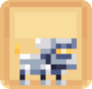
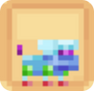
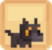

# 👾 Compagnon Légendaire

## 💠 La liste des compagnons LÉGENDAIRE

<table border="1" cellspacing="0" cellpadding="6">
  <tr>
    <td><mark style="color:purple;"><strong>Nom 🏷️</strong></mark></td>
    <td><mark style="color:purple;"><strong>Image de l'item 🖼️</strong></mark></td>
    <td><mark style="color:purple;"><strong>Avantages 💪</strong></mark></td>
    <td><mark style="color:purple;"><strong>Obtentions 🔍</strong></mark></td>
  </tr>
  <tr>
    <td><mark style="color:purple;"><strong>Doggo</strong></mark></td>
    <td>
      
<figure></figure>

      
<figure></figure>

    </td>
    <td>
      
<mark style="color:purple;"><strong>Niveau 1</strong></mark> → <mark style="color:purple;"><strong>Saturation</strong></mark>

      
<mark style="color:purple;"><strong>Niveau 5</strong></mark> → <mark style="color:purple;"><strong>💀 Dégâts Critiques</strong></mark> +9

      
<mark style="color:purple;"><strong>Niveau 10</strong></mark> → <mark style="color:purple;"><strong>+10%</strong></mark> d'EXP <mark style="color:purple;"><strong>ForgeMage 📖</strong></mark>

      
<mark style="color:purple;"><strong>Niveau 15</strong></mark> → <mark style="color:purple;"><strong>🥊 Chance de Critique</strong></mark> +9

      
<mark style="color:purple;"><strong>Niveau 20</strong></mark> → <mark style="color:purple;"><strong>+ 10.000</strong> 💲/h</mark>

    </td>
    <td>
      
* Œuf de familier (Caisse Rubis 🔻)

      
* Œuf de familier (Caisse Jackpot 🎰)

    </td>
  </tr>
  <tr>
    <td><mark style="color:purple;"><strong>Knity</strong></mark></td>
    <td>
      
<figure></figure>

      
<figure></figure>

    </td>
    <td>
      
<mark style="color:purple;"><strong>Niv. 1</strong></mark> → <mark style="color:purple;"><strong>💕 Régénération</strong></mark> +8

      
<mark style="color:purple;"><strong>Niv. 5</strong></mark> → <mark style="color:purple;"><strong>+ 7.500</strong></mark> 💲/h

      
<mark style="color:purple;"><strong>Niv. 10</strong></mark> → <mark style="color:purple;"><strong>+10%</strong></mark> d'EXP <mark style="color:purple;"><strong>Pêcheur 🎣</strong></mark>

      
<mark style="color:purple;"><strong>Niv. 15</strong></mark> → <mark style="color:purple;"><strong>Double les dégats</strong></mark> sur les <mark style="color:purple;"><strong>monstres vanilla</strong></mark>

      
<mark style="color:purple;"><strong>Niv. 20</strong></mark> → <mark style="color:purple;"><strong>+ 10.000</strong> 💲/h</mark>

    </td>
    <td>
      
* Œuf de familier (Caisse Rubis 🔻)

      
* Œuf de familier (Caisse Jackpot 🎰)

    </td>
  </tr>
  <tr>
    <td><mark style="color:purple;"><strong>Bruce</strong></mark></td>
    <td><figure></figure></td>
    <td>
      
<mark style="color:purple;"><strong>Niv. 1</strong></mark> → <mark style="color:purple;"><strong>+5%</strong></mark> sur la vente des <mark style="color:purple;"><strong>Poissons Crus</strong></mark> au /shop

      
<mark style="color:purple;"><strong>Niv. 5</strong></mark> → <mark style="color:purple;"><strong>+ 1.500</strong></mark> 💲/h

      
<mark style="color:purple;"><strong>Niv. 10</strong></mark> → <mark style="color:purple;"><strong>+15%</strong></mark> d'argent sur le <mark style="color:purple;"><strong>Pêcheur 🎣</strong></mark>

      
<mark style="color:purple;"><strong>Niv. 15</strong></mark> → <mark style="color:purple;"><strong>+ 3.500</strong></mark> 💲/h

      
<mark style="color:purple;"><strong>Niv. 20</strong></mark> → <mark style="color:purple;"><strong>🗡️ Force</strong></mark> +3
 
    </td>
    <td>* Palier level 175 Pêcheur 🎣</td>
  </tr>
  <tr>
    <td><mark style="color:purple;"><strong>Navet</strong></mark></td>
    <td><figure></figure></td>
    <td>
      
<mark style="color:purple;"><strong>Niv. 1</strong></mark> → <mark style="color:purple;"><strong>+5%</strong></mark> sur la vente de <mark style="color:purple;"><strong>Cultures</strong></mark> au /shop

      
<mark style="color:purple;"><strong>Niv. 5</strong></mark> → <mark style="color:purple;"><strong>+ 2.000</strong></mark> 💲/h

      
<mark style="color:purple;"><strong>Niv. 10</strong></mark> → <mark style="color:purple;"><strong>+15%</strong></mark> d'argent sur le <mark style="color:purple;"><strong>Fermier 🌾</strong></mark>

      
<mark style="color:purple;"><strong>Niv. 15</strong></mark> → <mark style="color:purple;"><strong>🏃‍♂️ Vitesse</strong></mark> +2

      
<mark style="color:purple;"><strong>Niv. 20</strong></mark> → <mark style="color:purple;"><strong>+ 4.000</strong></mark> 💲/h

    </td>
    <td>* Palier level 175 Fermier 🌾</td>
  </tr>
  <tr>
    <td><mark style="color:purple;"><strong>Rainbow Dash</strong></mark></td>
    <td><figure></figure></td>
    <td>
      
<mark style="color:purple;"><strong>Niv. 1</strong></mark> → <mark style="color:purple;"><strong>+10%</strong></mark> sur la vente d'<mark style="color:purple;"><strong>Insectes</strong></mark> au /shop

      
<mark style="color:purple;"><strong>Niv. 5</strong></mark> → <mark style="color:purple;"><strong>+ 500</strong></mark> 💲/h

      
<mark style="color:purple;"><strong>Niv. 10</strong></mark> → <mark style="color:purple;"><strong>+15%</strong></mark> d'argent sur le <mark style="color:purple;"><strong>ForgeMage 📖</strong></mark>

      
<mark style="color:purple;"><strong>Niv. 15</strong></mark> → <mark style="color:purple;"><strong>🛡️ Défense</strong></mark> +1

      
<mark style="color:purple;"><strong>Niv. 20</strong></mark> → <mark style="color:purple;"><strong>+ 3.000</strong></mark> 💲/h
 
    </td>
    <td>* Palier level 175 ForgeMage 📖</td>
  </tr>
  <tr>
    <td><mark style="color:purple;"><strong>Raksha</strong></mark></td>
    <td><figure></figure></td>
    <td>
      
<mark style="color:purple;"><strong>Niv. 1</strong></mark> → <mark style="color:purple;"><strong>+5%</strong></mark> sur la vente de <mark style="color:purple;"><strong>Loots de Mobs</strong></mark> au /shop

      
<mark style="color:purple;"><strong>Niv. 5</strong></mark> → <mark style="color:purple;"><strong>🗡️ Force</strong></mark> +1

      
<mark style="color:purple;"><strong>Niv. 10</strong></mark> → <mark style="color:purple;"><strong>+15%</strong></mark> d'argent sur le <mark style="color:purple;"><strong>Chasseur 🗡️</strong></mark>

      
<mark style="color:purple;"><strong>Niv. 15</strong></mark> → <mark style="color:purple;"><strong>🤺 Dextérité</strong></mark> +3

      
<mark style="color:purple;"><strong>Niv. 20</strong></mark> → <mark style="color:purple;"><strong>+ 6.000</strong></mark> 💲/h

    </td>
    <td>* Palier level 175 Chasseur 🗡️</td>
  </tr>
  <tr>
    <td><mark style="color:purple;"><strong>René</strong></mark></td>
    <td><figure></figure></td>
    <td>
      
<mark style="color:purple;"><strong>Niv. 1</strong></mark> → <mark style="color:purple;"><strong>+5%</strong></mark> sur la vente de <mark style="color:purple;"><strong>Minerais</strong></mark> au /shop

      
<mark style="color:purple;"><strong>Niv. 5</strong></mark> → <mark style="color:purple;"><strong>Célérité 2</strong></mark>

      
<mark style="color:purple;"><strong>Niv. 10</strong></mark> → <mark style="color:purple;"><strong>+15%</strong></mark> d'argent sur le <mark style="color:purple;"><strong>Mineur ⛏️</strong></mark>

      
<mark style="color:purple;"><strong>Niv. 15</strong></mark> → <mark style="color:purple;"><strong>+ 5.000</strong></mark> 💲/h

      
<mark style="color:purple;"><strong>Niv. 20</strong></mark> → <mark style="color:purple;"><strong>Vision Nocturne</strong></mark>
 
    </td>
    <td>* Palier level 175 Mineur ⛏️</td>
  </tr>
  <tr>
    <td><mark style="color:purple;"><strong>Woody</strong></mark></td>
    <td><figure></figure></td>
    <td>
      
<mark style="color:purple;"><strong>Niv. 1</strong></mark> → <mark style="color:purple;"><strong>+5%</strong></mark> sur la vente de <mark style="color:purple;"><strong>TOUTES types de Bûches</strong></mark> au /shop

      
<mark style="color:purple;"><strong>Niv. 5</strong></mark> → <mark style="color:purple;"><strong>❤️ Vie</strong></mark> +6

      
<mark style="color:purple;"><strong>Niv. 10</strong></mark> → <mark style="color:purple;"><strong>+15%</strong></mark> d'argent sur le <mark style="color:purple;"><strong>Bûcheron 🪚</strong></mark>

      
<mark style="color:purple;"><strong>Niv. 15</strong></mark> → <mark style="color:purple;"><strong>+ 1.000</strong></mark> 💲/h

      
<mark style="color:purple;"><strong>Niv. 20</strong></mark> → <mark style="color:purple;"><strong>+ 2.500</strong></mark> 💲/h
 
    </td>
    <td>* Palier level 175 Bûcheron 🪚</td>
  </tr>
  <tr>
    <td><mark style="color:purple;"><strong>Saphira</strong></mark></td>
    <td><figure></figure></td>
    <td>
      
<mark style="color:purple;"><strong>Niv. 1</strong></mark> → <mark style="color:purple;"><strong>🛡️ Défense</strong></mark> +10

      
<mark style="color:purple;"><strong>Niv. 5</strong></mark> → <mark style="color:purple;"><strong>+ 11.500</strong></mark> 💲/h

      
<mark style="color:purple;"><strong>Niv. 10</strong></mark> → <mark style="color:purple;"><strong>Monture</strong></mark> (Aérienne)

      
<mark style="color:purple;"><strong>Niv. 15</strong></mark> → <mark style="color:purple;"><strong>🗡️ Force</strong></mark> +13

      
<mark style="color:purple;"><strong>Niv. 20</strong></mark> → <mark style="color:purple;"><strong>+5%</strong></mark> d'argent sur <mark style="color:purple;"><strong>TOUS les métiers</strong></mark>

    </td>
    <td>* Œuf de famillier (Caisse Draconique 🐉)</td>
  </tr>
  <tr>
    <td><mark style="color:purple;"><strong>Phoenix</strong></mark></td>
    <td><figure></figure></td>
    <td>
      
<mark style="color:purple;"><strong>Niv. 1</strong></mark> → <mark style="color:purple;"><strong>💀 Dégâts Critiques</strong></mark> +10

      
<mark style="color:purple;"><strong>Niv. 5</strong></mark> → <mark style="color:purple;"><strong>+ 5.000</strong></mark> 💲/h

      
<mark style="color:purple;"><strong>Niv. 10</strong></mark> → <mark style="color:purple;"><strong>🥊 Chance de Critique</strong></mark> +4

      
<mark style="color:purple;"><strong>Niv. 15</strong></mark> → <mark style="color:purple;"><strong>+5% de dégats</strong></mark> sur les <mark style="color:purple;"><strong>monstres des Donjons Abyssaux</strong></mark>

      
<mark style="color:purple;"><strong>Niv. 20</strong></mark> → <mark style="color:purple;"><strong>+ 7.500</strong></mark> 💲/h
  
    </td>
    <td>* Œuf de famillier (Caisse Abyssal 🌊)</td>
  </tr>
  <tr>
    <td><mark style="color:purple;"><strong>Dracula</strong></mark></td>
    <td><figure></figure></td>
    <td>
      
<mark style="color:purple;"><strong>Niv. 1</strong></mark> → <mark style="color:purple;"><strong>+ 6.500</strong></mark> 💲/h

      
<mark style="color:purple;"><strong>Niv. 5</strong></mark> → <mark style="color:purple;"><strong>❤️ Vie</strong></mark> +35

      
<mark style="color:purple;"><strong>Niv. 10</strong></mark> → <mark style="color:purple;"><strong>2,5% des dégâts</strong></mark> que vous causez sont <mark style="color:purple;"><strong>convertis en points de vie</strong></mark>

      
<mark style="color:purple;"><strong>Niv. 15</strong></mark> → <mark style="color:purple;"><strong>+ 17.500</strong></mark> 💲/h

      
<mark style="color:purple;"><strong>Niv. 20</strong></mark> → <mark style="color:purple;"><strong>🏃‍♂️ Vitesse</strong></mark> +12
  
    </td>
    <td>* Œuf de famillier (Caisse Halloween 🎃)</td>
  </tr>
  <tr>
    <td><mark style="color:purple;"><strong>Cupidon</strong></mark></td>
    <td><figure></figure></td>
    <td>
      
<mark style="color:purple;"><strong>Niv. 1</strong></mark> → <mark style="color:purple;"><strong>+20%</strong></mark> sur la vente de <mark style="color:purple;"><strong>Diamants</strong></mark> au /shop

      
<mark style="color:purple;"><strong>Niv. 5</strong></mark> → <mark style="color:purple;"><strong>+ 7.500</strong></mark> 💲/h

      
<mark style="color:purple;"><strong>Niv. 10</strong></mark> → <mark style="color:purple;"><strong>✨ Régénération de Mana</strong></mark> +1

      
<mark style="color:purple;"><strong>Niv. 15</strong></mark> → <mark style="color:purple;"><strong>🏃‍♂️ Vitesse</strong></mark> +14

      
<mark style="color:purple;"><strong>Niv. 20</strong></mark> → <mark style="color:purple;"><strong>+10%</strong></mark> d'EXP <mark style="color:purple;"><strong>Bûcheron 🪚</strong></mark>
 
    </td>
    <td>* Œuf de famillier (Caisse Saint Valentin 💕)</td>
  </tr>
  <tr>
    <td><mark style="color:purple;"><strong>Chocovor</strong></mark></td>
    <td><figure></figure></td>
    <td>
      
<mark style="color:purple;"><strong>Niv. 1</strong></mark> → <mark style="color:purple;"><strong>+20%</strong></mark> sur la vente de <mark style="color:purple;"><strong>Pastèques</strong></mark> au /shop

      
<mark style="color:purple;"><strong>Niv. 5</strong></mark> → <mark style="color:purple;"><strong>+ 10.500</strong></mark> 💲/h

      
<mark style="color:purple;"><strong>Niv. 10</strong></mark> → <mark style="color:purple;"><strong>🛡️ Défense</strong></mark> +17

      
<mark style="color:purple;"><strong>Niv. 15</strong></mark> → <mark style="color:purple;"><strong>+ 11.000</strong></mark> 💲/h

      
<mark style="color:purple;"><strong>Niv. 20</strong></mark> → <mark style="color:purple;"><strong>+10%</strong></mark> d'EXP <mark style="color:purple;"><strong>Fermier 🌾</strong></mark>
 
    </td>
    <td>* Œuf de famillier (Caisse Pâques 🥚)</td>
  </tr>
  <tr>
    <td><mark style="color:purple;"><strong>Dents-Tranchantes</strong></mark></td>
    <td><figure></figure></td>
    <td>
      
<mark style="color:purple;"><strong>Niv. 1</strong></mark> → <mark style="color:purple;"><strong>+20%</strong></mark> sur la vente de <mark style="color:purple;"><strong>Moutons crus</strong></mark> au /shop

      
<mark style="color:purple;"><strong>Niv. 5</strong></mark> → <mark style="color:purple;"><strong>🗡️ Force</strong></mark> +20

      
<mark style="color:purple;"><strong>Niv. 10</strong></mark> → <mark style="color:purple;"><strong>+ 12.500</strong></mark> 💲/h

      
<mark style="color:purple;"><strong>Niv. 15</strong></mark> → <mark style="color:purple;"><strong>+10%</strong></mark> d'EXP <mark style="color:purple;"><strong>Mineur ⛏️</strong></mark>

      
<mark style="color:purple;"><strong>Niv. 20</strong></mark> → <mark style="color:purple;"><strong>+25% de chance</strong></mark> de <mark style="color:purple;"><strong>doubler ses dégats</strong></mark>
 
    </td>
    <td>* Œuf de famillier (Caisse Antique 🗿)</td>
  </tr>
  <tr>
    <td><mark style="color:purple;"><strong>Père Noël</strong></mark></td>
    <td><figure></figure></td>
    <td>
       
<mark style="color:purple;"><strong>Niv. 1</strong></mark> → <mark style="color:purple;"><strong>+20%</strong></mark> sur la vente d'<mark style="color:purple;"><strong>oeuil d'araignée</strong></mark> au /shop

      
<mark style="color:purple;"><strong>Niv. 5</strong></mark> → <mark style="color:purple;"><strong>+ 10.500</strong></mark> 💲/h

      
<mark style="color:purple;"><strong>Niv. 10</strong></mark> → <mark style="color:purple;"><strong>💀 Dégâts Critiques</strong></mark> +9

      
<mark style="color:purple;"><strong>Niv. 15</strong></mark> → <mark style="color:purple;"><strong>+ 12.000</strong></mark> 💲/h

      
<mark style="color:purple;"><strong>Niv. 20</strong></mark> → <mark style="color:purple;"><strong>+10%</strong></mark> d'EXP <mark style="color:purple;"><strong>Chasseur 🗡️</strong></mark>

    </td>
    <td>* Œuf de famillier (Caisse Pain d'épice 🍪)</td>
  </tr><tr>
    <td><mark style="color:purple;"><strong>Gorille du Laboratoire</strong></mark></td>
  <td><figure></figure></td>
    <td>
      
<mark style="color:purple;"><strong>Niv. 1</strong></mark> → <mark style="color:purple;"><strong>+ 5.000</strong></mark> 💲/h

       
<mark style="color:purple;"><strong>Niv. 5</strong></mark> → <mark style="color:purple;"><strong>💀 Dégâts Critiques</strong></mark> +10/<mark style="color:purple;"><strong>🥊 Chance de Critique</strong></mark>+10

       
<mark style="color:purple;"><strong>Niveau 10</strong></mark> → <mark style="color:purple;"><strong>+10%</strong></mark> d'EXP <mark style="color:purple;"><strong>ForgeMage 📖</strong></mark>

       
<mark style="color:purple;"><strong>Niv. 15</strong></mark> → <mark style="color:purple;"><strong>💀 Dégâts Critiques</strong></mark> +20/<mark style="color:purple;"><strong>🥊 Chance de Critique</strong></mark>+20

      
<mark style="color:purple;"><strong>Niv. 20</strong></mark> → <mark style="color:purple;"><strong>+ 10.000</strong></mark> 💲/h

    </td>
    <td>* Loot de boss + coffre de récompense🐉(donjons Laboratoire Glacial )</td>
  </tr>
</table>
