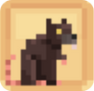
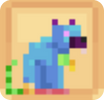
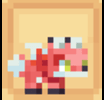

# 🦞 Compagnon Mythique

## 💠 La liste des compagnons MYTHIQUES

<table border="1" cellspacing="0" cellpadding="6">
  <tr>
    <td><mark style="color:red;"><strong>Nom 🏷️</strong></mark></td>
    <td><mark style="color:red;"><strong>Image de l'item 🖼️</strong></mark></td>
    <td><mark style="color:red;"><strong>Avantages 💪</strong></mark></td>
    <td><mark style="color:red;"><strong>Obtentions 🔍</strong></mark></td>
  </tr>
  <tr>
    <td align="center"><mark style="color:red;"><strong>Rat de Billy</strong></mark></td>
    <td>
      <figure>
        
      </figure>
      <figure>
        
      </figure>
    </td>
    <td>
      
<mark style="color:red;"><strong>Niv. 1</strong></mark> → <mark style="color:red;"><strong>+ 500</strong></mark> 💲/h

      
<mark style="color:red;"><strong>Niv. 5</strong></mark> → <mark style="color:red;"><strong>+50%</strong></mark> sur la vente de <mark style="color:red;"><strong>Patates empoisonnées</strong></mark> au /shop

      
<mark style="color:red;"><strong>Niv. 10</strong></mark> → <mark style="color:red;"><strong>+2,5%</strong></mark> d'EXP sur <mark style="color:red;"><strong>TOUS les métiers</strong></mark>

      
<mark style="color:red;"><strong>Niv. 15</strong></mark> → <mark style="color:red;"><strong>TOUTES les statistiques</strong></mark> +1

      
<mark style="color:red;"><strong>Niv. 20</strong></mark> → <mark style="color:red;"><strong>+ 1.500</strong></mark> 💲/h

    <td>
      
 * Caisse de Vote
    </td>
  </tr>
  <tr>
    <td align="center"><mark style="color:red;"><strong>Jack</strong></mark></td>
    <td>
      <figure>
        
      </figure>
    </td>
    <td>
      
<mark style="color:red;"><strong>Niv. 1</strong></mark> → <mark style="color:red;"><strong>+ 7.500</strong></mark> 💲/h

      
<mark style="color:red;"><strong>Niv. 5</strong></mark> → <mark style="color:red;"><strong>❤️ Vie</strong></mark> +48

      
<mark style="color:red;"><strong>Niv. 10</strong></mark> → <mark style="color:red;"><strong>+15%</strong></mark> sur la vente de <mark style="color:red;"><strong>Lingots d'or</strong></mark> au /shop

      
<mark style="color:red;"><strong>Niv. 15</strong></mark> → <mark style="color:red;"><strong>+ 11.000</strong></mark> 💲/h

      
<mark style="color:red;"><strong>Niv. 20</strong></mark> → <mark style="color:red;"><strong>+7,5%</strong></mark> d'argent sur <mark style="color:red;"><strong>TOUS les métiers</strong></mark>

    <td>
      
 * Œuf de famillier (Caisse aux Trésors 🏴‍☠️)

    </td>
  </tr>
  <tr>
    <td align="center"><mark style="color:red;"><strong>Petit Biscuit</strong></mark></td>
    <td>
      <figure>
        
      </figure>
    </td>
    <td>
      
<mark style="color:red;"><strong>Niv. 1</strong></mark> → <mark style="color:red;"><strong>🧪 Mana</strong></mark> +150

      
<mark style="color:red;"><strong>Niv. 5</strong></mark> → <mark style="color:red;"><strong>+ 9.500</strong></mark> 💲/h

      
<mark style="color:red;"><strong>Niv. 10</strong></mark> → <mark style="color:red;"><strong>+ 10.500</strong></mark> 💲/h

      
<mark style="color:red;"><strong>Niv. 15</strong></mark> → <mark style="color:red;"><strong>🥊 Chance de Critique</strong></mark> +4

      
<mark style="color:red;"><strong>Niv. 20</strong></mark> → <mark style="color:red;"><strong>+5%</strong></mark> d'EXP sur <mark style="color:red;"><strong>TOUS les métiers</strong></mark>

    <td>
      
 * Œuf de famillier (Caisse Givrée ❄️)

    </td>
  </tr>
  <tr>
    <td align="center"><mark style="color:red;"><strong>Leprechaun</strong></mark></td>
    <td>
      <figure>
        
      </figure>
    </td>
    <td>
      
<mark style="color:red;"><strong>Niv. 1</strong></mark> → <mark style="color:red;"><strong>+ 11.000</strong></mark> 💲/h

      
<mark style="color:red;"><strong>Niv. 5</strong></mark> → <mark style="color:red;"><strong>🏃‍♂️ Vitesse</strong></mark> +11

      
<mark style="color:red;"><strong>Niv. 10</strong></mark> → <mark style="color:red;"><strong>+ 12.500</strong></mark> 💲/h

      
<mark style="color:red;"><strong>Niv. 15</strong></mark> → <mark style="color:red;"><strong>💀 Dégâts Critiques</strong></mark> +20

      
<mark style="color:red;"><strong>Niv. 20</strong></mark> → <mark style="color:red;"><strong>+10%</strong></mark> d'argent sur <mark style="color:red;"><strong>TOUS les métiers</strong></mark>

    </td>
    <td>
      
 * Œuf de famillier (Caisse Saint Patrick 🍀)

    </td>
  </tr>
  <tr>
    <td align="center"><mark style="color:red;"><strong>Quacku</strong></mark></td>
    <td>
      <figure>
        
      </figure>
    </td>
    <td>
      
<mark style="color:red;"><strong>Niv. 1</strong></mark> → <mark style="color:red;"><strong>+25%</strong></mark> sur la vente de <mark style="color:red;"><strong>Chêne noir</strong></mark> au /shop

      
<mark style="color:red;"><strong>Niv. 5</strong></mark> → <mark style="color:red;"><strong>+ 16.500</strong></mark> 💲/h

      
<mark style="color:red;"><strong>Niv. 10</strong></mark> → <mark style="color:red;"><strong>✨ Régénération de Mana</strong></mark> +3

      
<mark style="color:red;"><strong>Niv. 15</strong></mark> → <mark style="color:red;"><strong>+ 18.000</strong></mark> 💲/h

      
<mark style="color:red;"><strong>Niv. 20</strong></mark> → <mark style="color:red;"><strong>+5%</strong></mark> d'argent sur <mark style="color:red;"><strong>TOUS les métiers</strong></mark>

    </td>
    <td>
      
 * Œuf de famillier (Caisse Summer 🏖️)

    </td>
  </tr>
  <tr>
    <td align="center"><mark style="color:red;"><strong>BloodMoon</strong></mark></td>
    <td><figure></figure></td>
    <td>
      
<mark style="color:red;"><strong>Niv. 1</strong></mark> → <mark style="color:red;"><strong>+25%</strong></mark> sur la vente d'<mark style="color:red;"><strong>oeil d'araignée</strong></mark> au /shop

      
<mark style="color:red;"><strong>Niv. 5</strong></mark> → <mark style="color:red;"><strong>🏃‍♂️ Vitesse</strong></mark> +12

      
<mark style="color:red;"><strong>Niv. 10</strong></mark> → <mark style="color:red;"><strong>+ 20.000</strong></mark> 💲/h

      
<mark style="color:red;"><strong>Niv. 15</strong></mark> → <mark style="color:red;"><strong>🗡️ Force</strong></mark> +21

      
<mark style="color:red;"><strong>Niv. 20</strong></mark> → <mark style="color:red;"><strong>1%</strong></mark>de chance de<mark style="color:red;"><strong>voler du Mana 🧪</strong></mark>

    </td>
    <td>
      
 * Œuf de famillier (Caisse Lune de Sang 🩸)

    </td>
  </tr>
  <tr>
    <td align="center"><mark style="color:red;"><strong>Renard Cupidon</strong></mark></td>
    <td><figure></figure></td>
    <td>
      
<mark style="color:red;"><strong>Niv. 1</strong></mark> → <mark style="color:red;"><strong>+ 13.500</strong></mark> 💲/h

      
<mark style="color:red;"><strong>Niv. 5</strong></mark> → <mark style="color:red;"><strong>🗡️ Force</strong></mark> +25

      
<mark style="color:red;"><strong>Niv. 10</strong></mark> → <mark style="color:red;"><strong>Monture</strong></mark> (Aérienne)

      
<mark style="color:red;"><strong>Niv. 15</strong></mark> → <mark style="color:red;"><strong>+10%</strong></mark> d'argent sur <mark style="color:red;"><strong>TOUS les métiers</strong></mark>

      
<mark style="color:red;"><strong>Niv. 20</strong></mark> → <mark style="color:red;"><strong>+ 16.500</strong></mark> 💲/h

    </td>
    <td>
      
* Œuf de famillier (Caisse Saint Valentin 💕)

    </td>
  </tr>
</table>
