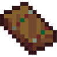
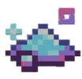

# 🛠️ Les Outils

## 💠 <mark style="color:green;">Quelques informations... ?</mark> 📃

Les <mark style="color:green;">**Outils**</mark>, en plus de leur fonction principale, vous offrent également des enchantements qui sont, pour certains, non possibles en vanilla. Mais également des effets pouvant faciliter votre farm du métier.

Également, les différents <mark style="color:green;">**outils**</mark> vous permettent de compléter votre **<mark style="color:green;">`/collection`</mark>** afin d’obtenir un <mark style="color:green;">**tag exclusif**</mark> lorsque la <mark style="color:green;">**collection complète**</mark> a été réunie. Cela ajoute un objectif supplémentaire pour les joueurs souhaitant <mark style="color:green;">**collectionner et se démarquer**</mark> sur le serveur.

Ces <mark style="color:green;">**différents outils**</mark> sont trouvables dans différentes [<mark style="color:green;">**caisses du serveur**</mark>](https://wiki.evolucraft.fr/le-gameplay/les-caisses), lors des <mark style="color:green;">**événements temporaires**</mark>, dans les [<mark style="color:green;">**Récompenses de métiers**</mark>](https://wiki.evolucraft.fr/le-gameplay/les-metiers#progression) ou encore [<mark style="color:green;">**l'hôtel de vente**</mark>](https://wiki.evolucraft.fr/le-gameplay/le-commerce#hotel-des-ventes).

Les <mark style="color:green;">**outils non vanilla**</mark> sont <mark style="color:green;">**réparables**</mark> avec la commande <mark style="color:green;">**`/forgeron`**</mark>, contre de <mark style="color:green;">**l'argent**</mark> et des <mark style="color:green;">**levels d'expériences vanilla**</mark> qui vous seront affichés à la réalisation de la commande avec l'outil en main <mark style="color:green;">**SAUF pour les outils de l'Aventurier**</mark>.

## 💠 <mark style="color:green;">Liste des Outils existantes ?</mark> 📑

Afin d’avoir une lecture plus agréable, nous avons répertorié les <mark style="color:green;">**outils**</mark> selon leur <mark style="color:green;">**catégorie de rareté**</mark>. Chaque catégorie permet d’identifier rapidement la <mark style="color:green;">**puissance et la valeur**</mark> de l’objet, facilitant ainsi votre choix lors de vos futures acquisitions. Cette organisation vous aidera à mieux comprendre la <mark style="color:green;">**progression des outils**</mark> et à repérer ceux qui correspondent le mieux à vos besoins et à votre niveau.

> [!NOTE]
> <mark style="color:green;">L’aperçu des outils n’est pas encore disponible</mark>. Il arrivera dans une <mark style="color:green;">mise à jour future du wiki</mark>. Merci de votre <mark style="color:green;">compréhension</mark> !

* 🤠 [<mark style="color:green;"><strong>Outils de l'Aventurier</strong></mark>](https://wiki.evolucraft.fr/le-codex/outils/aventurier)
* ✳️ [<mark style="color:green;"><strong>Outils en Émeraude</strong></mark>](https://wiki.evolucraft.fr/le-codex/outils/emeraude)
  * 🛠️ [<mark style="color:green;"><strong>Outils Émeraude Basique</strong></mark>](https://wiki.evolucraft.fr/le-codex/outils/emeraude#outils-en-émeraude)
  * ✨ [<mark style="color:green;"><strong>Outils Émeraude Shiny</strong></mark>](https://wiki.evolucraft.fr/le-codex/outils/emeraude#outils-en-émeraude-shiny)
* 🔻 [<mark style="color:red;"><strong>Outils en Rubis</strong></mark>](https://wiki.evolucraft.fr/le-codex/outils/rubis)
  * 🛠️ [<mark style="color:red;"><strong>Outils Rubis Basique</strong></mark>](https://wiki.evolucraft.fr/le-codex/outils/emeraude#outils-en-rubis)
  * ✨ [<mark style="color:red;"><strong>Outils Rubis Shiny</strong></mark>](https://wiki.evolucraft.fr/le-codex/outils/emeraude#outils-en-rubis-shiny)
* 💎 [<mark style="color:blue;"><strong>Outils de l'Émérite</strong></mark>](https://wiki.evolucraft.fr/le-codex/outils/emerite)
* 🛠️ [<mark style="color:yellow;"><strong>Outils des Métiers</strong></mark>](https://wiki.evolucraft.fr/le-codex/outils/metiers)
* 👨‍🎓 [<mark style="color:blue;"><strong>Outils de Maître</strong></mark>](https://wiki.evolucraft.fr/le-codex/outils/maitre)
* 📈 [<mark style="color:yellow;"><strong>Outils Évolutifs</strong></mark>](https://wiki.evolucraft.fr/le-codex/outils/evolutive)
* 🎁 [<mark style="color:green;"><strong>Outils des Caisses Évènements</strong></mark>](https://wiki.evolucraft.fr/le-codex/outils/caisses)
  * 🌊 [<mark style="color:blue;"><strong>Outils Abyssaux</strong></mark>](https://wiki.evolucraft.fr/le-codex/outils/caisses#outils-abyssaux)
  * 🏴‍☠️ [<mark style="color:yellow;"><strong>Outils Conquistadors</strong></mark>](https://wiki.evolucraft.fr/le-codex/outils/caisses#outils-conquistadors)
  * 🧊 [<mark style="color:blue;"><strong>Outils des Glaces</strong></mark>](https://wiki.evolucraft.fr/le-codex/outils/caisses#outils-des-glaces)
  * 👼 [<mark style="color:red;"><strong>Outils Cupidons</strong></mark>](https://wiki.evolucraft.fr/le-codex/outils/caisses#outils-cupidon)
  * 🍀 [<mark style="color:green;"><strong>Outils du Leprechaun</strong></mark>](https://wiki.evolucraft.fr/le-codex/outils/caisses#outils-du-leprechaun)
  * 🦴 [<mark style="color:orange;"><strong>Outils de l'Archéologue</strong></mark>](https://wiki.evolucraft.fr/le-codex/outils/caisses#outils-de-larchéologue)
  * 🍪 [<mark style="color:red;"><strong>Outils Pain d'épice</strong></mark>](https://wiki.evolucraft.fr/le-codex/outils/caisses#outils-pain-dépice)
  * 🎑 [<mark style="color:green;"><strong>Outils de Jade</strong></mark>](https://wiki.evolucraft.fr/le-codex/outils/caisses##outils-de-jade)
* 🧊 [<mark style="color:blue;"><strong>Outils des Glaces</strong></mark>](https://wiki.evolucraft.fr/le-codex/outils/glaces)
* 🐍 [<mark style="color:green;"><strong>Outils du Serpent</strong></mark>](https://wiki.evolucraft.fr/le-codex/outils/serpent)
* 💕 [<mark style="color:red;"><strong>Outils de l'Amour</strong></mark>](https://wiki.evolucraft.fr/le-codex/outils/amour)
* 👼 [<mark style="color:red;"><strong>Outils du Cupidon</strong></mark>](https://wiki.evolucraft.fr/le-codex/outils/cupidon)
* 🍀 [<mark style="color:green;"><strong>Outils du Leprechaun</strong></mark>](https://wiki.evolucraft.fr/le-codex/outils/leprechaun)
* ⚙️ [<mark style="color:orange;"><strong>Outils HolyCube</strong></mark>](https://wiki.evolucraft.fr/le-codex/outils/holycube)
* 🥚 [<mark style="color:yellow;"><strong>Outils de Pâques</strong></mark>](https://wiki.evolucraft.fr/le-codex/outils/paques2025)
* 🐲 [<mark style="color:red;"><strong>Outils Draconique édition 2025</strong></mark>](https://wiki.evolucraft.fr/le-codex/outils/draconique2025)
* 🐉 [<mark style="color:blue;"><strong>Outils Saphira</strong></mark>](https://wiki.evolucraft.fr/le-codex/outils/saphira)
* 💫 [<mark style="color:blue;"><strong>Outils Sompteueux</strong></mark>](https://wiki.evolucraft.fr/le-codex/outils/sompteueux)
* ⚒️ [<mark style="color:green;"><strong>Autres Outils</strong></mark>](https://wiki.evolucraft.fr/le-codex/outils/autre)

## 💠 <mark style="color:green;">Des avantages supplémentaire ?</mark> 😵

Depuis la mise à jour <mark style="color:green;">**Summer 2025**</mark>, vous pouvez désormais ajouter des <mark style="color:green;">**avantages spéciaux**</mark> à vos outils ou armes lorsque vous les tenez en main. Cette fonctionnalité est particulièrement utile pour <mark style="color:green;">**optimiser vos performances**</mark> sans dépendre constamment de vos <mark style="color:green;">**pets à effet**</mark>. Ces bonus apportent une nouvelle dimension stratégique à votre gameplay, vous permettant d’adapter vos outils/armes à votre <mark style="color:green;">**style de jeu et vos besoins**</mark> selon la situation.

> [!NOTE]
> <mark style="color:green;"><strong>Ces items d'avantage</strong></mark> ne <mark style="color:green;"><strong>peuvent pas être appliqués</strong></mark> sur les <mark style="color:green;"><strong>différents Sceptres</strong></mark>, <mark style="color:green;"><strong>Bâtons du Vent</strong></mark> ou encore <mark style="color:green;"><strong>Armures</strong></mark> (Elytre y compris). 

### 🛡️ ◦ <mark style="color:green;">Adamantium</mark>
<table border="1" cellspacing="0" cellpadding="6">
  <tr>
    <td align="center"><strong><ins>Nom</ins> 🏷️</strong></td>
    <td align="center"><strong><ins>Obtention</ins> 🎁</strong></td>
  </tr>
  <tr>
   <td><figure align="left"><figcaption>
<strong>Aperçu de l'item <mark style="color:green;">Adamantium</mark></strong>
</figcaption></figure></td>
   <td><a href="https://wiki.evolucraft.fr/le-gameplay/les-caisses#caisse-summer"><mark style="color:blue;">Caisse Summer 🏖️</mark></a></td>
  </tr>
  <tr>
   <td><figure align="left"></figure><figcaption>
<strong>Aperçu de l'item <mark style="color:green;">Adamantium de Noël</mark></strong>
</figcaption></figure></td>
   <td><a href="https://wiki.evolucraft.fr/le-gameplay/les-caisses#caisse-pain-depice"><mark style="color:red;">Caisse Pain d'épice 🍪</mark></a></td>
  </tr>
</table>

L’<mark style="color:green;">**Adamantium**</mark> confère à votre <mark style="color:green;">**outil**</mark> sur lequel il est appliqué la propriété d’être <mark style="color:green;">**incassable**</mark>. Vous n’aurez plus jamais à vous préoccuper de la <mark style="color:green;">**durabilité**</mark> de votre équipement.

### ✨ ◦ <mark style="color:green;">Poussière d'Étoile</mark>
<figure align="left"><figcaption>
<strong>Aperçu de l'item <mark style="color:green;">Poussière d'Étoile</mark></strong>
</figcaption></figure>

La <mark style="color:green;">**Poussière d'Étoile**</mark> vous procurera des [<mark style="color:green;">**effets de Minecraft Vanilla**</mark>](https://fr.minecraft.wiki/w/Effet) et sont exclusivement <mark style="color:green;">**positifs**</mark>. Vous n’avez donc aucune crainte d'avoir comme <mark style="color:green;">**poison**</mark> sur votre <mark style="color:green;">**pioche évolutive**</mark> 😌.

> [!WARNING]
> L'action d'application est irréversible. C'est-à-dire qu'une fois appliqué, vous ne pouvez plus modifier son effet ni le retirer.

