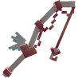
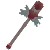

# 💕 Outils Amour

## 🔷 <mark style="color:green;">Son obtention 🤔</mark>

#### Les <mark style="color:green;">**outils Amour**</mark> s'obtennaient dans la <mark style="color:green;">**boutique Saint-Valentin**</mark> durant l'<mark style="color:green;">**évènement Saint-Valentin de 2025**</mark>


Cette commande <mark style="color:green;">**n'est plus disponible**</mark>. Les items sont donc obtenable uniquement à <mark style="color:green;">l'achat entre joueurs</mark> ou dans [<mark style="color:green;">l'hôtel de vente</mark>](https://wiki.evolucraft.fr/le-gameplay/le-commerce#hotel-des-ventes).


## 🔷 <mark style="color:green;">Son aperçue 🔍</mark>

<table border="1" cellspacing="0" cellpadding="6">
  <tr>
    <td align="center"><strong><ins>Nom</ins> 🏷️</strong></td>
    <td align="center"><strong><ins>Enchentement</ins> 📖</strong></td>
    <td align="center"><strong><ins>Durabilité</ins> 📏</strong></td>
  </tr>
  <tr>
   <td align="center">
     
<mark style="color:red;"><strong>Épée de l'Amour</strong></mark>

     
<figure></figure>

   </td>
   <td>
     
▸ <mark style="color:red;"><strong>Tranchant V</strong></mark>

     
▸ <mark style="color:red;"><strong>Châtiment VI</strong></mark>

     
▸ <mark style="color:red;"><strong>Fléau des arthropodes VI</strong></mark>

     
▸ <mark style="color:red;"><strong>Affliage III</strong></mark>

     
▸ <mark style="color:red;"><strong>Butin III</strong></mark>

   </td>
   <td align="center">
     
<mark style="color:red;"><strong>1 750</strong></mark> de <mark style="color:red;"><strong>Durabilitées</strong></mark>

   </td>
  </tr>
  <tr>
   <td align="center">
     
<mark style="color:red;"><strong>Pioche de l'Amour</strong></mark>

     
<figure></figure>

   </td>
   <td>
     
▸ <mark style="color:red;"><strong>Efficacité VI</strong></mark>

     
▸ <mark style="color:red;"><strong>Fortune III</strong></mark>

   </td>
   <td align="center">
     
<mark style="color:red;"><strong>1 500</strong></mark> de <mark style="color:red;"><strong>Durabilitées</strong></mark>

   </td>
  </tr>  
  <tr>
   <td align="center">
     
<mark style="color:red;"><strong>Hache de l'Amour</strong></mark>

     
<figure></figure>

   </td>
   <td>
     
▸ <mark style="color:red;"><strong>Efficacité VI</strong></mark>

   </td>
   <td align="center">
     
<mark style="color:red;"><strong>1 500</strong></mark> de <mark style="color:red;"><strong>Durabilitées</strong></mark>

   </td>
  </tr>
  <tr>
   <td align="center">
     
<mark style="color:red;"><strong>Houe de l'Amour</strong></mark>

     
<figure></figure>

   </td>
   <td>
     
▸ <mark style="color:red;"><strong>Efficacité V</strong></mark>

     
▸ <mark style="color:red;"><strong>Fortune IV</strong></mark>

   </td>
   <td align="center">
     
<mark style="color:red;"><strong>3 000</strong></mark> de <mark style="color:red;"><strong>Durabilitées</strong></mark>

   </td>
  </tr>
  <tr>
   <td align="center">
     
<mark style="color:red;"><strong>Canne à pêche de l'Amour</strong></mark>

     
<figure></figure>

   </td>
   <td>
     
▸ <mark style="color:red;"><strong>Chance de la Mer IV</strong></mark>

     
▸ <mark style="color:red;"><strong>Appât IV</strong></mark>

   </td>
   <td align="center">
     
<mark style="color:red;"><strong>1 500</strong></mark> de <mark style="color:red;"><strong>Durabilitées</strong></mark>

   </td>
  </tr>  
  <tr>
   <td align="center">
     
<mark style="color:red;"><strong>Pelle de l'Amour</strong></mark>

     
<figure></figure>

   </td>
   <td>
     
▸ <mark style="color:red;"><strong>Efficaciter VI</strong></mark>

     
▸ <mark style="color:red;"><strong>Toucher de Soi</strong></mark>

   </td>
   <td align="center">
     
<mark style="color:red;"><strong>3 000</strong></mark> de <mark style="color:red;"><strong>Durabilitées</strong></mark>

   </td>
  </tr>
</table>
