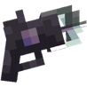
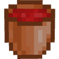
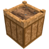
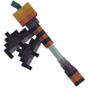
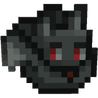
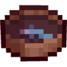
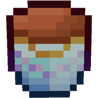
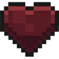

# ⚒️ Autres Outils

## 💠 <mark style="color:green;">Quelques informations... ?</mark> 📃

Ces <mark style="color:green;">**outils spéciaux**</mark> ont un rôle légèrement différent : contrairement aux <mark style="color:green;">**outils classiques**</mark> destinés à faciliter la progression dans vos métiers, ceux-ci agissent davantage comme des <mark style="color:green;">**accessoires pratiques**</mark>. Ils sont conçus pour vous aider dans vos <mark style="color:green;">**constructions**</mark> ou lors de vos <mark style="color:green;">**recherches**</mark>.

## 💠 <mark style="color:green;">Les autres outils</mark>

### 🪣 ◦ <mark style="color:green;">Grappin</mark>

🔹 Le <mark style="color:green;">Grappin</mark> s'obtient dans les [<mark style="color:orange;">enchères</mark>](https://wiki.evolucraft.fr/le-gameplay/les-evenements#encheres).

<table border="1" cellspacing="0" cellpadding="6">
  <td>
    
<figure><figcaption></figcaption></figure>

  </td>
  <td><mark style="color:green;"><strong>500</strong></mark> de <mark style="color:green;"><strong>Durabilitées</strong></mark></td>
  <td>Ce <mark style="color:green;">grappin</mark> vous permet de <mark style="color:green;">vous déplacer</mark> comme un <mark style="color:green;">arc tridimensionnel</mark>, plus rapidement, mais avec une <mark style="color:green;">durabilité limitée</mark>. Il est également pratique pour accompagner les <mark style="color:green;">élytres</mark> lors de la <mark style="color:green;">recherche de portails de donjons</mark> !</td>
</table>

### 🪣 ◦ <mark style="color:green;">Seau d'eau infini</mark>

🔹 Le <mark style="color:green;">seau d'eau infini</mark> s'obtient dans la [<mark style="color:orange;">caisse Draconique</mark>](https://wiki.evolucraft.fr/le-gameplay/les-caisses#caisse-draconique).

<table border="1" cellspacing="0" cellpadding="6">
  <td><figure></figure></td>
  <td>Ce <mark style="color:green;">seau d’eau infini</mark> vous permet de remplir vos <mark style="color:green;">blocs d’eau</mark> comme un <mark style="color:green;">seau classique</mark>, mais sans jamais avoir besoin de le recharger. Très pratique pour la <mark style="color:green;">construction de vos champs</mark> ou tout autre <mark style="color:green;">construction</mark>.</td>
</table>

### ⛲ ◦ <mark style="color:green;">Arroseur automatique</mark>

🔹 L'<mark style="color:green;">arroseur automatique</mark> s'obtient dans la <a href="https://wiki.evolucraft.fr/le-gameplay/les-caisses#caisse-aux-tresors"><mark style="color:yellow;">caisse aux Trésors</mark></a> ou dans la <mark style="color:green;">boutique du `/newworld`</mark> pour <mark style="color:green;">20 000 Viandes de poissons</mark>.

<table border="1" cellspacing="0" cellpadding="6">
  <td><figure></figure></td>
  <td>L’<mark style="color:green;">arroseur automatique</mark> vous permet, uniquement pour <mark style="color:green;">les plantes</mark> issues du <a href="https://wiki.evolucraft.fr/le-gameplay/mondes#le-new-world"><mark style="color:green;"><strong>/newworld</strong></mark></a>, d’arroser automatiquement la <mark style="color:green;">terre en pot</mark> sur une zone de <mark style="color:green;">3x3</mark>. Grâce à lui, vos <mark style="color:green;">plantes pousseront plus facilement</mark> sans avoir besoin d’une intervention manuelle.</td>
</table>

### 🌱 ◦ <mark style="color:green;">Terre en pot</mark>

🔹 La <mark style="color:green;">terre en pot</mark> s'obtient dans la [<mark style="color:yellow;">caisse aux Trésors</mark>](https://wiki.evolucraft.fr/le-gameplay/les-caisses#caisse-aux-tresors) en lot de 32, ou dans la <mark style="color:green;">boutique du `/newworld`</mark> pour <mark style="color:green;">en lot de 4, pour 2 500 Viandes de poissons</mark>.

<table border="1" cellspacing="0" cellpadding="6">
  <td><figure></figure></td>
  <td>La <mark style="color:green;">terre en pot</mark> vous permet de faire pousser uniquement le <mark style="color:green;">maïs</mark> et les <mark style="color:green;">tomates</mark>, issus du <a href="https://wiki.evolucraft.fr/le-gameplay/mondes#le-new-world"><mark style="color:green;"><strong>/newworld</strong></mark></a>. Elle sert donc à créer un <mark style="color:green;">champ spécial</mark> dédié à ces plantes uniques.</td>
</table>

### 🪄 ◦ <mark style="color:green;">Sceptre du bâtisseur</mark>

🔹 Le <mark style="color:green;">sceptre du bâtisseur</mark> s'obtient dans la [<mark style="color:orange;">caisse Halloween</mark>](https://wiki.evolucraft.fr/le-gameplay/les-caisses#caisse-halloween).

<table border="1" cellspacing="0" cellpadding="6">
  <td><figure></figure></td>
  <td><mark style="color:green;"><strong>600</strong></mark> de <mark style="color:green;"><strong>Durabilitées</strong></mark></td>
  <td>Ce <mark style="color:green;">sceptre du bâtisseur</mark> vous permet de poser plusieurs <mark style="color:green;">blocs alignés</mark> en un seul clic, selon une <mark style="color:green;">liste de blocs définie</mark>. Il vous fera gagner un <mark style="color:green;">temps considérable</mark> lors de vos <mark style="color:green;">constructions géantes</mark> et facilitera grandement vos projets architecturaux.</td>
</table>

### 🎒 ◦ <mark style="color:green;">Sac Chauve-Souris</mark>

🔹 Le <mark style="color:green;">sac Chauve-Souris</mark> s'obtient dans la [<mark style="color:orange;">caisse Halloween</mark>](https://wiki.evolucraft.fr/le-gameplay/les-caisses#caisse-halloween).

<table border="1" cellspacing="0" cellpadding="6">
  <td><figure></figure></td>
  <td><mark style="color:green;"><strong>9 stacks d'items</strong></mark></td>
  <td>Ce <mark style="color:green;">sac chauve-souris</mark> vous permet de <mark style="color:green;">stocker des items</mark> à l’intérieur, agissant comme un véritable <mark style="color:green;">sac à dos portable</mark>. Très pratique pour <mark style="color:green;">gagner de la place</mark> dans votre inventaire et <mark style="color:green;">accéder rapidement</mark> à vos outils par exemple quand vous en avez besoin.</td>
</table>

### 🧭 ◦ <mark style="color:green;">Traqueur de Donjon</mark>

🔹 Le <mark style="color:green;">traqueur de donjon</mark> s'obtient dans la [<mark style="color:yellow;">caisse de Pâques</mark>](https://wiki.evolucraft.fr/le-gameplay/les-caisses#caisse-paques).

<table border="1" cellspacing="0" cellpadding="6">
  <td><figure></figure></td>
  <td><mark style="color:green;"><strong>20</strong></mark> d'<mark style="color:green;"><strong>Utilisations</strong></mark></td>
  <td>Ce <mark style="color:green;">traqueur de donjon</mark> vous permet, en plus des méthodes déjà existantes pour <mark style="color:green;">trouver des donjons</mark>, de <mark style="color:green;">localiser plus facilement</mark> celui qui se trouve le plus proche de vous. Un outil idéal pour <mark style="color:green;">gagner du temps</mark> et <mark style="color:green;">optimiser vos explorations</mark> sans passer des heures à chercher.</td>
</table>

### 🪣 ◦ <mark style="color:green;">Seau vide infini</mark>

🔹 Le <mark style="color:green;">seau vide infini</mark> s'obtient dans la [<mark style="color:yellow;">caisse de Pâques</mark>](https://wiki.evolucraft.fr/le-gameplay/les-caisses#caisse-paques).

<table border="1" cellspacing="0" cellpadding="6">
  <td><figure></figure></td>
  <td>Ce <mark style="color:green;">seau vide infini</mark> vous permet, à l'inverse du seau d'eau infini, d'enlever vos <mark style="color:green;">source d’eau</mark> comme un <mark style="color:green;">seau vide classique</mark>, mais sans jamais avoir besoin de le vider. Très pratique pour la <mark style="color:green;">construction en pleine océan</mark> par exemple.</td>
</table>

### 💜 ◦ <mark style="color:green;">Coeur du Démon</mark>

🔹 Le <mark style="color:green;">coeur du démon</mark> s'obtient dans la [<mark style="color:yellow;">caisse Lune de Sang</mark>](https://wiki.evolucraft.fr/le-gameplay/les-caisses#caisse-lune-de-sang).

<table border="1" cellspacing="0" cellpadding="6">
  <td><figure></figure></td>
  <td>Ce <mark style="color:green;">cœur du démon</mark> vous permet, en le mangeant, de restaurer votre <mark style="color:green;">barre de faim</mark> et ainsi de bénéficier d’une <mark style="color:green;">source de nourriture illimitée</mark>.</td>
</table>
