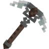
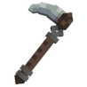
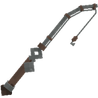
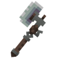

# 🤠 Outils de l'Aventurier


**⚠️ ATTENTION :** Les <mark style="color:green;">**outils de l'Aventurier**</mark> ne sont <mark style="color:green;">**pas réparables**</mark> avec le <mark style="color:green;">**`/forgeron`**</mark>, dès qu'ils <mark style="color:green;">**tombent à 0 de durabilité**</mark>, ils <mark style="color:green;">**sont alors inutilisable**</mark> à tout jamais.


## 🔹 <mark style="color:blue;">Son obtention 🤔</mark>

Les <mark style="color:green;">outils de l'Aventurier</mark> s'obtiennent dans la [<mark style="color:green;">caisse Vote</mark>](https://wiki.evolucraft.fr/le-gameplay/les-caisses#caisse-vote).

## 🔹 <mark style="color:blue;">Son aperçue 🔍</mark>

<table border="1" cellspacing="0" cellpadding="6">
  <tr>
    <td><mark style="color:green;"><strong>Nom 🏷️</strong></mark></td>
    <td><mark style="color:green;"><strong>Enchentement 📖</strong></mark></td>
    <td><mark style="color:green;"><strong>Durabilité 📏</strong></mark></td>
    <td><mark style="color:green;"><strong>Effet ✨</strong></mark></td>    
  </tr>
  <tr>
   <td align="center">
     
<mark style="color:green;"><strong>Épée de l'aventurier</strong></mark>

     
<figure></figure>

   </td>
   <td>
     
● <mark style="color:green;"><strong>Tranchant V</strong></mark>

     
● <mark style="color:green;"><strong>Châtiment VI</strong></mark>

     
● <mark style="color:green;"><strong>Fléau des Arthopodes VI</strong></mark>

     
● <mark style="color:green;"><strong>Affliage III</strong></mark>

     
● <mark style="color:green;"><strong>Butin III</strong></mark>

   </td>
   <td>
     
● <mark style="color:green;"><strong>150</strong></mark> de <mark style="color:green;"><strong>Durabilitées</strong></mark>

   </td>
   <td>  
     
● <mark style="color:green;"><strong>Aucun Effet Supplémentaire</strong></mark>

   </td>
  </tr>
  <tr>
   <td align="center">
     
<mark style="color:green;"><strong>Pioche de l'aventurier</strong></mark>

     
<figure></figure>

   </td>
   <td>
     
● <mark style="color:green;"><strong>Efficacité VI</strong></mark>

     
● <mark style="color:green;"><strong>Fortune III</strong></mark>

   </td>
   <td>
     
● <mark style="color:green;"><strong>150</strong></mark> de <mark style="color:green;"><strong>Durabilitées</strong></mark>

   </td>
   <td>  
     
● <mark style="color:green;"><strong>Aucun Effet Supplémentaire</strong></mark>

   </td>
  </tr>
  <tr>
   <td align="center">
     
<mark style="color:green;"><strong>Houe de l'aventurier</strong></mark>

     
<figure></figure>

   </td>
   <td>
     
● <mark style="color:green;"><strong>Efficacité V</strong></mark>

     
● <mark style="color:green;"><strong>Fortune IV</strong></mark>

   </td>
   <td>
     
● <mark style="color:green;"><strong>150</strong></mark> de <mark style="color:green;"><strong>Durabilitées</strong></mark>

   </td>
   <td>  
     
● <mark style="color:green;"><strong>Effet Magnet</strong></mark> : Vous permet de récolter les cultures cassées.

     
● <mark style="color:green;"><strong>Effet Farmer</strong></mark> : Casse et replante dans une zone de 1X1.

   </td>
  </tr>
  <tr>
   <td align="center">
     
<mark style="color:green;"><strong>Canne à pêche de l'aventurier</strong></mark>

     
<figure></figure>

   </td>
   <td>
     
● <mark style="color:green;"><strong>Chance de la Mer IV</strong></mark>

     
● <mark style="color:green;"><strong>Appât IV</strong></mark>

   </td>
   <td>
     
● <mark style="color:green;"><strong>50</strong></mark> de <mark style="color:green;"><strong>Durabilitées</strong></mark>

   </td>
   <td>  
     
● <mark style="color:green;"><strong>Aucun Effet Supplémentaire</strong></mark>

   </td>
  </tr>
  <tr>
   <td align="center">
     
<mark style="color:green;"><strong>Hache de l'aventurier</strong></mark>

     
<figure></figure>

   </td>
   <td>
     
● <mark style="color:green;"><strong>Efficaciter VI</strong></mark>

   </td>
   <td>
     
● <mark style="color:green;"><strong>150</strong></mark> de <mark style="color:green;"><strong>Durabilitées</strong></mark>

   </td>
   <td>  
     
● <mark style="color:green;"><strong>Aucun Effet Supplémentaire</strong></mark>

   </td>
  </tr>
</table>
