# 🎁 Outils des Caisses Évènements

Ces <mark style="color:green;">**outils**</mark> disponibles via les <mark style="color:green;">**caisses d'événements**</mark> offrent des <mark style="color:green;">**enchante­ments puissants**</mark> et une <mark style="color:green;">**durabilité exceptionnelle**</mark>, idéale pour progresser rapidement dans vos métiers. 

Leur rareté et leur ancienneté en font des objets de <mark style="color:green;">**prestige**</mark>, recherchés par les collectionneurs et les vétérans du serveur. Posséder l’un de ces outils, c’est afficher votre <mark style="color:green;">**expérience et votre dévouement**</mark> dans l’univers d’Évolucraft.

## 🌊◦ <mark style="color:blue;">Outils Abyssaux</mark>

### 🔹 <ins>Son obtention</ins>🤔

Les <mark style="color:green;">outils abyssaux</mark> s'obtiennent dans la [<mark style="color:blue;">caisse Abyssal</mark>](https://wiki.evolucraft.fr/le-gameplay/les-caisses#caisse-abyssal).

### 🔹 <ins>Son aperçue</ins>🔍

<table border="1" cellspacing="0" cellpadding="6">
  <tr>
    <td align="center"><strong><ins>Nom</ins> 🏷️</strong></td>
    <td align="center"><strong><ins>Enchentement</ins> 📖</strong></td>
    <td align="center"><strong><ins>Durabilité</ins> 📏</strong></td>
    <td align="center"><strong><ins>Effet</ins> ✨</strong></td>    
  </tr>
  <tr>
   <td align="center">
     
<mark style="color:blue;"><strong>Houe Abyssal</strong></mark>

     
<figure>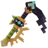</figure>

   </td>
   <td>
     
▸ <mark style="color:blue;"><strong>Solidité I</strong></mark>

   </td>
   <td align="center">
     
<mark style="color:blue;"><strong>1 500</strong></mark> de <mark style="color:blue;"><strong>Durabilitées</strong></mark>

   </td>
   <td>  
     
▸ <mark style="color:blue;"><strong>Effet Bêche</strong></mark> : Bêche les blocks de terre dans une zone de 5x5.

   </td>
  </tr>
  <tr>
</table>

## 🏴‍☠️◦ <mark style="color:yellow;">Outils Conquistadors</mark>

### 🔹 <ins>Son obtention</ins>🤔

Les <mark style="color:green;">outils conquistadors</mark> s'obtiennent dans la [<mark style="color:yellow;">caisse aux Trésors</mark>](https://wiki.evolucraft.fr/le-gameplay/les-caisses#caisse-aux-tresors).

### 🔹 <ins>Son aperçue</ins>🔍

<table border="1" cellspacing="0" cellpadding="6">
  <tr>
    <td align="center"><strong><ins>Nom</ins> 🏷️</strong></td>
    <td align="center"><strong><ins>Enchentement</ins> 📖</strong></td>
    <td align="center"><strong><ins>Durabilité</ins> 📏</strong></td>
    <td align="center"><strong><ins>Effet</ins> ✨</strong></td>    
  </tr>
  <tr>
   <td align="center">
     
<mark style="color:yellow;"><strong>Épée du Conquistador</strong></mark>

     
<figure>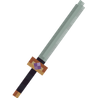</figure>

   </td>
   <td>
     
▸ <mark style="color:yellow;"><strong>Tranchant V</strong></mark>

     
▸ <mark style="color:yellow;"><strong>Châtiment VI</strong></mark>

     
▸ <mark style="color:yellow;"><strong>Fléau des Arthropodes VI</strong></mark>

     
▸ <mark style="color:yellow;"><strong>Affliage III</strong></mark>

     
▸ <mark style="color:yellow;"><strong>Butin IV</strong></mark>

     
▸ <mark style="color:yellow;"><strong>Solidité I</strong></mark>

   </td>
   <td align="center">
     
<mark style="color:yellow;"><strong>3 000</strong></mark> de <mark style="color:yellow;"><strong>Durabilitées</strong></mark>

   </td>
   <td>  
     
▸ <mark style="color:yellow;"><strong>Effet Dextérité</strong></mark> : Frappe 10% plus vite.

   </td>
  </tr>
  <tr>
   <td align="center">
     
<mark style="color:yellow;"><strong>Pioche du Conquistador</strong></mark>

     
<figure>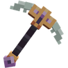</figure>

   </td>
   <td>
     
▸ <mark style="color:yellow;"><strong>Efficacité V</strong></mark>

     
▸ <mark style="color:yellow;"><strong>Fortune III</strong></mark>

     
▸ <mark style="color:yellow;"><strong>Solidité I</strong></mark>

   </td>
   <td align="center">
     
<mark style="color:yellow;"><strong>3 000</strong></mark> de <mark style="color:yellow;"><strong>Durabilitées</strong></mark>

   </td>
   <td>  
     
▸ <mark style="color:yellow;"><strong>Effet Excavation</strong></mark> : Mine tout le filon du minerais miné.

   </td>
  </tr>
  <tr>
   <td align="center">
     
<mark style="color:yellow;"><strong>Hache du Conquistador</strong></mark>

     
<figure>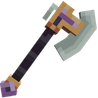</figure>

   </td>
   <td>
     
▸ <mark style="color:yellow;"><strong>Efficacité VII</strong></mark>

     
▸ <mark style="color:yellow;"><strong>Solidité I</strong></mark>

   </td>
   <td align="center">
     
<mark style="color:yellow;"><strong>3 000</strong></mark> de <mark style="color:yellow;"><strong>Durabilitées</strong></mark>

   </td>
   <td>  
     
▸ <mark style="color:yellow;"><strong>Effet Bûcheron</strong></mark> : Coupe un petit arbre en entier dès une bûche cassée.

   </td>
  </tr>
  <tr>
   <td align="center">
     
<mark style="color:yellow;"><strong>Houe du Conquistador</strong></mark>

     
<figure>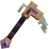</figure>

   </td>
   <td>
     
▸ <mark style="color:yellow;"><strong>Efficacité VI</strong></mark>

     
▸ <mark style="color:yellow;"><strong>Solidité I</strong></mark>

   </td>
   <td align="center">
     
<mark style="color:yellow;"><strong>9 000</strong></mark> de <mark style="color:yellow;"><strong>Durabilitées</strong></mark>

   </td>
   <td>  
     
▸ <mark style="color:yellow;"><strong>Effet Magnet</strong></mark> : Vous permet de récolter les cultures cassées.

     
▸ <mark style="color:yellow;"><strong>Effet Farmer</strong></mark> : Casse et replante dans une zone de 3X3.

   </td>
  </tr>
  <tr>
   <td align="center">
     
<mark style="color:yellow;"><strong>Canne à Pêche du Conquistador</strong></mark>

     
<figure>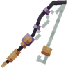</figure>

   </td>
   <td>
     
▸ <mark style="color:yellow;"><strong>Chance de la mer V</strong></mark>

     
▸ <mark style="color:yellow;"><strong>Appât V</strong></mark>

     
▸ <mark style="color:yellow;"><strong>Solidité I</strong></mark>

   </td>
   <td align="center">
     
<mark style="color:yellow;"><strong>1 500</strong></mark> de <mark style="color:yellow;"><strong>Durabilitées</strong></mark>

   </td>
   <td>  
     
▸ <mark style="color:yellow;"><strong>Effet Pêche</strong></mark> : Vous avez 10% de chance de doubler votre pêche.

   </td>
  </tr>
</table>

## 🧊◦ <mark style="color:blue;">Outils des Glaces</mark>

### 🔹 <ins>Son obtention</ins>🤔

Les <mark style="color:green;">outils des Glaces</mark> s'obtiennent dans la [<mark style="color:blue;">caisse Givrée</mark>](https://wiki.evolucraft.fr/le-gameplay/les-caisses#caisse-givree).

### 🔹 <ins>Son aperçue</ins>🔍
<table border="1" cellspacing="0" cellpadding="6">
  <tr>
    <td align="center"><strong><ins>Nom</ins> 🏷️</strong></td>
    <td align="center"><strong><ins>Enchentement</ins> 📖</strong></td>
    <td align="center"><strong><ins>Durabilité</ins> 📏</strong></td>
    <td align="center"><strong><ins>Effet</ins> ✨</strong></td>    
  </tr>
  <tr>
   <td align="center">
     
<mark style="color:blue;"><strong>Pioche des Glaces</strong></mark>

     
<figure></figure>

   </td>
   <td>
     
▸ <mark style="color:blue;"><strong>Efficacité VI</strong></mark>

     
▸ <mark style="color:blue;"><strong>Fortune V</strong></mark>

     
▸ <mark style="color:blue;"><strong>Solidité I</strong></mark>

   </td>
   <td align="center">
     
<mark style="color:blue;"><strong>3 000</strong></mark> de <mark style="color:blue;"><strong>Durabilitées</strong></mark>

   </td>
   <td>  
     
▸ <mark style="color:blue;"><strong>Effet Effet Magnet</strong></mark> : Vous permet de récolter les cultures cassées.

   </td>
  </tr>
  <tr>
   <td align="center">
     
<mark style="color:blue;"><strong>Hache des Glaces</strong></mark>

     
<figure></figure>

   </td>
   <td>
     
▸ <mark style="color:blue;"><strong>Efficacité V</strong></mark>

     
▸ <mark style="color:blue;"><strong>Solidité I</strong></mark>

   </td>
   <td align="center">
     
<mark style="color:blue;"><strong>3 000</strong></mark> de <mark style="color:blue;"><strong>Durabilitées</strong></mark>

   </td>
   <td>  
     
▸ <mark style="color:blue;"><strong>Effet Cacao</strong></mark> : Replante le cacao cassé.

   </td>
  </tr>
</table>

## 👼◦ <mark style="color:red;">Outils Cupidon</mark>

### 🔹 <ins>Son obtention</ins>🤔

Les <mark style="color:green;">outils cupidons</mark> s'obtiennent dans la [<mark style="color:red;">caisse Saint-Valentin</mark>](https://wiki.evolucraft.fr/le-gameplay/les-caisses#caisse-saint-valentin).

### 🔹 <ins>Son aperçue</ins>🔍

<table border="1" cellspacing="0" cellpadding="6">
  <tr>
    <td align="center"><strong><ins>Nom</ins> 🏷️</strong></td>
    <td align="center"><strong><ins>Enchentement</ins> 📖</strong></td>
    <td align="center"><strong><ins>Durabilité</ins> 📏</strong></td>
    <td align="center"><strong><ins>Effet</ins> ✨</strong></td>    
  </tr>
  <tr>
   <td align="center">
     
<mark style="color:red;"><strong>Épée du Cupidon</strong></mark>

     
<figure>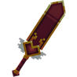</figure>

   </td>
   <td>
     
▸ <mark style="color:red;"><strong>Tranchant V</strong></mark>

     
▸ <mark style="color:red;"><strong>Châtiment VI</strong></mark>

     
▸ <mark style="color:red;"><strong>Fléau des Arthropodes VI</strong></mark>

     
▸ <mark style="color:red;"><strong>Affliage III</strong></mark>

     
▸ <mark style="color:red;"><strong>Butin III</strong></mark>

     
▸ <mark style="color:red;"><strong>Solidité I</strong></mark>

   </td>
   <td align="center">
     
<mark style="color:red;"><strong>1 750</strong></mark> de <mark style="color:red;"><strong>Durabilitées</strong></mark>

   </td>
   <td>  
     
▸ <mark style="color:red;"><strong>Effet Vente Automatique</strong></mark> : Vend les objets récupéré au prix du /shop.

   </td>
  </tr>
  <tr>
   <td align="center">
     
<mark style="color:red;"><strong>Marteau du Cupidon</strong></mark>

     
<figure>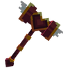</figure>

   </td>
   <td>
     
▸ <mark style="color:red;"><strong>Efficacité V</strong></mark>

     
▸ <mark style="color:red;"><strong>Fortune III</strong></mark>

     
▸ <mark style="color:red;"><strong>Solidité I</strong></mark>

   </td>
   <td align="center">
     
<mark style="color:red;"><strong>3 000</strong></mark> de <mark style="color:red;"><strong>Durabilitées</strong></mark>

   </td>
   <td>  
     
▸ <mark style="color:red;"><strong>Effet Hammer</strong></mark> : Casse les blocks dans une zone de 3X3.

     
▸ <mark style="color:red;"><strong>Effet Vente Automatique</strong></mark> : Vend les objets récupéré au prix du /shop.

   </td>
  </tr>
</table>

## 🍀◦ <mark style="color:green;">Outils du Leprechaun</mark>

### 🔹 <ins>Son obtention</ins>🤔

Les <mark style="color:green;">outils du Leprechaun</mark> s'obtiennent dans la [<mark style="color:green;">caisse Saint-Patrick</mark>](https://wiki.evolucraft.fr/le-gameplay/les-caisses#caisse-saint-patrick).

### 🔹 <ins>Son aperçue</ins>🔍

<table border="1" cellspacing="0" cellpadding="6">
  <tr>
    <td align="center"><strong><ins>Nom</ins> 🏷️</strong></td>
    <td align="center"><strong><ins>Enchentement</ins> 📖</strong></td>
    <td align="center"><strong><ins>Durabilité</ins> 📏</strong></td>
    <td align="center"><strong><ins>Effet</ins> ✨</strong></td>    
  </tr>
  <tr>
   <td align="center">
     
<mark style="color:green;"><strong>Épée du Leprechaun</strong></mark>

     
<figure></figure>

   </td>
   <td>
     
▸ <mark style="color:green;"><strong>Tranchant V</strong></mark>

     
▸ <mark style="color:green;"><strong>Châtiment VI</strong></mark>

     
▸ <mark style="color:green;"><strong>Fléau des Arthropodes VI</strong></mark>

     
▸ <mark style="color:green;"><strong>Affliage III</strong></mark>

     
▸ <mark style="color:green;"><strong>Butin III</strong></mark>

     
▸ <mark style="color:green;"><strong>Solidité I</strong></mark>

   </td>
   <td align="center">
     
<mark style="color:green;"><strong>1 750</strong></mark> de <mark style="color:green;"><strong>Durabilitées</strong></mark>

   </td>
   <td>  
     
▸ <mark style="color:green;"><strong>Effet Bonne Fortune</strong></mark> : Donne 1$ à chaque mob tué.
 <!-- Oui, c'est éclater 🤯 -->
   </td>
  </tr>
  <tr>
   <td align="center">
     
<mark style="color:green;"><strong>Houe du Leprechaun</strong></mark>

     
<figure></figure>

   </td>
   <td>
     
▸ <mark style="color:green;"><strong>Efficacité V</strong></mark>

     
▸ <mark style="color:green;"><strong>Fortune III</strong></mark>

     
▸ <mark style="color:green;"><strong>Solidité I</strong></mark>

   </td>
   <td align="center">
     
<mark style="color:green;"><strong>1 500</strong></mark> de <mark style="color:green;"><strong>Durabilitées</strong></mark>

   </td>
   <td>  
     
▸ <mark style="color:green;"><strong>Effet Bêche</strong></mark> : Bêche les blocks de terre dans une zone de 5x5.

     
▸ <mark style="color:green;"><strong>Effet Farmer</strong></mark> : Casse et replante dans une zone de 3X3.

   </td>
  </tr>
  <tr>
   <td align="center">
     
<mark style="color:green;"><strong>Baton du Vent</strong></mark>

     
<figure></figure>

   </td>
   <td>
     
▸ <mark style="color:green;"><strong>Solidité I</strong></mark>

   </td>
   <td align="center">
     
<mark style="color:green;"><strong>1 000</strong></mark> de <mark style="color:green;"><strong>Durabilitées</strong></mark>

   </td>
   <td>  
     
▸ <mark style="color:green;"><strong>Effet Bourrasque</strong></mark> : Casse les feuilles de l'abre dans une zone de 3X3 blocks en forme de sphère.

   </td>
  </tr>
</table>

## 🦴◦ <mark style="color:orange;">Outils de l'Archéologue</mark>

### 🔹 <ins>Son obtention</ins>🤔

Les <mark style="color:green;">outils de l'archéologues</mark> s'obtiennent dans la [<mark style="color:orange;">caisse Antique</mark>](https://wiki.evolucraft.fr/le-gameplay/les-caisses#caisse-antique).

### 🔹 <ins>Son aperçue</ins>🔍

<table border="1" cellspacing="0" cellpadding="6">
  <tr>
    <td align="center"><strong><ins>Nom</ins> 🏷️</strong></td>
    <td align="center"><strong><ins>Enchentement</ins> 📖</strong></td>
    <td align="center"><strong><ins>Durabilité</ins> 📏</strong></td>
    <td align="center"><strong><ins>Effet</ins> ✨</strong></td>    
  </tr>
  <tr>
   <td align="center">
     
<mark style="color:orange;"><strong>Épée de l'Archéologue</strong></mark>

     
<figure>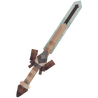</figure>

   </td>
   <td>
     
▸ <mark style="color:orange;"><strong>Tranchant V</strong></mark>

     
▸ <mark style="color:orange;"><strong>Châtiment VI</strong></mark>

     
▸ <mark style="color:orange;"><strong>Fléau des Arthropodes VI</strong></mark>

     
▸ <mark style="color:orange;"><strong>Affliage III</strong></mark>

     
▸ <mark style="color:orange;"><strong>Butin IV</strong></mark>

   </td>
   <td align="center">
     
<mark style="color:orange;"><strong>3 000</strong></mark> de <mark style="color:orange;"><strong>Durabilitées</strong></mark>

   </td>
   <td>  
     
▸ <mark style="color:orange;"><strong>Effet Dextérité</strong></mark> : Frappe 15% plus vite.

   </td>
  </tr>
  <tr>
   <td align="center">
     
<mark style="color:orange;"><strong>Pioche de l'Archéologue</strong></mark>

     
<figure>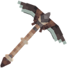</figure>

   </td>
   <td>
     
▸ <mark style="color:orange;"><strong>Efficacité VI</strong></mark>

     
▸ <mark style="color:orange;"><strong>Fortune IV</strong></mark>

   </td>
   <td align="center">
     
<mark style="color:orange;"><strong>3 000</strong></mark> de <mark style="color:orange;"><strong>Durabilitées</strong></mark>

   </td>
   <td>  
     
▸ <mark style="color:orange;"><strong>Effet Excavation</strong></mark> : Mine tout le filon du minerais miné.

   </td>
  </tr>
  <tr>
   <td align="center">
     
<mark style="color:orange;"><strong>Hache de l'Archéologue</strong></mark>

     
<figure>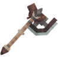</figure>

   </td>
   <td>
     
▸ <mark style="color:orange;"><strong>Efficacité VII</strong></mark>

   </td>
   <td align="center">
     
<mark style="color:orange;"><strong>3 000</strong></mark> de <mark style="color:orange;"><strong>Durabilitées</strong></mark>

   </td>
   <td>  
     
▸ <mark style="color:orange;"><strong>Effet Bûcheron</strong></mark> : Coupe un petit arbre en entier dès une bûche cassée.

   </td>
  </tr>
  <tr>
   <td align="center">
     
<mark style="color:orange;"><strong>Houe de l'Archéologue</strong></mark>

     
<figure>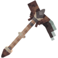</figure>

   </td>
   <td>
     
▸ <mark style="color:orange;"><strong>Efficacité VI</strong></mark>

     
▸ <mark style="color:orange;"><strong>Fortune III</strong></mark>

   </td>
   <td align="center">
     
<mark style="color:orange;"><strong>9 000</strong></mark> de <mark style="color:orange;"><strong>Durabilitées</strong></mark>

   </td>
   <td>  
     
▸ <mark style="color:orange;"><strong>Effet Magnet</strong></mark> : Vous permet de récolter les cultures cassées.

     
▸ <mark style="color:orange;"><strong>Effet Farmer</strong></mark> : Casse et replante dans une zone de 3X3.

   </td>
  </tr>
  <tr>
   <td align="center">
     
<mark style="color:orange;"><strong>Canne à Pêchede l'Archéologue</strong></mark>

     
<figure>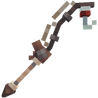</figure>

   </td>
   <td>
     
▸ <mark style="color:orange;"><strong>Chance de la mer V</strong></mark>

     
▸ <mark style="color:orange;"><strong>Appât V</strong></mark>

   </td>
   <td align="center">
     
<mark style="color:orange;"><strong>1 500</strong></mark> de <mark style="color:red;"><strong>Durabilitées</strong></mark>

   </td>
   <td>  
     
▸ <mark style="color:orange;"><strong>Effet Pêche</strong></mark> : Vous avez 15% de chance de doubler votre pêche.

   </td>
  </tr>
  <tr>
   <td align="center">
     
<mark style="color:orange;"><strong>Pelle de l'Archéoloque</strong></mark>

     
<figure>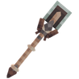</figure>

   </td>
   <td>
     
▸ <mark style="color:orange;"><strong>Efficacité VII</strong></mark>

   </td>
   <td align="center">
     
<mark style="color:orange;"><strong>3 000</strong></mark> de <mark style="color:orange;"><strong>Durabilitées</strong></mark>

   </td>
   <td>
     
▸ <mark style="color:orange;"><strong>Effet Magnet</strong></mark> : Vous permet de récolter les cultures cassées.

   </td>
  </tr>
  <tr>
   <td align="center">
     
<mark style="color:orange;"><strong>Multi-tools de l'Archéologue</strong></mark>

     
<figure>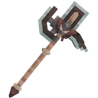</figure>

   </td>
   <td>
     
▸ <mark style="color:orange;"><strong>Efficacité V</strong></mark>

   </td>
   <td align="center">
     
<mark style="color:orange;"><strong>2 000</strong></mark> de <mark style="color:orange;"><strong>Durabilitées</strong></mark>

   </td>
   <td>
     
▸ <mark style="color:orange;"><strong>Effet Hammer</strong></mark> : Casse les blocks dans une zone de 3X3.

   </td>
  </tr>
</table>

## 🍪◦ <mark style="color:red;">Outils Pain d'épice</mark>

### 🔹 <ins>Son obtention</ins>🤔

Les <mark style="color:green;">outils en pain d'épices</mark> s'obtiennent dans la [<mark style="color:blue;">caisse Pain d'Épice</mark>](https://wiki.evolucraft.fr/le-gameplay/les-caisses#caisse-pain-dépice).

### 🔹 <ins>Son aperçue</ins>🔍

<table border="1" cellspacing="0" cellpadding="6">
  <tr>
    <td align="center"><strong><ins>Nom</ins> 🏷️</strong></td>
    <td align="center"><strong><ins>Enchentement</ins> 📖</strong></td>
    <td align="center"><strong><ins>Durabilité</ins> 📏</strong></td>
    <td align="center"><strong><ins>Effet</ins> ✨</strong></td>    
  </tr>
  <tr>
   <td align="center">
     
<mark style="color:red;"><strong>Marteau en Pain d'épice</strong></mark>

     
<figure></figure>

   </td>
   <td>
     
▸ <mark style="color:red;"><strong>Efficacité VI</strong></mark>

     
▸ <mark style="color:red;"><strong>Fortune IV</strong></mark>

   </td>
   <td align="center">
     
<mark style="color:red;"><strong>3 000</strong></mark> de <mark style="color:red;"><strong>Durabilitées</strong></mark>

   </td>
   <td>
     
▸ <mark style="color:red;"><strong>Effet Hammer</strong></mark> : Casse les blocks dans une zone de 3X3.

   </td>
  </tr>
  <tr>
</table>

## 🤫 Et d'autres nouveaux outils sont à prévoir...

Et voilà, vous connaissez désormais tout les outils du serveur ! À vous de les équiper pour vos meilleurs farms ! 😎
