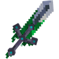
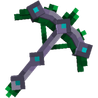
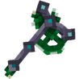
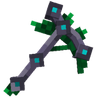
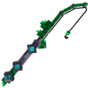
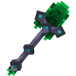
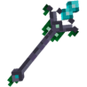

# ✳️ Outils en Émeraude

## 🔷 <mark style="color:green;">Son obtention 🤔</mark>

Les <mark style="color:green;">outils en Émeraude</mark> s'obtiennent dans la [<mark style="color:green;">caisse Émeraude</mark>](https://wiki.evolucraft.fr/le-gameplay/les-caisses#caisse-emeraude).

## 🔷 <mark style="color:green;">Son aperçue 🔍</mark>

### 🔹 Outils en Émeraude

<table border="1" cellspacing="0" cellpadding="6">
  <tr>
    <td align="center"><strong><ins>Nom</ins> 🏷️</strong></td>
    <td align="center"><strong><ins>Enchentement</ins> 📖</strong></td>
    <td align="center"><strong><ins>Durabilité</ins> 📏</strong></td>
    <td align="center"><strong><ins>Effet</ins> ✨</strong></td> 
  </tr>
  <tr>
   <td align="center">
     
<mark style="color:green;"><strong>Épée en Émeraude</strong></mark>

     
<figure></figure>

   </td>
   <td>
     
▸ <mark style="color:green;"><strong>Tranchant V</strong></mark>

     
▸ <mark style="color:green;"><strong>Châtiment VI</strong></mark>

     
▸ <mark style="color:green;"><strong>Fléau des arthropodes VI</strong></mark>

     
▸ <mark style="color:green;"><strong>Affliage III</strong></mark>

     
▸ <mark style="color:green;"><strong>Butin III</strong></mark>

   </td>
   <td align="center">
     
<mark style="color:green;"><strong>2 500</strong></mark> de <mark style="color:green;"><strong>Durabilitées</strong></mark>

   </td>
   <td>
     
<strong><mark style="color:green;">Aucun Effet</mark> Supplémentaire ❌</strong>

   </td>
  </tr>
  <tr>
   <td align="center">
     
<mark style="color:green;"><strong>Pioche en Émeraude</strong></mark>

     
<figure></figure>

   </td>
   <td>
     
▸ <mark style="color:green;"><strong>Efficacité VI</strong></mark>

     
▸ <mark style="color:green;"><strong>Fortune III</strong></mark>

   </td>
   <td align="center">
     
<mark style="color:green;"><strong>2 000</strong></mark> de <mark style="color:green;"><strong>Durabilitées</strong></mark>

   </td>
   <td>
     
<strong><mark style="color:green;">Aucun Effet</mark> Supplémentaire ❌</strong>

   </td>
  </tr>  
  <tr>
   <td align="center">
     
<mark style="color:green;"><strong>Hache en Émeraude</strong></mark>

     
<figure></figure>

   </td>
   <td>
     
▸ <mark style="color:green;"><strong>Efficacité VI</strong></mark>

   </td>
   <td align="center">
     
<mark style="color:green;"><strong>2 000</strong></mark> de <mark style="color:green;"><strong>Durabilitées</strong></mark>

   </td>
   <td>
     
<strong><mark style="color:green;">Aucun Effet</mark> Supplémentaire ❌</strong>

   </td>
  </tr>
  <tr>
   <td align="center">
     
<mark style="color:green;"><strong>Houe en Émeraude</strong></mark>

     
<figure></figure>

   </td>
   <td>
     
▸ <mark style="color:green;"><strong>Efficacité V</strong></mark>

     
▸ <mark style="color:green;"><strong>Fortune IV</strong></mark>

   </td>
   <td align="center">
     
<mark style="color:green;"><strong>4 000</strong></mark> de <mark style="color:green;"><strong>Durabilitées</strong></mark>

   </td>
   <td>  
    
▸ <mark style="color:green;"><strong>Effet Magnet</strong></mark> : Vous permet de récolter les cultures cassées.

    
▸ <mark style="color:green;"><strong>Effet Farmer</strong></mark> : Casse et replante dans une zone de 1X1.

   </td>
  </tr>
  <tr>
   <td align="center">
     
<mark style="color:green;"><strong>Canne à Pêche en Émeraude</strong></mark>

     
<figure></figure>

   </td>
   <td>
     
▸ <mark style="color:green;"><strong>Chance de la Mer IV</strong></mark>

     
▸ <mark style="color:green;"><strong>Appât IV</strong></mark>

   </td>
   <td align="center">
     
<mark style="color:green;"><strong>750</strong></mark> de <mark style="color:green;"><strong>Durabilitées</strong></mark>

   </td>
   <td>
     
<strong><mark style="color:green;">Aucun Effet</mark> Supplémentaire ❌</strong>

   </td>
  </tr>  
  <tr>
   <td align="center">
     
<mark style="color:green;"><strong>Pelle en Émeraude</strong></mark>

     
<figure></figure>

   </td>
   <td>
     
▸ <mark style="color:green;"><strong>Efficaciter VI</strong></mark>

     
▸ <mark style="color:green;"><strong>Toucher de Soi</strong></mark>

   </td>
   <td align="center">
     
<mark style="color:green;"><strong>2 500</strong></mark> de <mark style="color:green;"><strong>Durabilitées</strong></mark>

   </td>
   <td>
     
<strong><mark style="color:green;">Aucun Effet</mark> Supplémentaire ❌</strong>

   </td>
  </tr>
  <tr>
   <td align="center">
     
<mark style="color:green;"><strong>Sceptre en Émeraude</strong></mark>

     
<figure></figure>

   </td>
   <td>
     
▸ <mark style="color:green;"><strong>Solidité I</strong></mark>

   </td>
   <td align="center">
     
<mark style="color:green;"><strong>300</strong></mark> de <mark style="color:green;"><strong>Durabilitées</strong></mark>

   </td>
   <td>
    
▸ <mark style="color:green;"><strong>Effet Vente</strong></mark> : Vend le contenu d'un coffre à un prix 20% plus chère du /shop.

   </td>
  </tr>
</table>

### 🔹 Outils en Émeraude Shiny

<table border="1" cellspacing="0" cellpadding="6">
  <tr>
    <td align="center"><strong><ins>Nom</ins> 🏷️</strong></td>
    <td align="center"><strong><ins>Enchentement</ins> 📖</strong></td>
    <td align="center"><strong><ins>Durabilité</ins> 📏</strong></td>
    <td align="center"><strong><ins>Effet</ins> ✨</strong></td> 
  </tr>
  <tr>
   <td align="center">
     
<mark style="color:green;"><strong>Épée en Émeraude Shiny</strong></mark>

     
<figure></figure>

   </td>
   <td>
     
▸ <mark style="color:green;"><strong>Tranchant V</strong></mark>

     
▸ <mark style="color:green;"><strong>Châtiment VI</strong></mark>

     
▸ <mark style="color:green;"><strong>Fléau des arthropodes VI</strong></mark>

     
▸ <mark style="color:green;"><strong>Affliage III</strong></mark>

     
▸ <mark style="color:green;"><strong>Butin III</strong></mark>

   </td>
   <td align="center">
     
<mark style="color:green;"><strong>2 500</strong></mark> de <mark style="color:green;"><strong>Durabilitées</strong></mark>

   </td>
   <td>
     
<strong><mark style="color:green;">Aucun Effet</mark> Supplémentaire ❌</strong>

   </td>
  </tr>
  <tr>
   <td align="center">
     
<mark style="color:green;"><strong>Pioche en Émeraude Shiny</strong></mark>

     
<figure></figure>

   </td>
   <td>
     
▸ <mark style="color:green;"><strong>Efficacité VI</strong></mark>

     
▸ <mark style="color:green;"><strong>Fortune III</strong></mark>

   </td>
   <td align="center">
     
<mark style="color:green;"><strong>2 000</strong></mark> de <mark style="color:green;"><strong>Durabilitées</strong></mark>

   </td>
   <td>
     
<strong><mark style="color:green;">Aucun Effet</mark> Supplémentaire ❌</strong>

   </td>
  </tr>  
  <tr>
   <td align="center">
     
<mark style="color:green;"><strong>Hache en Émeraude Shiny</strong></mark>

     
<figure></figure>

   </td>
   <td>
     
▸ <mark style="color:green;"><strong>Efficacité VI</strong></mark>

   </td>
   <td align="center">
     
<mark style="color:green;"><strong>2 000</strong></mark> de <mark style="color:green;"><strong>Durabilitées</strong></mark>

   </td>
   <td>
     
<strong><mark style="color:green;">Aucun Effet</mark> Supplémentaire ❌</strong>

   </td>
  </tr>
  <tr>
   <td align="center">
     
<mark style="color:green;"><strong>Houe en Émeraude Shiny</strong></mark>

     
<figure></figure>

   </td>
   <td>
     
▸ <mark style="color:green;"><strong>Efficacité V</strong></mark>

     
▸ <mark style="color:green;"><strong>Fortune IV</strong></mark>

   </td>
   <td align="center">
     
<mark style="color:green;"><strong>4 000</strong></mark> de <mark style="color:green;"><strong>Durabilitées</strong></mark>

   </td>
   <td>  
    
▸ <mark style="color:green;"><strong>Effet Magnet</strong></mark> : Vous permet de récolter les cultures cassées.

    
▸ <mark style="color:green;"><strong>Effet Farmer</strong></mark> : Casse et replante dans une zone de 1X1.

   </td>
  </tr>
  <tr>
   <td align="center">
     
<mark style="color:green;"><strong>Canne à Pêche en Émeraude Shiny</strong></mark>

     
<figure></figure>

   </td>
   <td>
     
▸ <mark style="color:green;"><strong>Chance de la Mer IV</strong></mark>

     
▸ <mark style="color:green;"><strong>Appât IV</strong></mark>

   </td>
   <td align="center">
     
<mark style="color:green;"><strong>750</strong></mark> de <mark style="color:green;"><strong>Durabilitées</strong></mark>

   </td>
   <td>
     
<strong><mark style="color:green;">Aucun Effet</mark> Supplémentaire ❌</strong>

   </td>
  </tr>  
  <tr>
   <td align="center">
     
<mark style="color:green;"><strong>Pelle en Émeraude Shiny</strong></mark>

     
<figure></figure>

   </td>
   <td>
     
▸ <mark style="color:green;"><strong>Efficaciter VI</strong></mark>

     
▸ <mark style="color:green;"><strong>Toucher de Soi</strong></mark>

   </td>
   <td align="center">
     
<mark style="color:green;"><strong>2 500</strong></mark> de <mark style="color:green;"><strong>Durabilitées</strong></mark>

   </td>
   <td>
     
<strong><mark style="color:green;">Aucun Effet</mark> Supplémentaire ❌</strong>

   </td>
  </tr>
</table>
