# 📈 Outils Évolutifs

 <!--Voici une version développée de ton texte, avec les mots importants en **vert** et en **gras** :-->

Les <mark style="color:green;">**items évolutifs**</mark> sont des outils spéciaux dont la puissance augmente à mesure que vous les utilisez. Plus vous les maniez, plus ils gagnent en <mark style="color:green;">**niveau et en efficacité**</mark>, offrant ainsi de meilleures enchantements et/ou de nouveaux effets. Votre objectif final est d’atteindre le <mark style="color:green;">**niveau 5**</mark>, symbole de maîtrise et de puissance maximale, récompensant les joueurs les plus <mark style="color:green;">**persévérants**</mark>.

## 🔹 <mark style="color:yellow;">Son obtention 🤔</mark>

Les <mark style="color:green;">outils évolutifs</mark> s'obtiennent soit dans les [<mark style="color:green;">enchères 💸</mark>](https://wiki.evolucraft.fr/le-gameplay/les-evenements#enchere) mais également dans les [<mark style="color:green;">récompenses de donjons</mark>](https://wiki.evolucraft.fr/le-gameplay/les-donjons#quelques-exemples-de-recompenses) dans les donjons [<mark style="color:green;">Légendaires 🟪</mark>](https://wiki.evolucraft.fr/le-gameplay/les-donjons/legendaire) ou [<mark style="color:green;">Mythiques 🟥</mark>](https://wiki.evolucraft.fr/le-gameplay/les-donjons/mythique).

## 🔹 <mark style="color:yellow;">Leur aperçu 🔍</mark>

### 🔹 Épée Évolutive

<table border="1" cellspacing="0" cellpadding="6">
  <tr>
    <td align="center"><strong><ins>Nom</ins> 🏷️</strong></td>
    <td align="center"><strong><ins>Enchentement</ins> 📖</strong></td>
    <td align="center"><strong><ins>Durabilité</ins> 📏</strong></td>
    <td align="center"><strong><ins>Effet</ins> ✨</strong></td> 
  </tr>
  <tr>
   <td align="center">
     
<mark style="color:yellow;"><strong>Épée évolutive level 1</strong></mark>

     
<figure>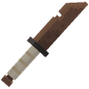</figure>

   </td>
   <td>
     
▸ <mark style="color:yellow;"><strong>Tranchant II</strong></mark>

     
▸ <mark style="color:yellow;"><strong>Fléau des arthropodes I</strong></mark>

   </td>
   <td align="center">
     
<mark style="color:yellow;"><strong>Objectif</strong></mark> de <mark style="color:yellow;"><strong>5 000 Mobs tuées</strong></mark>

   </td>
   <td>
     
<strong><mark style="color:yellow;">Aucun Effet</mark> Supplémentaire ❌</strong>

   </td>
  </tr>
  <tr>
   <td align="center">
     
<mark style="color:yellow;"><strong>Épée évolutive level 2</strong></mark>

     
<figure>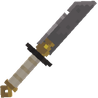</figure>

   </td>
   <td>
     
▸ <mark style="color:yellow;"><strong>Tranchant III</strong></mark>

     
▸ <mark style="color:yellow;"><strong>Fléau des arthropodes II</strong></mark>

     
▸ <mark style="color:yellow;"><strong>Affliage I</strong></mark>

   </td>
   <td align="center">
     
<mark style="color:yellow;"><strong>Objectif</strong></mark> de <mark style="color:yellow;"><strong>25 000 Mobs tuées</strong></mark>

   </td>
   <td>
     
<strong><mark style="color:yellow;">Aucun Effet</mark> Supplémentaire ❌</strong>

   </td>
  </tr>
  <tr>
   <td align="center">
     
<mark style="color:yellow;"><strong>Épée évolutive level 3</strong></mark>

     
<figure>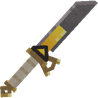</figure>

   </td>
   <td>
     
▸ <mark style="color:yellow;"><strong>Tranchant IV</strong></mark>

     
▸ <mark style="color:yellow;"><strong>Châtiment I</strong></mark>

     
▸ <mark style="color:yellow;"><strong>Fléau des arthropodes III</strong></mark>

     
▸ <mark style="color:yellow;"><strong>Affliage II</strong></mark>

     
▸ <mark style="color:yellow;"><strong>Butin III</strong></mark>

   </td>
   <td align="center">
     
<mark style="color:yellow;"><strong>Objectif</strong></mark> de <mark style="color:yellow;"><strong>100 000 Mobs tuées</strong></mark>

   </td>
   <td>
     
<strong><mark style="color:yellow;">Effet Dextérité</mark></strong> : Tappe 5% plus vite

   </td>
  </tr>
  <tr>
   <td align="center">
     
<mark style="color:yellow;"><strong>Épée évolutive level 4</strong></mark>

     
<figure>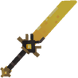</figure>

   </td>
   <td>
     
▸ <mark style="color:yellow;"><strong>Tranchant V</strong></mark>

     
▸ <mark style="color:yellow;"><strong>Châtiment II</strong></mark>

     
▸ <mark style="color:yellow;"><strong>Fléau des arthropodes IV</strong></mark>

     
▸ <mark style="color:yellow;"><strong>Affliage III</strong></mark>

     
▸ <mark style="color:yellow;"><strong>Butin IV</strong></mark>

   </td>
   <td align="center">
     
<mark style="color:yellow;"><strong>Objectif</strong></mark> de <mark style="color:yellow;"><strong>500 000 Mobs tuées</strong></mark>

   </td>
   <td>
     
<strong><mark style="color:yellow;">Effet Dextérité</mark></strong> : Tappe 15% plus vite

   </td>
  </tr>
  <tr>
   <td align="center">
     
<mark style="color:yellow;"><strong>Épée évolutive level 5</strong></mark>

     
<figure>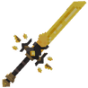</figure>

   </td>
   <td>
     
▸ <mark style="color:yellow;"><strong>Tranchant VI</strong></mark>

     
▸ <mark style="color:yellow;"><strong>Châtiment VI</strong></mark>

     
▸ <mark style="color:yellow;"><strong>Fléau des arthropodes VI</strong></mark>

     
▸ <mark style="color:yellow;"><strong>Affliage IV</strong></mark>

     
▸ <mark style="color:yellow;"><strong>Butin V</strong></mark>

   </td>
   <td align="center">
     
<mark style="color:yellow;"><strong>5 000</strong></mark> de <mark style="color:yellow;"><strong>Durabilitées</strong></mark>

   </td>
   <td>
     
<strong><mark style="color:yellow;">Effet Dextérité</mark></strong> : Tappe 25% plus vite

   </td>
  </tr>
</table>

### 🔹 Pioche Évolutive

<table border="1" cellspacing="0" cellpadding="6">
  <tr>
    <td align="center"><strong><ins>Nom</ins> 🏷️</strong></td>
    <td align="center"><strong><ins>Enchentement</ins> 📖</strong></td>
    <td align="center"><strong><ins>Durabilité</ins> 📏</strong></td>
    <td align="center"><strong><ins>Effet</ins> ✨</strong></td> 
  </tr>
  <tr>
   <td align="center">
     
<mark style="color:yellow;"><strong>Pioche évolutive level 1</strong></mark>

     
<figure>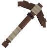</figure>

   </td>
   <td>
     
▸ <mark style="color:yellow;"><strong>Efficacité III</strong></mark>

   </td>
   <td align="center">
     
<mark style="color:yellow;"><strong>Objectif</strong></mark> de <mark style="color:yellow;"><strong>5 000 Blocks cassés</strong></mark>

   </td>
   <td>
     
<strong><mark style="color:yellow;">Aucun Effet</mark> Supplémentaire ❌</strong>

   </td>
  </tr>
  <tr>
   <td align="center">
     
<mark style="color:yellow;"><strong>Pioche évolutive level 2</strong></mark>

     
<figure>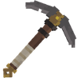</figure>

   </td>
   <td>
     
▸ <mark style="color:yellow;"><strong>Efficacité IV</strong></mark>

     
▸ <mark style="color:yellow;"><strong>Fortune I</strong></mark>

   </td>
   <td align="center">
     
<mark style="color:yellow;"><strong>Objectif</strong></mark> de <mark style="color:yellow;"><strong>25 000 Blocks cassés</strong></mark>

   </td>
   <td>
     
<strong><mark style="color:yellow;">Aucun Effet</mark> Supplémentaire ❌</strong>

   </td>
  </tr>
  <tr>
   <td align="center">
     
<mark style="color:yellow;"><strong>Pioche évolutive level 3</strong></mark>

     
<figure>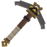</figure>

   </td>
   <td>
     
▸ <mark style="color:yellow;"><strong>Efficacité V</strong></mark>

     
▸ <mark style="color:yellow;"><strong>Fortune II</strong></mark>

   </td>
   <td align="center">
     
<mark style="color:yellow;"><strong>Objectif</strong></mark> de <mark style="color:yellow;"><strong>100 000 Blocks cassés</strong></mark>

   </td>
   <td>
     
<strong><mark style="color:yellow;">Aucun Effet</mark> Supplémentaire ❌</strong>

  </tr>
  <tr>
   <td align="center">
     
<mark style="color:yellow;"><strong>Pioche évolutive level 4</strong></mark>

     
<figure>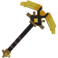</figure>

   </td>
   <td>
     
▸ <mark style="color:yellow;"><strong>Efficacité VI</strong></mark>

     
▸ <mark style="color:yellow;"><strong>Fortune III</strong></mark>

   </td>
   <td align="center">
     
<mark style="color:yellow;"><strong>Objectif</strong></mark> de <mark style="color:yellow;"><strong>500 000 Blocks cassés</strong></mark>

   </td>
   <td>
     
<strong><mark style="color:yellow;">Aucun Effet</mark> Supplémentaire ❌</strong>

   </td>
  </tr>
  <tr>
   <td align="center">
     
<mark style="color:yellow;"><strong>Pioche évolutive level 5</strong></mark>

     
<figure>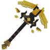</figure>

   </td>
   <td>
     
▸ <mark style="color:yellow;"><strong>Efficacité VII</strong></mark>

     
▸ <mark style="color:yellow;"><strong>Fortune V</strong></mark>

   </td>
   <td align="center">
     
<mark style="color:yellow;"><strong>4 250</strong></mark> de <mark style="color:yellow;"><strong>Durabilitées</strong></mark>

   </td>
   <td>
     
▸ <mark style="color:yellow;"><strong>Effet Magnet</strong></mark> : Ramasse les blocs cassées.

     
▸ <mark style="color:yellow;"><strong>Effet Hammer</strong></mark> : Casse les blocs dans une zone de 3X3.

   </td>
  </tr>
</table>

### 🔹 Hache Évolutive

<table border="1" cellspacing="0" cellpadding="6">
  <tr>
    <td align="center"><strong><ins>Nom</ins> 🏷️</strong></td>
    <td align="center"><strong><ins>Enchentement</ins> 📖</strong></td>
    <td align="center"><strong><ins>Durabilité</ins> 📏</strong></td>
    <td align="center"><strong><ins>Effet</ins> ✨</strong></td> 
  </tr>
  <tr>
   <td align="center">
     
<mark style="color:yellow;"><strong>Hache évolutive level 1</strong></mark>

     
<figure>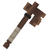</figure>

   </td>
   <td>
     
▸ <mark style="color:yellow;"><strong>Efficacité III</strong></mark>

   </td>
   <td align="center">
     
<mark style="color:yellow;"><strong>Objectif</strong></mark> de <mark style="color:yellow;"><strong>5 000 Bûches cassés</strong></mark>

   </td>
   <td>
     
<strong><mark style="color:yellow;">Aucun Effet</mark> Supplémentaire ❌</strong>

   </td>
  </tr>
  <tr>
   <td align="center">
     
<mark style="color:yellow;"><strong>Hache évolutive level 2</strong></mark>

     
<figure>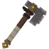</figure>

   </td>
   <td>
     
▸ <mark style="color:yellow;"><strong>Efficacité IV</strong></mark>

     
▸ <mark style="color:yellow;"><strong>Fortune I</strong></mark>

   </td>
   <td align="center">
     
<mark style="color:yellow;"><strong>Objectif</strong></mark> de <mark style="color:yellow;"><strong>25 000 Bûches cassés</strong></mark>

   </td>
   <td>
     
<strong><mark style="color:yellow;">Aucun Effet</mark> Supplémentaire ❌</strong>

   </td>
  </tr>
  <tr>
   <td align="center">
     
<mark style="color:yellow;"><strong>Hache évolutive level 3</strong></mark>

     
<figure>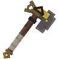</figure>

   </td>
   <td>
     
▸ <mark style="color:yellow;"><strong>Efficacité V</strong></mark>

     
▸ <mark style="color:yellow;"><strong>Fortune II</strong></mark>

   </td>
   <td align="center">
     
<mark style="color:yellow;"><strong>Objectif</strong></mark> de <mark style="color:yellow;"><strong>100 000 Bûches cassés</strong></mark>

   </td>
   <td>
     
<strong><mark style="color:yellow;">Aucun Effet</mark> Supplémentaire ❌</strong>

  </tr>
  <tr>
   <td align="center">
     
<mark style="color:yellow;"><strong>Hache évolutive level 4</strong></mark>

     
<figure>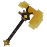</figure>

   </td>
   <td>
     
▸ <mark style="color:yellow;"><strong>Efficacité VII</strong></mark>

     
▸ <mark style="color:yellow;"><strong>Fortune III</strong></mark>

   </td>
   <td align="center">
     
<mark style="color:yellow;"><strong>Objectif</strong></mark> de <mark style="color:yellow;"><strong>500 000 Bûches cassés</strong></mark>

   </td>
   <td>
     
<strong><mark style="color:yellow;">Aucun Effet</mark> Supplémentaire ❌</strong>

   </td>
  </tr>
  <tr>
   <td align="center">
     
<mark style="color:yellow;"><strong>Hache évolutive level 5</strong></mark>

     
<figure>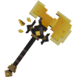</figure>

   </td>
   <td>
     
▸ <mark style="color:yellow;"><strong>Efficacité VII</strong></mark>

     
▸ <mark style="color:yellow;"><strong>Fortune V</strong></mark>

   </td>
   <td align="center">
     
<mark style="color:yellow;"><strong>5 000</strong></mark> de <mark style="color:yellow;"><strong>Durabilitées</strong></mark>

   </td>
   <td>
     
▸ <mark style="color:yellow;"><strong>Effet Bûcheron</strong></mark> : Coupe un arbre moyen en entier en cassant une bûche.

   </td>
  </tr>
</table>

### 🔹 Houe Évolutive

<table border="1" cellspacing="0" cellpadding="6">
  <tr>
    <td align="center"><strong><ins>Nom</ins> 🏷️</strong></td>
    <td align="center"><strong><ins>Enchentement</ins> 📖</strong></td>
    <td align="center"><strong><ins>Durabilité</ins> 📏</strong></td>
    <td align="center"><strong><ins>Effet</ins> ✨</strong></td> 
  </tr>
  <tr>
   <td align="center">
     
<mark style="color:yellow;"><strong>Houe évolutive level 1</strong></mark>

     
<figure>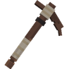</figure>

   </td>
   <td>
     
▸ <mark style="color:yellow;"><strong>Fortune I</strong></mark>

   </td>
   <td align="center">
     
<mark style="color:yellow;"><strong>Objectif</strong></mark> de <mark style="color:yellow;"><strong>5 000 Cultures cassées</strong></mark>

   </td>
   <td>
     
<strong><mark style="color:yellow;">Aucun Effet</mark> Supplémentaire ❌</strong>

   </td>
  </tr>
  <tr>
   <td align="center">
     
<mark style="color:yellow;"><strong>Houe évolutive level 2</strong></mark>

     
<figure>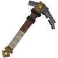</figure>

   </td>
   <td>
     
▸ <mark style="color:yellow;"><strong>Fortune II</strong></mark>

   </td>
   <td align="center">
     
<mark style="color:yellow;"><strong>Objectif</strong></mark> de <mark style="color:yellow;"><strong>25 000 Cultures cassées</strong></mark>

   </td>
   <td>
     
<strong><mark style="color:yellow;">Aucun Effet</mark> Supplémentaire ❌</strong>

  </tr>
  <tr>
   <td align="center">
     
<mark style="color:yellow;"><strong>Houe évolutive level 3</strong></mark>

     
<figure>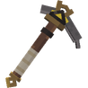</figure>

   </td>
   <td>
     
▸ <mark style="color:yellow;"><strong>Efficacité V</strong></mark>

     
▸ <mark style="color:yellow;"><strong>Fortune III</strong></mark>

   </td>
   <td align="center">
     
<mark style="color:yellow;"><strong>Objectif</strong></mark> de <mark style="color:yellow;"><strong>100 000 Cultures cassées</strong></mark>

   </td>
   <td>
     
▸ <mark style="color:yellow;"><strong>Effet Farmer</strong></mark> : Casse et replante dans une zone 1X1.

  </tr>
  <tr>
   <td align="center">
     
<mark style="color:yellow;"><strong>Houe évolutive level 4</strong></mark>

     
<figure>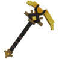</figure>

   </td>
   <td>
     
▸ <mark style="color:yellow;"><strong>Efficacité VI</strong></mark>

     
▸ <mark style="color:yellow;"><strong>Fortune IV</strong></mark>

   </td>
   <td align="center">
     
<mark style="color:yellow;"><strong>Objectif</strong></mark> de <mark style="color:yellow;"><strong>500 000 Cultures cassées</strong></mark>

   </td>
   <td>
     
▸ <mark style="color:yellow;"><strong>Effet Magnet</strong></mark> : Ramasse les cultures cassées.

     
▸ <mark style="color:yellow;"><strong>Effet Farmer</strong></mark> : Casse et replante dans une zone 3X3.

   </td>
  </tr>
  <tr>
   <td align="center">
     
<mark style="color:yellow;"><strong>Houe évolutive level 5</strong></mark>

     
<figure>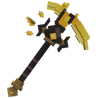</figure>

   </td>
   <td>
     
▸ <mark style="color:yellow;"><strong>Efficacité VII</strong></mark>

     
▸ <mark style="color:yellow;"><strong>Fortune V</strong></mark>

   </td>
   <td align="center">
     
<mark style="color:yellow;"><strong>12 000</strong></mark> de <mark style="color:yellow;"><strong>Durabilitées</strong></mark>

   </td>
   <td>
     
▸ <mark style="color:yellow;"><strong>Effet Magnet</strong></mark> : Ramasse les cultures cassées.

     
▸ <mark style="color:yellow;"><strong>Effet Farmer</strong></mark> : Casse et replante dans une zone 5X5.

   </td>
  </tr>
</table>

### 🔹 Canne à Pêche Évolutive

<table border="1" cellspacing="0" cellpadding="6">
  <tr>
    <td align="center"><strong><ins>Nom</ins> 🏷️</strong></td>
    <td align="center"><strong><ins>Enchentement</ins> 📖</strong></td>
    <td align="center"><strong><ins>Durabilité</ins> 📏</strong></td>
    <td align="center"><strong><ins>Effet</ins> ✨</strong></td> 
  </tr>
  <tr>
   <td align="center">
     
<mark style="color:yellow;"><strong>Canne à pêche évolutive level 1</strong></mark>

     
<figure></figure>

   </td>
   <td>
     
▸ <mark style="color:yellow;"><strong>Chance de la mer II</strong></mark>

     
▸ <mark style="color:yellow;"><strong>Appât II</strong></mark>

   </td>
   <td align="center">
     
<mark style="color:yellow;"><strong>Objectif</strong></mark> de <mark style="color:yellow;"><strong>350 Poissons pêchés</strong></mark>

   </td>
   <td>
     
<strong><mark style="color:yellow;">Aucun Effet</mark> Supplémentaire ❌</strong>

   </td>
  </tr>
  <tr>
   <td align="center">
     
<mark style="color:yellow;"><strong>Canne à pêche level 2</strong></mark>

     
<figure></figure>

   </td>
   <td>
     
▸ <mark style="color:yellow;"><strong>Chance de la mer III</strong></mark>

     
▸ <mark style="color:yellow;"><strong>Appât III</strong></mark>

   </td>
   <td align="center">
     
<mark style="color:yellow;"><strong>Objectif</strong></mark> de <mark style="color:yellow;"><strong>1 000 Poissons pêchés</strong></mark>

   </td>
   <td>
     
▸ <mark style="color:yellow;"><strong>Effet Pêche</strong></mark> : Vous avez 5% de chance de doubler votre pêche.

   </td>
  </tr>
  <tr>
   <td align="center">
     
<mark style="color:yellow;"><strong>Canne à pêche évolutive level 3</strong></mark>

     
<figure></figure>

   </td>
   <td>
     
▸ <mark style="color:yellow;"><strong>Chance de la mer VI</strong></mark>

     
▸ <mark style="color:yellow;"><strong>Appât IV</strong></mark>

   </td>
   <td align="center">
     
<mark style="color:yellow;"><strong>Objectif</strong></mark> de <mark style="color:yellow;"><strong>2 500 Poissons pêchés</strong></mark>

   </td>
   <td>
     
▸ <mark style="color:yellow;"><strong>Effet Pêche</strong></mark> : Vous avez 10% de chance de doubler votre pêche.

   </td>
  </tr>
  <tr>
   <td align="center">
     
<mark style="color:yellow;"><strong>Canne à pêche évolutive level 4</strong></mark>

     
<figure></figure>

   </td>
   <td>
     
▸ <mark style="color:yellow;"><strong>Chance de la mer V</strong></mark>

     
▸ <mark style="color:yellow;"><strong>Appât V</strong></mark>

   </td>
   <td align="center">
     
<mark style="color:yellow;"><strong>Objectif</strong></mark> de <mark style="color:yellow;"><strong>5 000 Poissons pêchés</strong></mark>

   </td>
   <td>
     
▸ <mark style="color:yellow;"><strong>Effet Pêche</strong></mark> : Vous avez 15% de chance de doubler votre pêche.

   </td>
   </td>
  </tr>
  <tr>
   <td align="center">
     
<mark style="color:yellow;"><strong>Canne à pêche évolutive level 5</strong></mark>

     
<figure></figure>

   </td>
   <td>
     
▸ <mark style="color:yellow;"><strong>Chance de la mer VI</strong></mark>

     
▸ <mark style="color:yellow;"><strong>Appât VI</strong></mark>

   </td>
   </td>
   <td align="center">
     
<mark style="color:yellow;"><strong>1 750</strong></mark> de <mark style="color:yellow;"><strong>Durabilitées</strong></mark>

   </td>
   <td>
     
▸ <mark style="color:yellow;"><strong>Effet Pêche</strong></mark> : Vous avez 25% de chance de doubler votre pêche.

   </td>
  </tr>
</table>

### 🔹 Pelle Évolutive

<table border="1" cellspacing="0" cellpadding="6">
  <tr>
    <td align="center"><strong><ins>Nom</ins> 🏷️</strong></td>
    <td align="center"><strong><ins>Enchentement</ins> 📖</strong></td>
    <td align="center"><strong><ins>Durabilité</ins> 📏</strong></td>
    <td align="center"><strong><ins>Effet</ins> ✨</strong></td> 
  </tr>
  <tr>
   <td align="center">
     
<mark style="color:yellow;"><strong>Pelle évolutive level 1</strong></mark>

     
<figure>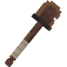</figure>

   </td>
   <td>
     
▸ <mark style="color:yellow;"><strong>Efficacité III</strong></mark>

   </td>
   <td align="center">
     
<mark style="color:yellow;"><strong>Objectif</strong></mark> de <mark style="color:yellow;"><strong>5 000 Blocks cassés</strong></mark>

   </td>
   <td>
     
<strong><mark style="color:yellow;">Aucun Effet</mark> Supplémentaire ❌</strong>

   </td>
  </tr>
  <tr>
   <td align="center">
     
<mark style="color:yellow;"><strong>Pelle évolutive level 2</strong></mark>

     
<figure>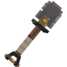</figure>

   </td>
   <td>
     
▸ <mark style="color:yellow;"><strong>Efficacité III</strong></mark>

     
▸ <mark style="color:yellow;"><strong>Toucher de soi</strong></mark>

   </td>
   <td align="center">
     
<mark style="color:yellow;"><strong>Objectif</strong></mark> de <mark style="color:yellow;"><strong>25 000 Blocks cassés</strong></mark>

   </td>
   <td>
     
<strong><mark style="color:yellow;">Aucun Effet</mark> Supplémentaire ❌</strong>

   </td>
  </tr>
  <tr>
   <td align="center">
     
<mark style="color:yellow;"><strong>Pelle évolutive level 3</strong></mark>

     
<figure>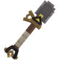</figure>

   </td>
   <td>
     
▸ <mark style="color:yellow;"><strong>Efficacité V</strong></mark>

     
▸ <mark style="color:yellow;"><strong>Toucher de soi</strong></mark>

   </td>
   <td align="center">
     
<mark style="color:yellow;"><strong>Objectif</strong></mark> de <mark style="color:yellow;"><strong>100 000 Blocks cassés</strong></mark>

   </td>
   <td>
     
<strong><mark style="color:yellow;">Aucun Effet</mark> Supplémentaire ❌</strong>

  </tr>
  <tr>
   <td align="center">
     
<mark style="color:yellow;"><strong>Pelle évolutive level 4</strong></mark>

     
<figure>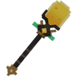</figure>

   </td>
   <td>
     
▸ <mark style="color:yellow;"><strong>Efficacité VI</strong></mark>

     
▸ <mark style="color:yellow;"><strong>Toucher de soi</strong></mark>

   </td>
   <td align="center">
     
<mark style="color:yellow;"><strong>Objectif</strong></mark> de <mark style="color:yellow;"><strong>500 000 Blocks cassés</strong></mark>

   </td>
   <td>
     
▸ <mark style="color:yellow;"><strong>Effet Magnet</strong></mark> : Ramasse les blocs cassées.

     
▸ <mark style="color:yellow;"><strong>Effet Hammer</strong></mark> : Casse les blocs dans une zone de 3X3.

   </td>
  </tr>
  <tr>
   <td align="center">
     
<mark style="color:yellow;"><strong>Pelle évolutive level 5</strong></mark>

     
<figure>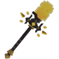</figure>

   </td>
   <td>
     
▸ <mark style="color:yellow;"><strong>Efficacité VII</strong></mark>

     
▸ <mark style="color:yellow;"><strong>Toucher de soi</strong></mark>

   </td>
   <td align="center">
     
<mark style="color:yellow;"><strong>4 500</strong></mark> de <mark style="color:yellow;"><strong>Durabilitées</strong></mark>

   </td>
   <td>
     
▸ <mark style="color:yellow;"><strong>Effet Magnet</strong></mark> : Ramasse les blocs cassées.

     
▸ <mark style="color:yellow;"><strong>Effet Hammer</strong></mark> : Casse les blocs dans une zone de 3X3.

   </td>
  </tr>
</table>
