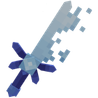
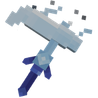
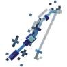

# 🧊 Outils des Glaces

### 🔹 <ins>Son obtention</ins>🤔

Les <mark style="color:green;">outils des Glaces</mark> s'obtiennent dans la [<mark style="color:blue;">caisse Givrée</mark>](https://wiki.evolucraft.fr/le-gameplay/les-caisses#caisse-givree).

### 🔹 <ins>Son aperçu</ins>🔍
<table border="1" cellspacing="0" cellpadding="6">
  <tr>
    <td align="center"><strong><ins>Nom</ins> 🏷️</strong></td>
    <td align="center"><strong><ins>Enchantement</ins> 📖</strong></td>
    <td align="center"><strong><ins>Durabilité</ins> 📏</strong></td>
    <td align="center"><strong><ins>Effet</ins> ✨</strong></td>    
  </tr>
  <tr>
   <td align="center">
     
<mark style="color:blue;"><strong>Pioche des Glaces</strong></mark>

     
<figure></figure>

   </td>
   <td>
     
▸ <mark style="color:blue;"><strong>Efficacité VI</strong></mark>

     
▸ <mark style="color:blue;"><strong>Fortune V</strong></mark>

     
▸ <mark style="color:blue;"><strong>Solidité I</strong></mark>

   </td>
   <td align="center">
     
<mark style="color:blue;"><strong>3 000</strong></mark> de <mark style="color:blue;"><strong>Durabilité</strong></mark>

   </td>
   <td>  
     
▸ <mark style="color:blue;"><strong>Effet Magnet</strong></mark> : Vous permet de récolter les blocks cassées.

   </td>
  </tr>
  <tr>
   <td align="center">
     
<mark style="color:blue;"><strong>Hache des Glaces</strong></mark>

     
<figure></figure>

   </td>
   <td>
     
▸ <mark style="color:blue;"><strong>Efficacité V</strong></mark>

     
▸ <mark style="color:blue;"><strong>Solidité I</strong></mark>

   </td>
   <td align="center">
     
<mark style="color:blue;"><strong>3 000</strong></mark> de <mark style="color:blue;"><strong>Durabilité</strong></mark>

   </td>
   <td>  
     
▸ <mark style="color:blue;"><strong>Effet Cacao</strong></mark> : Replante le cacao cassé.

   </td>
  </tr>
</table>

## 🔹 <mark style="color:blue;">Son obtention 🤔</mark>

#### Les <mark style="color:blue;">**autres outils cupidons**</mark> s'obtennaient dans la <mark style="color:blue;">**boutique du `/noel`**</mark> durant la <mark style="color:blue;">**mise à jour Noël de 2024**</mark>


La boutique n'étant <mark style="color:green;">**plus disponible**</mark>. Les items sont donc obtenable uniquement à <mark style="color:green;">l'achat entre joueurs</mark> ou dans [<mark style="color:green;">l'hôtel de vente</mark>](https://wiki.evolucraft.fr/le-gameplay/le-commerce#hotel-des-ventes).


## 🔷 <mark style="color:blue;">Son aperçue 🔍</mark>

<table border="1" cellspacing="0" cellpadding="6">
  <tr>
    <td align="center"><strong><ins>Nom</ins> 🏷️</strong></td>
    <td align="center"><strong><ins>Enchentement</ins> 📖</strong></td>
    <td align="center"><strong><ins>Durabilité</ins> 📏</strong></td>
    <td align="center"><strong><ins>Effet</ins> ✨</strong></td> 
  </tr>
  <tr>
   <td align="center">
     
<mark style="color:blue;"><strong>Épée des Glaces</strong></mark>

     
<figure></figure>

   </td>
   <td>
     
▸ <mark style="color:blue;"><strong>Tranchant VI</strong></mark>

     
▸ <mark style="color:blue;"><strong>Affilage III</strong></mark>

     
▸ <mark style="color:blue;"><strong>Butin IV</strong></mark>

   </td>
   <td align="center">
     
<mark style="color:blue;"><strong>3 000</strong></mark> de <mark style="color:blue;"><strong>Durabilité</strong></mark>

   </td>
   <td>  
     
▸ <mark style="color:blue;"><strong>Effet Dextérité</strong></mark> : Frappe 10% plus vite.

   </td>
  </tr>
  <tr>
   <td align="center">
     
<mark style="color:blue;"><strong>Houe des Glaces</strong></mark>

     
<figure></figure>

   </td>
   <td>
     
▸ <mark style="color:blue;"><strong>Efficacité V</strong></mark>

     
▸ <mark style="color:blue;"><strong>Fortune IV</strong></mark>

   </td>
   <td align="center">
     
<mark style="color:blue;"><strong>4 000</strong></mark> de <mark style="color:blue;"><strong>Durabilitées</strong></mark>

   </td>
   <td>  
    
▸ <mark style="color:blue;"><strong>Effet Magnet</strong></mark> : Vous permet de récolter les cultures cassées.

    
▸ <mark style="color:blue;"><strong>Effet Farmer</strong></mark> : Casse et replante dans une zone de 1X1.

   </td>
  </tr>
  <tr>
   <td align="center">
     
<mark style="color:blue;"><strong>Canne à Pêche des Glaces</strong></mark>

     
<figure></figure>

   </td>
   <td>
     
▸ <mark style="color:blue;"><strong>Chance de la Mer IV</strong></mark>

     
▸ <mark style="color:blue;"><strong>Appât IV</strong></mark>

   </td>
   <td align="center">
     
<mark style="color:blue;"><strong>750</strong></mark> de <mark style="color:blue;"><strong>Durabilitées</strong></mark>

   </td>
   <td>
     
<strong><mark style="color:blue;">Aucun Effet</mark> Supplémentaire ❌</strong>

   </td>
  </tr>
</table>
