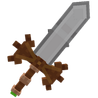
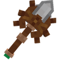

# 🚂 Outils HolyCube

## 🔷 <mark style="color:orange;">Son obtention 🤔</mark>

#### Les <mark style="color:green;">**outils HolyCube**</mark> s'obtennaient avec le <mark style="color:green;">**`/holycube`**</mark> durant le <mark style="color:green;">**partenariat entre HolyCube et Évolucraft**</mark>


Cette commande <mark style="color:green;">**n'est plus disponible**</mark>. Les items sont donc obtenable uniquement à <mark style="color:green;">l'achat entre joueurs</mark> ou dans [<mark style="color:green;">l'hôtel de vente</mark>](https://wiki.evolucraft.fr/le-gameplay/le-commerce#hotel-des-ventes).


## 🔷 <mark style="color:orange;">Son aperçue 🔍</mark>

<table border="1" cellspacing="0" cellpadding="6">
  <tr>
    <td align="center"><strong><ins>Nom</ins> 🏷️</strong></td>
    <td align="center"><strong><ins>Enchentement</ins> 📖</strong></td>
    <td align="center"><strong><ins>Durabilité</ins> 📏</strong></td>
  </tr>
  <tr>
   <td align="center">
     
<mark style="color:orange;"><strong>Holy-Sword</strong></mark>

     
<figure></figure>

   </td>
   <td>
     
▸ <mark style="color:orange;"><strong>Tranchant V</strong></mark>

     
▸ <mark style="color:orange;"><strong>Affliage III</strong></mark>

     
▸ <mark style="color:orange;"><strong>Aura de Feu II</strong></mark>

   </td>
   <td align="center">
     
<mark style="color:orange;"><strong>2 000</strong></mark> de <mark style="color:orange;"><strong>Durabilitées</strong></mark>

   </td>
  </tr>
  <tr>
   <td align="center">
     
<mark style="color:orange;"><strong>Holy-Pickaxe</strong></mark>

     
<figure></figure>

   </td>
   <td>
     
▸ <mark style="color:orange;"><strong>Efficacité V</strong></mark>

     
▸ <mark style="color:orange;"><strong>Fortune III</strong></mark>

   </td>
   <td align="center">
     
<mark style="color:orange;"><strong>2 000</strong></mark> de <mark style="color:orange;"><strong>Durabilitées</strong></mark>

   </td>
  </tr>  
  <tr>
   <td align="center">
     
<mark style="color:orange;"><strong>Holy-Axe</strong></mark>

     
<figure></figure>

   </td>
   <td>
     
▸ <mark style="color:orange;"><strong>Efficacité V</strong></mark>

     
▸ <mark style="color:orange;"><strong>Fortune III</strong></mark>

   </td>
   <td align="center">
     
<mark style="color:orange;"><strong>2 000</strong></mark> de <mark style="color:orange;"><strong>Durabilitées</strong></mark>

   </td>
  </tr>
  <tr>
   <td align="center">
     
<mark style="color:orange;"><strong>Holy-Hoe</strong></mark>

     
<figure></figure>

   </td>
   <td>
     
▸ <mark style="color:orange;"><strong>Efficacité V</strong></mark>

     
▸ <mark style="color:orange;"><strong>Fortune III</strong></mark>

   </td>
   <td align="center">
     
<mark style="color:orange;"><strong>2 000</strong></mark> de <mark style="color:orange;"><strong>Durabilitées</strong></mark>

   </td>
  </tr>
  <tr>
   <td align="center">
     
<mark style="color:orange;"><strong>Holy-Fishing Rod</strong></mark>

     
<figure></figure>

   </td>
   <td>
     
▸ <mark style="color:orange;"><strong>Chance de la Mer III</strong></mark>

     
▸ <mark style="color:orange;"><strong>Appât III</strong></mark>

   </td>
   <td align="center">
     
<mark style="color:orange;"><strong>750</strong></mark> de <mark style="color:orange;"><strong>Durabilitées</strong></mark>

   </td>
  </tr>  
  <tr>
   <td align="center">
     
<mark style="color:orange;"><strong>Holy-Shovel</strong></mark>

     
<figure></figure>

   </td>
   <td>
     
▸ <mark style="color:orange;"><strong>Efficaciter V</strong></mark>

     
▸ <mark style="color:orange;"><strong>Toucher de Soi</strong></mark>

   </td>
   <td align="center">
     
<mark style="color:orange;"><strong>2 000</strong></mark> de <mark style="color:orange;"><strong>Durabilitées</strong></mark>

   </td>
  </tr>
</table>
