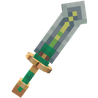
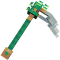
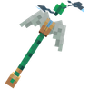
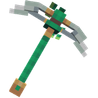
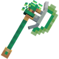

# 🍀 Outils du Leprechaun

## 🔹 <ins>Son obtention</ins>🤔

Les <mark style="color:green;">outils du Leprechaun</mark> s'obtiennent dans la [<mark style="color:green;">caisse Saint-Patrick</mark>](https://wiki.evolucraft.fr/le-gameplay/les-caisses#caisse-saint-patrick).

## 🔹 <ins>Son aperçu</ins>🔍

<table border="1" cellspacing="0" cellpadding="6">
  <tr>
    <td align="center"><strong><ins>Nom</ins> 🏷️</strong></td>
    <td align="center"><strong><ins>Enchantement</ins> 📖</strong></td>
    <td align="center"><strong><ins>Durabilité</ins> 📏</strong></td>
    <td align="center"><strong><ins>Effet</ins> ✨</strong></td>    
  </tr>
  <tr>
   <td align="center">
     
<mark style="color:green;"><strong>Épée du Leprechaun</strong></mark>

     
<figure></figure>

   </td>
   <td>
     
▸ <mark style="color:green;"><strong>Tranchant V</strong></mark>

     
▸ <mark style="color:green;"><strong>Châtiment VI</strong></mark>

     
▸ <mark style="color:green;"><strong>Fléau des Arthropodes VI</strong></mark>

     
▸ <mark style="color:green;"><strong>Affilage III</strong></mark>

     
▸ <mark style="color:green;"><strong>Butin III</strong></mark>

     
▸ <mark style="color:green;"><strong>Solidité I</strong></mark>

   </td>
   <td align="center">
     
<mark style="color:green;"><strong>1 750</strong></mark> de <mark style="color:green;"><strong>Durabilité</strong></mark>

   </td>
   <td>  
     
▸ <mark style="color:green;"><strong>Effet Bonne Fortune</strong></mark> : Donne 1$ à chaque mob tué.
 <!-- Oui, c'est éclater 🤯 -->
   </td>
  </tr>
  <tr>
   <td align="center">
     
<mark style="color:green;"><strong>Houe du Leprechaun</strong></mark>

     
<figure></figure>

   </td>
   <td>
     
▸ <mark style="color:green;"><strong>Efficacité V</strong></mark>

     
▸ <mark style="color:green;"><strong>Fortune III</strong></mark>

     
▸ <mark style="color:green;"><strong>Solidité I</strong></mark>

   </td>
   <td align="center">
     
<mark style="color:green;"><strong>1 500</strong></mark> de <mark style="color:green;"><strong>Durabilité</strong></mark>

   </td>
   <td>  
     
▸ <mark style="color:green;"><strong>Effet Bêche</strong></mark> : Bêche les blocs de terre dans une zone de 5x5.

     
▸ <mark style="color:green;"><strong>Effet Farmer</strong></mark> : Casse et replante dans une zone de 3X3.

   </td>
  </tr>
  <tr>
   <td align="center">
     
<mark style="color:green;"><strong>Baton du Vent</strong></mark>

     
<figure></figure>

   </td>
   <td>
     
▸ <mark style="color:green;"><strong>Solidité I</strong></mark>

   </td>
   <td align="center">
     
<mark style="color:green;"><strong>1 000</strong></mark> de <mark style="color:green;"><strong>Durabilité</strong></mark>

   </td>
   <td>  
     
▸ <mark style="color:green;"><strong>Effet Bourrasque</strong></mark> : Casse les feuilles de l'abre dans une zone de 3X3 blocs en forme de sphère.

   </td>
  </tr>
</table>

## 🔹 <mark style="color:green;">Son obtention 🤔</mark>

#### Les <mark style="color:green;">**autres outils du Leprechaun**</mark> s'obtennaient dans la <mark style="color:green;">**boutique du `/stpatrick`**</mark> durant la <mark style="color:green;">**mise à jour Saint-Patrick de 2025**</mark>


La boutique n'étant <mark style="color:green;">**plus disponible**</mark>. Les items sont donc obtenable uniquement à <mark style="color:green;">l'achat entre joueurs</mark> ou dans [<mark style="color:green;">l'hôtel de vente</mark>](https://wiki.evolucraft.fr/le-gameplay/le-commerce#hotel-des-ventes).


## 🔷 <mark style="color:green;">Son aperçue 🔍</mark>

<table border="1" cellspacing="0" cellpadding="6">
  <tr>
    <td align="center"><strong><ins>Nom</ins> 🏷️</strong></td>
    <td align="center"><strong><ins>Enchentement</ins> 📖</strong></td>
    <td align="center"><strong><ins>Durabilité</ins> 📏</strong></td>
    <td align="center"><strong><ins>Effet</ins> ✨</strong></td> 
  </tr>
  <tr>
   <td align="center">
     
<mark style="color:green;"><strong>Pioche du Leprechaun</strong></mark>

     
<figure></figure>

   </td>
   <td>
     
▸ <mark style="color:green;"><strong>Efficacité VI</strong></mark>

     
▸ <mark style="color:green;"><strong>Fortune III</strong></mark>

   </td>
   <td align="center">
     
<mark style="color:green;"><strong>1 500</strong></mark> de <mark style="color:green;"><strong>Durabilité</strong></mark>

   </td>
   <td>  
     
▸ <mark style="color:green;"><strong>Effet Bonne Fortune</strong></mark> : Vous fait gagné 10$ supplémentaire sur chaque minerais cassé.

   </td>
  </tr>
  <tr>
   <td align="center">
     
<mark style="color:green;"><strong>Hache du Leprechaun</strong></mark>

     
<figure></figure>

   </td>
   <td>
     
▸ <mark style="color:green;"><strong>Efficacité VI</strong></mark>

   </td>
   <td align="center">
     
<mark style="color:green;"><strong>1 500</strong></mark> de <mark style="color:green;"><strong>Durabilitées</strong></mark>

   </td>
   <td>  
     
▸ <mark style="color:green;"><strong>Effet Bonne Fortune</strong></mark> : Vous fait gagné 2$ supplémentaire sur chaque bûche cassée.

   </td>
  </tr>
  <tr>
   <td align="center">
     
<mark style="color:green;"><strong>Canne à Pêche du Leprechaun</strong></mark>

     
<figure></figure>

   </td>
   <td>
     
▸ <mark style="color:green;"><strong>Chance de la Mer V</strong></mark>

     
▸ <mark style="color:green;"><strong>Appât V</strong></mark>

   </td>
   <td align="center">
     
<mark style="color:green;"><strong>1 500</strong></mark> de <mark style="color:green;"><strong>Durabilitées</strong></mark>

   </td>
   <td>
     
▸ <mark style="color:green;"><strong>Effet Bonne Fortune</strong></mark> : Vous fait gagné 25$ supplémentaire sur chaque poisson pêché.

   </td>
  </tr>
</table>
