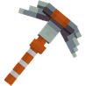
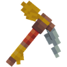
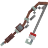

# 🛠️ Outils des Métiers

## 🔷 <mark style="color:yellow;">Son obtention 🤔</mark>

Les <mark style="color:green;">outils des Métiers</mark> s'obtiennent dans les [<mark style="color:green;">**paliers de métiers**</mark>](https://wiki.evolucraft.fr/le-gameplay/les-metiers#progression) en les récupérant avec la commande <mark style="color:green;">**`/jobs claim`**</mark>.

## 🔷 <mark style="color:yellow;">Son aperçu 🔍</mark>

### 🔹 Outils de Métiers

<table border="1" cellspacing="0" cellpadding="6">
  <tr>
    <td align="center"><strong><ins>Nom</ins> 🏷️</strong></td>
    <td align="center"><strong><ins>Enchentement</ins> 📖</strong></td>
    <td align="center"><strong><ins>Durabilité</ins> 📏</strong></td>
    <td align="center"><strong><ins>Effet</ins> ✨</strong></td> 
  </tr>
  <tr>
   <td align="center">
     
<mark style="color:yellow;"><strong>Épée du Chasseur</strong></mark>

     
<figure></figure>

   </td>
   <td>
     
▸ <mark style="color:yellow;"><strong>Tranchant V</strong></mark>

     
▸ <mark style="color:yellow;"><strong>Châtiment VI</strong></mark>

     
▸ <mark style="color:yellow;"><strong>Fléau des arthropodes VI</strong></mark>

     
▸ <mark style="color:yellow;"><strong>Affliage III</strong></mark>

     
▸ <mark style="color:yellow;"><strong>Butin III</strong></mark>

   </td>
   <td align="center">
     
<mark style="color:yellow;"><strong>2 000</strong></mark> de <mark style="color:yellow;"><strong>Durabilitées</strong></mark>

   </td>
   <td>
     
<strong><mark style="color:yellow;">Aucun Effet</mark> Supplémentaire ❌</strong>

   </td>
  </tr>
  <tr>
   <td align="center">
     
<mark style="color:yellow;"><strong>Pioche du Mineur</strong></mark>

     
<figure></figure>

   </td>
   <td>
     
▸ <mark style="color:yellow;"><strong>Efficacité VI</strong></mark>

     
▸ <mark style="color:yellow;"><strong>Fortune III</strong></mark>

   </td>
   <td align="center">
     
<mark style="color:yellow;"><strong>1 500</strong></mark> de <mark style="color:yellow;"><strong>Durabilitées</strong></mark>

   </td>
   <td>
     
<strong><mark style="color:yellow;">Aucun Effet</mark> Supplémentaire ❌</strong>

   </td>
  </tr>  
  <tr>
   <td align="center">
     
<mark style="color:yellow;"><strong>Hache du Bûcheron</strong></mark>

     
<figure></figure>

   </td>
   <td>
     
▸ <mark style="color:yellow;"><strong>Efficacité VI</strong></mark>

   </td>
   <td align="center">
     
<mark style="color:yellow;"><strong>1 500</strong></mark> de <mark style="color:yellow;"><strong>Durabilitées</strong></mark>

   </td>
   <td>
     
<strong><mark style="color:yellow;">Aucun Effet</mark> Supplémentaire ❌</strong>

   </td>
  </tr>
  <tr>
   <td align="center">
     
<mark style="color:yellow;"><strong>Houe du Fermier</strong></mark>

     
<figure></figure>

   </td>
   <td>
     
▸ <mark style="color:yellow;"><strong>Efficacité V</strong></mark>

     
▸ <mark style="color:yellow;"><strong>Fortune IV</strong></mark>

   </td>
   <td align="center">
     
<mark style="color:yellow;"><strong>3 250</strong></mark> de <mark style="color:yellow;"><strong>Durabilitées</strong></mark>

   </td>
   <td>  
    
▸ <mark style="color:yellow;"><strong>Effet Magnet</strong></mark> : Vous permet de récolter les cultures cassées.

    
▸ <mark style="color:yellow;"><strong>Effet Farmer</strong></mark> : Casse et replante dans une zone de 1X1.

   </td>
  </tr>
  <tr>
   <td align="center">
     
<mark style="color:yellow;"><strong>Canne à Pêche du Pêcheur</strong></mark>

     
<figure></figure>

   </td>
   <td>
     
▸ <mark style="color:yellow;"><strong>Chance de la Mer IV</strong></mark>

     
▸ <mark style="color:yellow;"><strong>Appât IV</strong></mark>

   </td>
   <td align="center">
     
<mark style="color:yellow;"><strong>500</strong></mark> de <mark style="color:yellow;"><strong>Durabilitées</strong></mark>

   </td>
   <td>
     
<strong><mark style="color:yellow;">Aucun Effet</mark> Supplémentaire ❌</strong>

   </td>
  </tr>
</table>
