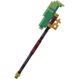
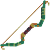
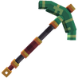
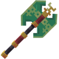
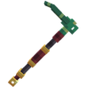
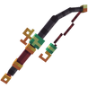
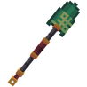
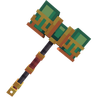

# 🐍 Outils du Serpent

## 🔹 <mark style="color:green;">Son obtention 🤔</mark>

#### Les <mark style="color:green;">**outils du Serpent**</mark> s'obtenaient dans le <mark style="color:green;">**Pass Serpent**</mark> durant la <mark style="color:green;">**mise à jour Serpent**</mark>


Le pass serpent <mark style="color:green;">**n'est plus disponible**</mark>. Les items sont donc obtenables uniquement à <mark style="color:green;">l'achat entre joueurs</mark> ou dans [<mark style="color:green;">l'hôtel de vente</mark>](https://wiki.evolucraft.fr/le-gameplay/le-commerce#hotel-des-ventes).


## 🔹 <mark style="color:green;">Son aperçu 🔍</mark>

<table border="1" cellspacing="0" cellpadding="6">
  <tr>
    <td align="center"><strong><ins>Nom</ins> 🏷️</strong></td>
    <td align="center"><strong><ins>Enchentement</ins> 📖</strong></td>
    <td align="center"><strong><ins>Durabilité</ins> 📏</strong></td>
    <td align="center"><strong><ins>Effet</ins> ✨</strong></td> 
  </tr>
  <tr>
   <td align="center">
     
<mark style="color:green;"><strong>Dague du Serpent</strong></mark>

     
<figure></figure>

   </td>
   <td>
     
▸ <mark style="color:green;"><strong>Tranchant V</strong></mark>

     
▸ <mark style="color:green;"><strong>Butin III</strong></mark>

   </td>
   <td align="center">
     
<mark style="color:green;"><strong>3 000</strong></mark> de <mark style="color:green;"><strong>Durabilitées</strong></mark>

   </td>
   <td>
     
<strong><mark style="color:green;">Aucun Effet</mark> Supplémentaire ❌</strong>

   </td>
  </tr>
  <tr>
   <td align="center">
     
<mark style="color:green;"><strong>Lance du Serpent</strong></mark>

     
<figure></figure>

   </td>
   <td>
     
▸ <mark style="color:green;"><strong>Tranchant V</strong></mark>

     
▸ <mark style="color:green;"><strong>Châtiment VI</strong></mark>

     
▸ <mark style="color:green;"><strong>Fléau des arthropodes VI</strong></mark>

     
▸ <mark style="color:green;"><strong>Affliage V</strong></mark>

     
▸ <mark style="color:green;"><strong>Butin V</strong></mark>

   </td>
   <td align="center">
     
<mark style="color:green;"><strong>3 500</strong></mark> de <mark style="color:green;"><strong>Durabilitées</strong></mark>

   </td>
   <td>
     
▸ <strong><mark style="color:green;">Effet Dextérité</mark></strong> : Tappe 15% plus vite

   </td>
  </tr>
  <tr>
   <td align="center">
     
<mark style="color:green;"><strong>Arc du Serpent</strong></mark>

     
<figure></figure>

   </td>
   <td>
     
▸ <mark style="color:green;"><strong>Puissance VII</strong></mark>

     
▸ <mark style="color:green;"><strong>Frappe III</strong></mark>

     
▸ <mark style="color:green;"><strong>Flamme III</strong></mark>

     
▸ <mark style="color:green;"><strong>Infinité</strong></mark>

   </td>
   <td align="center">
     
<mark style="color:green;"><strong>3 500</strong></mark> de <mark style="color:green;"><strong>Durabilitées</strong></mark>

   </td>
   <td>
     
<strong><mark style="color:green;">Aucun Effet</mark> Supplémentaire ❌</strong>

   </td>
  </tr>
  <tr>
   <td align="center">
     
<mark style="color:green;"><strong>Pioche du Serpent</strong></mark>

     
<figure></figure>

   </td>
   <td>
     
▸ <mark style="color:green;"><strong>Efficacité VI</strong></mark>

     
▸ <mark style="color:green;"><strong>Fortune IX</strong></mark>

   </td>
   <td align="center">
     
<mark style="color:green;"><strong>3 000</strong></mark> de <mark style="color:green;"><strong>Durabilitées</strong></mark>

   </td>
   <td>
     
<strong><mark style="color:green;">Aucun Effet</mark> Supplémentaire ❌</strong>

   </td>
  </tr>  
  <tr>
   <td align="center">
     
<mark style="color:green;"><strong>Hache du Serpent</strong></mark>

     
<figure></figure>

   </td>
   <td>
     
▸ <mark style="color:green;"><strong>Efficacité VII</strong></mark>

   </td>
   <td align="center">
     
<mark style="color:green;"><strong>3 500</strong></mark> de <mark style="color:green;"><strong>Durabilitées</strong></mark>

   </td>
   <td>
     
▸ <mark style="color:green;"><strong>Effet Bûcheron</strong></mark> : Coupe un petit arbre en entier en y cassant juste une bûche.

   </td>
  </tr>
  <tr>
   <td align="center">
     
<mark style="color:green;"><strong>Houe du Serpent</strong></mark>

     
<figure></figure>

   </td>
   <td>
     
▸ <mark style="color:green;"><strong>Efficacité V</strong></mark>

     
▸ <mark style="color:green;"><strong>Fortune V</strong></mark>

   </td>
   <td align="center">
     
<mark style="color:green;"><strong>8 000</strong></mark> de <mark style="color:green;"><strong>Durabilitées</strong></mark>

   </td>
   <td>  
    
▸ <mark style="color:green;"><strong>Effet Magnet</strong></mark> : Vous permet de récolter les cultures cassées.

    
▸ <mark style="color:green;"><strong>Effet Farmer</strong></mark> : Casse et replante dans une zone de 3X3.

   </td>
  </tr>
  <tr>
   <td align="center">
     
<mark style="color:green;"><strong>Canne à Pêche du Serpent</strong></mark>

     
<figure></figure>

   </td>
   <td>
     
▸ <mark style="color:green;"><strong>Chance de la Mer V</strong></mark>

     
▸ <mark style="color:green;"><strong>Appât V</strong></mark>

   </td>
   <td align="center">
     
<mark style="color:green;"><strong>1 250</strong></mark> de <mark style="color:green;"><strong>Durabilitées</strong></mark>

   </td>
   <td>
     
▸ <mark style="color:green;"><strong>Effet Pêche</strong></mark> : Vous avez 10% de chance de doubler votre pêche.

   </td>
  </tr>  
  <tr>
   <td align="center">
     
<mark style="color:green;"><strong>Pelle du Serpent</strong></mark>

     
<figure></figure>

   </td>
   <td>
     
▸ <mark style="color:green;"><strong>Efficaciter VII</strong></mark>

     
▸ <mark style="color:green;"><strong>Toucher de Soi</strong></mark>

   </td>
   <td align="center">
     
<mark style="color:green;"><strong>4 500</strong></mark> de <mark style="color:green;"><strong>Durabilitées</strong></mark>

   </td>
   <td>
     
<strong><mark style="color:green;">Aucun Effet</mark> Supplémentaire ❌</strong>

   </td>
  </tr>
  <tr>
   <td align="center">
     
<mark style="color:green;"><strong>Marteau du Serpent</strong></mark>

     
<figure></figure>

   </td>
   <td>
     
▸ <mark style="color:green;"><strong>Efficacité V</strong></mark>

     
▸ <mark style="color:green;"><strong>Fortune III</strong></mark>

   </td>
   <td align="center">
     
<mark style="color:green;"><strong>4 500</strong></mark> de <mark style="color:green;"><strong>Durabilitées</strong></mark>

   </td>
   <td>
     
▸ <mark style="color:green;"><strong>Effet Hammer</strong></mark> : Casse les blocs dans une zone de 3X3.

   </td>
  </tr>
</table>
