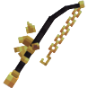

# 💫 Outils Somptueux
<!--- Oui il y a une faute de frappe dans la catégorie de l'item --->

## 🔹 <mark style="color:yellow;">Son obtention 🤔</mark>

#### Les <mark style="color:yellow;">**outils Somptueux**</mark> s'obtenaient dans le <mark style="color:yellow;">**Pass Black Friday de 2025**</mark> durant la <mark style="color:yellow;">**mise à jour Black Friday**</mark>


Le pass Black Friday <mark style="color:green;">**n'est plus disponible**</mark>. Les items sont donc obtenables uniquement à <mark style="color:green;">l'achat entre joueurs</mark> ou dans [<mark style="color:green;">l'hôtel de vente</mark>](https://wiki.evolucraft.fr/le-gameplay/le-commerce#hotel-des-ventes).


## 🔷 <mark style="color:yellow;">Son aperçu 🔍</mark>

<table border="1" cellspacing="0" cellpadding="6">
  <tr>
    <td align="center"><strong><ins>Nom</ins> 🏷️</strong></td>
    <td align="center"><strong><ins>Enchantement</ins> 📖</strong></td>
    <td align="center"><strong><ins>Durabilité</ins> 📏</strong></td>
    <td align="center"><strong><ins>Effet</ins> ✨</strong></td> 
  </tr>
  <tr>
   <td align="center">
     
<mark style="color:yellow;"><strong>Épée sompteueuse</strong></mark>

     
<figure></figure>

   </td>
   <td>
     
▸ <mark style="color:yellow;"><strong>Tranchant V</strong></mark>

     
▸ <mark style="color:yellow;"><strong>Châtiment VI</strong></mark>

     
▸ <mark style="color:yellow;"><strong>Fléau des arthropodes VI</strong></mark>

     
▸ <mark style="color:yellow;"><strong>Affilage III</strong></mark>

     
▸ <mark style="color:yellow;"><strong>Butin III</strong></mark>

   </td>
   <td align="center">
     
<mark style="color:yellow;"><strong>2 500</strong></mark> de <mark style="color:yellow;"><strong>Durabilité</strong></mark>

   </td>
   <td>
     
<strong><mark style="color:yellow;">Aucun Effet</mark> Supplémentaire ❌</strong>

   </td>
  </tr>
  <tr>
   <td align="center">
     
<mark style="color:yellow;"><strong>Pioche sompteueuse</strong></mark>

     
<figure></figure>

   </td>
   <td>
     
▸ <mark style="color:yellow;"><strong>Efficacité VI</strong></mark>

     
▸ <mark style="color:yellow;"><strong>Fortune III</strong></mark>

   </td>
   <td align="center">
     
<mark style="color:yellow;"><strong>2 000</strong></mark> de <mark style="color:yellow;"><strong>Durabilité</strong></mark>

   </td>
   <td>
     
<strong><mark style="color:yellow;">Aucun Effet</mark> Supplémentaire ❌</strong>

   </td>
  </tr>  
  <tr>
   <td align="center">
     
<mark style="color:yellow;"><strong>Hache sompteueuse</strong></mark>

     
<figure></figure>

   </td>
   <td>
     
▸ <mark style="color:yellow;"><strong>Efficacité VI</strong></mark>

   </td>
   <td align="center">
     
<mark style="color:yellow;"><strong>2 000</strong></mark> de <mark style="color:yellow;"><strong>Durabilité</strong></mark>

   </td>
   <td>
     
<strong><mark style="color:yellow;">Aucun Effet</mark> Supplémentaire ❌</strong>

   </td>
  </tr>
  <tr>
   <td align="center">
     
<mark style="color:yellow;"><strong>Houe sompteueuse</strong></mark>

     
<figure></figure>

   </td>
   <td>
     
▸ <mark style="color:yellow;"><strong>Efficacité V</strong></mark>

     
▸ <mark style="color:yellow;"><strong>Fortune IV</strong></mark>

   </td>
   <td align="center">
     
<mark style="color:yellow;"><strong>4 000</strong></mark> de <mark style="color:yellow;"><strong>Durabilité</strong></mark>

   </td>
   <td>  
    
▸ <mark style="color:yellow;"><strong>Effet Magnet</strong></mark> : Vous permet de récolter les cultures cassées.

    
▸ <mark style="color:yellow;"><strong>Effet Farmer</strong></mark> : Casse et replante dans une zone de 1X1.

   </td>
  </tr>
  <tr>
   <td align="center">
     
<mark style="color:yellow;"><strong>Canne à Pêche sompteueuse</strong></mark>

     
<figure></figure>

   </td>
   <td>
     
▸ <mark style="color:yellow;"><strong>Chance de la Mer IV</strong></mark>

     
▸ <mark style="color:yellow;"><strong>Appât IV</strong></mark>

   </td>
   <td align="center">
     
<mark style="color:yellow;"><strong>750</strong></mark> de <mark style="color:yellow;"><strong>Durabilité</strong></mark>

   </td>
   <td>
     
<strong><mark style="color:yellow;">Aucun Effet</mark> Supplémentaire ❌</strong>

   </td>
  </tr>  
  <tr>
   <td align="center">
     
<mark style="color:yellow;"><strong>Pelle sompteueuse</strong></mark>

     
<figure></figure>

   </td>
   <td>
     
▸ <mark style="color:yellow;"><strong>Efficacité VI</strong></mark>

     
▸ <mark style="color:yellow;"><strong>Toucher de Soie</strong></mark>

   </td>
   <td align="center">
     
<mark style="color:yellow;"><strong>2 500</strong></mark> de <mark style="color:yellow;"><strong>Durabilité</strong></mark>

   </td>
   <td>
     
<strong><mark style="color:yellow;">Aucun Effet</mark> Supplémentaire ❌</strong>

   </td>
  </tr>
</table>
