# 🐾 Les Spawners

## 💠 <mark style="color:green;">Quelques informations... ?</mark> 📃

Les <mark style="color:green;">**spawners**</mark> sont des blocs spéciaux permettant de faire apparaître régulièrement un <mark style="color:green;">**mob défini**</mark> par le spawner.\
Ils sont particulièrement utiles pour la création de <mark style="color:green;">**farm automatiques**</mark>, afin de récolter des ressources, <mark style="color:green;">**gagner de l'XP**</mark> ou encore <mark style="color:green;">**monter votre métier de Chasseur**</mark>.

Ces blocs peuvent être placés <mark style="color:green;">**n’importe où**</mark> (dans les zones où vous en avez l’autorisation).\
Cependant, ils ne sont <mark style="color:green;">**récupérables**</mark> qu’à l’intérieur de votre <mark style="color:green;">**propre ville**</mark>, ou d’une ville où vous disposez des droits nécessaires, et uniquement à l’aide d’une <mark style="color:green;">**pioche enchantée Toucher de Soie**</mark>.\
Également, vous ne pouvez placer que <mark style="color:green;">**12 spawners par chunk**</mark>.

Il existe <mark style="color:green;">**deux types de spawners**</mark> sur le serveur :

* <mark style="color:green;">**Spawner PASSIF**</mark> 🐔 : Nécessite des <mark style="color:green;">**blocs d’herbe**</mark> et de la <mark style="color:green;">**lumière**</mark> pour que les mobs puissent apparaître.
* <mark style="color:green;">**Spawner AGRESSIF**</mark> 🐍 : Nécessite l’absence <mark style="color:green;">**totale de lumière**</mark> pour que les mobs puissent apparaître.

## 💠 <mark style="color:green;">Liste des spawners existant ?</mark> 🔍

| <mark style="color:green;">**Nom 🏷️**</mark>                                                                                                                                                              | <mark style="color:green;">**Catégorie 📂**</mark> | <mark style="color:green;">**Obtentions 🔍**</mark>                                                                                                                                                                                                                                                                                          |
| -------------------------------------------------------------------------------------------------------------------------------------------------------------------------------------------------------- | ------------------------------------------------ | ------------------------------------------------------------------------------------------------------------------------------------------------------------------------------------------------------------------------------------------------------------------------------------------------------------------------------------------ |
| 
<mark style="color:green;"><strong>Vache</strong></mark>

<figure>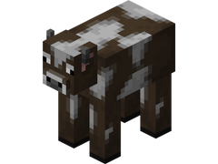<figcaption></figcaption></figure>
                          | <mark style="color:green;">**Passif 🐔**</mark>  | 
* Caisse de Vote 📨

* `/Boutique` (300 Gemmes💎)

* Parchemin Avancé 🟡

* Parchemin Abyssal 🌊

* Parchemin Terrier du Lapin / Fabrique du Chcolat 🍫

* Parchemin Citrouille 🎃
                                                                                                                                                         |
| 
<mark style="color:green;"><strong>Cochon</strong></mark>

<figure>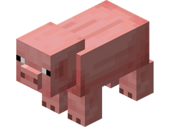<figcaption></figcaption></figure>
                        | <mark style="color:green;">**Passif 🐔**</mark>  | 
* Caisse de Vote 📨

* `/Boutique` (250 Gemmes💎)

* Parchemin Facile 🟢
                                                                                                                                                                                                                                                  |
| 
<mark style="color:green;"><strong>Mouton</strong></mark>

<figure>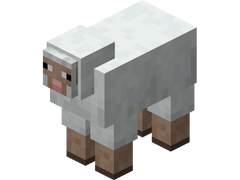<figcaption></figcaption></figure>
                        | <mark style="color:green;">**Passif 🐔**</mark>  | 
* Caisse de Vote 📨

* `/Boutique` (200 Gemmes💎)

* Parchemin Facile 🟢
                                                                                                                                                                                                                                                  |
| 
<mark style="color:green;"><strong>Poule</strong></mark>

<figure><figcaption></figcaption></figure>
                          | <mark style="color:green;">**Passif 🐔**</mark>  | 
* Caisse de Vote 📨

* `/Boutique` (150 Gemmes💎)

* Parchemin Facile 🟢

* Parchemin Abyssal 🌊

* Parchemin Terrier du Lapin / Fabrique du Chcolat 🍫

* Parchemin Citrouille 🎃
                                                                                                                                                            |
| 
<mark style="color:green;"><strong>Lapin</strong></mark>

<figure>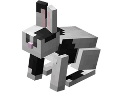<figcaption></figcaption></figure>
                          | <mark style="color:green;">**Passif 🐔**</mark>  | 
* Caisse Pâques 🥚

* `/Boutique` (250 Gemmes💎)

* Parchemin Facile 🟢
                                                                                                                                                                                                                                                   |
| 
<mark style="color:green;"><strong>Tortue</strong></mark>

<figure>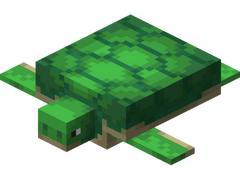<figcaption></figcaption></figure>
                        | <mark style="color:green;">**Passif 🐔**</mark>  | \* Caisse Abyssal 🌊                                                                                                                                                                                                                                                                                                                       |
| 
<mark style="color:green;"><strong>Grenouille</strong></mark>

<figure>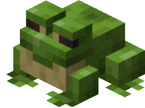<figcaption></figcaption></figure>
                | <mark style="color:green;">**Passif 🐔**</mark>  | \* Caisse Trésors 🏴‍☠️                                                                                                                                                                                                                                                                                                                    |
| 
<mark style="color:green;"><strong>Ours Polaire</strong></mark>

<figure>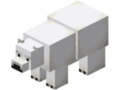<figcaption></figcaption></figure>
             | <mark style="color:green;">**Passif 🐔**</mark>  | 
* Caisse Givrée ❄️

* `/Boutique` (400 Gemmes💎)

* Parchemin de l'Amour ❤️

* Caisse Pain d'épice 🍪

* Parchemin en Pain d'épice 🍪
                                                                                                                                                                                                                                               |
| 
<mark style="color:green;"><strong>Champimeuh</strong></mark>

<figure>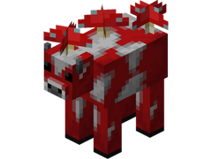<figcaption></figcaption></figure>
                | <mark style="color:green;">**Passif 🐔**</mark>  | \* \`/Boutique\` (350 Gemmes💎)                                                                                                                                                                                                                                                                                                            |
| 
<mark style="color:green;"><strong>Renard</strong></mark>

<figure><figcaption></figcaption></figure>
                        | <mark style="color:green;">**Passif 🐔**</mark>  | 
* Caisse Pain d'épice 🍪
                                                                                                                                                                                                                                                                                                          |
| 
<mark style="color:red;"><strong>Enderman</strong></mark>

<figure><figcaption></figcaption></figure>
                    | <mark style="color:red;">**Agressif 🐍**</mark>  | 
* Caisse Rubis 🔻

* `/Boutique` (500 Gemmes💎)

* Parchemin Expert 🟣

* Parchemin Abyssal 🌊

* Parchemin Terrier du Lapin / Fabrique du Chcolat 🍫

* Parchemin Citrouille 🎃

* Parchemin Lune de Sang 🩸
                                                                                                                                                               |
| 
<mark style="color:red;"><strong>Blaze</strong></mark>

<figure>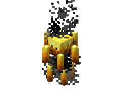<figcaption></figcaption></figure>
                          | <mark style="color:red;">**Agressif 🐍**</mark>  | 
* Caisse Rubis 🔻

* Caisse Draconique 🐉

* `/Boutique` (500 Gemmes💎)

* Parchemin Expert 🟣

* Parchemin Abyssal 🌊

* Parchemin Halloween 🎃

* Parchemin Givré ❄️

* Parchemin de l'Amour ❤️

* Parchemin Terrier du Lapin / Fabrique du Chcolat 🍫

* Parchemin Citrouille 🎃

* Parchemin Lune de Sang 🩸

* Parchemin en Pain d'épice 🍪
                                         |
| 
<mark style="color:red;"><strong>Zombie</strong></mark>

<figure><figcaption></figcaption></figure>
                        | <mark style="color:red;">**Agressif 🐍**</mark>  | 
* Caisse Émeraude ✳️

* Caisse St-Valentin 💕

* `/Boutique` (300 Gemmes💎)

* Parchemin Avancé 🟡

* Parchemin Difficile 🔵

* Parchemin Abyssal 🌊

* Parchemin Halloween 🎃

* Parchemin Givré ❄️

* Parchemin de l'Amour ❤️

* Parchemin Terrier du Lapin / Fabrique du Chcolat 🍫

* Parchemin Citrouille 🎃

* Parchemin Lune de Sang 🩸

* Parchemin en Pain d'épice 🍪
      |
| 
<mark style="color:red;"><strong>Squelette</strong></mark>

<figure>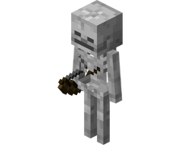<figcaption></figcaption></figure>
                  | <mark style="color:red;">**Agressif 🐍**</mark>  | 
* Caisse Émeraude ✳️

* `/Boutique` (400 Gemmes💎)

* Parchemin Avancé 🟡

* Parchemin Difficile 🔵

* Parchemin Abyssal 🌊

* Parchemin Halloween 🎃

* Parchemin Givré ❄️

* Parchemin de l'Amour ❤️

* Parchemin Terrier du Lapin / Fabrique du Chcolat 🍫

* Caisse Lune de Sang 🩸

* Parchemin Citrouille 🎃

* Parchemin Lune de Sang 🩸

* Parchemin en Pain d'épice 🍪
      |
| 
<mark style="color:red;"><strong>Creeper</strong></mark>

<figure>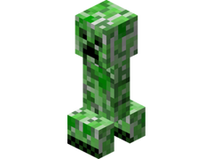<figcaption></figcaption></figure>
                      | <mark style="color:red;">**Agressif 🐍**</mark>  | 
* Caisse Émeraude ✳️

* Parchemin Difficile 🔵

* Parchemin Abyssal 🌊

* Parchemin Halloween 🎃

* Parchemin Givré ❄️

* Parchemin de l'Amour ❤️

* Parchemin Terrier du Lapin / Fabrique du Chcolat 🍫

* Parchemin Citrouille 🎃

* Parchemin Lune de Sang 🩸

* Parchemin en Pain d'épice 🍪
                                                                                                   |
| 
<mark style="color:red;"><strong>Piglin Zombifié</strong></mark>

<figure>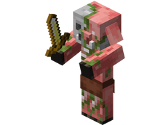<figcaption></figcaption></figure>
               | <mark style="color:red;">**Agressif 🐍**</mark>  | 
* Caisse Draconique 🐉

* Caisse Trésors 🏴‍☠️

* Caisse Pâques 🥚

* `/Boutique` (850 Gemmes💎)

* Parchemin Expert 🟣

* Parchemin Impossible 🔴
                                                                                                                                                         |
| 
<mark style="color:red;"><strong>Cube de Magma</strong></mark>

<figure>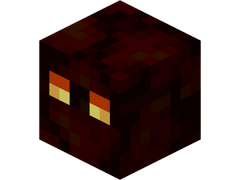<figcaption></figcaption></figure>
              | <mark style="color:red;">**Agressif 🐍**</mark>  | 
* Caisse Draconique 🐉

* `/Boutique` (650 Gemmes💎)
                                                                                                                                                                                                                                                                           |
| 
<mark style="color:red;"><strong>Gardien</strong></mark>

<figure>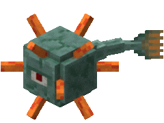<figcaption></figcaption></figure>
                      | <mark style="color:red;">**Agressif 🐍**</mark>  | 
* Caisse Jackpot 🎰

* Caisse Abyssal 🌊

* Caisse St-Valentin 💕

* Caisse Summer 🏖️

* `/Boutique` (850 Gemmes💎)

* Parchemin Lune de Sang 🩸

* Parchemin en Pain d'épice 🍪
                                                                                                                                                                                              |
| 
<mark style="color:red;"><strong>Dauphin</strong></mark>

<figure><figcaption></figcaption></figure>
                      | <mark style="color:red;">**Agressif 🐍**</mark>  | \* Caisse Abyssal 🌊                                                                                                                                                                                                                                                                                                                       |
| 
<mark style="color:red;"><strong>Sorcière</strong></mark>

<figure><figcaption></figcaption></figure>
                    | <mark style="color:red;">**Agressif 🐍**</mark>  | 
* Caisse Halloween 🎃

* Parchemin Impossible 🔴

* Parchemin Halloween 🎃

* Parchemin Givré ❄️

* Caisse Lune de Sang 🩸
                                                                                                                                                                                     |
| 
<mark style="color:red;"><strong>Hoglin</strong></mark>

<figure><figcaption></figcaption></figure>
                        | <mark style="color:red;">**Agressif 🐍**</mark>  | 
* Caisse Halloween 🎃

* Caisse Pâques 🥚

* Parchemin Halloween 🎃

* Parchemin Givré ❄️
                                                                                                                                                                                                                            |
| 
<mark style="color:red;"><strong>Bonhomme de Neige</strong></mark>

<figure><figcaption></figcaption></figure>
          | <mark style="color:red;">**Agressif 🐍**</mark>  | 
* Caisse Givrée ❄️

* Parchemin de l'Amour ❤️

* Caisse Pain d'épice 🍪

* Parchemin en Pain d'épice 🍪
                                                                                                                                                                                                                                                                                   |
| 
<mark style="color:red;"><strong>Zombie Momifié</strong></mark>

<figure>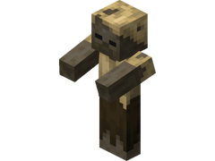<figcaption></figcaption></figure>
           | <mark style="color:red;">**Agressif 🐍**</mark>  | 
* Caisse St-Valentin 💕

* Parchemin Abyssal 🌊

* Parchemin Terrier du Lapin / Fabrique du Chcolat 🍫

* Parchemin Citrouille 🎃

* Parchemin Lune de Sang 🩸
                                                                                                                                                                                                                          |
| 
<mark style="color:red;"><strong>Vindicateur</strong></mark>

<figure><figcaption></figcaption></figure>
              | <mark style="color:red;">**Agressif 🐍**</mark>  | \* Caisse St-Patrick 🍀                                                                                                                                                                                                                                                                                                                    |
| 
<mark style="color:red;"><strong>Slime</strong></mark>

<figure>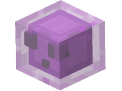<figcaption></figcaption></figure>
                            | <mark style="color:red;">**Agressif 🐍**</mark>  | \* Caisse St-Patrick 🍀                                                                                                                                                                                                                                                                                                                    |
| 
<mark style="color:red;"><strong>Poulpe</strong></mark>

<figure>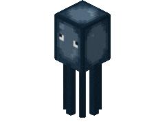<figcaption></figcaption></figure>
                        | <mark style="color:red;">**Agressif 🐍**</mark>  | \* Caisse Summer 🏖️                                                                                                                                                                                                                                                                                                                       |
| 
<mark style="color:red;"><strong>Poulpe Scintillant</strong></mark>

<figure>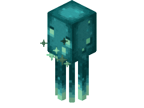<figcaption></figcaption></figure>
         | <mark style="color:red;">**Agressif 🐍**</mark>  | \* \`/Boutique\` (500 Gemmes💎)                                                                                                                                                                                                                                                                                                            |
| 
<mark style="color:red;"><strong>Araignée</strong></mark>

<figure>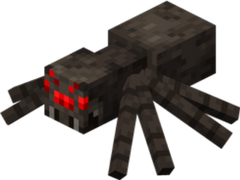<figcaption></figcaption></figure>
                    | <mark style="color:red;">**Agressif 🐍**</mark>  | 
* `/Boutique` (300 Gemmes💎)

* Parchemin Avancé 🟡

* Parchemin Difficile 🔵
                                                                                                                                                                                                                                             |
| 
<mark style="color:red;"><strong>Golem de Fer</strong></mark>

<figure><figcaption></figcaption></figure>
              | <mark style="color:red;">**Agressif 🐍**</mark>  | 
* Caisse Jackpot 🎰

* `/Boutique` (1 000 Gemmes💎)

* Parchemin Impossible 🔴

* Parchemin Halloween 🎃

* Parchemin Givré ❄️

* Parchemin de l'Amour ❤️

* Parchemin Lune de Sang 🩸

* Parchemin en Pain d'épice 🍪
                                                                                                                                                    |
| 
<mark style="color:red;"><strong>Araignée Venimeuse</strong></mark>

<figure>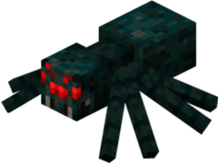<figcaption></figcaption></figure>
 | <mark style="color:red;">**Agressif 🐍**</mark>  | \* Parchemin Expert 🟣                                                                                                                                                                                                                                                                                                                     |
| 
<mark style="color:red;"><strong>Wither Squelette</strong></mark>

<figure><figcaption></figcaption></figure>
    | <mark style="color:red;">**Agressif 🐍**</mark>  | \* Caisse Lune de Sang 🩸                                                                                                                                                                                                                                                                                                                     |
