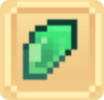
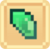
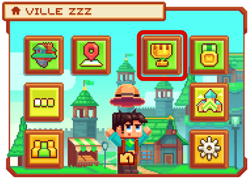
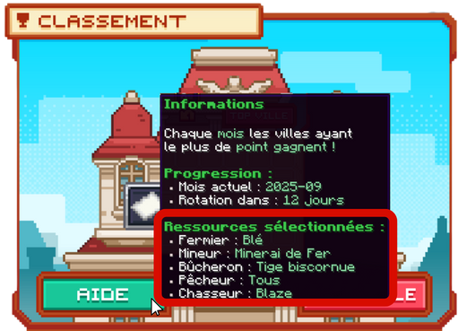
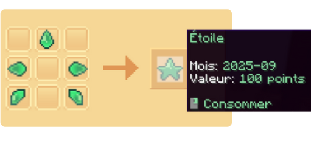

# ⭐ Fragments d'étoiles de métiers

Les **<mark style="color:green;"><strong>fragments d'étoiles de métiers</strong></mark>** vous permettent de **<mark style="color:green;"><strong>fabriquer une étoile</strong></mark>** en combinant les fragments de chaque **<mark style="color:green;"><strong>métier</strong></mark>**, comme indiqué ci-dessous :

<table border="1" cellspacing="0" cellpadding="6">
  <tr>
   <td><mark style="color:green;"><strong><ins>Métiers 🛠️</ins></strong></mark></td> 
   <td><mark style="color:green;"><strong>Fermier 🌾</strong></mark></td>
   <td><mark style="color:green;"><strong>Mineur ⛏️</strong></mark></td>
   <td><mark style="color:green;"><strong>Bûcheron 🪚</strong></mark></td>
   <td><mark style="color:green;"><strong>Pêcheur 🎣</strong></mark></td>
   <td><mark style="color:green;"><strong>Chasseur 🗡️</strong></mark></td>
  </tr>
  <tr>
   <td><mark style="color:green;"><strong><ins>Aperçu des fragments d'étoile</ins></strong></mark></td>
   <td><figure></figure></td>
   <td><figure></figure></td>
   <td><figure></figure></td>
   <td><figure></figure></td>
   <td><figure></figure></td>
  </tr>
</table>

Ces **<mark style="color:green;"><strong>étoiles</strong></mark>** servent ensuite au **<mark style="color:green;"><strong>classement des villes</strong></mark>** en ajoutant **<mark style="color:green;"><strong>100 points par étoile fabriquée</strong></mark>**.

Si vous souhaitez plus d'informations sur le **<mark style="color:green;"><strong>classement des villes</strong></mark>**, nous vous renvoyons vers cette page du wiki :  
[🏆 Le Classement des Villes](https://wiki.evolucraft.fr/le-gameplay/les-villes/classement-ville)

## 💠 <mark style="color:green;">Comment les obtenir ? 🤨</mark>

Pour obtenir des **<mark style="color:green;"><strong>fragments d'étoile</strong></mark>**, il vous suffit de récolter les **<mark style="color:green;"><strong>items demandés</strong></mark>** dans le métier concerné.  
Un **<mark style="color:green;"><strong>pourcentage de drop</strong></mark>** est appliqué, ce qui signifie que vous n’en obtiendrez pas à chaque action.

Pour connaître l’**<mark style="color:green;"><strong>action demandée</strong></mark>**, suivez les étapes ci-dessous :

### 🔷 <mark style="color:blue;">Étape 1️⃣</mark>

Dans votre **<mark style="color:green;"><strong>`/ville`</strong></mark>**, cliquez sur **<mark style="color:green;"><strong>Classement</strong></mark>**, représenté par **<mark style="color:green;"><strong>un trophée</strong></mark>**, comme sur l’image ci-dessous.

<figure><figcaption>Interface du /ville</figcaption></figure>

### 🔷 <mark style="color:blue;">Étape 2️⃣</mark>

Passez votre curseur sur le bouton **<mark style="color:green;"><strong>"Aide"</strong></mark>** afin de connaître les **<mark style="color:green;"><strong>items concernés</strong></mark>** où le **<mark style="color:green;"><strong>fragment du métier</strong></mark>** peut être obtenu.

<figure><figcaption>Informations des actions de métiers donnant le fragment</figcaption></figure>


**REMARQUE 🔍 :** Les **<mark style="color:green;"><strong>items indiqués changent chaque 1er du mois</strong></mark>**.


## 💠 <mark style="color:green;">Comment crafter l'étoile ? 🌟</mark>

Pour **<mark style="color:green;"><strong>crafter l’étoile</strong></mark>**, vous aurez besoin d’un **<mark style="color:green;"><strong>fragment de chaque métier</strong></mark>** :  
**<mark style="color:green;"><strong>Mineur ⛏️</strong></mark>**, **<mark style="color:green;"><strong>Chasseur 🗡️</strong></mark>**, **<mark style="color:green;"><strong>Pêcheur 🎣</strong></mark>**, **<mark style="color:green;"><strong>Bûcheron 🪚</strong></mark>** et **<mark style="color:green;"><strong>Fermier 🌾</strong></mark>**, puis de les placer comme indiqué sur l’image ci-dessous :

<figure><figcaption>Craft d'une Étoile</figcaption></figure>


**🚨 IMPORTANT ‼ :** Les **<mark style="color:green;"><strong>étoiles</strong></mark>** et les **<mark style="color:green;"><strong>fragments d'étoiles de métiers</strong></mark>** ont une **<mark style="color:green;"><strong>date limite</strong></mark>**.  
Ils ne sont plus utilisables après le mois où ils ont été obtenus et deviennent alors **<mark style="color:green;"><strong>obsolètes</strong></mark>**.  
Par conséquent, ils sont **<mark style="color:green;"><strong>interdits à la vente ❌</strong></mark>**.


Une fois l’**<mark style="color:green;"><strong>étoile craftée</strong></mark>**, il vous suffit de faire un **<mark style="color:green;"><strong>clic droit</strong></mark>** avec l’étoile en main, après avoir bien sélectionné votre ville via la commande **<mark style="color:green;"><strong>`/v select`</strong></mark>**, afin de **<mark style="color:green;"><strong>comptabiliser les points dans le classement des villes</strong></mark>**.

Pour plus d’informations sur le **<mark style="color:green;"><strong>classement des villes</strong></mark>**, consultez également cette page :  
[🏆 Le Classement des Villes](https://wiki.evolucraft.fr/le-gameplay/les-villes/classement-ville#comment-voir-son-classement)

Vous savez désormais tout sur l’**<mark style="color:green;"><strong>utilité des fragments d'étoiles</strong></mark>** ! ⭐
