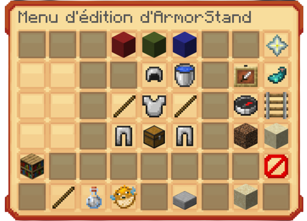

# 🧍‍♂️ Le guide de l'ASE

Le `/ase` vous permet de <mark style="color:green;">**personnaliser vos armor stands**</mark> afin d’apporter de la vie dans vos villes ou encore de magnifiques détails à vos shops de villes.

## <mark style="color:green;">💠 Comment l’obtenir 🎁 ?</mark>

Pour accéder à la commande `/ase`, vous devez disposer du <mark style="color:green;">**Premium 👑**</mark> que vous pouvez obtenir de deux manières :

* Soit <mark style="color:green;">**gratuitement via la box vote**</mark> pendant **24 heures** !
* Soit via <mark style="color:green;">**l'abonnement mensuel**</mark> disponible à **la** [**boutique**](https://store.evolucraft.fr/) **du site**.

## <mark style="color:green;">💠 Le</mark> <mark style="color:green;"></mark><mark style="color:green;">`/ase`</mark><mark style="color:green;">, comment ça fonctionne ? 🤔</mark>

Pour personnaliser un **armor stand**, vous aurez besoin d'un <mark style="color:green;">**silex**</mark> et d'un ou plusieurs <mark style="color:green;">**armor stands**</mark>, disponibles dans le `/shop`.

Ensuite, pour accéder <mark style="color:green;">**au menu de l'ase**</mark>, faites un **clic droit avec le silex en main, sans viser l’armor stand**.


**Important 🚨** :\
Assurez-vous d’avoir les <mark style="color:green;">**permissions d’édition des porte-armures**</mark> dans votre rôle en regardant dans le `/v > rôle > "votre rôle" > paramètres d’action > page 2 > Édition de porte-armure`.


<figure><figcaption>
<strong>Aperçu du menu</strong>
</figcaption></figure>

## <mark style="color:green;">💠 Que peut-on faire avec le</mark> <mark style="color:green;"></mark><mark style="color:green;">`/ase`</mark> <mark style="color:green;"></mark><mark style="color:green;">? 🔎</mark>

### 🔸 <mark style="color:green;">Déplacer un armor stand</mark>

Pour déplacer votre armor stand à un endroit précis, vous devez :

* <mark style="color:green;">Étape 1️⃣</mark> : Cliquer sur le <mark style="color:green;">rail nommé "position"</mark>.
* <mark style="color:green;">Étape 2️⃣</mark> : Choisir si vous souhaitez <mark style="color:green;">un gros déplacement</mark> (_terre stérile/coarse dirt_) ou <mark style="color:green;">un petit déplacement</mark> (_grès lisse/smooth sandstone_).
* <mark style="color:green;">Étape 3️⃣</mark> : Choisir <mark style="color:green;">l'axe sur lequel vous voulez déplacer</mark> votre armor stand : <mark style="color:red;">X en rouge</mark>, <mark style="color:green;">Y en vert</mark> et <mark style="color:blue;">Z en bleu</mark>.
* <mark style="color:green;">Étape 4️⃣</mark> : Puis, avec le silex toujours en main, faites soit :
  * Un <mark style="color:green;">**clic droit**</mark> sur l’armor stand pour un <mark style="color:green;">déplacement</mark> <mark style="color:green;">**dans les coordonnées positives**</mark>.
  * Un <mark style="color:green;">**clic gauche**</mark> pour un <mark style="color:green;">déplacement</mark> <mark style="color:green;">**dans les coordonnées négatives**</mark>.


Astuce 💡 : Pour changer l'axe de déplacement, il vous suffit de faire le raccourci clavier **sneak + molette**.


### 🔸 <mark style="color:green;">Ajouter des éléments sur votre armor stand</mark>


Pour cette partie, vous n'êtes pas obligé d'utiliser le /ase pour mettre des éléments d'armure ou une tête sur votre armor stand, car vous avez la permission de changer les armures sans passer par le menu.


Pour ajouter des <mark style="color:green;">**éléments à votre porte-armure**</mark>, commencez par ouvrir le menu du `/ase`, puis cliquez sur <mark style="color:green;">**l’icône du coffre**</mark>. Ensuite, faites un clic droit sur <mark style="color:green;">**votre porte-armure**</mark> pour ouvrir un nouvel affichage. Dans ce nouveau menu, <mark style="color:green;">**chaque emplacement en haut représente une partie du corps**</mark>.

Par exemple, si vous souhaitez placer **un objet sur la tête du porte-armure**, placez-le dans l’emplacement **situé sous le casque**.


🔎 **Remarque** : **Seuls les équipements d’armure** peuvent être visibles **sur les emplacements du plastron, du pantalon et des bottes**. Il n’est donc <mark style="color:green;">**pas possible d’y placer un objet ou une tête personnalisée**</mark>.


### 🔸 <mark style="color:green;">Afficher les bras de l’armor stand</mark>

Pour afficher <mark style="color:green;">les bras du porte-armure</mark>, ouvrez le menu du `/ase`, sélectionnez **l’icône en forme de bâton**, puis **cliquez sur le porte-armure** pour activer ou désactiver les bras.

### 🔸 <mark style="color:green;">Bouger les membres (tête, corps, bras et jambes) librement</mark>

Pour modifier la position des différentes parties du porte-armure, la méthode est similaire à celle du déplacement général.

* <mark style="color:green;">Étape 1️⃣</mark> : Dans le menu `/ase`, cliquez sur <mark style="color:green;">**la partie du corps**</mark> à modifier :

<figure><figcaption>
<strong>Aperçu des membres et de sa correspondance</strong>
</figcaption></figure>

* <mark style="color:green;">Étape 2️⃣</mark> : Comme pour le déplacement d'un armor stand, sélectionnez la puissance du mouvement entre <mark style="color:green;">un gros déplacement</mark> (_terre stérile/coarse dirt_) ou <mark style="color:green;">un petit déplacement</mark> (_grès lisse/smooth sandstone_).
* <mark style="color:green;">Étape 3️⃣</mark> : Choisissez <mark style="color:green;">l'axe</mark> sur lequel vous voulez positionner la partie déplacée : <mark style="color:red;">X en rouge</mark>, <mark style="color:green;">Y en vert</mark> et <mark style="color:blue;">Z en bleu</mark>.
* <mark style="color:green;">Étape 4️⃣</mark> : Puis, avec le silex toujours en main, faites soit :
  * Un <mark style="color:green;">**clic droit**</mark> sur l’armor stand pour <mark style="color:green;">déplacer</mark> <mark style="color:green;">**dans les coordonnées positives**</mark>.
  * Un <mark style="color:green;">**clic gauche**</mark> pour <mark style="color:green;">déplacer</mark> <mark style="color:green;">**dans les coordonnées négatives**</mark>.


**Remarque 🤓☝** : Les parties du corps peuvent uniquement **tourner sur elles-mêmes à 360°**.


### 🔸 <mark style="color:green;">Ajouter un nom à votre name tag</mark>

Pour ajouter un nom visible au-dessus de votre armor stand, il vous suffit d'utiliser **un nametag que vous avez préalablement renommé**, puis de **cliquer sur l’armor stand** avec ce nametag.

Mais ce n’est pas tout ! Lors du renommage du nametag, vous pouvez personnaliser le texte affiché :

* <mark style="color:green;">**Ajouter de la couleur**</mark> à votre texte pour le rendre unique (_voir l'image en dessous pour les codes couleurs_)
* Mettre le texte en <mark style="color:green;">**gras**</mark>, en <mark style="color:green;">**italique**</mark>, le <mark style="color:green;">**souligner**</mark> ou le <mark style="color:green;">**rayer**</mark>.
* Vous pouvez même appliquer un <mark style="color:green;">**effet “glitch”**</mark> pour un rendu original et dynamique.

<figure><figcaption>
<strong>Aperçu des tags des couleurs et des formats</strong>
</figcaption></figure>

**Image créée par Minecraft.fr**

## <mark style="color:green;">💠 Quelques options de personnalisation supplémentaires... ⚙️</mark>

* **<mark style="color:green;">Potion d'invisibilité</mark>** : rend le <mark style="color:green;">**porte-armure invisible**</mark>, mais uniquement sa structure de base. Les éléments ajoutés dessus (armures, objets, etc.) **restent visibles**.
* **<mark style="color:green;">Poisson-globe</mark> (**_**pufferfish**_**)** : change la <mark style="color:green;">**taille de l’armor stand**</mark>. Vous pourrez changer la taille de votre choix parmis 10 préset de taille déjà finis via les block de béton rouge, mais vous pouvez l'ajuster la taille avec les concrete verte ou orange.

**Important 🚨** :\
Vous ne pouvez pas actuellement changer la taille d'un porte armure, il sera de retour prochainement.

* **<mark style="color:green;">Dalle de pierre lisse</mark> (**_**smooth stone slab**_**)** : permet de <mark style="color:green;">**retirer la plateforme en pierre**</mark> sous l’armor stand, ne laissant visible que la **partie en bois**.
* **<mark style="color:green;">Bloc de sable</mark> (**_**sand block**_**)** : ajoute un <mark style="color:green;">**effet de gravité**</mark> à l’armor stand. S’il est suspendu dans les airs, il tombera au sol dès que la gravité sera activée.
* **<mark style="color:green;">Bloc invisible</mark> 🚫** : permet de <mark style="color:green;">**désactiver l’interaction avec l’armure**</mark> sur le porte-armure. Les objets restent visibles, mais **ne peuvent plus être récupérés**.
* **<mark style="color:green;">Seau d’eau</mark> (**_**water bucket**_**)** : <mark style="color:green;">**réinitialise la position de l’armor stand**</mark>, sans retirer les objets ou armures posés dessus.
* **<mark style="color:green;">Boussole</mark> (**_**compass**_**)** : fait <mark style="color:green;">**pivoter l’ensemble du porte-armure**</mark> sur lui-même.
* **<mark style="color:green;">Poche d’encre lumineuse</mark> (**_**glow ink sac**_**)** : applique un <mark style="color:green;">**effet de surbrillance blanc**</mark> à l’armor stand, le rendant plus visible dans l’obscurité.


🔎 <mark style="color:green;">**Remarque**</mark> : Si vous désactivez l’effet lumineux, **quittez puis revenez dans la zone** pour que le changement soit visible.


* **<mark style="color:green;">Cadre</mark> (**_**item frame**_**)** : rend un <mark style="color:green;">**cadre invisible**</mark>, ne laissant apparaître que **l’objet** placé à l’intérieur.

### ✨ Vous êtes prêt à faire des armor stand custom dans toute votre ville !
