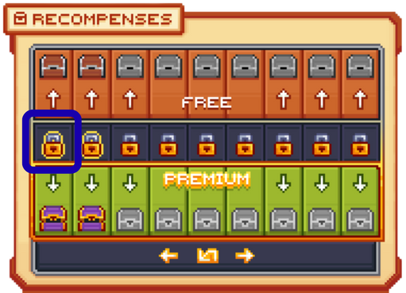
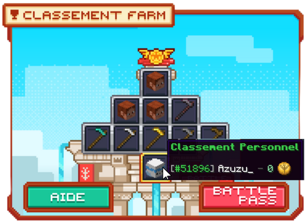
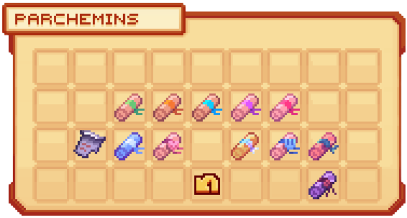

# 💎 Gagner des gemmes

Les <mark style="color:green;">gemmes</mark> font partie des <mark style="color:green;">monnaies</mark> vous permettant d’acheter divers objets dans le <mark style="color:green;">`/boutique`</mark>, tels que des <mark style="color:green;">clés de caisses</mark>, des <mark style="color:green;">boosts</mark>, des <mark style="color:green;">spawners</mark> ou encore des <mark style="color:green;">cartes de classe</mark>. Cela permet donc d’obtenir plus facilement certains <mark style="color:green;">items rares</mark> ou, dans d’autres cas, de faciliter vos <mark style="color:green;">farm de métiers</mark> ou de <mark style="color:green;">gains d’argent</mark> par exemple. Mais comment obtenir facilement ces gemmes ? 🤔

## 🔶 <mark style="color:green;">Les Métiers 👷‍♂️</mark>


Pour découvrir <mark style="color:green;">comment rejoindre un métier</mark>, nous vous invitons à lire cette page : [Rejoindre un métier](https://wiki.evolucraft.fr/le-gameplay/les-metiers#comment-rejoindre-un-metier) 👷‍♂️


À chaque <mark style="color:green;">niveau de métier</mark> complété, vous pouvez récupérer des <mark style="color:green;">récompenses de palier de métiers</mark> telles que des <mark style="color:green;">gemmes</mark> dans certains paliers, en utilisant la commande <mark style="color:green;">`/jobs claim`</mark>. Celle-ci vous permettra d’obtenir toutes les <mark style="color:green;">récompenses de paliers des métiers</mark> atteints qui n’avaient pas encore été récupérées.

<figure><figcaption>
<strong>Aperçu des </strong><mark style="color:green;"><strong>paliers de métiers</strong></mark>
</figcaption></figure>


Si vous avez besoin de <mark style="color:green;">plus d'infos sur les métiers</mark>, nous vous invitons à <mark style="color:green;">lire également la page dédiée</mark> : [<mark style="color:green;">les métiers 👷‍♂️</mark>](https://wiki.evolucraft.fr/le-gameplay/les-metiers).


## 🔶 <mark style="color:green;">Les votes 🗝️</mark>

Nous vous laissons regarder <mark style="color:green;">**ce tutoriel**</mark> pour savoir : [<mark style="color:green;">**Comment voter pour le serveur 📩**</mark>](https://wiki.evolucraft.fr/tuto-et-astuce/voter)

### 🔹 [<mark style="color:white;">La caisse de vote</mark>](https://wiki.evolucraft.fr/le-gameplay/les-caisses#caisse-vote)🎁

La <mark style="color:green;">caisse de vote</mark> est l'une des astuces les <mark style="color:green;">plus utilisée pour gagner des gemmes</mark> en début de jeu. En effet, l'une des récompenses de cette caisse est <mark style="color:green;">le lot de 10 gemmes</mark>.

### 🔹 Les paliers de vote ? ✅

Vous votez souvent sur le serveur ? Alors profitez des <mark style="color:green;">récompenses de vote hebdomadaires</mark> ! 

Si vous souhaitez <mark style="color:green;">faciliter votre obtention de gemmes</mark>, sachez qu’il est possible d’en <mark style="color:green;">récupérer chaque semaine</mark> : en votant <mark style="color:green;">40 fois</mark> durant la semaine, vous recevrez une récompense de <mark style="color:green;">150 gemmes 💎</mark> !  

<figure><figcaption>
<strong>Aperçu des </strong><mark style="color:green;"><strong>palliers de votes</strong></mark>
</figcaption></figure>

## 🔶 <mark style="color:green;">Le Battle Pass 🔱</mark>

### 🔹 Les palliers du pass 📈

Chaque jour, <mark style="color:green;">deux actions de métiers</mark> sont sélectionnées pour permettre de <mark style="color:green;">farmer du Farmium</mark> 🔱. Ce dernier vous permet, chaque mois, de <mark style="color:green;">débloquer des récompenses de paliers</mark> dans le <mark style="color:green;">Pass mensuel</mark>. 🎁  


Pour découvrir <mark style="color:green;">comment gagner du Farmium</mark>, nous vous invitons à lire cette page : [Le Pass 🔱](https://wiki.evolucraft.fr/le-gameplay/pass#comment-gagner-du-farmium).


Lorsque vous <mark style="color:green;">débloquez des paliers</mark>, vous pouvez parfois obtenir des <mark style="color:green;">gemmes 💎</mark>, un excellent moyen d’en récupérer en quantité chaque mois, encore plus si vous possédez le [<mark style="color:green;">Premium</mark>](https://wiki.evolucraft.fr/le-gameplay/les-grades#abonnement-premium) 👑 !

<figure><figcaption>
<strong>Aperçu de l'onglet </strong><mark style="color:green;"><strong><code>Récompenses du /pass</code></strong></mark>
</figcaption></figure>

### 🔹 Classement Farmium 🏆

Chaque semaine, un <mark style="color:green;">classement</mark> est établi regroupant les joueurs ayant <mark style="color:green;">récolté le plus de Farmium</mark> 🔱.  
Les meilleurs d’entre eux remportent de <mark style="color:green;">belles récompenses</mark> comme des <mark style="color:green;">gemmes 💎</mark> pour le <mark style="color:green;">Top 3 hebdomadaire</mark> !  


Pour plus d’informations sur le <mark style="color:green;">Classement Farmium</mark>, nous vous invitons à lire cette page : [Classement Farmium 🏆](https://wiki.evolucraft.fr/le-gameplay/pass#comment-gagner-du-farmium).


<figure><figcaption>
<strong>Aperçu du </strong><mark style="color:green;"><strong><code>classement personnel</code></strong></mark>
</figcaption></figure>

## 🔶 <mark style="color:green;">La Boutique 💳</mark>

Vous avez la possibilité, si vous êtes impatient de <mark style="color:green;">récolter des gemmes 💎</mark>, de les acheter directement sur [<mark style="color:green;">la boutique du serveur</mark>](https://store.evolucraft.fr) dans le <mark style="color:green;">respect du règlement</mark> 🧾 ([article K](https://wiki.evolucraft.fr/informations-importantes/reglement-ig#article-k-la-boutique)), parmi les <mark style="color:green;">différentes offres disponibles</mark>.

Cela vous permet donc de <mark style="color:green;">profiter d’avantages en jeu</mark> grâce au pass via la commande `/boutique`, tout en <mark style="color:green;">soutenant directement le serveur</mark> ❤️ !


Pour encore plus d’avantages, n’hésitez pas à suivre le salon [<mark style="color:green;">**`#📯・annonce`**</mark>](https://discord.com/channels/699670538737418343/703689221743050903) sur le Discord afin d’être informé des <mark style="color:green;">réductions disponibles</mark> sur la boutique du site ! 🛍️


## 🔶 <mark style="color:green;">Les Parchemins 📜</mark>

Chaque <mark style="color:green;">parchemin</mark> de <mark style="color:green;">de difficultés différentes</mark> propose des <mark style="color:green;">défis différents</mark> et <mark style="color:green;">des récompenses</mark> à la hauteur de vos exploits comme <mark style="color:green;">des gemmes 💎</mark> , visibles dans le <mark style="color:green;">`/quete`</mark>, puis en cliquant sur <mark style="color:green;">parchemins</mark> et en passant votre curseur sur la quête que vous avez.

<figure><figcaption>
<strong>Aperçu des </strong><mark style="color:green;"><strong>parchemins disponibles</strong></mark>
</figcaption></figure>


Pour connaîtres les  <mark style="color:green;">différents parchemins</mark> présents sur le serveur, nous vous invitons à lire cette page : [Les Parchemins 📜](https://wiki.evolucraft.fr/le-gameplay/les-quetes#parchemin-daventure).


## 🔶 <mark style="color:green;">Le /Afk 💤</mark>

Le <mark style="color:green;">`/afk`</mark> est un espace où, si vous restez inactif pendant 15 minutes _(pour les joueurs sans grade)_, vous êtes téléporté, et un affichage vous indique ce que vous avez gagné en étant à l'intérieur. Pour y <mark style="color:green;">gagner une gemme</mark>, il faudra y <mark style="color:green;">rester afk</mark> pendant <mark style="color:green;">30 minutes</mark>.

<figure><figcaption>
<strong>Aperçu de l’interface du </strong><mark style="color:green;"><strong>/afk</strong></mark>
</figcaption></figure>

## 🔶 <mark style="color:green;">Les Évènements 🎪</mark>

Dans certains <mark style="color:green;">évènements organisés par le staff</mark>, il est possible de <mark style="color:green;">remporter plusieurs gemmes 💎</mark> en fonction du <mark style="color:green;">type d’évènement</mark> et de la <mark style="color:green;">manière dont il est réalisé</mark>.  
Ces évènements sont une excellente occasion de <mark style="color:green;">gagner des récompenses exclusives</mark> tout en <mark style="color:green;">vous amusant avec la communauté</mark>, alors n’hésitez pas à y participer pour tenter votre chance ! 🍀


Pour plus d’informations sur les <mark style="color:green;">Évènements</mark>, nous vous invitons à lire cette page : [Évènements 🎪](https://wiki.evolucraft.fr/le-gameplay/les-evenements#des-evenements-de-lequipe-danimation).


<figure><figcaption><strong>Aperçu du <mark style="color:green;">Monde Évent</mark></strong></figcaption></figure>

**Vous avez toutes les infos pour savoir comment gagner des gemmes facilement 🤑 ! À vous de trouver la meilleure technique ou d’en découvrir une nouvelle 😏**
