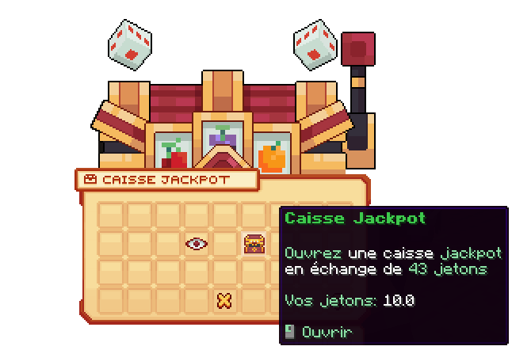
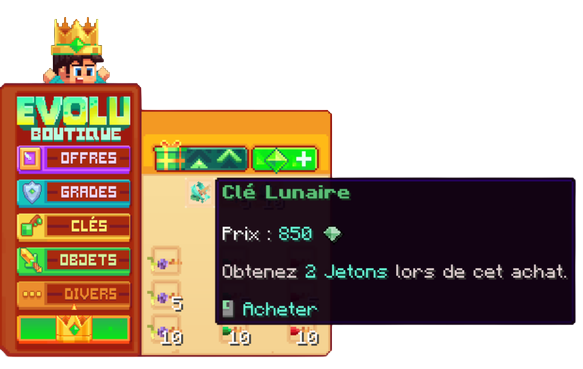

# 🪙 Gagner des jetons

## 💠 <mark style="color:green;">A quoi servent-ils et comment voir combien en avons-nous ? 🤨</mark>

Les jetons 🪙 vous permettent d'ouvrir la [caisse Jackpot](https://wiki.evolucraft.fr/le-gameplay/les-caisses#caisse-jackpot) contre 43 jetons pour obtenir un item dans cette caisse.

Pour voir combien vous-en possedez, il vous suffit de clique droit sur la caisse, puis de passer votre souris sur le coffre comme sur l'image ci-dessous.

<figure><figcaption>
<strong>Aperçu de l’interface de la </strong><mark style="color:green;"><strong>Caisse Jackpot</strong></mark>
</figcaption></figure>

## 💠 <mark style="color:green;">Comment en obtenir ? 🤗</mark>

### 🔷 <mark style="color:blue;">Le <code>/boutique</code> 🏬</mark>

Lorsque vous acheter des clés dans le `/boutique`, que ça sois des clés de caisse permananente ou bien des caisses évènements, vous obtenez automatiquement des jetons à l'achat suivant l'offre proposée. Il n'est possible d'en obtenir que via des clés achetés.

<figure><figcaption>
<strong>Aperçu du </strong><mark style="color:green;"><strong><code>/boutique</code></mark>, via la <mark style="color:green;">catégorie clé</strong></mark>
</figcaption></figure>

### 🔷 <mark style="color:blue;">Les Évènements 🎪</mark>

Dans certains <mark style="color:green;">évènements organisés par le staff</mark>, il est possible de <mark style="color:green;">remporter des jetons 🪙</mark> en fonction du <mark style="color:green;">type d’évènement</mark> et de la <mark style="color:green;">manière dont il est réalisé</mark>.

Ces évènements sont une excellente occasion de <mark style="color:green;">gagner des récompenses exclusives</mark> tout en <mark style="color:green;">vous amusant avec la communauté</mark>, alors n’hésitez pas à y participer pour tenter votre chance ! 🍀


Pour plus d’informations sur les <mark style="color:green;">Évènements</mark>, nous vous invitons à lire cette page : [Évènements 🎪](https://wiki.evolucraft.fr/le-gameplay/les-evenements#des-evenements-de-lequipe-danimation).


<figure><figcaption><strong>Aperçu du <mark style="color:green;">Monde Évent</mark></strong></figcaption></figure>

**Vous avez toutes les infos pour savoir l'utilité des jetons ! À vous d'en avoir le plus possible pour obtenir des items légendaire 😏**
