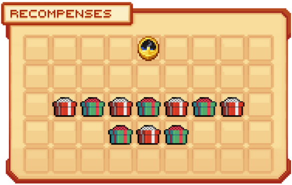

# 🪙 Gagner des jetons

## 💠 <mark style="color:green;">A quoi servent-ils et comment voir combien en avons-nous ? 🤨</mark>

Les jetons 🪙 vous permettent d'ouvrir la caisse Jackpot contre 43 jetons pour obtenir un item dans cette caisse.

Pour voir combien vous-en possedez, il vous suffit de clique droit sur la caisse, puis de passer votre souris sur le coffre comme sur l'image ci-dessous.

<figure><figcaption>
<strong>Aperçu de l’interface de la</strong><mark style="color:green;"><strong>Caisse Jackpot</strong></mark>
</figcaption></figure>
