# 📚 Rappel du Tutoriel

Vous avez déjà terminé le <mark style="color:green;">tutoriel de démarrage</mark> mais vous revenez après une longue absence ? Cette page est faite pour vous ! Retrouvez ici l'ensemble des <mark style="color:green;">étapes du tutoriel</mark> pour vous <mark style="color:green;">rafraîchir la mémoire</mark> sur les bases du serveur.

---

## 📖 <mark style="color:green;">Chapitre 1 - Découverte du Serveur</mark>

### <mark style="color:green;">🔹 Étape 1/10 - L'entrée dans la ville</mark>

| Information | Détail |
| :---------: | :----: |
| **Récompense** | <mark style="color:green;">1 000 pièces d'or</mark> |
| **Objectif** | Vous devez pénétrer à l'intérieur de la ville. |

<figure>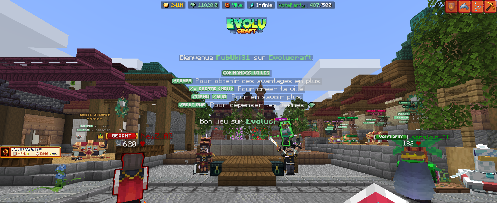<figcaption>
<strong>Aperçu de l'</strong><mark style="color:green;"><strong>entrée dans la ville</strong></mark>
</figcaption></figure>

---

### <mark style="color:green;">🔹 Étape 2/10 - Le menu principal</mark>

| Information | Détail |
| :---------: | :----: |
| **Récompense** | <mark style="color:green;">1 000 pièces d'or</mark> |
| **Objectif** | Vous devez ouvrir le menu principal du serveur. |
| **Commande** | <mark style="color:green;">`/menu`</mark> |

<figure>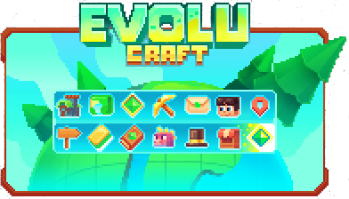<figcaption>
<strong>Aperçu du </strong><mark style="color:green;"><strong>menu principal</strong></mark>
</figcaption></figure>

---

### <mark style="color:green;">🔹 Étape 3/10 - L'acheteur compulsif</mark>

| Information | Détail |
| :---------: | :----: |
| **Récompense** | <mark style="color:green;">1 000 pièces d'or</mark> |
| **Objectif** | Vous devez ouvrir le menu du magasin principal. |
| **Commande** | <mark style="color:green;">`/shop`</mark> |

<figure><figcaption>
<strong>Aperçu du </strong><mark style="color:green;"><strong>magasin principal</strong></mark>
</figcaption></figure>

---

### <mark style="color:green;">🔹 Étape 4/10 - Le temps du commerce</mark>

| Information | Détail |
| :---------: | :----: |
| **Récompense** | <mark style="color:green;">1 000 pièces d'or</mark> |
| **Objectif** | Vous devez ouvrir le menu de l'hôtel des ventes. |
| **Commande** | <mark style="color:green;">`/ah`</mark> |

<figure><figcaption>
<strong>Aperçu de l'</strong><mark style="color:green;"><strong>hôtel des ventes</strong></mark>
</figcaption></figure>

---

### <mark style="color:green;">🔹 Étape 5/10 - L'évolution personnelle</mark>

| Information | Détail |
| :---------: | :----: |
| **Récompense** | <mark style="color:green;">1 000 pièces d'or</mark> |
| **Objectif** | Vous devez ouvrir le menu des rangs F2W. |
| **Commande** | <mark style="color:green;">`/rang`</mark> |

<figure><figcaption>
<strong>Aperçu du menu des </strong><mark style="color:green;"><strong>rangs F2W</strong></mark>
</figcaption></figure>

---

### <mark style="color:green;">🔹 Étape 6/10 - Le soutien du serveur</mark>

| Information | Détail |
| :---------: | :----: |
| **Récompense** | <mark style="color:green;">1 000 pièces d'or</mark> + <mark style="color:yellow;">Clé Vote (x1)</mark> |
| **Objectif** | Vous devez ouvrir le menu du système de vote. |
| **Commande** | <mark style="color:green;">`/vote`</mark> |

<figure>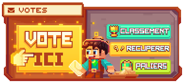<figcaption>
<strong>Aperçu du menu de </strong><mark style="color:green;"><strong>vote</strong></mark>
</figcaption></figure>

---

### <mark style="color:green;">🔹 Étape 7/10 - Après l'effort, le réconfort</mark>

| Information | Détail |
| :---------: | :----: |
| **Récompense** | <mark style="color:green;">1 000 pièces d'or</mark> |
| **Objectif** | Vous devez ouvrir une caisse de vote grâce à la clé récupérée. |

<figure>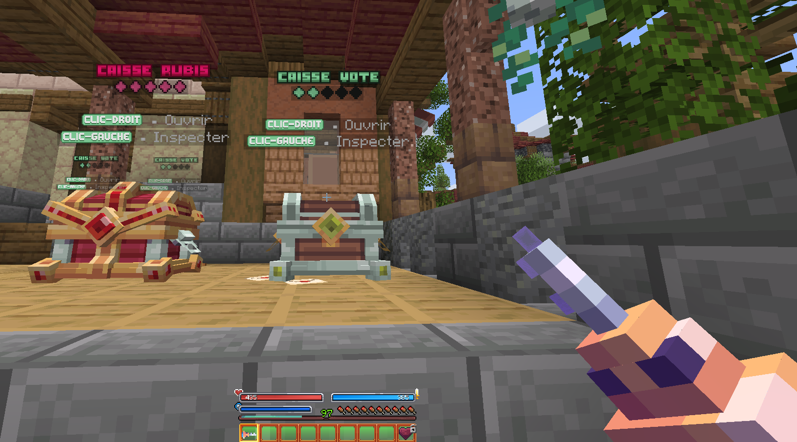<figcaption>
<strong>Aperçu de la </strong><mark style="color:green;"><strong>caisse de vote</strong></mark>
</figcaption></figure>

---

### <mark style="color:green;">🔹 Étape 8/10 - Une autre forme de soutien</mark>

| Information | Détail |
| :---------: | :----: |
| **Récompense** | <mark style="color:blue;">50 gemmes</mark> + <mark style="color:purple;">Classe aléatoire</mark> |
| **Objectif** | Vous devez ouvrir notre boutique pour nous soutenir. |
| **Commande** | <mark style="color:green;">`/boutique`</mark> |

<figure>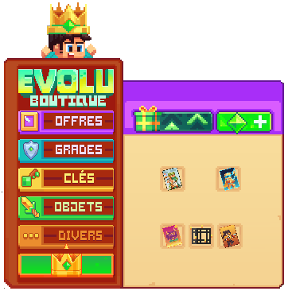<figcaption>
<strong>Aperçu de la </strong><mark style="color:green;"><strong>boutique</strong></mark>
</figcaption></figure>

---

### <mark style="color:green;">🔹 Étape 9/10 - Sélection des classes</mark>

| Information | Détail |
| :---------: | :----: |
| **Récompense** | <mark style="color:purple;">Carte d'une classe</mark> |
| **Objectif** | Vous devez sélectionner votre première classe. |
| **Commande** | <mark style="color:green;">`/classe`</mark> |

<figure>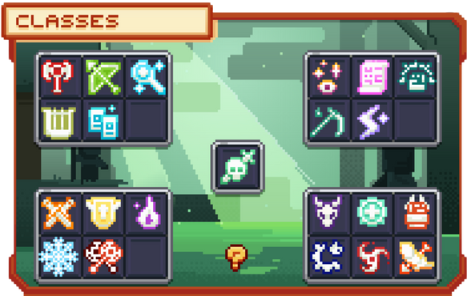<figcaption>
<strong>Aperçu du menu des </strong><mark style="color:green;"><strong>classes</strong></mark>
</figcaption></figure>


<mark style="color:green;">ASTUCE</mark> : Pour plus d'informations sur les classes, consultez la page dédiée : [Avoir une classe](avoir-une-classe.md)


---

### <mark style="color:green;">🔹 Étape 10/10 - Camps d'entraînement</mark>

| Information | Détail |
| :---------: | :----: |
| **Récompense** | <mark style="color:green;">1 000 pièces d'or</mark> |
| **Objectif** | Tentez d'utiliser votre première classe (avec votre épée). |

<figure>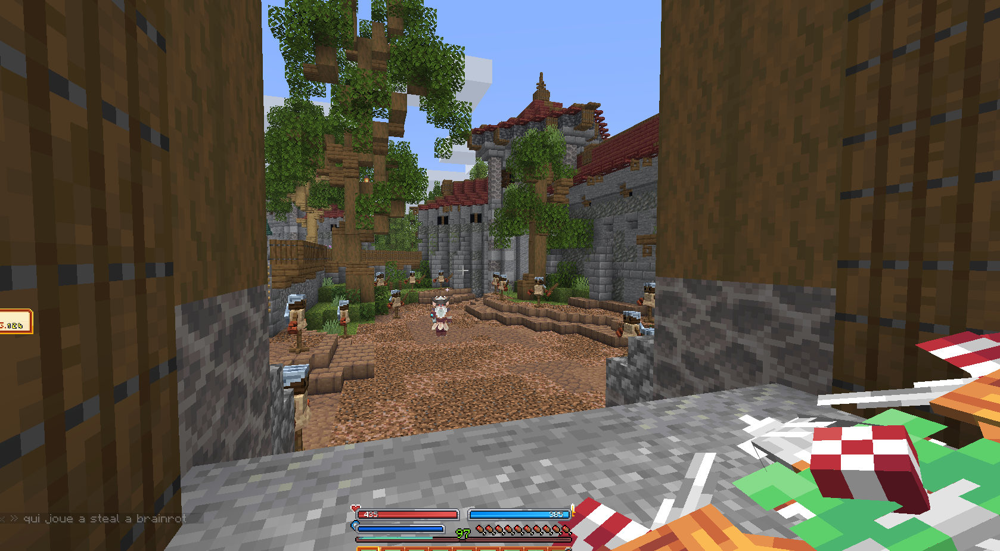<figcaption>
<strong>Aperçu du </strong><mark style="color:green;"><strong>camp d'entraînement</strong></mark>
</figcaption></figure>

---

## 🌍 <mark style="color:green;">Chapitre 2 - Exploration et Survie</mark>

### <mark style="color:green;">🔹 Étape 1/8 - Exploration du monde</mark>

| Information | Détail |
| :---------: | :----: |
| **Récompense** | <mark style="color:green;">1 000 pièces d'or</mark> |
| **Objectif** | Vous devez vous rendre dans le monde ressource. |
| **Commande** | <mark style="color:green;">`/monde`</mark> |

<figure>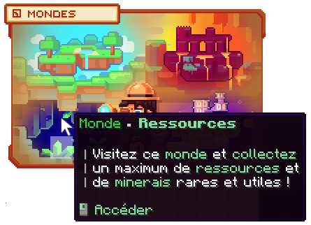<figcaption>
<strong>Aperçu du menu des </strong><mark style="color:green;"><strong>mondes</strong></mark>
</figcaption></figure>

---

### <mark style="color:green;">🔹 Étape 2/8 - Du bois pour se chauffer</mark>

| Information | Détail |
| :---------: | :----: |
| **Récompense** | <mark style="color:yellow;">Pioche en fer</mark> |
| **Objectif** | Vous devez casser 4 bûches de n'importe quel type. |

<figure>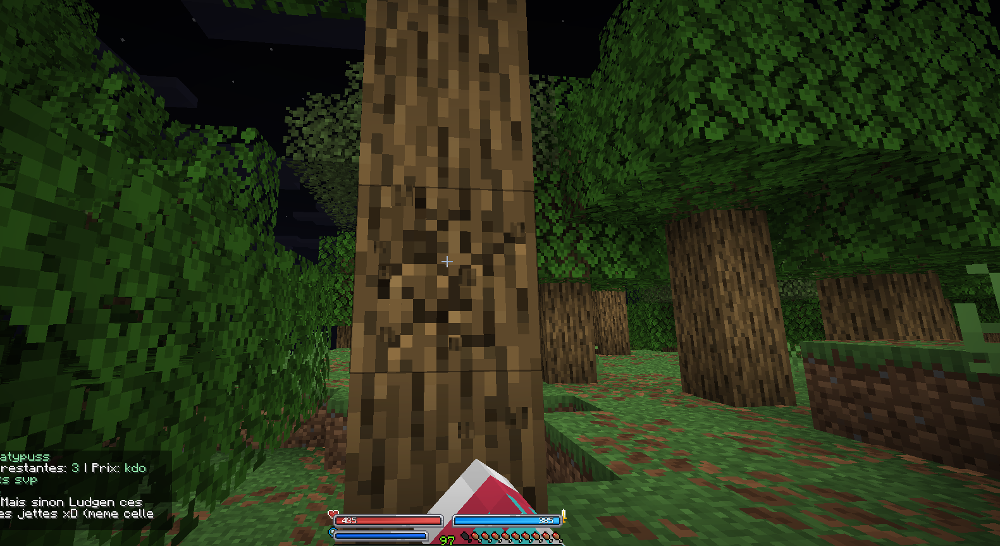<figcaption>
<strong>Aperçu de la </strong><mark style="color:green;"><strong>récolte de bois</strong></mark>
</figcaption></figure>

---

### <mark style="color:green;">🔹 Étape 3/8 - L'ère de la pierre</mark>

| Information | Détail |
| :---------: | :----: |
| **Récompense** | <mark style="color:green;">1 000 pièces d'or</mark> |
| **Objectif** | Vous devez casser un total de 8 blocs de roches. |

<figure>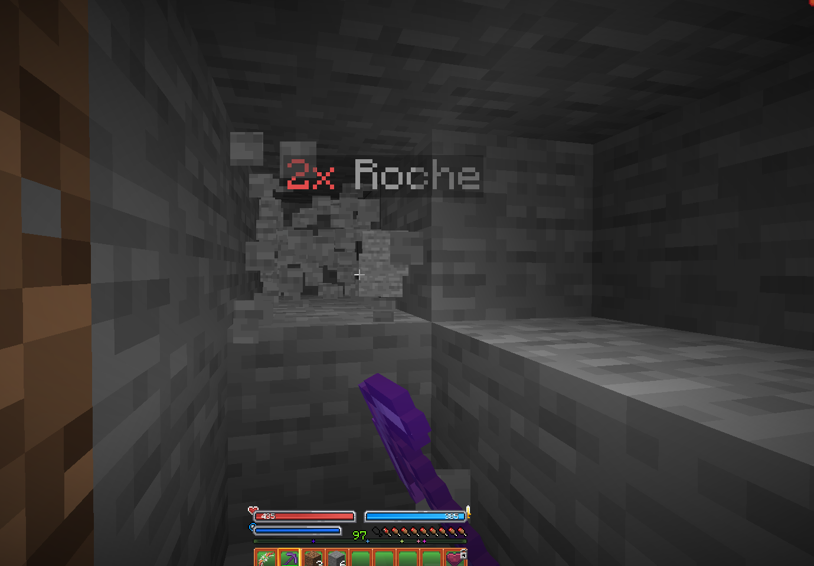<figcaption>
<strong>Aperçu du </strong><mark style="color:green;"><strong>minage de pierre</strong></mark>
</figcaption></figure>

---

### <mark style="color:green;">🔹 Étape 4/8 - Les premiers bénéfices</mark>

| Information | Détail |
| :---------: | :----: |
| **Récompense** | <mark style="color:green;">1 000 pièces d'or</mark> |
| **Objectif** | Vous devez ouvrir le menu des métiers et en choisir un. |
| **Commande** | <mark style="color:green;">`/jobs`</mark> |

<figure><figcaption>
<strong>Aperçu du menu des </strong><mark style="color:green;"><strong>métiers</strong></mark>
</figcaption></figure>


<mark style="color:green;">ASTUCE</mark> : Pour plus d'informations sur les métiers, consultez la page dédiée : [Les Métiers](../le-gameplay/les-metiers.md)


---

### <mark style="color:green;">🔹 Étape 5/8 - Les premières tâches</mark>

| Information | Détail |
| :---------: | :----: |
| **Récompense** | <mark style="color:yellow;">Boost de métier (10mn) [x1]</mark> |
| **Objectif** | Dans votre métier, vous devez passer un niveau. |

<figure>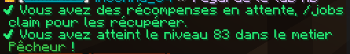<figcaption>
<strong>Aperçu d'un </strong><mark style="color:green;"><strong>niveau de métier</strong></mark>
</figcaption></figure>

---

### <mark style="color:green;">🔹 Étape 6/8 - Les ressources minières</mark>

| Information | Détail |
| :---------: | :----: |
| **Récompense** | <mark style="color:green;">1 000 pièces d'or</mark> + <mark style="color:yellow;">Armure en fer</mark> |
| **Objectif** | Vous devez miner un total de 8 minerais de charbon. |

<figure>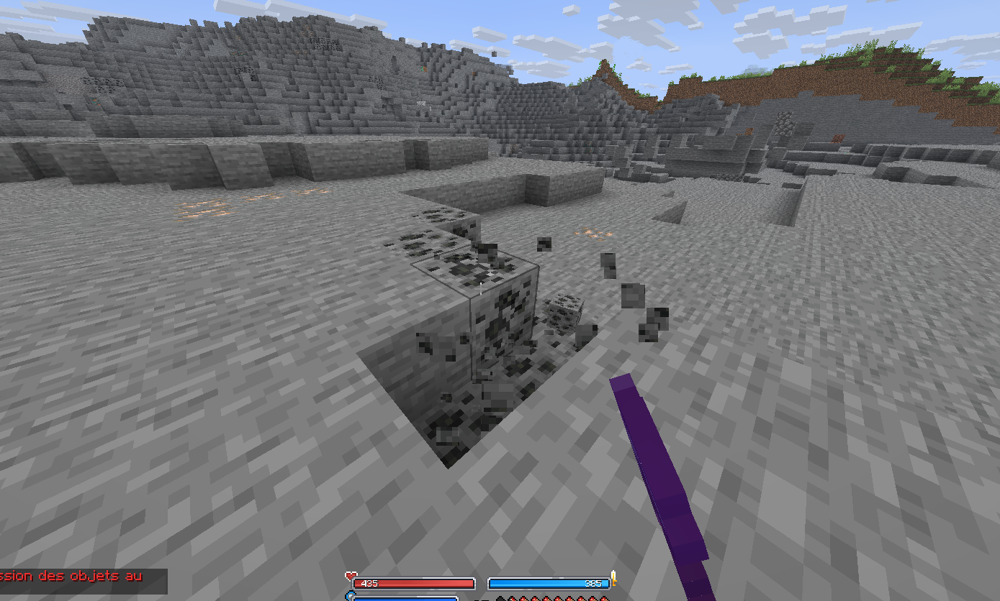<figcaption>
<strong>Aperçu du </strong><mark style="color:green;"><strong>minage de charbon</strong></mark>
</figcaption></figure>

---

### <mark style="color:green;">🔹 Étape 7/8 - Besoin de protéines</mark>

| Information | Détail |
| :---------: | :----: |
| **Récompense** | <mark style="color:green;">1 000 pièces d'or</mark> + <mark style="color:blue;">Épée de l'aventurier</mark> |
| **Objectif** | Pour survivre il faut manger, alors tuez 4 animaux passifs. |
| **Commande** | <mark style="color:green;">`/monde`</mark> |

<figure>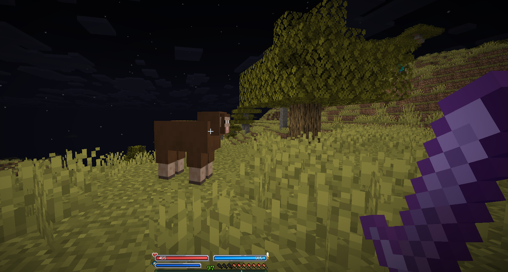<figcaption>
<strong>Aperçu de la </strong><mark style="color:green;"><strong>chasse</strong></mark>
</figcaption></figure>

---

### <mark style="color:green;">🔹 Étape 8/8 - Le premier combat</mark>

| Information | Détail |
| :---------: | :----: |
| **Récompense** | <mark style="color:green;">1 000 pièces d'or</mark> |
| **Objectif** | Tentez d'utiliser une compétence. Attention, c'est dangereux ! |

<figure>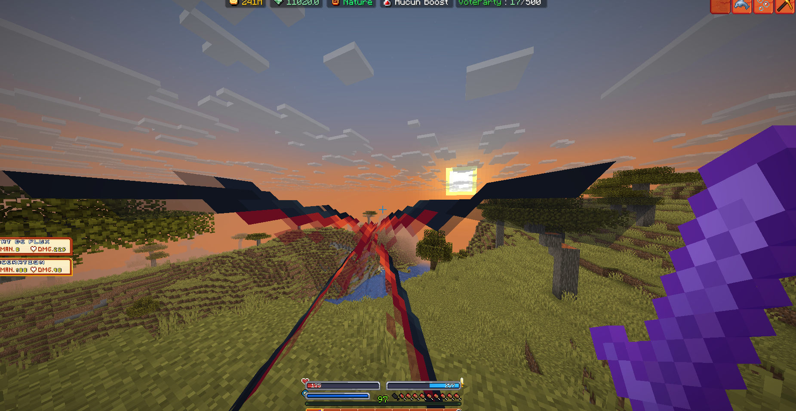<figcaption>
<strong>Aperçu d'une </strong><mark style="color:green;"><strong>compétence de classe</strong></mark>
</figcaption></figure>


<mark style="color:green;">ATTENTION</mark> : Les compétences consomment de l'énergie (mana). Assurez-vous d'avoir suffisamment de mana avant d'utiliser vos compétences en combat !


---

**Félicitations ! Vous avez terminé le tutoriel et êtes prêt à explorer Évolucraft ! Bonne aventure !**
