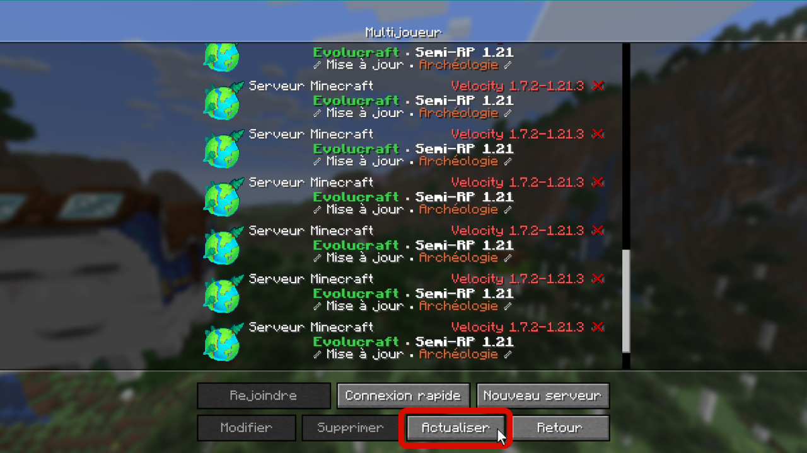

# 🎫 <mark style="color:green;">Comment rejoindre le serveur ?</mark>

## 💠 Ajouter une version 🆕

### <mark style="color:green;">🔸 Étape 1️⃣</mark>
**Lancez votre <mark style="color:green;"><strong>launcher Minecraft</strong></mark>**, puis cliquez sur l'onglet **<mark style="color:green;"><strong>"Configuration"</strong></mark>** comme montré sur l'image ci-dessous.
<figure></figure>

### <mark style="color:green;">🔸 Étape 2️⃣</mark>
Cliquez sur le bouton **<mark style="color:green;"><strong>"Nouvelle configuration"</strong></mark>**.
<figure></figure>

### <mark style="color:green;">🔸 Étape 3️⃣</mark>
Cliquez sur la case **<mark style="color:green;"><strong>"Version"</strong></mark>**, puis sélectionnez la version **<mark style="color:green;"><strong>"release 1.21.8"</strong></mark>**.
<figure></figure>

### <mark style="color:green;">🔸 Étape 4️⃣</mark>
Après cette étape, il ne vous reste plus qu’à cliquer sur le bouton **<mark style="color:green;"><strong>"Installer"</strong></mark>** en bas à droite, et votre jeu se lancera automatiquement.
<figure></figure>

## 💠 Ajouter le serveur

### <mark style="color:green;">🔸 Étape 1️⃣</mark>
Une fois votre jeu lancé, cliquez sur **<mark style="color:green;"><strong>"Multijoueur"</strong></mark>**, puis en bas sur **<mark style="color:green;"><strong>"Nouveau serveur"</strong></mark>**.
<figure></figure>
<figure></figure>

### <mark style="color:green;">🔸 Étape 2️⃣</mark>
Entrez les informations comme ci-dessous, puis activez l’option **<mark style="color:green;"><strong>Pack de ressources</strong></mark>** en la mettant sur **<mark style="color:green;"><strong>"Activé"</strong></mark>**. Une fois cela fait, cliquez sur **<mark style="color:green;"><strong>"Terminé"</strong></mark>**.
<figure></figure>

### <mark style="color:green;">🔸 Étape 3️⃣</mark>
Rejoignez le serveur en effectuant un **<mark style="color:green;"><strong>double clic</strong></mark>** sur celui-ci. Une fois arrivé dans le **<mark style="color:green;"><strong>lobby</strong></mark>**, faites un **<mark style="color:green;"><strong>clic droit</strong></mark>** avec la **<mark style="color:green;"><strong>boussole</strong></mark>** en main, puis cliquez sur le **<mark style="color:green;"><strong>bloc vert</strong></mark>** comme indiqué ci-dessous.
<figure></figure>

## 💠 Problème de connexion au serveur

Lorsque vous essayez de vous connecter et que vous tombez sur cette page après plusieurs **<mark style="color:green;"><strong>minutes d'attente</strong></mark>**, comme ci-dessous, voici une petite astuce pour résoudre votre **<mark style="color:green;"><strong>problème de connexion</strong></mark>** et rejoindre notre **<mark style="color:green;"><strong>serveur</strong></mark>** 🤩

<figure></figure>

### <mark style="color:green;">🔸 Étape 1️⃣</mark>
Cliquez sur **<mark style="color:green;"><strong>"Retourner sur la liste des serveurs"</strong></mark>**. Ensuite, **<mark style="color:green;"><strong>cliquez sur "Actualiser"</strong></mark>** puis **<mark style="color:green;"><strong>double-cliquez sur le serveur</strong></mark>** afin de tenter de le rejoindre à nouveau.

<figure></figure>

### <mark style="color:green;">🔸 Étape 2️⃣</mark>
S’il affiche le message **<mark style="color:green;"><strong>"Chiffrement en cours"</strong></mark>** (**<mark style="color:green;"><strong>"Encrypting"</strong></mark>** si vous avez le jeu en anglais) durant le chargement, comme ci-dessous, cliquez directement sur **<mark style="color:green;"><strong>"Annuler"</strong></mark>**.

<figure></figure>

### <mark style="color:green;">🔸 Étape 3️⃣</mark>
Répétez l’opération jusqu’à ce que le message **<mark style="color:green;"><strong>"Entrée dans le monde"</strong></mark>** s’affiche.

**Vous pouvez dès à présent commencer votre aventure sur Évolucraft ! 🥳**
