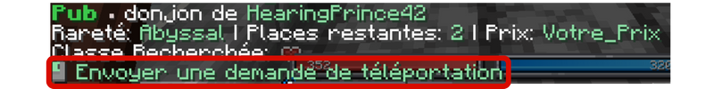
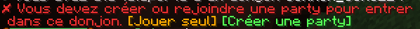
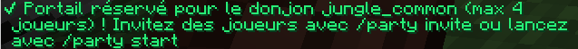
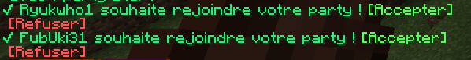
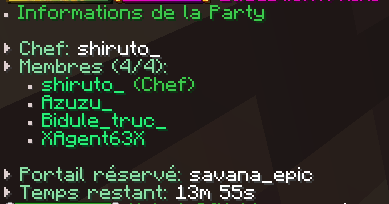

# 🏛️ Trouver un donjons

## <mark style="color:green;">💠 Où sont les donjons ? 📍</mark>

Les donjons apparaissent <mark style="color:green;">aléatoirement</mark> dans le <mark style="color:green;">monde ressource</mark> et <mark style="color:green;">le nether</mark>, avec au minimum <mark style="color:green;">un type de donjon par monde ressource</mark>, qu'il s'agisse de donjons basiques ou de donjons événementiels.

## <mark style="color:green;">💠 Comment trouver un donjon ? 🔍</mark>

### <mark style="color:green;">• 1️⃣ Les pierres de téléportation donjon 🟩</mark>

Les pierres de téléportation donjon vous servent à être <mark style="color:green;">téléporté directement</mark>, en étant dans le monde ressource, à <mark style="color:green;">un portail de donjon généré</mark>. Très utile si vous ne voulez pas passer des heures à en chercher un !

Pour <mark style="color:green;">vous en procurer</mark>, il vous suffit d'utiliser <mark style="color:green;">`/kit donjon`</mark> _(disponible toutes les 24 heures)_ ou de passer par <mark style="color:green;">la box de vote</mark>.

Pour les joueurs plus avancés, vous avez le <mark style="color:green;">`/dragon`</mark> où, sur la deuxième page, vous pouvez <mark style="color:green;">échanger des pierres de tp donjon</mark> de rareté supérieure : <mark style="color:yellow;">Rare</mark>, <mark style="color:blue;">Épique</mark> ou <mark style="color:purple;">Légendaire</mark> !

### <mark style="color:green;">• 2️⃣ La recherche en balade 🚶‍♂️</mark>

En vous <mark style="color:green;">baladant dans les différents mondes ressource</mark>, vous pouvez également <mark style="color:green;">trouver des donjons générés</mark> et y entrer pour défier leurs mobs féroces. Avec un peu de chance, le <mark style="color:green;">`/rtp`</mark> pourra vous faire apparaître <mark style="color:green;">près d’un portail de donjon</mark>.

### <mark style="color:green;">• 3️⃣ Les publicités 📣</mark>

Avec la commande [<mark style="color:green;">/pub 📢</mark>](http://wiki.evolucraft.fr/le-gameplay/le-commerce#publicite), vous pouvez <mark style="color:green;">activer les notifications de pub pour donjon</mark> lorsque <mark style="color:green;">des joueurs trouvent un portail</mark> et souhaitent le partager. Très utile pour gagner des loots tout en participant au donjon !

<figure></figure>

Si vous souhaitez faire la <mark style="color:green;">publicité</mark> de votre trouvaille d'un <mark style="color:green;">portail de donjon</mark>, vous pouvez inviter des joueurs à éventuellement vous accompagner en effectuant la commande <mark style="color:green;">`/donjon "rareté du donjon" "nombre de joueurs" "prix"`</mark>.

## <mark style="color:green;">💠 Comment inviter des joueurs dans un donjon ? 👥</mark>

Avec le **<mark style="color:green;">`/party`</mark>**, qui permettra, à la personne ayant **<mark style="color:green;">créé le groupe</mark>**, de gérer les **<mark style="color:green;">joueurs entrant dans un donjon</mark>** avec elle.  
Fini les **<mark style="color:green;">vols de donjon</mark>** ou les **<mark style="color:green;">téléportations trop proches</mark>** !

### 🔸 Un donjon trouvé

Lorsque vous avez **<mark style="color:green;">trouvé un donjon</mark>**, dirigez-vous vers le **<mark style="color:green;">portail</mark>**. Un message s’affichera alors, vous permettant de choisir si vous souhaitez faire le donjon **<mark style="color:green;">seul</mark>** ou **<mark style="color:green;">à plusieurs</mark>**. Il vous suffira de cliquer sur l’option souhaitée directement dans le **<mark style="color:green;">chat</mark>**.

* L’option **"<mark style="color:orange;">Jouer seul</mark>"** vous téléportera directement dans le **<mark style="color:green;">donjon</mark>**.  
* L’option **"<mark style="color:green;">Créer une party</mark>"** vous permettra de **<mark style="color:green;">créer une party</mark>**.

<figure></figure>

### 🔸 Réservation du donjon

Une fois la **<mark style="color:green;">party créée</mark>**, retournez au **<mark style="color:green;">portail</mark>** afin de le **<mark style="color:green;">réserver</mark>**. Cela permet d’effectuer le donjon **<mark style="color:green;">à plusieurs</mark>** et d’éviter tout **<mark style="color:green;">vol de dernière minute</mark>**.
Le portail sera considéré comme **<mark style="color:green;">réservé</mark>** dès réception du message ci-dessous.

<figure></figure>


Si le portail a déjà été **<mark style="color:green;">réservé</mark>**, le message ci-dessous vous sera affiché.
<figure></figure>


### 🔸 Formation de votre groupe

Pour inviter des **<mark style="color:green;">joueurs</mark>** dans votre **<mark style="color:green;">groupe</mark>**, publiez une **<mark style="color:green;">pub de donjon</mark>** avec la commande :  
**<mark style="color:green;">`/donjon [Type de donjon] [Nombre de joueurs] [Prix d'entrée]`</mark>**


En cas de doute sur votre **<mark style="color:green;">portail</mark>**, consultez le **[<mark style="color:green;">codex des portails de donjons disponible sur le serveur</mark>](https://wiki.evolucraft.fr/le-codex/donjons)** ou vérifiez le **<mark style="color:green;">message de réservation</mark>**.


Une fois la **<mark style="color:green;">pub envoyée</mark>**, vous recevrez les **<mark style="color:green;">demandes des joueurs</mark>** souhaitant vous accompagner.

<figure></figure>

### 🔸 Démarrer le donjon

Lorsque votre **<mark style="color:green;">groupe est prêt</mark>** et **<mark style="color:green;">au complet</mark>**, utilisez la commande **<mark style="color:green;">`/party start`</mark>** afin que **<mark style="color:green;">tous les joueurs</mark>** soient **<mark style="color:green;">téléportés</mark>** dans le donjon.


Un **<mark style="color:green;">timer de 10 secondes</mark>** se déclenchera avant la téléportation dans le donjon, permettant à tous les joueurs de se préparer.


Pour consulter les **<mark style="color:green;">joueurs présents</mark>**, utilisez  
**<mark style="color:green;">`/party info`</mark>**, affichant le **<mark style="color:green;">chef de la party</mark>** ainsi que les **<mark style="color:green;">membres</mark>**.

<figure></figure>


Une fois que **<mark style="color:green;">le donjon est terminé</mark>** et que vous ne souhaitez plus **<mark style="color:green;">refaire de donjon avec ce groupe</mark>**, il est nécessaire d’effectuer la commande **<mark style="color:green;">`/party leave`</mark>** afin de **<mark style="color:green;">quitter la party</mark>**.

Sans cela, vous pourriez être **<mark style="color:green;">téléporté automatiquement</mark>** avec ce groupe si vous restez dans le même monde que les autres joueurs, **<mark style="color:green;">sauf en cas de redémarrage du serveur</mark>** ou de **<mark style="color:green;">disband de la party</mark>**.


Si vous souhaitez **<mark style="color:green;">plus d'informations sur les donjons</mark>**, nous vous laissons consulter cette page : **<mark style="color:green;">[🏛️ Les donjons](https://wiki.evolucraft.fr/le-gameplay/les-donjons#comment-realiser-un-donjon)</mark>**
