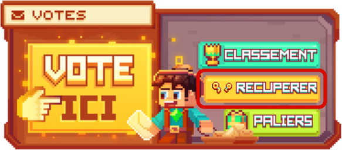
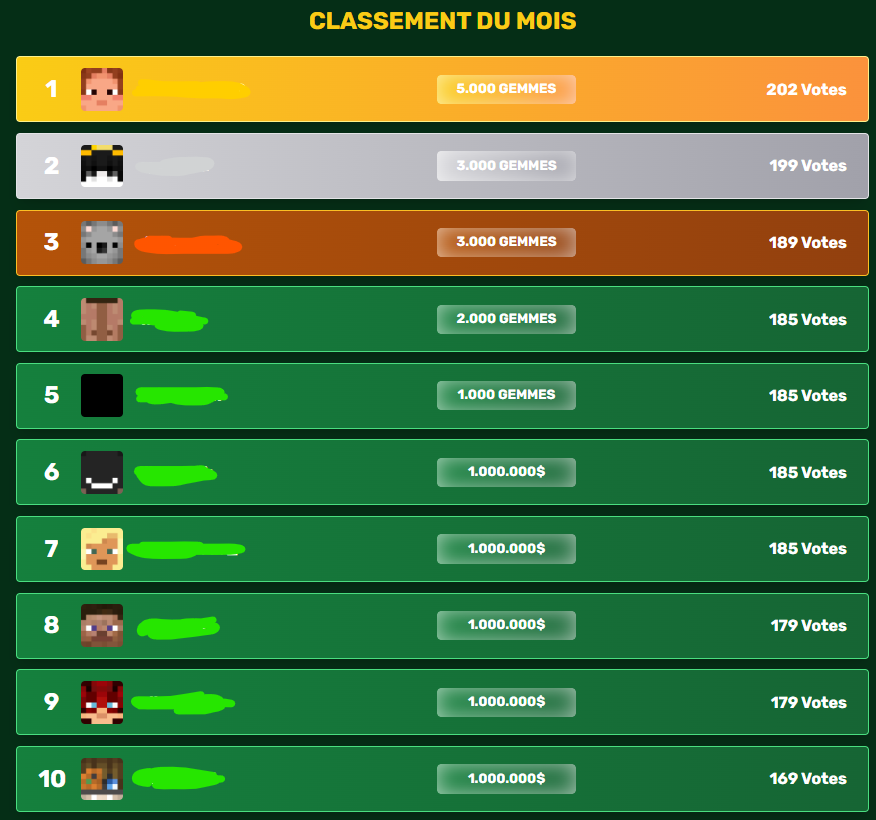

# 📩 Comment voter sur le serveur ?

Voter pour le serveur vous permet de contribuer au serveur en plus de votre présence sur le serveur, tout en remportant des récompenses 🎁 ! 

## 💠 Quels sont les étapes pour voter ? ✅

### <mark style="color:green;">🔹 Étape 1️⃣</mark>
**Obtenir des clés est relativement simple : dans un premier temps, vous pouvez <mark style="color:green;">aller sur le site d'<a href="https://evolucraft.fr/vote">Évolucraft 🌏</mark></a> puis aller dans <mark style="color:green;">l'onglet Vote</mark>.**
<figure><figcaption>
<strong>Aperçu de la page <mark style="color:green;">d'accueil du site</mark></strong>
</figcaption></figure>

### <mark style="color:green;">🔹 Étape 2️⃣</mark>
**Ensuite, vous devrez <mark style="color:green;">insérer votre pseudo</mark> sur la droite comme sur l'image ci-dessous, <mark style="color:green;">veillez à bien écrire le pseudo exact, au caractère près</mark> !**
<figure><figcaption>
<strong>Aperçu de l'onglet <mark style="color:green;">vote du site</mark></strong>
</figcaption></figure>

### <mark style="color:green;">🔹 Étape 3️⃣</mark>
**Vous devrez ensuite <mark style="color:green;">cliquer sur Site 1 ou Site 2</mark>. Cela vous amènera vers un autre site ; suivez les instructions demandées, il vous faudra probablement <mark style="color:green;">remplir un captcha</mark> (avec image ou texte selon la demande) puis <mark style="color:green;">cliquer sur "Je Vote Maintenant"</mark>.**

**Après avoir voté, il est impératif de <mark style="color:green;">revenir sur le site d'Évolucraft</mark> afin que le vote soit validé (Le vote sera considéré comme validé lorsque le temps du prochain vote commencera à s'afficher ; sinon, refaites le vote ou rafraîchissez la page internet).**
<figure><figcaption>
<strong>Aperçu du <mark style="color:green;">Site 1</mark></strong>
</figcaption></figure>

### <mark style="color:green;">🔹 Étape 4️⃣</mark>
**Lorsque <mark style="color:green;">vous serez en jeu</mark>, il vous suffira de <mark style="color:green;">faire la commande `/vote`</mark>, puis de <mark style="color:green;">cliquer sur le bouton "Récupérer"</mark> afin de <mark style="color:green;">récupérer vos clés de votes</mark>.**
<figure><figcaption>
<strong>Aperçu du <mark style="color:green;">/vote</mark></strong>
</figcaption></figure>


**⚠️ Attention : si plusieurs joueurs jouent sur la même connexion internet, chacun doit utiliser une connexion différente, par exemple en utilisant les données mobiles.**


## 💠 Que peut-on gagner en étant dans le <mark style="color:green;">**classement vote du mois**</mark> ? 🏆

À chaque fin de mois, un <mark style="color:green;">**classement**</mark> est publié dans le channel [<mark style="color:green;">**`#🥇・classements`**</mark>](https://discord.com/channels/699670538737418343/1063147838965547138), affichant les <mark style="color:green;">**joueurs ayant voté le plus de fois**</mark> durant le mois.  

Les <mark style="color:green;">**10 premiers**</mark> du classement remportent une <mark style="color:green;">**récompense**</mark> en fonction de leur position :  

| Classement                                    | Récompenses                                           |
| --------------------------------------------- | ----------------------------------------------------- |
| <mark style="color:yellow;">**1er**</mark>    | <mark style="color:blue;">**5 000 Gemmes 💎**</mark> |
| <mark style="color:white;">**2e**</mark>      | <mark style="color:blue;">**4 000 Gemmes 💎**</mark> |
| <mark style="color:orange;">**3e**</mark>     | <mark style="color:blue;">**3 000 Gemmes 💎**</mark> |
| <mark style="color:green;">**4e**</mark>      | <mark style="color:blue;">**2 000 Gemmes 💎**</mark> |
| <mark style="color:white;">**5e**</mark>      | <mark style="color:blue;">**1 000 Gemmes 💎**</mark> |
| <mark style="color:green;">**6e à 10e**</mark>| <mark style="color:yellow;">**1 000 000 💲**</mark>   |


**⚠️ Attention : Le <mark style="color:green;">bot-vote</mark> est strictement <mark style="color:green;">interdit</mark> 👀.**


<figure><figcaption>
<strong>Aperçu du <mark style="color:green;">Classement des votes</mark></strong>
</figcaption></figure>

**Plus d'excuses pour ne pas voter ! À vos <mark style="color:green;">votes</mark>, chers joueurs 🎉 !**
