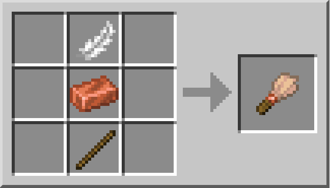

# L'Archéologie 🦴

L'<mark style="color:green;">**archéologie**</mark> est une mise à jour vous permettant de découvrir, à l'aide de vos outils, des <mark style="color:green;">**œuvres d'art antiques**</mark> décomposées et d'essayer de les restituer pour récupérer des <mark style="color:green;">**bonus de statistiques**</mark> pour vos classes.

## 💠 Comment trouver des <mark style="color:green;">**œuvres d'art antiques**</mark> ? 🔍

Pour trouver des <mark style="color:green;">**œuvres d'art antiques enfouies**</mark>, deux solutions sont possibles :

### 🔷 Les <mark style="color:green;">**blocs suspects**</mark> ⁉

#### 🔶 Étape 1️⃣
Craftez-vous un <mark style="color:green;">**pinceau**</mark>, il vous servira grandement à découvrir les <mark style="color:green;">**trésors enfouis**</mark>...

<figure><figcaption>Craft du <mark style="color:green;">pinceau</mark></figcaption></figure>

#### 🔶 Étape 2️⃣
Trouvez du <mark style="color:green;">**sable suspect**</mark> ou du <mark style="color:green;">**gravier suspect**</mark>. Ces derniers sont trouvables aux alentours des structures suivantes :
* [<mark style="color:green;">Ruines de sentiers</mark>](https://fr.minecraft.wiki/w/Ruines_de_sentier) _(Gravier suspect uniquement)_
* [<mark style="color:green;">Fontaines de sable</mark>](https://fr.minecraft.wiki/w/Puits_du_d%C3%A9sert) _(Sable suspect uniquement)_
* [<mark style="color:green;">Temple du désert</mark>](https://fr.minecraft.wiki/w/Pyramide_du_d%C3%A9sert) _(Sable suspect uniquement)_
* [<mark style="color:green;">Ruines sous-marines</mark>](https://fr.minecraft.wiki/w/Ruines_oc%C3%A9aniques) _(Suivant le biome)_

#### 🔶 Étape 3️⃣
Prenez votre <mark style="color:green;">**pinceau**</mark> en main et maintenez votre <mark style="color:green;">**clic droit**</mark> sur le bloc suspect. Vous aurez alors **5%** de chance d'obtenir une <mark style="color:green;">**œuvre d'art antique**</mark> parmi la liste que vous retrouverez dans le `/musee`, en cliquant sur le "❔" en bas à droite.

<figure><figcaption>Liste des <mark style="color:green;">loots obtenables</mark> dans les blocs suspects</figcaption></figure>

### 🔷 Les <mark style="color:green;">**récompenses de donjons**</mark> 🏛

Lorsque vous finissez un <mark style="color:green;">**donjon**</mark> en tuant le boss de ce dernier, vous avez la possibilité d'ouvrir des <mark style="color:green;">**coffres de récompenses**</mark>. Dans ces coffres, vous pouvez obtenir des <mark style="color:green;">**œuvres d'art antiques**</mark>.  

Elles sont classées suivant leur <mark style="color:green;">**rareté**</mark> :

| Type de Donjon                                           | Couleur du titre de l'œuvre antique                   |
| -------------------------------------------------------- | ----------------------------------------------------- |
| <mark style="color:green;">**Commun 🟩**</mark>          | <mark style="color:green;">**Œuvre Verte**</mark>     |
| <mark style="color:yellow;">**Rare 🟨**</mark>           | <mark style="color:yellow;">**Œuvre Jaune**</mark>    |
| <mark style="color:blue;">**Épique 🟦**</mark>           | <mark style="color:blue;">**Œuvre Bleue**</mark>      |
| <mark style="color:purple;">**Légendaire 🟪**</mark>     | <mark style="color:purple;">**Œuvre Violette**</mark> |
| <mark style="color:red;">**Mythique 🟥**</mark>          | <mark style="color:red;">**Œuvre Rouge**</mark>       |

## 💠 Comment <mark style="color:green;">**déposer mes œuvres d'art antiques**</mark> et quels sont les <mark style="color:green;">**récompenses**</mark> ? 🎁

### 🔷 Déposer une œuvre 🤝
Pour déposer vos <mark style="color:green;">**œuvres d'art antiques**</mark>, rendez-vous dans le <mark style="color:green;">**Musée**</mark> au spawn.  
Il est accessible via le `/codex` une fois découvert.

### 🔷 Les récompenses 🎁
Lorsque vous réussissez à terminer une <mark style="color:green;">**statue**</mark>, vous obtenez :
- des <mark style="color:green;">**statistiques bonus permanentes**</mark> pour vos classes,  
- ainsi que des <mark style="color:green;">**fragments de clé Antique**</mark>, permettant d'ouvrir la <mark style="color:green;">**Caisse Antique 🦴**</mark> !


**⚠️ ATTENTION :** Lorsque vous terminez une <mark style="color:green;">**statue**</mark>, elle n'est plus renouvelable.  
Vous ne pourrez donc plus récupérer de <mark style="color:green;">**fragments de clés**</mark> via cette statue. Pensez à bien les <mark style="color:green;">**garder**</mark> si vous souhaitez en ouvrir une.


## 💠 Quelles sont les <mark style="color:green;">**statues disponibles**</mark> à compléter ? 🎁

Vous pouvez compléter les statues suivantes (consultez votre avancée via le `/musee`) :

<table border="1" cellspacing="0" cellpadding="6">
  <tr>
    <td><mark style="color:white;"><strong>Nom de l'œuvre 🗿</strong></mark></td>
    <td><mark style="color:green;"><strong>Œuvres antiques requises</strong></mark></td>
  </tr>
  <tr>
    <td><mark style="color:green;"><strong>Tableau de la Joconde</strong></mark></td>
    <td><mark style="color:white;"><strong>On ne va pas tout dire 👀</strong></mark></td>
  </tr>
  <tr>
    <td><mark style="color:green;"><strong>Machette Aztèque</strong></mark></td>
    <td><mark style="color:white;"><strong>On ne va pas tout dire 👀</strong></mark></td>
  </tr>
  <tr>
    <td><mark style="color:green;"><strong>Toison d'Or</strong></mark></td>
    <td><mark style="color:white;"><strong>On ne va pas tout dire 👀</strong></mark></td>
  </tr>
  <tr>
    <td><mark style="color:yellow;"><strong>Kabuto</strong></mark></td>
    <td><mark style="color:white;"><strong>On ne va pas tout dire 👀</strong></mark></td>
  </tr>
  <tr>
    <td><mark style="color:yellow;"><strong>Bouclier Viking</strong></mark></td>
    <td><mark style="color:white;"><strong>On ne va pas tout dire 👀</strong></mark></td>
  </tr>
  <tr>
    <td><mark style="color:yellow;"><strong>Louve Capitoline</strong></mark></td>
    <td><mark style="color:white;"><strong>On ne va pas tout dire 👀</strong></mark></td>
  </tr>
  <tr>
    <td><mark style="color:blue;"><strong>Pierre de Rosette</strong></mark></td>
    <td><mark style="color:white;"><strong>On ne va pas tout dire 👀</strong></mark></td>
  </tr>
  <tr>
    <td><mark style="color:blue;"><strong>Soldat d'Argile</strong></mark></td>
    <td><mark style="color:white;"><strong>On ne va pas tout dire 👀</strong></mark></td>
  </tr>
  <tr>
    <td><mark style="color:blue;"><strong>Vase de Soissons</strong></mark></td>
    <td><mark style="color:white;"><strong>On ne va pas tout dire 👀</strong></mark></td>
  </tr>
  <tr>
    <td><mark style="color:purple;"><strong>Atlas</strong></mark></td>
    <td><mark style="color:white;"><strong>On ne va pas tout dire 👀</strong></mark></td>
  </tr>
  <tr>
    <td><mark style="color:red;"><strong>T-Rex</strong></mark></td>
    <td><mark style="color:white;"><strong>On ne va pas tout dire 👀</strong></mark></td>
  </tr>
</table>

---

Voilà, vous connaissez tout sur l'<mark style="color:green;">**Archéologie**</mark> !  
Bonne chasse, cher(e) <mark style="color:green;">**Tyro Jones**</mark> 🤠 !
