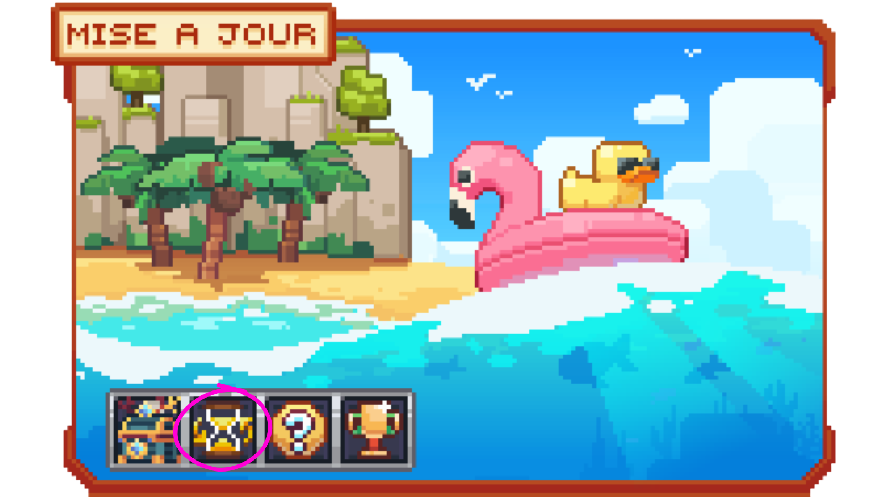
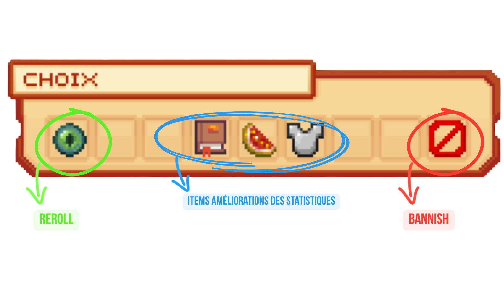
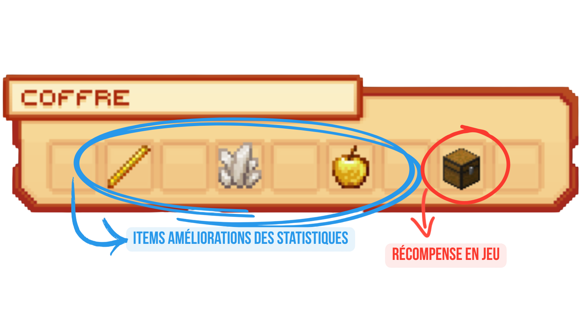
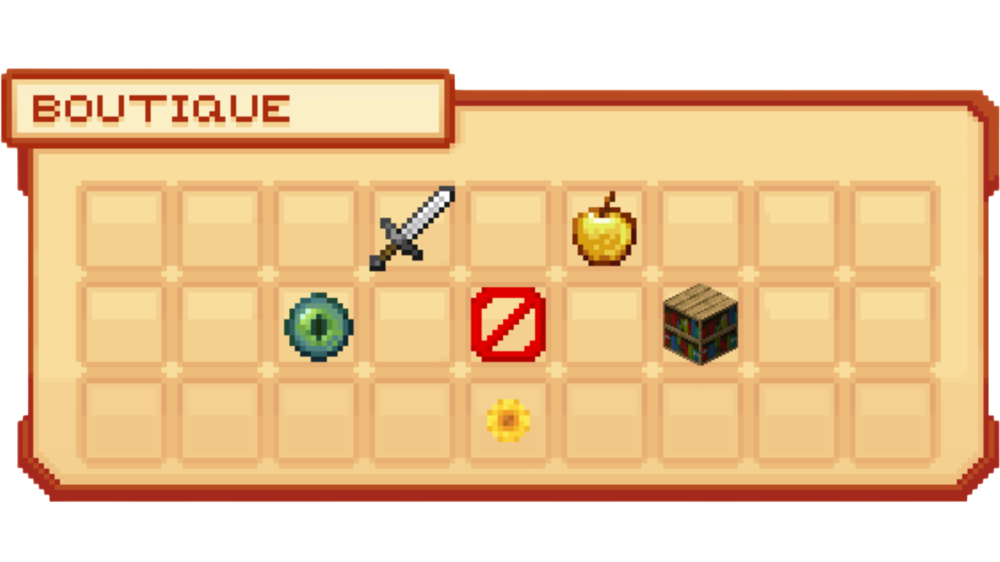

# ♾️ Le Donjon Infini

Le <mark style="color:green;">**donjon infini**</mark> est un nouveau donjon aux <mark style="color:green;">**particularités**</mark> bien différentes des <mark style="color:green;">**donjons traditionnels**</mark>. En effet, dans ce donjon, pas d'histoire de classe, mais une histoire de jusqu'où vous serez capable de survivre jusqu'à votre dernier souffle afin de récolter des <mark style="color:green;">**récompenses**</mark> tout aussi intéressantes que vos donjons traditionnels !

<figure><figcaption>Aperçu de la <mark style="color:green;">Map du donjon Infini</mark></figcaption></figure>

## 💠 Comment entrer dans ce <mark style="color:green;">**donjon infini**</mark> ? 🔍

Pour entrer dans ce donjon infini, pas d'histoire de portail à trouver dans le monde ressource. Non, pour y entrer, il faudra des <mark style="color:green;">**tickets**</mark>, mais comment les obtenir ?

### 🔷 Obtention des tickets 🎫

#### 🔶 Les <mark style="color:green;">**Tickets gratuits**</mark> ⁉️

Des tickets peuvent être <mark style="color:green;">**récoltés**</mark> gratuitement et surtout très facilement !

Pour cela, il vous suffira de réaliser la commande `/atlasbonks redeem` ! Vous en recevrez 3 par jour !

Mais pas de panique si vous oubliez un jour ! Vous pouvez récupérer vos tickets des jours précédents avec la même commande jusqu'à 7 jours !


**⚠️ ATTENTION :** Pour récupérer vos tickets lorsque vous n'êtes pas connecté, il faudra avoir au minimum récupéré un ticket. Ce dernier effectuera une <mark style="color:green;">**sauvegarde**</mark> de l'heure à laquelle vous l'avez récupéré afin de pouvoir récupérer chaque jour à la même heure lorsque vous effectuerez la commande.

Par exemple, si vous récupérez votre premier ticket le premier jour à 16H, vous pourrez alors récupérer chaque jour le ticket à 16H.


#### 🔶 Les <mark style="color:green;">**Caisses Aquatiques**</mark> 🎁

Lorsque vous ouvrez la [<mark style="color:green;">**Caisse Aquatique**</mark>](https://wiki.evolucraft.fr/le-gameplay/les-caisses#caisse-aquatique) à l'aide d'une clé Aquatique, vous avez une <mark style="color:green;">**probabilité**</mark> de tomber soit sur :

* 🔶 2 tickets pour le donjon infini (5.56%)
ou
* 🔶 4 tickets pour le donjon infini (5.56%)
 
Lorsque vous recevez vos tickets de donjon, ces derniers ne sont pas sous <mark style="color:green;">**forme**</mark> d'un item mais d'une monnaie d'entrée. C'est ainsi qu'ils sont <mark style="color:green;">**directement**</mark> rajoutés à votre compte à l'<mark style="color:green;">**obtention**</mark> sans la possibilité de les donner à d'autres joueurs.

 REMARQUE 🔍 :
Pour savoir combien de <mark style="color:green;">**tickets**</mark> vous possédez actuellement, il vous suffit de réaliser la commande `/update` et de passer la souris sur le sablier.
<figure><figcaption>Aperçu du <mark style="color:green;">nombre de tickets en votre possession</mark></figcaption></figure>


### 🔷 Ouverture du donjon infini 🏛️

Pour entrer dans le donjon infini en ayant des <mark style="color:green;">**tickets non utilisés**</mark>, il vous suffira d'aller dans le `/update`, puis de faire un <mark style="color:green;">**clic gauche**</mark> sur le sablier.

<figure><figcaption>Aperçu du <mark style="color:green;">nombre de tickets en votre possession</mark></figcaption></figure>

Après avoir <mark style="color:green;">**cliqué**</mark>, vous serez alors <mark style="color:green;">**téléporté**</mark> dans une salle bedrock. Et vous serez vidé temporairement de votre inventaire.

 ATTENTION ⚠️ :
Nous vous <mark style="color:green;">**déconseillons**</mark> de bouger votre inventaire durant ce temps d'attente, car si vous déplacez votre inventaire au moment où le serveur videra votre inventaire, l'item sera perdu !


## 💠 Comment se présente ce donjon infini qui est si différent des autres ? 🕹️

Votre <mark style="color:green;">**objectif**</mark> dans ce donjon infini est très simple, inspiré du célèbre jeu Mégabonk, c'est de rester en vie le plus longtemps possible dans une map remplie de <mark style="color:green;">**monstres**</mark>. Pour vous aider, vous disposerez de votre <mark style="color:green;">**pistolet à eau**</mark>. 

Plus vous <mark style="color:green;">**restez**</mark> longtemps dans le donjon en <mark style="color:green;">**tuant**</mark> les mobs, plus vous gagnerez des <mark style="color:green;">**récompenses**</mark> de prestige.

### 🔷 Pas de stuff et pas de classe ? 😱
Dès l'arrivée dans le donjon, vous aurez peut-être <mark style="color:green;">**remarqué**</mark> quelque chose, vous n'avez plus votre stuff habituel mais seulement un pistolet à eau, cela est normal ! Votre stuff sera rendu à la fin de votre donjon infini !

### 🔷 Comment rester en vie plus longtemps ? 
Pour rester en vie, il faudra vous battre contre ces méchantes créatures... Mais ce n'est pas tout ! Vous pouvez également débloquer des <mark style="color:green;">**améliorations**</mark> de vos <mark style="color:green;">**statistiques**</mark> ainsi que des <mark style="color:green;">**tomes**</mark> vous permettant d'améliorer vos statistiques mais également votre chance sur les récompenses !

Pour cela, vous pourrez les récupérer dans deux endroits dans ce donjon :

<table border="1" cellspacing="0" cellpadding="6">
  <tr>
    <td>À la <mark style="color:green;"><strong>montée de niveau</strong></mark> de votre barre d'expérience (symbolisée par la barre d'xp Minecraft)</td>
    <td>Dans les <mark style="color:green;"><strong>coffres de donjon</strong></mark> (qui apparaissent un peu partout sur la map ou à la mort d'un monstre)</td>
  </tr>
  <tr>
    <td><figure><figcaption>Aperçu d'un choix <mark style="color:green;">à votre montée de niveau</mark></figcaption></figure></td>
    <td><figure><figcaption>Aperçu d'un <mark style="color:green;">coffre en donjon infini</mark></figcaption></figure></td>
  </tr>
</table>

Il pourra donc vous donner des <mark style="color:green;">**améliorations**</mark> des statistiques ou des tomes suivants :

<table border="1" cellspacing="0" cellpadding="6">
  <tr>
    <td><mark style="color:white;"><strong>📊 Statistiques Personnelles</strong></mark></td>
    <td><mark style="color:white;"><strong>🔫 Statistiques de l'Arme</strong></mark></td>
    <td><mark style="color:white;"><strong>📖 Tomes (Bonus par niveau)</strong></mark></td>
  </tr>
  <tr>
    <td><mark style="color:red;">Augmenter votre vie maximum 💓</mark></td>
    <td><mark style="color:red;">Augmenter vos Dégâts 🗡️</mark></td>
    <td>
     
<mark style="color:red;"><strong>Puissance</strong></mark>

     
+0.8% Dégâts

    </td>
  </tr>
  <tr>
    <td><mark style="color:red;">Régénération de votre vie plus rapide 💕</mark></td>
    <td><mark style="color:orange;">Augmenter vos Dégâts Critiques ⚔️</mark></td>
    <td>
     
<mark style="color:yellow;"><strong>Cadence</strong></mark>

     
+0.6% Cadence

    </td>
  </tr>
  <tr>
    <td><mark style="color:blue;">Augmentation de votre vitesse de déplacement 🏃‍♂️</mark></td>
    <td><mark style="color:green;">Chance de Critique 🎯</mark></td>
    <td>
     
<mark style="color:red;"><strong>Vitalité</strong></mark>

     
+1% Vie Maximum

     
+0.3% Régénération

    </td>
  </tr>
  <tr>
    <td><mark style="color:purple;">La Résistance (Armure) 🛡️</mark></td>
    <td><mark style="color:yellow;">Cadence (Temps de recharge) ⌛</mark></td>
    <td>
     
<mark style="color:orange;"><strong>Précision</strong></mark>

     
+8% Dégâts Critiques

     
+0.4% Chance de Critique

    </td>
  </tr>
  <tr>
    <td><mark style="color:green;">Portée du ramassage d'XP 🧲</mark></td>
    <td><mark style="color:blue;">Augmenter la taille du jet 🌊</mark></td>
    <td>
     
<mark style="color:purple;"><strong>Protection</strong></mark>

     
+0.4% Résistance

     
+2% Esquive

    </td>
  </tr>
  <tr>
    <td><mark style="color:green;">Gain d'XP 📈</mark></td>
    <td><mark style="color:blue;">Vitesse de votre jet 💨</mark></td>
    <td>
     
<mark style="color:blue;"><strong>Agilité</strong></mark>

     
+0.5% Vitesse

     
+10% Portée XP

    </td>
  </tr>
  <tr>
    <td><mark style="color:yellow;">Gain d'Or 🧈</mark></td>
    <td><mark style="color:blue;">Nombre de jets ✖️💦</mark></td>
    <td>
     
<mark style="color:green;"><strong>Fortune</strong></mark>

     
+4% Chance des Récompenses

     
+0.8% XP/Gold/Silver

    </td>
  </tr>
  <tr>
    <td><mark style="color:blue;">Esquiver les attaques 🤺</mark></td>
    <td><mark style="color:blue;">Nombre de rebonds du jet 🏀</mark></td>
    <td>
     
<mark style="color:blue;"><strong>Flots</strong></mark>

     
+1% Vitesse du jet

     
+8% Taille du jet

     
+1 Jet dans les manches épiques

    </td>
  </tr>
  <tr>
    <td><mark style="color:green;">Chance de récompense ✨</mark></td>
    <td></td>
    <td></td>
  </tr>
</table>

(Vous êtes limité de base à 1 par donjon, mais vous pouvez augmenter votre nombre de <mark style="color:green;">**tomes**</mark> par donjon avec des <mark style="color:green;">**silvers**</mark>)

Lorsque vous n'aimez pas les lots proposés quand vous avez <mark style="color:green;">**monté de niveau**</mark> d'expérience, vous allez la possibilité de :
#### * 🔶 <mark style="color:green;">**Reroll**</mark> :
Il vous sert à retirer au sort les offres obtenues à votre level up si vous n'aimez pas leurs propositions. Il est représenté par un <mark style="color:green;">**œil de l'Ender**</mark>
#### * 🔶 <mark style="color:green;">**Banish**</mark> : 
Il vous permet de <mark style="color:green;">**bannir**</mark> une statistique lors de la montée de niveau sur les statistiques proposées. Une fois bannie, cette statistique ne pourra plus apparaître à chaque montée de niveau jusqu'à la fin de votre partie.

<figure><figcaption>Aperçu de la <mark style="color:green;">montée de niveau</mark></figcaption></figure>
 

**⚠️ ATTENTION :** Les statistiques et les tomes que vous aurez <mark style="color:green;">**ajoutés**</mark> seront <mark style="color:green;">**perdus**</mark> et ne sont pas <mark style="color:green;">**gardés**</mark> quand vous effectuerez un autre donjon infini, c'est là que chaque partie est unique en plus des récompenses !


### 🔷 D'autres armes de donjon ? 🔫
Vous avez également la possibilité, en ouvrant des caisses dans le donjon, d'<mark style="color:green;">**améliorer**</mark> vos armes mais également de <mark style="color:green;">**changer**</mark> d'arme :

<table border="1" cellpadding="10" cellspacing="0">
  <thead>
    <tr>
      <th><mark style="color:white;"><b>Nom du pistolet 🏷️</b></mark></th>
      <th><mark style="color:yellow;"><b>Nombre de dégâts ☠️</b></mark></th>
      <th><mark style="color:blue;"><b>Nombre de tirs par seconde 🥏</b></mark></th>
      <th><mark style="color:purple;"><b>Portée du Tir 📏</b></mark></th>
      <th><mark style="color:red;"><b>Nombre de Jets 💦</b></mark></th>
    </tr>
  </thead>
    <tr>
      <td>
       
<mark style="color:green;">Pistolet à eau</mark> (Arme de base)

       
<figure></figure>

      </td>
      <td><mark style="color:green;">18 Dégâts</mark></td>
      <td><mark style="color:green;">2 tirs /s</mark></td>
      <td><mark style="color:green;">16 blocks</mark></td>
      <td><mark style="color:green;">1 jet</mark></td>
    </tr>
    <tr>
      <td>
       
<mark style="color:yellow;">Double Buse</mark>

       
<figure></figure>

      </td>
      <td><mark style="color:yellow;">12 Dégâts</mark></td>
      <td><mark style="color:yellow;">2 tirs /s</mark></td>
      <td><mark style="color:yellow;">14 blocks</mark></td>
      <td><mark style="color:yellow;">2 jets</mark></td>
    </tr>
    <tr>
      <td>
       
<mark style="color:yellow;">Mitraillette</mark>

       
<figure></figure>

      </td>
      <td><mark style="color:yellow;">7 Dégâts</mark></td>
      <td><mark style="color:yellow;">10 tirs /s</mark></td>
      <td><mark style="color:yellow;">12 blocks</mark></td>
      <td><mark style="color:yellow;">1 jet</mark></td>
    </tr>
    <tr>
      <td>
       
<mark style="color:blue;">Sniper</mark>

       
<figure></figure>

      </td>
      <td><mark style="color:blue;">75 Dégâts</mark></td>
      <td><mark style="color:blue;">1.2 tirs /s</mark></td>
      <td><mark style="color:blue;">28 blocks</mark></td>
      <td><mark style="color:blue;">1 jet</mark></td>
    </tr>
    <tr>
      <td>
       
<mark style="color:blue;">Fusil à Pompe</mark>

       
<figure></figure>

      </td>
      <td><mark style="color:blue;">15 Dégâts</mark></td>
      <td><mark style="color:blue;">1.4 tirs /s</mark></td>
      <td><mark style="color:blue;">8 blocks</mark></td>
      <td><mark style="color:blue;">2 jets</mark></td>
    </tr>
    <tr>
      <td>
       
<mark style="color:purple;">Canon lourd</mark>

       
<figure></figure>

      </td>
      <td><mark style="color:purple;">140 Dégâts</mark></td>
      <td><mark style="color:purple;">0.8 tirs /s</mark></td>
      <td><mark style="color:purple;">14 blocks</mark></td>
      <td><mark style="color:purple;">1 jet</mark></td>
    </tr>
</table>


**⚠️ ATTENTION :** Si vous <mark style="color:green;">**changez**</mark> d'arme pendant le donjon, elle prendra la place de votre arme de base, cependant l'arme que vous aviez de base <mark style="color:green;">**améliorée**</mark> gardera les <mark style="color:green;">**améliorations**</mark> effectuées précédemment si vous la rechoisissez.


## 💠 Quelles sont les <mark style="color:green;">**récompenses disponibles**</mark> ? 🗿

À la fin de votre donjon lorsque vous mourrez, vous pourrez récupérer des <mark style="color:green;">**récompenses**</mark> en plus de celles déjà récupérées dans les coffres dans le donjon. Mais que sont-elles ?

### 🔷 Les silvers 🪙

À la fin de votre donjon lorsque vous mourrez, vous pourrez récupérer des <mark style="color:green;">**silvers**</mark>, ils vous servent à améliorer vos <mark style="color:green;">**statistiques**</mark> de vie, de dégâts mais également d'ajouter des [<mark style="color:green;">**Banish**</mark>](https://wiki.evolucraft.fr/le-gameplay/donjon-infini#banish), des [<mark style="color:green;">**Reroll**</mark>](https://wiki.evolucraft.fr/le-gameplay/donjon-infini#reroll) ou encore la possibilité d'avoir des <mark style="color:green;">**Tomes supplémentaires**</mark> dans votre inventaire en donjon.

<figure><figcaption>Aperçu de la <mark style="color:green;">Boutique Silver</mark></figcaption></figure>

### 🔷 Des récompenses en jeu 🪙

Pour récupérer les <mark style="color:green;">**récompenses**</mark> de votre donjon effectué, il vous suffira de réaliser la commande `/atlasbonks claim`. Vos récompenses sont récupérables à n'importe quel moment, même après un deuxième donjon infini.

<table border="1" cellpadding="10" cellspacing="0">
  <thead>
    <tr>
      <th><mark style="color:green;"><b>Commun 🟩</b></mark></th>
      <th><mark style="color:yellow;"><b>Rare 🟨</b></mark></th>
      <th><mark style="color:blue;"><b>Épique 🟦</b></mark></th>
      <th><mark style="color:purple;"><b>Légendaire 🟪</b></mark></th>
      <th><mark style="color:red;"><b>Mythique 🟥</b></mark></th>
    </tr>
  </thead>
  <tbody>
    <tr>
      <td>
       
<mark style="color:green;">Argent</mark>

       
(Entre 10.000💲 et 25.000💲)

      </td>
      <td>
       
<mark style="color:yellow;">Argent</mark>

       
(Entre 35.000💲 et 100.000💲)

      </td>
      <td>
       
<mark style="color:blue;">Argent</mark>

       
(Entre 125.000💲 et 250.000💲)

      </td>
      <td>
       
<mark style="color:purple;">Argent</mark>

       
(Entre 300.000💲 et 750.000💲)

      </td>
      <td>
       
<mark style="color:red;">Argent</mark>

       
(1.500.000💲)

      </td>
    </tr>
    <tr>
      <td><mark style="color:green;">1 ou 2 Cartes de classe Commune</mark></td>
      <td><mark style="color:yellow;">1 ou 2 Cartes de classe Rare</mark></td>
      <td><mark style="color:blue;">1 Carte de classe Épique</mark></td>
      <td><mark style="color:purple;">1 Carte de classe Légendaire</mark></td>
      <td><mark style="color:red;">1 Parchemin Impossible</mark></td>
    </tr>
    <tr>
      <td><mark style="color:green;">1 Parchemin Facile</mark></td>
      <td>
       
<mark style="color:yellow;">1 Parchemin Avancé</mark>

       
<mark style="color:blue;">1 Parchemin Abyssal</mark>

       
<mark style="color:orange;">1 Parchemin Halloween</mark>

      </td>
      <td>
       
<mark style="color:blue;">1 Parchemin Difficile</mark>

       
<mark style="color:yellow;">1 Parchemin Fabrique du Chocolat</mark>

       
<mark style="color:blue;">1 Parchemin Givré</mark>

       
<mark style="color:orange;">1 Parchemin Citrouille</mark>

      </td>
      <td><mark style="color:purple;">1 Parchemin Expert</mark></td>
      <td><mark style="color:red;">1 Cristal de donjon Mythique</mark></td>
    </tr>
    <tr>
      <td>
       
<mark style="color:green;">1 bonbon à la Pomme</mark>

       
<mark style="color:blue;">2 bonbons à la Myrtille</mark>

      </td>
      <td>
       
<mark style="color:yellow;">2 bonbons à l'orange</mark>

       
<mark style="color:blue;">3 bonbons à la myrtille</mark>

       
<mark style="color:purple;">2 bonbons aux raisins</mark>

      </td>
      <td><mark style="color:blue;">1 cristal de donjon Épique</mark></td>
      <td><mark style="color:purple;">1 Parchemin Expert</mark></td>
      <td><mark style="color:red;">1 Pierre de téléportation de donjon Mythique</mark></td>
    </tr>
    <tr>
      <td><mark style="color:green;">1 Cristal de donjon Commun</mark></td>
      <td><mark style="color:yellow;">1 Cristal de donjon Rare</mark></td>
      <td><mark style="color:blue;">5.000 XP Classe</mark></td>
      <td><mark style="color:purple;">1 Pierre de téléportation Glaciale</mark></td>
      <td><mark style="color:red;">1 Oeuf de familier Summer 2026</mark></td>
    </tr>
    <tr>
      <td>
       
<a href="https://wiki.evolucraft.fr/le-gameplay/marche-noir#summer-2025"><mark style="color:blue;">2 Glaces</mark></a>

       
<a href="https://wiki.evolucraft.fr/le-gameplay/marche-noir#abyssal"><mark style="color:blue;">2 Pinces de crabe</mark></a>

       
<a href="https://wiki.evolucraft.fr/le-gameplay/marche-noir#givre"><mark style="color:blue;">2 Sucre d'orges</mark></a>

       
<a href="https://wiki.evolucraft.fr/le-gameplay/marche-noir#paques-2025"><mark style="color:yellow;">2 Tablettes de chocolat</mark>

       
<a href="https://wiki.evolucraft.fr/le-gameplay/marche-noir#halloween"><mark style="color:orange;">2 Citrouilles Scintillantes</mark>

      </td>
      <td>
       
<a href="https://wiki.evolucraft.fr/le-gameplay/marche-noir#draconique"><mark style="color:orange;">1 Cœur de dragon</mark></a>

       
<a href="https://wiki.evolucraft.fr/le-gameplay/marche-noir#halloween-2025"><mark style="color:red;">1 Lune de sang</mark></a>

       
<a href="https://wiki.evolucraft.fr/le-gameplay/marche-noir#st-valentin"><mark style="color:red;">1 Auréoles</mark></a>

      </td>
      <td>
       
<mark style="color:blue;">1 Oeuf de familier Summer 2025</mark>

       
<mark style="color:orange;">1 Oeuf de familier Draconique</mark>

      </td>
      <td>
       
<mark style="color:blue;">1 Oeuf de familier Abyssal</mark>

       
<mark style="color:orange;">1 Oeuf de familier Halloween</mark>

       
<mark style="color:blue;">1 Oeuf de familier Givré</mark>

       
<mark style="color:red;">1 Oeuf de familier Saint-Valentin 2025</mark>

       
<mark style="color:yellow;">1 Oeuf de familier Pâques 2025</mark>

       
<mark style="color:red;">1 Oeuf de familier Lune de Sang</mark>

      </td>
      <td><mark style="color:blue;">1 clé Aquatique</mark></td>
    </tr>
   <tr>
      <td><mark style="color:green;">1 plume de Fly (10 min)</mark></td>
      <td>
       
<mark style="color:yellow;">1 plume de Fly (30 min)</mark>

       
<mark style="color:purple;">1 plume de Phénix</mark>

      </td>
      <td>
       
<mark style="color:yellow;">1 clé Pâques 2025</mark>

       
<mark style="color:blue;">1 clé Givrée</mark>

       
<mark style="color:red;">1 clé Cupidon</mark>

      </td>
      <td>
       
<mark style="color:red;">1 clé Lune de Sang</mark>

       
<mark style="color:yellow;">1 clé Aléatoire d'Événement</mark>

      </td>
      <td>
       
<mark style="color:blue;">1 familier Merlock</mark>

       
<mark style="color:blue;">1 familier Abubis</mark>

       
<mark style="color:blue;">1 familier Biggoron</mark>

       
<mark style="color:blue;">1 familier Bolg</mark>

       
<mark style="color:blue;">1 familier Lilith</mark>

       
<mark style="color:blue;">1 familier Gorille des Cavernes</mark>

       
<mark style="color:purple;">1 familier Gorille du Laboratoire</mark>

       
<mark style="color:red;">1 familier Sunny</mark>

      </td>
    </tr>
    <tr>
      <td><mark style="color:green;">250 XP classe</mark></td>
      <td><mark style="color:yellow;">1.000 XP classe</mark></td>
      <td><mark style="color:blue;">1 familier Sylphe</mark></td>
      <td>
       
<mark style="color:blue;">1 familier Skog</mark>

       
<mark style="color:blue;">1 familier Yukio</mark>

       
<mark style="color:blue;">1 familier Pohaku</mark>

       
<mark style="color:blue;">1 familier Bufo Bufo</mark>

      </td>
      <td><a href="https://wiki.evolucraft.fr/le-codex/outils/evolutive"><mark style="color:red;">1 Item Évolutif Aléatoire</mark></a></td>
    </tr>
    <tr>
      <td>X</td>
      <td>X</td>
      <td><mark style="color:blue;">1 Arme de Récompense de Donjon Épique</mark></td>
      <td>
       
<mark style="color:red;">1 pièce</mark> de l'œuvre <mark style="color:red;">T-REX</mark>

       
<mark style="color:red;">Pièce Colonne Vertébrale du T-REX</mark>

       
<mark style="color:red;">Pièce Main Gauche du T-REX</mark>

       
<mark style="color:red;">Pièce Bras Gauche du T-REX</mark>

       
<mark style="color:red;">Pièce Pied Gauche du T-REX</mark>

       
<mark style="color:red;">Pièce Bras Droit du T-REX</mark>

       
<mark style="color:red;">Pièce Pied Droit du T-REX</mark>

      </td>
      <td>X</td>
    </tr>
    <tr>
      <td>X</td>
      <td>X</td>
      <td>
       
<mark style="color:green;">1 pièce</mark> de l'oeuvre <mark style="color:green;">Machette Aztèque</mark>

       
<mark style="color:green;">Pièce Socle de la Machette Aztèque</mark>

       
<mark style="color:green;">Pièce Lame de la Machette Aztèque</mark>

      </td>
      <td>X</td>
      <td>X</td>
    </tr>
    <tr>
      <td>X</td>
      <td>X</td>
     <td>
       
<mark style="color:yellow;">1 pièce</mark> de l'œuvre <mark style="color:yellow;">Kabuto</mark>

       
<mark style="color:yellow;">Pièce Socle du Kabuto</mark>

       
<mark style="color:yellow;">Pièce Épaulière Droite du Kabuto</mark>

       
<mark style="color:yellow;">Pièce Jambière Droite du Kabuto</mark>

      </td>
      <td>X</td>
      <td>X</td>
    </tr>
    <tr>
      <td>X</td>
      <td>X</td>
     <td>
       
<mark style="color:yellow;">1 pièce</mark> de l'oeuvre <mark style="color:yellow;">Louve Capitoline</mark>

       
<mark style="color:yellow;">Pièce Bébé Droit de la Louve Capitoline</mark>

       
<mark style="color:yellow;">Pièce Louve de la Louve Capitoline</mark>

      </td>
      <td>X</td>
      <td>X</td>
    </tr>
    <tr>
      <td>X</td>
      <td>X</td>
     <td>
       
<mark style="color:blue;">1 pièce</mark> de l'œuvre <mark style="color:blue;">Pierre de Rosette</mark>

       
<mark style="color:blue;">Pièce Partie Gauche de la Pierre de Rosette</mark>

       
<mark style="color:blue;">Pièce Partie Haute de la Pierre de Rosette</mark>

      </td>
      <td>X</td>
      <td>X</td>
    </tr>
    <tr>
      <td>X</td>
      <td>X</td>
     <td>
       
<mark style="color:blue;">1 pièce</mark> de l'œuvre <mark style="color:blue;">Soldat D'argile</mark>

       
<mark style="color:blue;">Pièce Socle du Soldat d'Argile</mark>

       
<mark style="color:blue;">Pièce Côté Droit du Soldat d'Argile</mark>

       
<mark style="color:blue;">Pièce Côté Gauche du Soldat d'Argile</mark>

      </td>
      <td>X</td>
      <td>X</td>
    </tr>
    <tr>
      <td>X</td>
      <td>X</td>
     <td>
       
<mark style="color:blue;">1 pièce</mark> de l'œuvre <mark style="color:blue;">Vase de Soissons</mark>

       
<mark style="color:blue;">Pièce Base du Vase de Soissons</mark>

       
<mark style="color:blue;">Pièce Socle du Vase de Soissons</mark>

       
<mark style="color:blue;">Pièce Pot du Vase de Soissons</mark>

      </td>
      <td>X</td>
      <td>X</td>
    </tr>
    <tr>
      <td>X</td>
      <td>X</td>
     <td>
       
<mark style="color:purple;">1 pièce</mark> de l'œuvre <mark style="color:purple;">Atlas</mark>

       
<mark style="color:purple;">Pièce Pierre du Haut d'Atlas</mark>

       
<mark style="color:purple;">Pièce Pierre du Bas d'Atlas</mark>

       
<mark style="color:purple;">Pièce Bras Gauche d'Atlas</mark>

       
<mark style="color:purple;">Pièce Jambe Gauche d'Atlas</mark>

      </td>
      <td>X</td>
      <td>X</td>
     </tr>
  </tbody>
</table>

**Voilà, vous connaissez tout sur les donjons <mark style="color:green;">**Infinis**</mark> ♾️ ! Mais attention à ne pas perdre la tête 😵**
