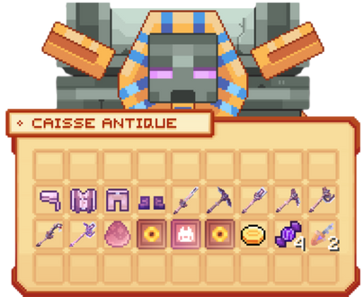

# 🎁 Les Caisses


**Tuto : Maximiser sa Progression sur Evolucraft**


Afin d’apporter un aspect aléatoire et dynamique à votre aventure, Evolucraft propose un système de caisses. Ces dernières contiennent diverses <mark style="color:green;">récompenses</mark> et permettent de varier l’<mark style="color:green;">expérience de jeu</mark> en donnant accès à des <mark style="color:green;">objets</mark> ou <mark style="color:green;">avantages exclusifs</mark>.

Il existe deux types de caisses :

## 💠 <mark style="color:green;">Les caisses permanentes 🌞</mark>

Ces box sont présentes et resteront <mark style="color:green;">accessibles</mark> sur le serveur pendant toute la version. Ces dernières vous permettent de gagner des <mark style="color:green;">items</mark> améliorant votre <mark style="color:green;">gameplay</mark> comme des <mark style="color:green;">outils</mark>, des <mark style="color:green;">pets</mark>, des <mark style="color:green;">boosters</mark> et autres items très intéressants que nous vous laisserons découvrir...

### 🔸 <mark style="color:green;">Caisse Vote 🗝️</mark>

#### 🔹 <mark style="color:blue;">Son obtention 🤔</mark>

La <mark style="color:green;">clé</mark> de la Caisse Vote s'obtient en <mark style="color:green;">votant</mark> pour le serveur. Nous vous laissons regarder le petit tutoriel pour savoir [<mark style="color:green;">comment voter pour le serveur</mark>](https://wiki.evolucraft.fr/tuto-et-astuce/gagner-argent#comment-voter-sur-le-serveur) ! 🧐

#### 🔹 <mark style="color:blue;">Ses récompenses 🎰</mark>

<figure><figcaption></figcaption></figure>

| **Récompense**                                                                                                                                                                       | **Pourcentage d'obtention** |
| ------------------------------------------------------------------------------------------------------------------------------------------------------------------------------------ | --------------------------- |
| <mark style="color:green;">**Épée de l'Aventurier**</mark>                                                                                                                           | **4,22%**                   |
| <mark style="color:green;">**Pioche de l'Aventurier**</mark>                                                                                                                         | **4,22%**                   |
| <mark style="color:green;">**Houe de l'Aventurier**</mark>                                                                                                                           | **4,22%**                   |
| <mark style="color:green;">**Canne à Pêche de l'Aventurier**</mark>                                                                                                                  | **4,22%**                   |
| <mark style="color:green;">**Hache de l'Aventurier**</mark>                                                                                                                          | **4,22%**                   |
| <mark style="color:green;">**5.000💰**</mark>                                                                                                                                        | **4,22%**                   |
| <mark style="color:green;">**10.000💰**</mark>                                                                                                                                       | **4,22%**                   |
| <mark style="color:green;">**10 Gemmes 💎**</mark>                                                                                                                                   | **4,22%**                   |
| <mark style="color:green;">**Spawner Aléatoire**</mark>                                                                                                                              | **4,22%**                   |
| <mark style="color:green;">**Booster Aléatoire de 10% pendant 30 minutes**</mark>                                                                                                    | **4,21%**                   |
| <mark style="color:green;">**Pierre de Téléportation Commune**</mark>                                                                                                                 | **4,21%**                   |
| <mark style="color:green;">**2 000 XP sur un Métier Aléatoire**</mark>                                                                                                               | **4,21%**                   |
| <mark style="color:green;">**1 000 XP Classe**</mark>                                                                                                                                | **4,21%**                   |
| <mark style="color:green;">**1 395 Point d'XP (Vanilla)**</mark>                                                                                                                     | **4,21%**                   |
| <mark style="color:green;">**Plume de Fly de 10 Minutes**</mark>                                                                                                                     | **4,21%**                   |
| <mark style="color:green;">**Plume de Fly de 30 Minutes**</mark>                                                                                                                     | **4,21%**                   |
| <mark style="color:green;">**Parchemin d'Aventure Aléatoire**</mark>                                                                                                                 | **4,21%**                   |
| <mark style="color:green;">**2 Bonbons à la Pomme**</mark>                                                                                                                           | **4,21%**                   |
| <mark style="color:green;">**Livre d'Echantement Aléatoire**</mark>                                                                                                                  | **4,21%**                   |
| <mark style="color:green;">**Entonnoir**</mark>                                                                                                                                      | **4,21%**                   |
| <mark style="color:green;">**2 Fragments de Netherite**</mark>                                                                                                                       | **4,21%**                   |
| <mark style="color:green;">**Carapace de Shulker**</mark>                                                                                                                            | **4,21%**                   |
| <mark style="color:green;">**Chapeau de Tyro**</mark><mark style="color:green;">**&#x20;**</mark><mark style="color:green;">**`/cosmetics`**</mark> _(Obtenable qu'une seule fois)_  | **4,21%**                   |
| <mark style="color:green;">**Clé Cosmétique**</mark>                                                                                                                                 | **1%**                      |
| <mark style="color:green;">**Clé Émeraude**</mark>                                                                                                                                   | **1%**                      |
| [<mark style="color:blue;"><mark style="color:green;">**24H de Premium 👑**<mark style="color:green;"></mark>](https://wiki.evolucraft.fr/le-gameplay/les-grades#abonnement-premium) | **1%**                      |
| <mark style="color:green;">**Rat de Billy**</mark> _(20% de chance d'avoir la version Shiny)_                                                                                                  | **0,05%**                   |

### 🔸 <mark style="color:purple;">Caisse Cosmétique 🎩</mark>

#### 🔹 <mark style="color:blue;">Son obtention 🤔</mark>

La <mark style="color:green;">clé</mark> de la Caisse Cosmétique s'obtient en l'achetant dans le <mark style="color:green;">**`/boutique`**</mark> au prix de <mark style="color:green;">500 Gemmes 💎</mark>, ou en participant à des <mark style="color:green;">events</mark>.

#### 🔹 <mark style="color:blue;">Ses récompenses 🎰</mark>

<figure><figcaption></figcaption></figure>

| **Récompense**                                                 | **Pourcentage d'obtention** |
| -------------------------------------------------------------- | --------------------------- |
| <mark style="color:purple;">**Chapeau pastèque**</mark>        | **5,55%**                   |
| <mark style="color:purple;">**Sac de pièces**</mark>            | **5,55%**                   |
| <mark style="color:purple;">**Tête de télévision**</mark>      | **5,55%**                   |
| <mark style="color:purple;">**Bob**</mark>                     | **5,55%**                   |
| <mark style="color:purple;">**Chapeau de cowboy**</mark>       | **5,55%**                   |
| <mark style="color:purple;">**Chapeau de Poulet**</mark>       | **5,55%**                   |
| <mark style="color:purple;">**Coffre au Trésor**</mark>        | **5,55%**                   |
| <mark style="color:purple;">**Hache de Noël**</mark>           | **5,55%**                   |
| <mark style="color:purple;">**Chapeau d'OVNI**</mark>          | **5,55%**                   |
| <mark style="color:purple;">**Chaussette de Noël**</mark>      | **5,55%**                   |
| <mark style="color:purple;">**Coffre maléfique**</mark>        | **5,55%**                   |
| <mark style="color:purple;">**Montgolfière**</mark>            | **5,55%**                   |
| <mark style="color:purple;">**Méduse**</mark>                  | **5,55%**                   |
| <mark style="color:purple;">**Requin**</mark>                  | **5,55%**                   |
| <mark style="color:purple;">**Fourche de Krampus**</mark>      | **5,55%**                   |
| <mark style="color:purple;">**Visière cybernétique**</mark>    | **5,55%**                   |
| <mark style="color:purple;">**Chapeau de campagne**</mark>     | **5,55%**                   |
| <mark style="color:purple;">**Masque Tiki**</mark>             | **5,55%**                   |
| <mark style="color:purple;">**Bâton de Casse-Noisette**</mark> | **5,55%**                   |
| <mark style="color:purple;">**Sceptre Fantôme**</mark>         | **5,55%**                   |


**REMARQUE 🔍 : Lorsque vous avez tous les cosmétiques que la box propose, alors vous ne pouvez plus en obtenir**.


### 🔸 <mark style="color:green;">Caisse Émeraude ✳️</mark>

#### 🔹 <mark style="color:blue;">Son obtention 🤔</mark>

La <mark style="color:green;">clé</mark> de la Caisse Émeraude s'obtient en l'achetant dans le <mark style="color:green;">**`/boutique`**</mark> au prix de <mark style="color:green;">350 Gemmes 💎</mark>, ou en participant à des <mark style="color:green;">events</mark>.

#### 🔹 <mark style="color:blue;">Ses récompenses 🎰</mark>

<figure><figcaption></figcaption></figure>

| **Récompense**                                                                                   | **Pourcentage d'obtention** |
| ------------------------------------------------------------------------------------------------ | --------------------------- |
| <mark style="color:green;">**Épée en Émeraude**</mark> _(20% de chance d'avoir la version Shiny)_          | **5,55%**                   |
| <mark style="color:green;">**Pioche en Émeraude**</mark> _(20% de chance d'avoir la version Shiny)_        | **5,55%**                   |
| <mark style="color:green;">**Hache en Émeraude**</mark> _(20% de chance d'avoir la version Shiny)_         | **5,55%**                   |
| <mark style="color:green;">**Houe en Émeraude**</mark> _(20% de chance d'avoir la version Shiny)_          | **5,55%**                   |
| <mark style="color:green;">**Canne à Pêche en Émeraude**</mark> _(20% de chance d'avoir la version Shiny)_ | **5,55%**                   |
| <mark style="color:green;">**Pelle en Émeraude**</mark> _(20% de chance d'avoir la version Shiny)_         | **5,55%**                   |
| <mark style="color:green;">**Sceptre en Émeraude**</mark>                                        | **5,55%**                   |
| <mark style="color:green;">**Oeuf de Familier**</mark> _(20% de chance d'avoir la version Shiny)_          | **5,55%**                   |
| <mark style="color:green;">**300.000💰**</mark>                                                  | **5,55%**                   |
| <mark style="color:green;">**Spawner Aléatoire**</mark>                                          | **5,55%**                   |
| <mark style="color:green;">**Booster Aléatoire de 25% pendant 1H**</mark>                        | **5,55%**                   |
| <mark style="color:green;">**Carte de Classe Aléatoire**</mark>                                  | **5,55%**                   |
| <mark style="color:green;">**Pierre de Téléportation**</mark>                                    | **5,55%**                   |
| <mark style="color:green;">**3 Parchemin d'Aventure Difficile**</mark>                           | **5,55%**                   |
| <mark style="color:green;">**3 Bonbons à la Myrtille**</mark>                                    | **5,55%**                   |
| <mark style="color:green;">**2 Clés Émeraude**</mark>                                            | **5,55%**                   |
| <mark style="color:green;">**Clé Rubis**</mark>                                                  | **5,55%**                   |
| <mark style="color:green;">**Totem d'Immortalité**</mark>                                        | **5,55%**                   |

### 🔸 <mark style="color:red;">Caisse Rubis 🔻</mark>

#### 🔹 <mark style="color:blue;">Son obtention 🤔</mark>

La <mark style="color:green;">clé</mark> de la Caisse Rubis s'obtient en l'achetant dans le <mark style="color:green;">**`/boutique`**</mark> au prix de <mark style="color:green;">650 Gemmes 💎</mark>, ou en participant à des <mark style="color:green;">events</mark>.

#### 🔹 <mark style="color:blue;">Ses récompenses 🎰</mark>

<figure><figcaption></figcaption></figure>

| **Récompense**                                                                                                                           | **Pourcentage d'obtention** |
| ---------------------------------------------------------------------------------------------------------------------------------------- | --------------------------- |
| <mark style="color:red;">**Épée en Rubis**</mark> _(20% de chance d'avoir la version Shiny)_                                                       | **5,82%**                   |
| <mark style="color:red;">**Pioche en Rubis**</mark> _(20% de chance d'avoir la version Shiny)_                                                     | **5,82%**                   |
| <mark style="color:red;">**Hache en Rubis**</mark> _(20% de chance d'avoir la version Shiny)_                                                      | **5,82%**                   |
| <mark style="color:red;">**Houe en Rubis**</mark> _(20% de chance d'avoir la version Shiny)_                                                       | **5,82%**                   |
| <mark style="color:red;">**Canne à Pêche en Rubis**</mark> _(20% de chance d'avoir la version Shiny)_                                              | **5,82%**                   |
| <mark style="color:red;">**Pelle en Rubis**</mark> _(20% de chance d'avoir la version Shiny)_                                                      | **5,82%**                   |
| <mark style="color:red;">**Marteau en Rubis**</mark> _(20% de chance d'avoir la version Shiny)_                                                    | **5,82%**                   |
| <mark style="color:red;">**Oeuf de Familier**</mark> _(20% de chance d'avoir la version Shiny)_                                                    | **5,82%**                   |
| <mark style="color:red;">**Coffre Rubis**</mark>                                                                                         | **5,82%**                   |
| <mark style="color:red;">**800.000**</mark>**💰**                                                                                        | **5,82%**                   |
| <mark style="color:red;">**Spawner Aléatoire**</mark>                                                                                    | **5,82%**>                  |
| <mark style="color:red;">**Booster Aléatoire de 50% pendant 1H**</mark>                                                                  | **5,82%**                   |
| <mark style="color:red;">**Cartes de Classe Aléatoire**</mark>                                                                           | **5,82%**                   |
| <mark style="color:red;">**Pierre de Téléportation**</mark>                                                                              | **5,82%**                   |
| <mark style="color:red;">**3 Parchemins d'Aventure Expert**</mark>                                                                       | **5,82%**                   |
| <mark style="color:red;">**3 Bonbons au Raisin**</mark>                                                                                  | **5,82%**                   |
| <mark style="color:red;">**2 Clés Rubis**</mark>                                                                                         | **5,82%**                   |
| [<mark style="color:red;">**Grade Héros ⚜️**</mark>](https://wiki.evolucraft.fr/le-gameplay/les-grades#heros) _(Sur la version version)_ | **1%**                      |

### 🔸 <mark style="color:yellow;">Caisse Jackpot 🎰</mark>

#### 🔹 <mark style="color:blue;">Son obtention 🤔</mark>

Dans cette caisse, il n’est pas question de <mark style="color:green;">**clé**</mark> mais de <mark style="color:green;">**jetons**</mark> pour l’ouvrir. Ces <mark style="color:green;">**jetons**</mark> sont obtenables uniquement en achetant des <mark style="color:green;">**clés**</mark> dans le <mark style="color:green;">**`/boutique`**</mark> ! Lorsque vous avez en votre possession <mark style="color:green;">**43 jetons**</mark>, vous pourrez alors obtenir <mark style="color:green;">**1 item**</mark> de la <mark style="color:green;">**caisse Jackpot**</mark>.


**REMARQUE 🔍 : Pour voir votre nombre de&#x20;**<mark style="color:green;">**jetons**</mark>**&#x20;en votre possession, faites un clic droit sur la&#x20;**<mark style="color:green;">**box**</mark>**, puis passez votre curseur sur le&#x20;**<mark style="color:green;">**coffre**</mark>**. Une ligne indiquant&#x20;**_**"Vos jetons"**_**&#x20;vous précisera le nombre exact que vous possédez.**


#### 🔹 <mark style="color:blue;">Ses récompenses 🎰</mark>

<figure><figcaption></figcaption></figure>

| **Récompense**                                                                                      | **Pourcentage d'obtention** |
| --------------------------------------------------------------------------------------------------- | --------------------------- |
| <mark style="color:yellow;">**Casque Légendaire**</mark>                                            | **11,1%**                   |
| <mark style="color:yellow;">**Plastron Légendaire**</mark>                                          | **11,1%**                   |
| <mark style="color:yellow;">**Pantalon Légendaire**</mark>                                          | **11,1%**                   |
| <mark style="color:yellow;">**Bottes Légendaire**</mark>                                            | **11,1%**                   |
| <mark style="color:yellow;">**Armes de classe Aléatoire**</mark>                                    | **11,1%**                   |
| <mark style="color:yellow;">**Carte de classe Légendaire**</mark>                                   | **11,1%**                   |
| <mark style="color:yellow;">**Oeuf de Familier Légendaire**</mark> _(20% de chance d'avoir la version Shiny)_ | **11,1%**                   |
| <mark style="color:yellow;">**Spawner Aléatoire**</mark>                                            | **11,1%**                   |
| <mark style="color:yellow;">**Booster Aléatoire de 100% pendant 1H**</mark>                         | **11,2%**                   |

## 💠 <mark style="color:green;">Les caisses événementielles ⛄</mark>

Ces <mark style="color:green;">caisses spéciales</mark> apparaissent généralement à la suite de <mark style="color:green;">mises à jour</mark> ou lors d’<mark style="color:green;">événements particuliers</mark>. Elles renferment des <mark style="color:green;">objets</mark> qui peuvent considérablement <mark style="color:green;">enrichir votre gameplay</mark>, en apportant de <mark style="color:green;">nouvelles possibilités</mark> ou en renforçant vos <mark style="color:green;">acquis</mark>. Toutefois, ces <mark style="color:green;">items</mark> restent assez <mark style="color:green;">rares</mark> pour s'en procurer !

Si vous réussissez à obtenir une <mark style="color:green;">clé</mark> afin d'ouvrir l'une des <mark style="color:green;">box</mark> présentées ci-dessous, vous pourrez alors l'ouvrir dans un <mark style="color:green;">bâtiment</mark> situé derrière le bâtiment des <mark style="color:green;">caisses permanentes</mark>.

<figure><figcaption></figcaption></figure>


Vous pouvez y accèder à cette zone via le `/codex` si vous l'avez au minimum visité.


### 🔸 <mark style="color:orange;">Caisse Draconique 🐉</mark>

#### 🔹 <mark style="color:blue;">Son obtention 🤔</mark>

La clé de la Caisse Draconique s'obtient grâce à <mark style="color:green;">la clé aléatoire</mark> avec une petite chance de l'obtenir de <mark style="color:green;">8.33%</mark>.

#### 🔹 <mark style="color:blue;">Ses récompenses 🎰</mark>

<figure><figcaption></figcaption></figure>

| **Récompense**                                                                   | **Pourcentage d'obtention** |
| -------------------------------------------------------------------------------- | --------------------------- |
| <mark style="color:orange;">**Casque Draconique**</mark>                         | **5,55%**                   |
| <mark style="color:orange;">**Plastron Draconique**</mark>                       | **5,55%**                   |
| <mark style="color:orange;">**Pantalon Draconique**</mark>                       | **5,55%**                   |
| <mark style="color:orange;">**Bottes Draconiques**</mark>                        | **5,55%**                   |
| <mark style="color:orange;">**Seau d'eau Infini**</mark>                         | **5,55%**                   |
| <mark style="color:orange;">**Oeuf de Familier**</mark>                          | **5,55%**                   |
| <mark style="color:orange;">**Cosmétique Aléatoire**</mark>                      | **5,55%**                   |
| <mark style="color:orange;">**1.000.000💰**</mark>                               | **5,55%**                   |
| <mark style="color:orange;">**Spawner Aléatoire**</mark>                         | **5,55%**                   |
| <mark style="color:orange;">**Booster Aléatoire de 100% durant 1H**</mark>       | **5,55%**                   |
| <mark style="color:orange;">**Carte du Moine**</mark>                            | **5,55%**                   |
| <mark style="color:orange;">**Carte de l'Artiste Martial**</mark>                | **5,55%**                   |
| <mark style="color:orange;">**Carte du Guerrier Dragon**</mark>                  | **5,55%**                   |
| <mark style="color:orange;">**Pierre de Téléportation Donjon Draconique**</mark> | **5,55%**                   |
| <mark style="color:orange;">**Parchemin d'Aventure Impossible**</mark>           | **5,55%**                   |
| <mark style="color:orange;">**4 Bonbons au Raisin**</mark>                       | **5,55%**                   |
| <mark style="color:orange;">**2 Clés Draconique**</mark>                         | **5,55%**                   |
| <mark style="color:orange;">**Arme Aléatoire**</mark>                           | **5,55%**                   |

### 🔸 <mark style="color:blue;">Caisse Abyssale 🌊</mark>

#### 🔹 <mark style="color:blue;">Son obtention 🤔</mark>

La clé de la Caisse Abyssale s'obtient grâce à <mark style="color:green;">la clé aléatoire</mark> avec une petite chance de l'obtenir de <mark style="color:green;">9.09%</mark>.

#### 🔹 <mark style="color:blue;">Ses récompenses 🎰</mark>

<figure><figcaption></figcaption></figure>

| **Récompense**                                                              | **Pourcentage d'obtention** |
| --------------------------------------------------------------------------- | --------------------------- |
| <mark style="color:blue;">**Casque Abyssal**</mark>                         | **5,55%**                   |
| <mark style="color:blue;">**Plastron Abyssal**</mark>                       | **5,55%**                   |
| <mark style="color:blue;">**Pantalon Abyssal**</mark>                       | **5,55%**                   |
| <mark style="color:blue;">**Bottes Abyssales**</mark>                       | **5,55%**                   |
| <mark style="color:blue;">**Houe Abyssale**</mark>                          | **5,55%**                   |
| <mark style="color:blue;">**Oeuf de Familier**</mark>                       | **5,55%**                   |
| <mark style="color:blue;">**Cosmétique Aléatoire**</mark>                   | **5,55%**                   |
| <mark style="color:blue;">**Pack de Décorations Aléatoire**</mark>          | **5,55%**                   |
| <mark style="color:blue;">**1.500.000**</mark>**💰**                        | **5,55%**                   |
| <mark style="color:blue;">**Spawner Aléatoire**</mark>                      | **5,55%**                   |
| <mark style="color:blue;">**Booster Aléatoire de 100% pendant 1H**</mark>   | **5,55%**                   |
| <mark style="color:blue;">**Parchemin d'Aventure Impossible**</mark>        | **5,55%**                   |
| <mark style="color:blue;">**4 Bonbons au Raisin**</mark>                    | **5,55%**                   |
| <mark style="color:blue;">**2 Clés Abyssales**</mark>                        | **5,55%**                   |
| <mark style="color:blue;">**Arme Aléatoire**</mark>                         | **5,55%**                   |
| <mark style="color:blue;">**40 Cartes du Barde**</mark>                     | **5,55%**                   |
| <mark style="color:blue;">**Carte de l'Artificier**</mark>                  | **5,55%**                   |
| <mark style="color:blue;">**Pierre de Téléportation Donjon Abyssal**</mark> | **5,55%**                   |

### 🔸 <mark style="color:yellow;">Caisse aux Trésors 🏴‍☠️</mark>

#### 🔹 <mark style="color:blue;">Son obtention 🤔</mark>

La clé de la Caisse aux Trésors s'obtient grâce à <mark style="color:green;">la clé aléatoire</mark> avec une petite chance de l'obtenir de <mark style="color:green;">8.33%</mark>.

#### 🔹 <mark style="color:blue;">Ses récompenses 🎰</mark>

<figure><figcaption></figcaption></figure>

| **Récompense**                                                              | **Pourcentage d'obtention** |
| --------------------------------------------------------------------------- | --------------------------- |
| <mark style="color:yellow;">**Casque du Conquistador**</mark>               | **5,55%**                   |
| <mark style="color:yellow;">**Plastron du Conquistador**</mark>             | **5,55%**                   |
| <mark style="color:yellow;">**Jambières du Conquistador**</mark>            | **5,55%**                   |
| <mark style="color:yellow;">**Bottes du Conquistador**</mark>               | **5,55%**                   |
| <mark style="color:yellow;">**Epée du Conquistador**</mark>                 | **5,55%**                   |
| <mark style="color:yellow;">**Pioche du Conquistador**</mark>               | **5,55%**                   |
| <mark style="color:yellow;">**Hache du Conquistador**</mark>                | **5,55%**                   |
| <mark style="color:yellow;">**Houe du Conquistador**</mark>                 | **5,55%**                   |
| <mark style="color:yellow;">**Canne à pêche du Conquistador**</mark>        | **5,55%**                   |
| <mark style="color:yellow;">**Œuf de Familier**</mark>                      | **5,55%**                   |
| <mark style="color:yellow;">**Arroseur Automatique**</mark>                 | **5,55%**                   |
| <mark style="color:yellow;">**32 Terres en pot**</mark>                     | **5,55%**                   |
| <mark style="color:yellow;">**2.000.000💰**</mark>                          | **5,55%**                   |
| <mark style="color:yellow;">**Spawner Aléatoire**</mark>                    | **5,55%**                   |
| <mark style="color:yellow;">**Booster Aléatoire de 100% pendant 1H**</mark> | **5,55%**                   |
| <mark style="color:yellow;">**Parchemin d'Aventure Impossible**</mark>      | **5,55%**                   |
| <mark style="color:yellow;">**4 Bonbons au Raisin**</mark>                  | **5,55%**                   |
| <mark style="color:yellow;">**2 Clés aux Trésors**</mark>                   | **5,55%**                   |

### 🔸 <mark style="color:orange;">Caisse Halloween 🎃</mark>

#### 🔹 <mark style="color:blue;">Son obtention 🤔</mark>

La clé de la Caisse Halloween s'obtient grâce à <mark style="color:green;">la clé aléatoire</mark> avec une petite chance de l'obtenir de <mark style="color:green;">8.33%</mark>.

#### 🔹 <mark style="color:blue;">Ses récompenses 🎰</mark>

<figure><figcaption></figcaption></figure>

| **Récompense**                                                                  | **Pourcentage d'obtention** |
| ------------------------------------------------------------------------------- | --------------------------- |
| <mark style="color:orange;">**Casque de Minuit**</mark>                         | **5,55%**                   |
| <mark style="color:orange;">**Plastron de Minuit**</mark>                       | **5,55%**                   |
| <mark style="color:orange;">**Jambières de Minuit**</mark>                      | **5,55%**                   |
| <mark style="color:orange;">**Bottes de Minuit**</mark>                         | **5,55%**                   |
| <mark style="color:orange;">**Sceptre du Bâtisseur**</mark>                     | **5,55%**                   |
| <mark style="color:orange;">**Sac Chauve-souris**</mark>                        | **5,55%**                   |
| <mark style="color:orange;">**Œuf de Familier**</mark>                          | **5,55%**                   |
| <mark style="color:orange;">**Cosmétique Aléatoire**</mark>                     | **5,55%**                   |
| <mark style="color:orange;">**Arme Aléatoire**</mark>                           | **5,55%**                   |
| <mark style="color:orange;">**Booster Aléatoire de 100% pendant 1H**</mark>     | **5,55%**                   |
| <mark style="color:orange;">**Peluche Aléatoire**</mark>                        | **5,55%**                   |
| <mark style="color:orange;">**2.500.000💰**</mark>                              | **5,55%**                   |
| <mark style="color:orange;">**Spawner Aléatoire**</mark>                        | **5,55%**                   |
| <mark style="color:orange;">**3 Cartes du Faucheur**</mark>                     | **5,55%**                   |
| <mark style="color:orange;">**Pierre de Téléportation Donjon Halloween**</mark> | **5,55%**                   |
| <mark style="color:orange;">**3 Parchemins Halloween**</mark>                   | **5,55%**                   |
| <mark style="color:orange;">**4 Bonbons au Raisin**</mark>                      | **5,55%**                   |
| <mark style="color:orange;">**2 Clés Halloween**</mark>                         | **5,55%**                   |

### 🔸 <mark style="color:blue;">Caisse Givrée ❄️</mark>

#### 🔹 <mark style="color:blue;">Son obtention 🤔</mark>

La clé de la Caisse Givrée s'obtient grâce à <mark style="color:green;">la clé aléatoire</mark> avec une petite chance de l'obtenir de <mark style="color:green;">8.33%</mark> ou via le [<mark style="color:green;">**Marché Noir 🧥**</mark>](https://wiki-evolucraft/le-gameplay/marche-noir#cl%C3%A9-givr%C3%A9e).

#### 🔹 <mark style="color:blue;">Ses récompenses 🎰</mark>

<figure><figcaption></figcaption></figure>

| **Récompense**                                                    | **Pourcentage d'obtention** |
| ----------------------------------------------------------------- | --------------------------- |
| <mark style="color:blue;">**Casque du Père Noël**</mark>          | **5,55%**                   |
| <mark style="color:blue;">**Plastron du Père Noël**</mark>        | **5,55%**                   |
| <mark style="color:blue;">**Jambières du Père Noël**</mark>       | **5,55%**                   |
| <mark style="color:blue;">**Bottes du Père Noël**</mark>          | **5,55%**                   |
| <mark style="color:blue;">**Pioche des Glaces**</mark>            | **5,55%**                   |
| <mark style="color:blue;">**Hache des Glaces**</mark>             | **5,55%**                   |
| <mark style="color:blue;">**Œuf de Familier**</mark>              | **5,55%**                   |
| <mark style="color:blue;">**Pack de Décorations**</mark>          | **5,55%**                   |
| <mark style="color:blue;">**Cosmétique Aléatoire**</mark>         | **5,55%**                   |
| <mark style="color:blue;">**Arme Aléatoire**</mark>               | **5,55%**                   |
| <mark style="color:blue;">**Booster Aléatoire**</mark>            | **5,55%**                   |
| <mark style="color:blue;">**Cadeau Givré**</mark>                 | **5,55%**                   |
| <mark style="color:blue;">**2.750.000💰**</mark>                  | **5,55%**                   |
| <mark style="color:blue;">**Spawner Aléatoire**</mark>            | **5,55%**                   |
| <mark style="color:blue;">**6 Carte Chevalier des Glaces**</mark> | **5,55%**                   |
| <mark style="color:blue;">**3 Parchemins des Glaces**</mark>      | **5,55%**                   |
| <mark style="color:blue;">**4 Bonbons au Raisin**</mark>          | **5,55%**                   |
| <mark style="color:blue;">**2 Clés Givrée**</mark>                | **5,55%**                   |

### 🔸 <mark style="color:red;">Caisse Saint Valentin 💕</mark>

#### 🔹 <mark style="color:blue;">Son obtention 🤔</mark>

La clé de la Caisse Saint Valentin s'obtient grâce à <mark style="color:green;">la clé aléatoire</mark> avec une petite chance de l'obtenir de <mark style="color:green;">8.33%</mark> ou via le [<mark style="color:green;">**Marché Noir 🧥**</mark>](https://wiki-evolucraft/le-gameplay/marche-noir#cl%C3%A9-cupidon).

#### 🔹 <mark style="color:blue;">Ses récompenses 🎰</mark>

<figure><figcaption></figcaption></figure>

| **Récompense**                                                                             | **Pourcentage d'obtention** |
| ------------------------------------------------------------------------------------------ | --------------------------- |
| <mark style="color:red;">**Casque de Cupidon**</mark>                                      | **5,55%**                   |
| <mark style="color:red;">**Plastron de Cupidon**</mark>                                    | **5,55%**                   |
| <mark style="color:red;">**Jambière de Cupidon**</mark>                                    | **5,55%**                   |
| <mark style="color:red;">**Bottes de Cupidon**</mark>                                      | **5,55%**                   |
| <mark style="color:red;">**Marteau de Cupidon**</mark>                                     | **5,55%**                   |
| <mark style="color:red;">**Épée de Cupidon**</mark>                                        | **5,55%**                   |
| <mark style="color:red;">**Œuf de Familier**</mark>                                        | **5,55%**                   |
| <mark style="color:red;">**Pack de Décorations**</mark>                                    | **5,55%**                   |
| <mark style="color:red;">**Cosmétique Aléatoire**</mark>                                   | **5,55%**                   |
| <mark style="color:red;">**Arme Aléatoire**</mark>                                         | **5,55%**                   |
| <mark style="color:red;">**Booster Aléatoire**</mark>                                      | **5,55%**                   |
| <mark style="color:red;">**Carte de l'Archimage**</mark>                                   | **5,55%**                   |
| <mark style="color:red;">**3.000.000💰**</mark>                                            | **5,55%**                   |
| <mark style="color:red;">**Spawner Aléatoire**</mark>                                      | **5,55%**                   |
| <mark style="color:red;">**3 Parchemins de l'Amour**</mark>                                | **5,55%**                   |
| <mark style="color:red;">**4 Bonbons au Raisin**</mark>                                    | **5,55%**                   |
| <mark style="color:red;">**Pierre de Téléportation Aléatoire**</mark> _(Amour ou Cupidon)_ | **5,55%**                   |
| <mark style="color:red;">**2 Clés de Cupidon**</mark>                                      | **5,55%**                   |

### 🔸 <mark style="color:green;">Caisse Saint Patrick 🍀</mark>

#### 🔹 <mark style="color:blue;">Son obtention 🤔</mark>

La clé de la Caisse Saint Patrick s'obtient grâce à <mark style="color:green;">la clé aléatoire</mark> avec une petite chance de l'obtenir de <mark style="color:green;">8.33%</mark> ou via le [<mark style="color:green;">**Marché Noir 🧥**</mark>](https://wiki-evolucraft/le-gameplay/marche-noir#cl%C3%A9-l%C3%A9prechaun).

#### 🔹 <mark style="color:blue;">Ses récompenses 🎰</mark>

<figure><figcaption></figcaption></figure>

| **Récompense**                                                             | **Pourcentage d'obtention** |
| -------------------------------------------------------------------------- | --------------------------- |
| <mark style="color:green;">**Casque du Leprechaun**</mark>                 | **5,55%**                   |
| <mark style="color:green;">**Plastron du Leprechaun**</mark>               | **5,55%**                   |
| <mark style="color:green;">**Jambières du Leprechaun**</mark>              | **5,55%**                   |
| <mark style="color:green;">**Bottes du Leprechaun**</mark>                 | **5,55%**                   |
| <mark style="color:green;">**Epée du Leprechaun**</mark>                   | **5,55%**                   |
| <mark style="color:green;">**Bâton de Vent**</mark>                        | **5,55%**                   |
| <mark style="color:green;">**Houe du Leprechaun**</mark>                   | **5,55%**                   |
| <mark style="color:green;">**Coffre du Leprechaun**</mark>                 | **5,56%**                   |
| <mark style="color:green;">**Oeuf du Leprechaun**</mark>                   | **5,56%**                   |
| <mark style="color:green;">**Peluche Aléatoire**</mark>                    | **5,56%**                   |
| <mark style="color:green;">**Booster Aléatoire de 100% pendant 1H**</mark> | **5,56%**                   |
| <mark style="color:green;">**3.500.000💰**</mark>                          | **5,56%**                   |
| <mark style="color:green;">**Spawner Aléatoire**</mark>                    | **5,56%**                   |
| <mark style="color:green;">**Bière du Leprechaun**</mark>                  | **5,56%**                   |
| <mark style="color:green;">**Pierre de Téléportation**</mark>              | **5,56%**                   |
| <mark style="color:green;">**2 Parchemins d'aventure Impossibles**</mark>   | **5,56%**                   |
| <mark style="color:green;">**4 Bonbons au Raisin**</mark>                  | **5,56%**                   |
| <mark style="color:green;">**2 Clés du Leprechaun**</mark>                 | **5,56%**                   |

### 🔸 <mark style="color:yellow;">Caisse Pâques 🥚</mark>

#### 🔹 <mark style="color:blue;">Son obtention 🤔</mark>

La clé de la Caisse Pâques s'obtient grâce à <mark style="color:green;">la clé aléatoire</mark> avec une petite chance de l'obtenir de <mark style="color:green;">8.33%</mark> ou via le [<mark style="color:green;">**Marché Noir 🧥**</mark>](https://wiki-evolucraft/le-gameplay/marche-noir#cl%C3%A9-p%C3%A2ques).

#### 🔹 <mark style="color:blue;">Ses récompenses 🎰</mark>

<figure><figcaption></figcaption></figure>

| **Récompense**                                                              | **Pourcentage d'obtention** |
| --------------------------------------------------------------------------- | --------------------------- |
| <mark style="color:yellow;">**Casque du Lapin**</mark>                      | **5,55%**                   |
| <mark style="color:yellow;">**Plastron du Lapin**</mark>                    | **5,55%**                   |
| <mark style="color:yellow;">**Jambières du Lapin**</mark>                   | **5,55%**                   |
| <mark style="color:yellow;">**Bottes du Lapin**</mark>                      | **5,55%**                   |
| <mark style="color:yellow;">**Traqueur de Donjon**</mark>                   | **5,55%**                   |
| <mark style="color:yellow;">**Seau Vide Infini**</mark>                    | **5,55%**                   |
| <mark style="color:yellow;">**Oeufs de Pâques**</mark>                      | **5,56%**                   |
| <mark style="color:yellow;">**Pack de décoration**</mark>                   | **5,56%**                   |
| <mark style="color:yellow;">**Peluche Aléatoire**</mark>                    | **5,56%**                   |
| <mark style="color:yellow;">**Arme Aléatoire**</mark>                       | **5,56%**                   |
| <mark style="color:yellow;">**Booster Aléatoire de 100% pendant 1H**</mark> | **5,56%**                   |
| <mark style="color:yellow;">**4.000.000💰**</mark>                          | **5,56%**                   |
| <mark style="color:yellow;">**Spawner Aléatoire**</mark>                    | **5,56%**                   |
| <mark style="color:yellow;">**Carte du Samouraï**</mark>                    | **5,56%**                   |
| <mark style="color:yellow;">**Pierre de Téléportation**</mark>              | **5,56%**                   |
| <mark style="color:yellow;">**3 Parchemins Aléatoires Pâques**</mark>        | **5,56%**                   |
| <mark style="color:yellow;">**4 Bonbons au Raisin**</mark>                  | **5,56%**                   |
| <mark style="color:yellow;">**2 Clés Pâques**</mark>                        | **5,56%**                   |

### 🔸 <mark style="color:blue;">Caisse Summer 🏖️</mark>

#### 🔹 <mark style="color:blue;">Son obtention 🤔</mark>

La clé de la Caisse Summer s'obtient grâce à <mark style="color:green;">la clé aléatoire</mark> avec une petite chance de l'obtenir de <mark style="color:green;">8.33%</mark> ou via le [<mark style="color:green;">**Marché Noir 🧥**</mark>](https://wiki-evolucraft/le-gameplay/marche-noir#cl%C3%A9-summer).

#### 🔹 <mark style="color:blue;">Ses récompenses 🎰</mark>

<figure><figcaption></figcaption></figure>

| **Récompense**                                                            | **Pourcentage d'obtention** |
| ------------------------------------------------------------------------- | --------------------------- |
| <mark style="color:blue;">**Casque Summer**</mark>                        | **5,56%**                   |
| <mark style="color:blue;">**Plastron Summer**</mark>                      | **5,56%**                   |
| <mark style="color:blue;">**Jambières Summer**</mark>                     | **5,56%**                   |
| <mark style="color:blue;">**Bottes Summer**</mark>                        | **5,56%**                   |
| <mark style="color:blue;">**Adamantium**</mark>                           | **5,56%**                   |
| <mark style="color:blue;">**Poussière d'étoile**</mark>                   | **5,56%**                   |
| <mark style="color:blue;">**Oeuf de familier summer**</mark>             | **5,56%**                   |
| <mark style="color:blue;">**Pack de décoration**</mark>                   | **5,56%**                   |
| <mark style="color:blue;">**Peluche Aléatoire**</mark>                    | **5,56%**                   |
| <mark style="color:blue;">**Arme Aléatoire**</mark>                       | **5,55%**                   |
| <mark style="color:blue;">**Booster Aléatoire de 100% pendant 1H**</mark> | **5,55%**                   |
| <mark style="color:blue;">**4.500.000💰**</mark>                          | **5,55%**                   |
| <mark style="color:blue;">**2 Spawners Aléatoires**</mark>                 | **5,55%**                   |
| <mark style="color:blue;">**40 Cartes de l'illusionniste**</mark>         | **5,55%**                   |
| <mark style="color:blue;">**Carte du chavalier de la mort**</mark>        | **5,55%**                   |
| <mark style="color:blue;">**Parchemin Abyssal**</mark>                    | **5,55%**                   |
| <mark style="color:blue;">**4 Bonbons au Raisin**</mark>                  | **5,55%**                   |
| <mark style="color:blue;">**2 Clés Summer**</mark>                        | **5,55%**                   |

### 🔸 <mark style="color:yellow;">Caisse Antique 🦴</mark>

#### 🔹 <mark style="color:blue;">Son obtention 🤔</mark>

La <mark style="color:green;">**Clé de la Caisse Antique**</mark> s'obtient grâce à <mark style="color:green;">la clé aléatoire</mark> avec une petite chance de l'obtenir de <mark style="color:green;">8.33%</mark> ou via le [<mark style="color:green;">**Marché Noir 🧥**</mark>](https://wiki.evolucraft.fr/le-gameplay/marche-noir#cle-antique).

#### 🔹 <mark style="color:blue;">Ses récompenses 🎰</mark>

<figure><figcaption></figcaption></figure>

| **Récompense**                                                              | **Pourcentage d'obtention** |
| --------------------------------------------------------------------------- | --------------------------- |
| <mark style="color:yellow;">**Casque d'Archéologue**</mark>                 | **5,56%**                   |
| <mark style="color:yellow;">**Plastron d'Archéologue**</mark>               | **5,56%**                   |
| <mark style="color:yellow;">**Jambières d'Archéologue**</mark>              | **5,56%**                   |
| <mark style="color:yellow;">**Bottes d'Archéologue**</mark>                 | **5,56%**                   |
| <mark style="color:yellow;">**Épée d'Archéologue**</mark>                   | **5,56%**                   |
| <mark style="color:yellow;">**Pioche d'Archéologue**</mark>                 | **5,56%**                   |
| <mark style="color:yellow;">**Pelle d'Archéologue**</mark>                  | **5,56%**                   |
| <mark style="color:yellow;">**Houe d'Archéologue**</mark>                   | **5,56%**                   |
| <mark style="color:yellow;">**Hache d'Archéologue**</mark>                  | **5,56%**                   |
| <mark style="color:yellow;">**Canne à pêche d'Archéologue**</mark>          | **5,56%**                   |
| <mark style="color:yellow;">**Multi-tool d'Archéologue**</mark>             | **5,55%**                   |
| <mark style="color:yellow;">**Oeuf de familier**</mark>                    | **5,55%**                   |
| <mark style="color:yellow;">**Pack de décoration**</mark>                   | **5,55%**                   |
| <mark style="color:yellow;">**Peluche Aléatoire**</mark>                    | **5,55%**                   |
| <mark style="color:yellow;">**Booster Aléatoire de 100% pendant 1H**</mark> | **5,55%**                   |
| <mark style="color:yellow;">**4.750.000💰**</mark>                          | **5,55%**                   |
| <mark style="color:yellow;">**4 Bonbons au Raisin**</mark>                  | **5,55%**                   |
| <mark style="color:yellow;">**2 Clés Antique**</mark>                       | **5,55%**                   |

### 🔸 <mark style="color:red;">Caisse Lune de Sang 🩸</mark>

#### 🔹 <mark style="color:blue;">Son obtention 🤔</mark>

La <mark style="color:green;">**Clé de la Caisse Lune de Sang**</mark> s'obtient grâce à <mark style="color:green;">la clé aléatoire</mark> avec une petite chance de l'obtenir de <mark style="color:green;">8.33%</mark> ou via le [<mark style="color:green;">**Marché Noir 🧥**</mark>](https://wiki.evolucraft.fr/le-gameplay/marche-noir#cle-lune-de-sang).

#### 🔹 <mark style="color:blue;">Ses récompenses 🎰</mark>

<figure><figcaption></figcaption></figure>

| **Récompense**                                                              | **Pourcentage d'obtention** |
| --------------------------------------------------------------------------- | --------------------------- |
| <mark style="color:red;">**Casque de la Lune de Sang**</mark>            | **5,56%**                   |
| <mark style="color:red;">**Plastron de la Lune de Sang**</mark>          | **5,56%**                   |
| <mark style="color:red;">**Jambières de la Lune de Sang**</mark>         | **5,56%**                   |
| <mark style="color:red;">**Bottes de la Lune de Sang**</mark>            | **5,56%**                   |
| <mark style="color:red;">**Coeur du démon**</mark>                       | **5,55%**                   |
| <mark style="color:red;">**Oeuf de familier**</mark>                    | **5,55%**                   |
| <mark style="color:red;">**Pack de décorations**</mark>                   | **5,55%**                   |
| <mark style="color:red;">**Arme de Classe Aléatoire**</mark>            | **5,55%**                   |
| <mark style="color:red;">**Booster Aléatoire de 100% pendant 1H**</mark> | **5,55%**                   |
| <mark style="color:red;">**Peluche Aléatoire**</mark>                    | **5,55%**                   |
| <mark style="color:red;">**4.750.000 💲**</mark>                          | **5,55%**                   |
| <mark style="color:red;">**Spawner Aléatoire**</mark>                    | **5,55%**                   |
| <mark style="color:red;">**Carte du Chasseur de Phénix**</mark>            | **5,55%**                   |
| <mark style="color:red;">**6 Cartes du Barbare**</mark>                    | **5,55%**                   |
| <mark style="color:red;">**Pierre de Téléportation**</mark>              | **5,56%**                   |
| <mark style="color:red;">**Parchemin Aléatoire Halloween**</mark>          | **5,55%**                   |
| <mark style="color:red;">**4 Bonbons au Raisin**</mark>                  | **5,55%**                   |
| <mark style="color:red;">**2 Clés Lune de Sang**</mark>                  | **5,55%**                   |

### 🔸 <mark style="color:red;">Caisse Pain d'Épice 🍪</mark>

#### 🔹 <mark style="color:blue;">Son obtention 🤔</mark>

La <mark style="color:green;">**Clé de la Caisse Pain d'Épice**</mark> s'obtient grâce à <mark style="color:green;">la clé aléatoire</mark> avec une petite chance de l'obtenir de <mark style="color:green;">8.33%</mark> ou via le [<mark style="color:green;">**Marché Noir 🧥**</mark>](https://wiki.evolucraft.fr/le-gameplay/marche-noir#cle-pain-depice)

#### 🔹 <mark style="color:blue;">Ses récompenses 🎰</mark>
<figure><figcaption></figcaption></figure>

| **Récompense**                                                              | **Pourcentage d'obtention** |
| --------------------------------------------------------------------------- | --------------------------- |
| <mark style="color:red;">**Casque de Pain d'Épice**</mark>                  | **5,56%**                   |
| <mark style="color:red;">**Plastron de Pain d'Épice**</mark>                | **5,56%**                   |
| <mark style="color:red;">**Jambières de Pain d'Épice**</mark>               | **5,56%**                   |
| <mark style="color:red;">**Bottes de Pain d'Épice**</mark>                  | **5,56%**                   |
| <mark style="color:red;">**Marteau en Pain d'Épice**</mark>                 | **5,56%**                   |
| <mark style="color:red;">**Oeuf de familier**</mark>                       | **5,56%**                   |
| <mark style="color:red;">**Adamantium en pain d'épice**</mark>              | **5,56%**                   |
| <mark style="color:red;">**Pack de décorations Aléatoire**</mark>            | **5,56%**                   |
| <mark style="color:red;">**Cosmétique Aléatoire**</mark>                    | **5,56%**                   |
| <mark style="color:red;">**Arme de Classe Aléatoire**</mark>               | **5,56%**                   |
| <mark style="color:red;">**Booster Aléatoire de 100% pendant 1H**</mark>    | **5,56%**                   |
| <mark style="color:red;">**Peluche Aléatoire**</mark>                       | **5,56%**                   |
| <mark style="color:red;">**Cadeau Pain d'épice**</mark>                     | **5,56%**                   |
| <mark style="color:red;">**Spawner Aléatoire**</mark>                       | **5,56%**                   |
| <mark style="color:red;">**4.750.000 💲**</mark>                            | **5,56%**                   |
| <mark style="color:red;">**Parchemin Aléatoire Noël**</mark>                | **5,56%**                   |
| <mark style="color:red;">**4 Bonbons au Raisin**</mark>                     | **5,56%**                   |
| <mark style="color:red;">**2 Clés Pain d'épice**</mark>                     | **5,56%**                   |

### 🔸 <mark style="color:green;">Et d'autres nouvelles caisses sont à prévoir...</mark>

**Et voilà, vous connaissez désormais toutes les&#x20;**<mark style="color:green;">**caisses**</mark>**&#x20;du serveur ! À vous de jouer avec les dernières ! 😎** _Nous rappelons que jouer à la loterie comporte des risques d’addiction, faites-y attention ! 🤗_
