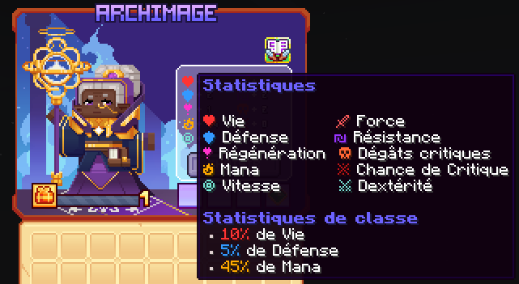

# 📖 Archimage

L'Archimage est une classe spécialisée dans les attaques à mi-distance. Grâce au pouvoir des arcanes, l'Archimage peut terrasser ses ennemis ou soutenir ses alliés.

<figure><figcaption>
<strong>Aperçu des stats de la classe Archimage</strong>
</figcaption></figure>

## 💠 <mark style="color:blue;">Compétences</mark>


Les dégâts des compétences sont en cours de modification, ne les prennez pas pour argent comptant !
-L'équipe du wiki


### 🔸 <mark style="color:blue;">Niveau 1 : Arcane Tranchant</mark>

* <mark style="color:blue;">**Temps de recharge**</mark>**:** 0.5
* <mark style="color:blue;">**Mana**</mark>**:** 0
* <mark style="color:blue;">**Dégâts**</mark>**:** 9

### 🔸 <mark style="color:blue;">**Niveau 5 : Bouclier Mana**</mark>

Vous formez 2 boucliers de mana qui vous donne résistance. Vos boucliers se régénèrent après un certain temps.

* <mark style="color:blue;">**Temps de recharge**</mark>**:** Passif (toujours actif)
* <mark style="color:blue;">**Mana**</mark>**:** 0
* <mark style="color:blue;">**Dégâts**</mark>**:** 153 

### 🔸 <mark style="color:blue;">**Niveau 10 : Blizzard**</mark>

Invoquez des glaçons qui tombent à la surface créant une aura glacée qui ralentit les ennemis.

* <mark style="color:blue;">**Temps de recharge**</mark>**:** 12s
* <mark style="color:blue;">**Mana**</mark>**:** 125
* <mark style="color:blue;">**Dégâts**</mark>**:** 38

### 🔸 <mark style="color:blue;">**Niveau 15 : Cape d'Hastur**</mark>

Invoquez une créature de l'ombre masquée rampant lentement au sol, répandant une aura qui donne un effet de peur et de cécité aux ennemis proches.

* <mark style="color:blue;">**Temps de recharge**</mark>**:** 10
* <mark style="color:blue;">**Mana**</mark>**:** 100
* <mark style="color:blue;">**Dégâts**</mark>**:** 332

### 🔸 <mark style="color:blue;">**Niveau 20 : Chaîne du Vide**</mark>

Ouvrez un portail de vide au sol, invoquant des chaînes de vide qui frappent la surface devant vous 2 fois, créant une rupture du vide attirant les ennemis. 

* <mark style="color:blue;">**Temps de recharge**</mark>**:** 7.5
* <mark style="color:blue;">**Mana**</mark>**:** 50
* <mark style="color:blue;">**Dégâts**</mark>**:** 204

### 🔸 <mark style="color:blue;">**Niveau 30 : Pluie de Feu**</mark>

Invoquez plusieurs météores tirés vers la surface provoquant des explosions mortelles 

* <mark style="color:blue;">**Temps de recharge**</mark>**:** 20s
* <mark style="color:blue;">**Mana**</mark>**:** 150
* <mark style="color:blue;">**Dégâts**</mark>**:** 306

### 🔸 <mark style="color:blue;">**Niveau 40: Choc Arcanique**</mark>

Lévitez dans les airs et formez une zone de destruction où vous invoquez des éclairs de tonnerre qui étourdissent les ennemis. Après un certain temps, vous vous précipitez à la surface et invoquez des éclaires de tonnerre plus gros dans un anneau.

* <mark style="color:blue;">**Temps de recharge**</mark>**:** 35s
* <mark style="color:blue;">**Mana**</mark>**:** 200
* <mark style="color:blue;">**Dégâts**</mark>**:** 13.5 puis 37.5

## 💠 <mark style="color:blue;">Armes</mark>

<table>
  <tr>
    <th>Armes</th>
    <th>Rareté</th>
    <th>Stat</th>
    <th>Obtention</th>
  </tr>
  <tr>
    <td><mark style="color:green;">Spectre des Arcanes</mark></td>
    <td><mark style="color:green;">Commun</mark></td>
    <td>
     
<mark style="color:red;">🗡 Force +7</mark>

     
<mark style="color:orange;">💀 Dégât Critique +4</mark>

    </td>
    <td>Pack d'arme</td>
  </tr>
  <tr>
    <td><mark style="color:yellow;">Spectre des Arcanes</mark></td>
    <td><mark style="color:yellow;">Rare</mark></td>
    <td>
     
<mark style="color:red;">🗡 Force +15</mark>

     
<mark style="color:orange;">💀 Dégât Critique +8</mark>

    </td>
    <td>Pack d'arme ou Forge</td>
  </tr>
  <tr>
    <td><mark style="color:blue;">Spectre des Arcanes</mark></td>
    <td><mark style="color:blue;">Épique</mark></td>
    <td>
     
<mark style="color:red;">🗡 Force +25</mark>

     
<mark style="color:orange;">💀 Dégât Critique +12</mark>

    </td>
    <td>Pack d'arme ou Forge</td>
  </tr>
  <tr>
    <td><mark style="color:purple;">Spectre des Arcanes</mark></td>
    <td><mark style="color:purple;">Légendaire</mark></td>
    <td>
     
<mark style="color:red;">🗡 Force +45</mark>

     
<mark style="color:orange;">💀 Dégât Critique +22</mark>

    </td>
    <td>Forge</td>
  </tr>
  <tr>
    <td><mark style="color:red;">Spectre des Arcanes</mark></td>
    <td><mark style="color:red;">Mythique</mark></td>
    <td>
     
<mark style="color:red;">🗡 Force +80</mark>

     
<mark style="color:orange;">💀 Dégât Critique +39</mark>

    </td>
    <td>Forge</td>
  </tr>
  <tr>
    <td><mark style="color:yellow;">Bâton Légendaire</mark></td>
    <td><mark style="color:yellow;">Légendaire</mark></td>
    <td>
     
<mark style="color:red;">🗡 Force +60</mark>

     
<mark style="color:orange;">💀 Dégât Critique +26</mark>

    </td>
    <td>Box Jackpot</td>
  </tr>
  <tr>
    <td><mark style="color:yellow;">Bâton en Chocolat</mark></td>
    <td><mark style="color:yellow;">Pâques</mark></td>
    <td>
     
<mark style="color:red;">🗡 Force +43</mark>

     
<mark style="color:orange;">💀 Dégât Critique +19</mark>

    </td>
    <td>Marché Noir</td>
  </tr>
  <tr>
    <td><mark style="color:blue;">Bâton Summer</mark></td>
    <td><mark style="color:blue;">Summer</mark></td>
    <td>
     
<mark style="color:red;">🗡 Force +43</mark>

     
<mark style="color:orange;">💀 Dégât Critique +19</mark>

     
<mark style="color:blue;">🏃‍♂️ Vitesse +2</mark>

    </td>
    <td>Marché Noir</td>
  </tr>
</table>
