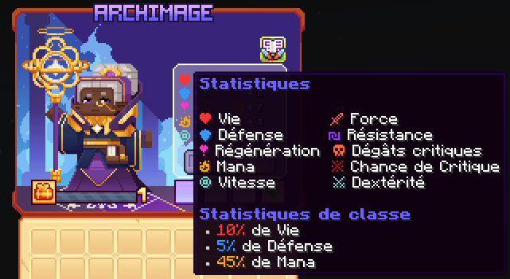

# 📖 Archimage

L'Archimage est une classe spécialisée dans les attaques à mi-distance. Grâce au pouvoir des arcanes, l'Archimage peut terrasser ses ennemis ou soutenir ses alliés.

<figure><figcaption>
<strong>Aperçu des stats de la classe Archimage</strong>
</figcaption></figure>

## 💠 <mark style="color:blue;">Compétences</mark>


Les dégâts des compétences sont en cours de modification, ne les prenez pas pour argent comptant !
-L'équipe du wiki


### 🔸 <mark style="color:blue;">Niveau 1 : Arcane Tranchant</mark>

* <mark style="color:blue;">**Temps de recharge**</mark>**:** 0.5
* <mark style="color:blue;">**Mana**</mark>**:** 0
* <mark style="color:blue;">**Dégâts**</mark>**:** 9

### 🔸 <mark style="color:blue;">**Niveau 5 : Bouclier Mana**</mark>

Vous formez 2 boucliers de mana qui vous donnent résistance. Vos boucliers se régénèrent après un certain temps.

* <mark style="color:blue;">**Temps de recharge**</mark>**:** Passif (toujours actif)
* <mark style="color:blue;">**Mana**</mark>**:** 0
* <mark style="color:blue;">**Dégâts**</mark>**:** 153 

### 🔸 <mark style="color:blue;">**Niveau 10 : Blizzard**</mark>

Invoquez des glaçons qui tombent à la surface créant une aura glacée qui ralentit les ennemis.

* <mark style="color:blue;">**Temps de recharge**</mark>**:** 12s
* <mark style="color:blue;">**Mana**</mark>**:** 125
* <mark style="color:blue;">**Dégâts**</mark>**:** 38

### 🔸 <mark style="color:blue;">**Niveau 15 : Cape d'Hastur**</mark>

Invoquez une créature de l'ombre masquée rampant lentement au sol, répandant une aura qui donne un effet de peur et de cécité aux ennemis proches.

* <mark style="color:blue;">**Temps de recharge**</mark>**:** 10
* <mark style="color:blue;">**Mana**</mark>**:** 100
* <mark style="color:blue;">**Dégâts**</mark>**:** 332

### 🔸 <mark style="color:blue;">**Niveau 20 : Chaîne du Vide**</mark>

Ouvrez un portail de vide au sol, invoquant des chaînes de vide qui frappent la surface devant vous 2 fois, créant une rupture du vide attirant les ennemis. 

* <mark style="color:blue;">**Temps de recharge**</mark>**:** 7.5
* <mark style="color:blue;">**Mana**</mark>**:** 50
* <mark style="color:blue;">**Dégâts**</mark>**:** 204

### 🔸 <mark style="color:blue;">**Niveau 30 : Pluie de Feu**</mark>

Invoquez plusieurs météores tirés vers la surface provoquant des explosions mortelles.

* <mark style="color:blue;">**Temps de recharge**</mark>**:** 20s
* <mark style="color:blue;">**Mana**</mark>**:** 150
* <mark style="color:blue;">**Dégâts**</mark>**:** 306

### 🔸 <mark style="color:blue;">**Niveau 40: Choc Arcanique**</mark>

Lévitez dans les airs et formez une zone de destruction où vous invoquez des éclairs de tonnerre qui étourdissent les ennemis. Après un certain temps, vous vous précipitez à la surface et invoquez des éclairs de tonnerre plus gros dans un anneau.

* <mark style="color:blue;">**Temps de recharge**</mark>**:** 35s
* <mark style="color:blue;">**Mana**</mark>**:** 200
* <mark style="color:blue;">**Dégâts**</mark>**:** 13.5 puis 37.5

## 💠 <mark style="color:blue;">Armes</mark>

### 🔸 <mark style="color:green;">**Packs d'Armes**</mark>

<table>
<tr>
    <th><strong>Nom de l'Armes 🏷️</strong></th>
    <th><strong>Rareté ou Collection 🌟</strong></th>
    <th><strong>Statistiques 📊</strong></th>
    <th><strong>Effets ✨</strong></th>
    <th><strong>Obtentions 📌</strong></th>
  </tr>
  <tr>
    <td><mark style="color:green;">Sceptre des Arcanes</mark></td>
    <td><mark style="color:green;">Commun</mark></td>
    <td>
     
<mark style="color:red;">🗡️️ Force +7</mark>

     
<mark style="color:orange;">💀 Dégât Critique +4</mark>

    </td>
    <td><mark style="color:green;">Aucun Effet</mark> Supplémentaire ❌</td>
    <td>
     
▸ <mark style="color:green;">Packs d'Armes (Mini-Boss & Boss des Donjons Communs)</mark>

    </td>
  </tr>
  <tr>
    <td><mark style="color:yellow;">Sceptre des Arcanes</mark></td>
    <td><mark style="color:yellow;">Rare</mark></td>
    <td>
     
<mark style="color:red;">🗡️️ Force +15</mark>

     
<mark style="color:orange;">💀 Dégât Critique +8</mark>

    </td>
    <td><mark style="color:green;">Aucun Effet</mark> Supplémentaire ❌</td>
    <td>
     
▸ <mark style="color:yellow;">Packs d'Armes (Mini-Boss & Boss des Donjons Rares)</mark>

     
▸ <a href="https://wiki.evolucraft.fr/le-gameplay/les-machines/forge#armes-rares"><mark style="color:green;">Forge 🔨</mark></a>

    </td>
  </tr>
  <tr>
    <td><mark style="color:blue;">Sceptre des Arcanes</mark></td>
    <td><mark style="color:blue;">Épique</mark></td>
    <td>
     
<mark style="color:red;">🗡️️ Force +25</mark>

     
<mark style="color:orange;">💀 Dégât Critique +12</mark>

    </td>
    <td><mark style="color:green;">Aucun Effet</mark> Supplémentaire ❌</td>
    <td>
     
▸ <mark style="color:blue;">Packs d'Armes (Mini-Boss & Boss des Donjons Épiques, Légendaires et Mythique)</mark>

     
▸ <a href="https://wiki.evolucraft.fr/le-gameplay/les-machines/forge#armes-epiques"><mark style="color:green;">Forge 🔨</mark></a>

    </td>
  </tr>
  <tr>
    <td><mark style="color:purple;">Sceptre des Arcanes</mark></td>
    <td><mark style="color:purple;">Légendaire</mark></td>
    <td>
     
<mark style="color:red;">🗡️️ Force +45</mark>

     
<mark style="color:orange;">💀 Dégât Critique +22</mark>

    </td>
    <td><mark style="color:green;">Aucun Effet</mark> Supplémentaire ❌</td>
    <td>
     
▸ <a href="https://wiki.evolucraft.fr/le-gameplay/les-machines/forge#armes-legendaires"><mark style="color:green;">Forge 🔨</mark></a>

  </td>
  </tr>
  <tr>
    <td><mark style="color:red;">Sceptre des Arcanes</mark></td>
    <td><mark style="color:red;">Mythique</mark></td>
    <td>
     
<mark style="color:red;">🗡️️ Force +80</mark>

     
<mark style="color:orange;">💀 Dégât Critique +39</mark>

    </td>
    <td><mark style="color:green;">Aucun Effet</mark> Supplémentaire ❌</td>
    <td>
     
▸ <a href="https://wiki.evolucraft.fr/le-gameplay/les-machines/forge#armes-mythiques"><mark style="color:green;">Forge 🔨</mark></a>

    </td>
  </tr>
  <tr>
    <td><mark style="color:green;">Sceptre des Arcanes Shiny</mark></td>
    <td><mark style="color:green;">Commun ✨</mark></td>
    <td>
     
<mark style="color:red;">🗡️️ Force +7</mark>

     
<mark style="color:orange;">💀 Dégât Critique +4</mark>

    </td>
    <td><mark style="color:green;">Aucun Effet</mark> Supplémentaire ❌</td>
    <td>
     
▸ <mark style="color:green;">Packs d'Armes (Mini-Boss & Boss des Donjons Communs)</mark>

    </td>
  </tr>
  <tr>
    <td><mark style="color:yellow;">Sceptre des Arcanes Shiny</mark></td>
    <td><mark style="color:yellow;">Rare ✨</mark></td>
    <td>
     
<mark style="color:red;">🗡️️ Force +15</mark>

     
<mark style="color:orange;">💀 Dégât Critique +8</mark>

    </td>
    <td><mark style="color:green;">Aucun Effet</mark> Supplémentaire ❌</td>
    <td>
     
▸ <mark style="color:yellow;">Packs d'Armes (Mini-Boss & Boss des Donjons Rares)</mark>

     
▸ <a href="https://wiki.evolucraft.fr/le-gameplay/les-machines/forge#armes-rares"><mark style="color:green;">Forge 🔨</mark></a>

    </td>
  </tr>
  <tr>
    <td><mark style="color:blue;">Sceptre des Arcanes Shiny</mark></td>
    <td><mark style="color:blue;">Épique ✨</mark></td>
    <td>
     
<mark style="color:red;">🗡️️ Force +25</mark>

     
<mark style="color:orange;">💀 Dégât Critique +12</mark>

    </td>
    <td><mark style="color:green;">Aucun Effet</mark> Supplémentaire ❌</td>
    <td>
     
▸ <mark style="color:blue;">Packs d'Armes (Mini-Boss & Boss des Donjons Épiques, Légendaires et Mythique)</mark>

     
▸ <a href="https://wiki.evolucraft.fr/le-gameplay/les-machines/forge#armes-epiques"><mark style="color:green;">Forge 🔨</mark></a>

    </td>
  </tr>
  <tr>
    <td><mark style="color:purple;">Sceptre des Arcanes Shiny</mark></td>
    <td><mark style="color:purple;">Légendaire ✨</mark></td>
    <td>
     
<mark style="color:red;">🗡️️ Force +45</mark>

     
<mark style="color:orange;">💀 Dégât Critique +22</mark>

    </td>
    <td><mark style="color:green;">Aucun Effet</mark> Supplémentaire ❌</td>
    <td>
     
▸ <a href="https://wiki.evolucraft.fr/le-gameplay/les-machines/forge#armes-legendaires"><mark style="color:green;">Forge 🔨</mark></a>

  </td>
  </tr>
  <tr>
    <td><mark style="color:red;">Sceptre des Arcanes Shiny</mark></td>
    <td><mark style="color:red;">Mythique ✨</mark></td>
    <td>
     
<mark style="color:red;">🗡️️ Force +80</mark>

     
<mark style="color:orange;">💀 Dégât Critique +39</mark>

    </td>
    <td><mark style="color:green;">Aucun Effet</mark> Supplémentaire ❌</td>
    <td>
     
▸ <a href="https://wiki.evolucraft.fr/le-gameplay/les-machines/forge#armes-mythiques"><mark style="color:green;">Forge 🔨</mark></a>

    </td>
  </tr>
</table>

### 🔸 <mark style="color:green;">**Armes des Évènements**</mark>

<table>
<tr>
    <th><strong>Nom de l'Armes 🏷️</strong></th>
    <th><strong>Rareté ou Collection 🌟</strong></th>
    <th><strong>Statistiques 📊</strong></th>
    <th><strong>Effets ✨</strong></th>
    <th><strong>Obtentions 📌</strong></th>
  </tr>
  <tr>
    <td><mark style="color:yellow;">Bâton légendaire</mark></td>
    <td><mark style="color:yellow;">Jackpot</mark></td>
    <td>
     
<mark style="color:red;">🗡️ Force +60</mark>

     
<mark style="color:orange;">💀 Dégât Critique +26</mark>

    </td>
    <td><mark style="color:green;">Aucun Effet</mark> Supplémentaire ❌</td>
    <td>▸ <a href="https://wiki.evolucraft.fr/le-gameplay/les-caisses#caisse-jackpot"><mark style="color:yellow;">Caisse Jackpot 🎰</mark></a></td>
  </tr>
  <tr>
    <td><mark style="color:yellow;">Bâton légendaire Shiny</mark></td>
    <td><mark style="color:yellow;">Jackpot ✨</mark></td>
    <td>
     
<mark style="color:red;">🗡️ Force +60</mark>

     
<mark style="color:orange;">💀 Dégât Critique +26</mark>

    </td>
    <td><mark style="color:green;">Aucun Effet</mark> Supplémentaire ❌</td>
    <td>▸ <a href="https://wiki.evolucraft.fr/le-gameplay/les-caisses#caisse-jackpot"><mark style="color:yellow;">Caisse Jackpot 🎰</mark></a></td>
  </tr>
  <tr>
    <td><mark style="color:yellow;">Bâton en Chocolat</mark></td>
    <td><mark style="color:yellow;">Pâques</mark></td>
    <td>
     
<mark style="color:red;">🗡️ Force +43</mark>

     
<mark style="color:orange;">💀 Dégât Critique +19</mark>

    </td>
    <td><mark style="color:yellow;"><strong>Bonus Dégâts 💢</strong></mark> ▸ <mark style="color:yellow;">+5% de dégâts</mark> dans les donjons <mark style="color:yellow;">terriers du lapins</mark> et <mark style="color:yellow;">fabrique du chocolat</mark></td>
    <td>
      
▸ <a href="https://wiki.evolucraft.fr/le-gameplay/marche-noir#paques"><mark style="color:green;">Marché Noir 🧥</mark></a>

      
▸ <a href="https://wiki.evolucraft.fr/le-gameplay/les-caisses#caisse-paques"><mark style="color:yellow;">Caisse Pâques 🥚</mark></a>

      
▸ <a href="https://wiki.evolucraft.fr/le-gameplay/lucky-block"><mark style="color:gold;">Armes Aléatoire via les Lucky Blocks Gold🎲</mark></a>

    </td>
  </tr>
  <tr>
    <td><mark style="color:blue;">Bâton Summer</mark></td>
    <td><mark style="color:blue;">Summer</mark></td>
    <td>
     
<mark style="color:red;">🗡️ Force +49</mark>

     
<mark style="color:orange;">💀 Dégât Critique +19</mark>

     
<mark style="color:blue;">🏃‍♂️ Vitesse +2</mark></td>

    </td>
    <td><mark style="color:green;">Aucun Effet</mark> Supplémentaire ❌</td>
    <td>
      
▸ <a href="https://wiki.evolucraft.fr/le-gameplay/marche-noir#summer-2025"><mark style="color:green;">Marché Noir 🧥</mark></a>

      
▸ <a href="https://wiki.evolucraft.fr/le-gameplay/les-caisses#caisse-summer"><mark style="color:blue;">Caisse Summer 🏖️</mark></a>

      
▸ <a href="https://wiki.evolucraft.fr/le-gameplay/lucky-block"><mark style="color:gold;">Armes Aléatoire via les Lucky Blocks Gold🎲</mark></a>

    </td>
  </tr>
  <tr>
    <td><mark style="color:red;">Bâton de la Lune de Sang</mark></td>
    <td><mark style="color:red;">Lune de Sang</mark></td>
    <td>
     
<mark style="color:red;">🗡️ Force +45</mark>

     
<mark style="color:orange;">💀 Dégât Critique +21</mark>

    </td>
    <td><mark style="color:green;">Aucun Effet</mark> Supplémentaire ❌</td>
    <td>
      
▸ <a href="https://wiki.evolucraft.fr/le-gameplay/marche-noir#halloween-2025"><mark style="color:green;">Marché Noir 🧥</mark></a>

      
▸ <a href="https://wiki.evolucraft.fr/le-gameplay/les-caisses#caisse-lune-de-sang"><mark style="color:red;">Caisse Lune de Sang 🩸</mark></a>

      
▸ <a href="https://wiki.evolucraft.fr/le-gameplay/lucky-block"><mark style="color:gold;">Armes Aléatoire via les Lucky Blocks Gold🎲</mark></a>

    </td>
  </tr> 
  <tr>
    <td><mark style="color:red;">Bâton Pain d'épice</mark></td>
    <td><mark style="color:red;">Pain d'épice</mark></td>
    <td>
     
<mark style="color:red;">🗡️ Force +47</mark>

     
<mark style="color:orange;">💀 Dégât Critique +21</mark>

    </td>
    <td><mark style="color:red;"><strong>Bonus Dégâts 💢</strong></mark> ▸ <mark style="color:red;">+5% de dégâts</mark> dans les donjons <mark style="color:red;">caverne glaciale</mark> et <mark style="color:red;">laboratoire glaciale</mark></td>
    <td>
      
▸ <a href="https://wiki.evolucraft.fr/le-gameplay/marche-noir#Noel-2025"><mark style="color:green;">Marché Noir 🧥</mark></a>

      
▸ <a href="https://wiki.evolucraft.fr/le-gameplay/les-caisses#caisse-pain-depice"><mark style="color:red;">Caisse Pain d'épice 🍪</mark></a>

      
▸ <a href="https://wiki.evolucraft.fr/le-gameplay/lucky-block"><mark style="color:gold;">Armes Aléatoire via les Lucky Blocks Gold🎲</mark></a>

    </td>
  </tr>
  <tr>
    <td><mark style="color:green;">Bâton de Jade</mark></td>
    <td><mark style="color:green;">Nouvel An Lunaire</mark></td>
    <td>
     
<mark style="color:red;">🗡️ Force +51</mark>

     
<mark style="color:orange;">💀 Dégât Critique +13</mark>

     
<mark style="color:yellow;">🧪 Mana +50</mark>

    </td>
    <td><mark style="color:green;">Aura de Feu 🔥</mark> ▸ Enflamme la cible pendant 4 secondes</td>
    <td>
      
▸ <a href="https://wiki.evolucraft.fr/le-gameplay/marche-noir#nouvel-an-lunaire"><mark style="color:green;">Marché Noir 🧥</mark></a>

      
▸ <a href="https://wiki.evolucraft.fr/le-gameplay/les-caisses#caisse-lunaire"><mark style="color:green;">Caisse Lunaire 🎑</mark></a>

    </td>
  </tr> 
</table>
